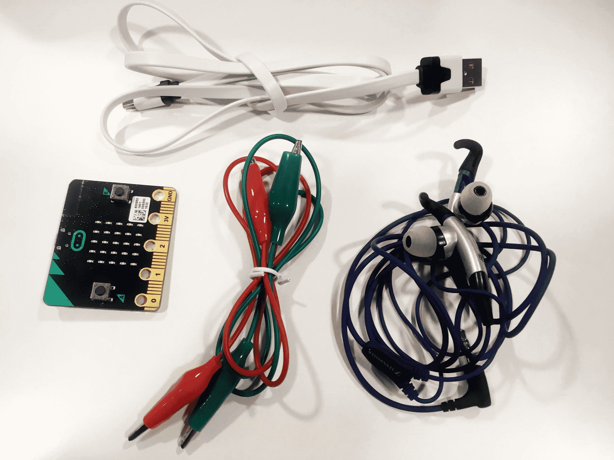
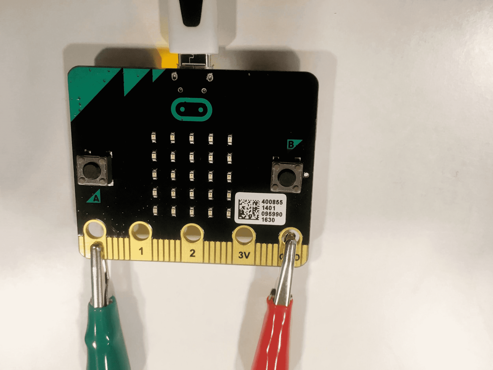

# Introduksjon {.intro}

Me skal lage eit lite program der me får micro:bit-en til å spele musikk viss me
koplar til hovudtelefonar eller ein høgtalar. I denne rettleiinga viser me
korleis du kan spele melodien "Twinkle twinkle little star", og med dette som
utgangspunkt kan du spele av kva song du vil.


# Steg 1: Sjekk at du har riktig utstyr {.activity}

*Det er viktig at du har alt utstyr og tilbehør for å kunne gjere denne
 oppgåva.*

## Sjekkliste {.check}

- [ ] Ein micro:bit med ein micro-usb-kabel.

- [ ] To ledningar med krokodilleklemmer.

- [ ] Hovudtelefonar eller ein høgtalar.

- [ ] Ei datamaskin med Internett eller ein [installert micro-python
  editor](https://codewith.mu/){target=_blank}.

*Her ser du eit bilete av utstyr du kan bruke:*

{ width=75% }


# Steg 2: Klargjere utstyret {.activity}

*Fyrst koplar me saman utstyret, så skal me programmere.*

## Sjekkliste {.check}

- [ ] Kople usb-kabelen til micro:bit-en og ein usb-port på datamaskina.

- [ ] Kople den eine krokodilleklemma til porten der det står GND på
  micro:bit-en. Den andre enden koplar du til innerst på stikket til
  hovudtelefonane/høgtalaren.

- [ ] Kople den andre krokodilleklemma til porten der det står 0 på
  micro:bit-en. Den andre enden koplar du til ytst på stikket til
  hovudtelefonane/høgtalaren.

*Her ser du to bilete av korleis utstyret bør koplast:*

{ width=45% } { width=45% }


# Steg 3: Start å kode {.activity}

*Fyrst startar me med å skrive kode for å spele toner.*

## Sjekkliste {.check}

- [ ] Gå til [python.microbit.org](http://python.microbit.org){target="_blank"}
  eller micropython-editoren din for å åpne ein editor me kan skrive kode i.

- [ ] Fjern all kode som står der frå før.

- [ ] Me startar med å importere eit musikk-bibliotek. Dette gjer at me kan
  bruke kode som er laga av nokon andre for å spele musikk. Skriv inn følgjande
  kode i editoren:

  ```python
  from music import *
  ```

- [ ] For å teste at alt funkar som det skal prøver me å spele av ein innebygd melodi som har namnet *NYAN*. Denne melodien kan me spele av ved å bruke ein funksjon som heiter `play()`. Legg til kodesnutten

  ```python
  play(NYAN)
  ```

- [ ] Til slutt må me overføre programmet vårt over til micro:bit-en. Trykk på
  **Download** i menyen, då vert programmet lasta ned til datamaskina di. Så
  overfører du fila *microbit.hex* til micro:bit-en du kopla til. Viss du brukar
  ein lokal editor kan du trykke på **Flash** for å overføre fila til
  micro:bit-en.

## Test prosjektet {.flag}

- [ ] Speler micro:bit-en av melodien når du har overført programmet ditt?

- [ ] Test ut nokre [andre innebygde
  melodiar](https://microbit-micropython.readthedocs.io/en/latest/music.html#built-in-melodies){target=_blank}.


# Steg 4: Lag ei tone sjølv {.activity}

*Det er kulare å lage si eiga tone enn å berre spele av ein innebygd ein. Det
 skal me gjere no.*

## Sjekkliste {.check}

- [ ] Fyrst fjernar me linja der me speler av musikk, men behald linja der me
  importerte musikk-biblioteket.

- [ ] Så lagar me ein ny variabel som heiter `tone` og set den lik ei tom liste.
  Skriv inn følgjande kodelinje:

  ```python
  tone = []
  ```

- [ ] Når me opprettar toner har dei ei viss form. Tonene er ein tekst som
  består av tre ulike delar. Fyrst ei note, så ein oktav og så lengda til tona.
  Noter vert beskrive med bokstavar, til dømes ein **C** eller ein **D**, eller
  **R** for pause. Oktavar er eit tal mellom **0** og **8** (som er det høgste
  eit menneske kan høyre), og lengda er antal *ticks* tona skal spelast. Utan å
  gå for mykje inn i detaljar, så er 4 ticks det same som 125 millisekund.

- [ ] Endre kodesnutten din til å inkludere ei tone, til dømes slik:

  ```python
  tone = ["C4:4"]
  ```

- [ ] For å spele av tona vår så må me bruke _play_ att. Legg til denne
  kodelinja nedst:

  ```python
  play(tone)
  ```

## Test prosjektet {.flag}

- [ ] Vert tona spelt av på micro:bit-en når du har overført programmet ditt?

- [ ] Trykk *restart*-knappen på micro:bit-en for å spele den av på nytt.


# Steg 5: Programmere melodien {.activity}

*No skal me erstatte tona vår med melodien til "Twinkle twinkle little star".*

- [ ] Erstatt variabelen `tone` med `melodi`, og spill av. Da ser koden din slik
  ut:

  ```python
  from music import *

  melodi = ["C4:4", "C", "G", "G", "A", "A", "G:8", "F:4", "F", "E", "E", "D", "D", "C:8",
  "G:4", "G", "F", "F", "E", "E", "D:8", "G:4", "G", "F", "F", "E", "E", "D:8", "C4:4",
  "C", "G", "G", "A", "A", "G:8", "F:4", "F", "E", "E", "D", "D","C:8"]

  play(melodi)
  ```

## Test prosjektet {.flag}

- [ ] Speler micro:bit-en "Twinkle twinkle little star"?


# Steg 5: Legg til knapp for å styre musikken {.activity}

*No vert melodien spelt av akkurat når me overfører den eller trykkar på
 restart. Me legg til ein knapp for å styre musikken.*

## Sjekkliste {.check}

- [ ] Fyrst må me importere endå eit bibliotek. Legg til følgjande linje heilt
  øvst:

  ```python
  from microbit import *
  ```

- [ ] Så legg me til ei løkke som vert køyrt for alltid, og så sjekkar me om
  knapp **A** er trykt. Då ser programmet ditt slik ut:

  ```python
  from microbit import *
  from music import*

  melodi = ["C4:4", "C", "G", "G", "A", "A", "G:8", "F:4", "F", "E", "E", "D", "D", "C:8",
  "G:4", "G", "F", "F", "E", "E", "D:8", "G:4", "G", "F", "F", "E", "E", "D:8", "C4:4",
  "C", "G", "G", "A", "A", "G:8", "F:4", "F", "E", "E", "D", "D","C:8"]

  while True:
    if button_a.is_pressed():
      play(melodi)
  ```

## Test prosjektet {.flag}

- [ ] Sjekk om melodien berre blir spelt av når ein trykkar på knapp **A**.

## Utfordring: Leggje til eigne melodiar {.challenge}

- [ ] Klarar du å komponere din eigen melodi?

- [ ] Klarar du å finne ein melodi på Internett og lage ei liste med toner som
  du kan spele av?

## Forklaring av koden {.protip}

Me brukar alltid å importere biblioteket som heiter *microbit* når me
programmerer ein micro:bit, slik at me kan bruke dei ulike sensorane som er
innebygd i micro:bit-en. I dette tilfellet brukar me biblioteket til å sjekke om
me har trykt på knapp **A**.

Me må importere biblioteket som heiter *musikk* for at me skal kunne bruke
funksjonen som heiter *play()* som speler av musikken me lagar.

Når me opprettar ei tone har den fleire ulike delar. Det fyrste du kan sjå er at
me har to klammeparentesar (`[` og `]`). Dei brukar me til å opprette ei liste
som me kan ha tonene våre i. Kvar tone består av tre delar, fyrst kva note som
skal spelast, så kva oktav nota skal vere i, og til slutt kor lenge tona skal
spelast av. Til dømes tyder `"C4:4"` at me skal spele ein **C** i oktav **fire**
i **fire** ticks, som altså er 125 millisekund.

Sjekk ut
[dokumentasjonen](https://microbit-micropython.readthedocs.io/en/latest/music.html){target="_blank"}
for å sjå kva moglegheiter som finst for musikk-programmering på micro:bit-en.
