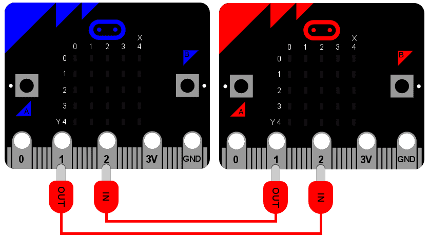

<!-- To get a box around the text about the playlist and to make it distinct from the rest of the exercise-->
# {.tip}

Denne oppgaven er den _siste_ i oppgavesamlingen _Programmering i micro-python_ og bygger videre på [Python: Bevegelse](../python_movement/python_movement_nb.html){target=_blank}.

Vi anbefaler at du laster ned og skriver koden din i [mu editor](https://codewith.mu/){target=_blank} når du jobber med disse oppgavene. Instruksjoner for hvordan man laster ned Mu finner du på nettsiden via linken.

Når Mu er installert kan du koble micro:biten din til datamaskinen via en USB-kabel. Skriv koden din i editor-vinduet og trykk på “Flash”-knappen for å laste koden over på micro:biten. Hvis det ikke fungerer, sørg for at micro:biten har dukket opp som en USB-enhet på datamaskinen din.

# Introduksjon {.intro}

Det er mulig å koble enheter sammen, og sende og motta meldinger fra hverandre.
Dette kalles for et nettverk. Et nettverk av sammenkoblede nettverk kalles for
et internett. Det du kjener som "internett" er faktisk ett internett av alle
internettene!

Å sende og motta meldinger over ett nettverk kan være vanskelig, og det er
reflekteres i programmet beskrevet nedenfor. Når det er sagt, er det nydelige
med dette prosjektet at det inneholder alle de aspektene av
nettverksprogrammeringer du trenger å vite om. Det er og overraskende enkelt og
morsomt.

Men først, la oss sette scenen...

## Tilkobling

Tenk deg et nettverk som en serie av lag. Helt på bunnen er det mest
fundamentale aspektet av kommunikasjon: det trenger å være en måte for et singal
å komme seg fra en enhet til en annen. Noen ganger er dette gjort via en radio
forbindelse, men i dette eksempelet skal vi bare bruke to ledninger.



Det er på dette fundamentet at vi kan bygge alle de andre lagene i nettverket.

Som diagramet viser, en blå og rød micro:bit er koblet sammen via
krokodilleklemmer. Begge bruker pin 1 for utgang og pin 2 inngang. Utgangen fra
en enhet er koblet til inngangen på den andre. Det er litt som å vite hvilken
vei en skal holde en telefon, en side har en liten mikrofon (inputt) og den
andre har en høytaler (utgang). Opptaket av stemmen din via mikrofonen spilles
av ut av den andre personen sin høytaler. Dersom du holde telefonen opp ned, vil
du få merkelige resultat!

Det er akkuratt det samme her, du må koble ledningen riktig!

## Signal

Det neste laget i nettverket er signalet. Ofte vil dette være avhengig av
egenskapene til forbindelsen. I vårt eksempel er det ett enkelt digitalt signal
som enten er på eller av, og sendt via IO pin'ene.

Om du husker det er det mulig å bruke IO pinene slik:

```python
  pin1.write_digital(1) # skru signalet på
  pin1.write_digital(0) # skru signalet av
  input = pin2.read_digital() # Les av verdien av signalet (enten 1 or 0)
```

## Protokoll

Dersom du noen gang møter Kongen er det forventninger til hvordan du skal
oppføre deg. For eksempel, når han kommer kan du bøye deg eller neie, om han
tilbyr deg hans hånd høflig rist den, og tiltal ham "hans majestet" også videre.
Denne mengden regler kalles den kongelige protokollen. En protokoll som
forklarer hvordan en skal oppføre seg i en bestem situasjon (slik som å møte
kongen). En protokoll er bestemt på forhånd slik at alle forstår hva som foregår
før situasjonen inntreffer.


Dette er gruinnen til at vi definerer og bruker protokoller for å kommunisere
meldinger via ett datanettverk. Datamaskiner trenger på forhånd å bli enige om
hvordan de skal sende og motta meldinger. Kanskje den best kjente protokollen er
hypertext transfer protokollen (HTTP) som brukes av verdensveven (World Wide
Web).

En annen berømt protokoll for å sende meldinger (som eksisterte før
datamaskinen) er morsekode. Den definerer hvordan å sende bokstaver via av og på
signaler av lang eller kort varighet. Ofte ble slike signaler spillt av som
toner. Lang varighet kalles for bindestrek (`-`), mens kort varighet noteres som
prikker (`.`). Ved å kominere bindestrek og prikker definerer Morse en måte å
sende alle bokstavene i det engelske alfabetet. For eksempel her er hvordan det
vanlige Morse alfabetet er definert:

```python
  .-    A     -.-   K     ..-   U     .----  1
  -...  B     .-..  L     ...-  V     ..---  2
  -.-.  C     --    M     .--   W     ...--  3
  -..   D     -.    N     -..-  X     ....-  4
  .     E     ---   O     -.--  Y     .....  5
  ..-.  F     .--.  P     --..  Z     -....  6
  --.   G     --.-  Q     .-.-  Æ     --...  7
  ....  H     .-.   R     ---.  Ø     ---..  8
  ..    I     ...   S     .--.- Å     ----.  9
  .---  J     -     T                 -----  0
```

Gitt tabellen ovenfor, for å sende bokstaven "H" (`....`) så må signalet skrus
på fire ganger, hver med kort varighet. For bokstaven "L" er signalet også
skrudd på fire ganger, men det andre signalet har en lengre varighet (`.-.._`).

Åpenbart så er timingen til signalet viktig, vi trenger å kunne skille en
bindestrek fra en prikk. Alle som bruker protokollen, må og bli enige på forhånd
slik at vi kan sammarbeide med hverandre. I dette tilfellet så sier vi bare at:

* Et signal med varighet mindre enn 250 millisekunder er en prikk.

* Et signal med varighet fra og med 250 til 500 millisekunder er en bindestrek.

* Alle andre signaler ignoreres.

* En pause / mellomrom i signalet med lengde lengre enn 500 milliseukunder
  indikerer slutten på sendingen av tegnet.

På denne måten, så å sende bokstaven "H" er definert som å sende fire "på"
signaler, som hver ikke varer lengre enn 250 millisekunder, etterfulgt av en
pause lengre enn 500 millisekunder (som indikerer slutten på bokstaven).

## Melding

Vi er endelig på et stadiet hvor vi kan bygge en meldig -- en melding som
faktisk betyr noe for oss mennesker. Dette er det øverste nivået i nettverket.

Ved å bruke protokollen definer ovenfor kan jeg sende den følgende sekvensen av
signaler langs den fysiske ledningen til den andre micro:bit'en:

```python
  ...././.-../.-../---/.--/---/.-./.-../-..
```

Klarer du å finne ut hva den sier?

## Applikasjon

Det er veldig bra å ha alle nettverkslagene, men du trenger og en måte å
sammhandle med det -- en eller annen applikasjon som kan sende og motta
meldinger. Mens HTTP er interessant, så trenger ikke de *fleste* mennesker å
vite om det og kan overlate det til nettleseren sin å behandle det. De
underliggende nettverkslagene av verdensveven er skjult (som de burde være).

så, hvilken type applikasjon skal vi skrive for micro:bit'en? Hvordan skal den
virke, fra en brukers synspunkt?

Åpenbart, så må du kunne velge når du vil sende bindestreker og prikker (vi kan
bruke knapp A) til det. Vi burde og ha muligheten til å se meldingen vi akkuratt
sendte eller mottok (vi kan bruke knapp B til det). Endelig, siden dette er
Morske kode, kan vi koble til en høytaler som skal spille av tonene som lager
når brukeren skriver inn meldingen sin.

## Det endelige resultatet

```python
from microbit import *
import music

# En oppslagstabell av morsekode og tilhørende bokstaver
MORSE_CODE_LOOKUP = {
    ".-": "A",
    "-...": "B",
    "-.-.": "C",
    "-..": "D",
    ".": "E",
    "..-.": "F",
    "--.": "G",
    "....": "H",
    "..": "I",
    ".---": "J",
    "-.-": "K",
    ".-..": "L",
    "--": "M",
    "-.": "N",
    "---": "O",
    ".--.": "P",
    "--.-": "Q",
    ".-.": "R",
    "...": "S",
    "-": "T",
    "..-": "U",
    "...-": "V",
    ".--": "W",
    "-..-": "X",
    "-.--": "Y",
    "--..": "Z",
    ".----": "1",
    "..---": "2",
    "...--": "3",
    "....-": "4",
    ".....": "5",
    "-....": "6",
    "--...": "7",
    "---..": "8",
    "----.": "9",
    "-----": "0"
}


def decode(buffer):
    # Forsøker å finne den tilhørende bokstaven fra tabellen
    # dersom tegnet ikke er derm bare return ett punktum
    return MORSE_CODE_LOOKUP.get(buffer, '.')

# Hvordan vise frem en enslig prikk{.}
DOT = Image("00000:"
            "00000:"
            "00900:"
            "00000:"
            "00000:")

# Hvordan vise frem en bindestrek{.}
DASH = Image("00000:"
             "00000:"
             "09990:"
             "00000:"
             "00000:")

# For å lage en PRIKK må du holde nede knappen i mindre enn 250ms{.}
DOT_THRESHOLD = 250
# For å lage en BINDESTREK må du holde nede knappen i mindre enn 500ms
DASH_THRESHOLD = 500

# Lagrer det inkommende Morse signalet{.}
buffer = ''
# Lager det oversatte Morse signalet som en tekststreng
message = ''
# Tiden fra enheten har ventet til det neste tastetrykket skjer
started_to_wait = running_time()

# Lar enheten gå i en while-løkke for alltid, og reagerer på tastetrykk{.}
while True:
    # Finner ut hvor lenge enheten har ventet på ett tastetrykk.
    waiting = running_time() - started_to_wait

    # Nullstiller tiden for the key_down_time.
    key_down_time = None

    # Dersom button_a holdes nede så, ...
    while button_a.is_pressed():
        # Spill av en tone - dette er morsekode vet du ;-)
        music.pitch(880, 10)

        # Sett pin1 (output) til "on"
        pin1.write_digital(1)

        # ...og dersom det key_down_time ikke er satt, sett den nå!
        if not key_down_time:
            key_down_time = running_time()

    # Alternativt, dersom pin2 (input) mottar ett signal, lat som det er ett tastetrykk
    while pin2.read_digital():
        if not key_down_time:
            key_down_time = running_time()

    # Ta tiden akkuratt og nå og lagre det i variabelen key_up_time
    key_up_time = running_time()

    # Sett pin1 (output) til "off"
    pin1.write_digital(0)

    # Dersom det er en key_down_time (laget når button_a først ble trykket)
    if key_down_time:
        # ... så finn ut hvor lenge den ble trykket.
        duration = key_up_time - key_down_time

        # Dersom varigheten er mindre enn maks lengde for ett "prikk" trykk
        if duration < DOT_THRESHOLD:
            # ... så legg til en prikk til bufferen som inneholder den
            # inkommende morsekoden og vis en prikk på displayet.
            buffer += '.'
            display.show(DOT)

        # Ellers, dersom varigheten er kortere enn maks lengde for en bindestrek
        # trykk... (men lengre enn enn varighete for en PRIKK som ble behandlet over)
        elif duration < DASH_THRESHOLD:
            # ... så legg til en bindestrek til buffer og vis en bindestrek
            buffer += '-'
            display.show(DASH)

        # Hvis ikke, så blir alle andre lengder på tastetrykk ignorert ( dette
        # er ikke nødvendig, men lagt til for forståelsens skyld).
        else:
            pass

        # Tastetrykket har blitt behandlet, så nullstill tiden fra når enheten
        # startet og vente på et tastetrykk på A knappen.
        started_to_wait = running_time()

    # Hvis ikke, har det ikke forekommet et button_a tastetrykk i løpet av denne
    # kjøringen av løkka. Så vi sjekker om det ikke har vært en pause for å
    # indikere enden av den inkommende morsekoden. Pausen må være lenge enn
    # varigheten av en BINDESTREK

    elif len(buffer) > 0 and waiting > DASH_THRESHOLD:
        # Dersom det er noen tegn i buffer'en og vi har nådd enden på
        # meldingen...
        # Så skal vi dekode det som er i buffer'en
        character = decode(buffer)

        # Nullstill innholdet i bufferen
        buffer = ''

        # Vis den dekodede bokstaven
        display.show(character)

        # Legg bokstaven til i meldingen
        message += character

    # Endelig, dersom button_b var trykkt mens alt dette foregikk...
    if button_b.was_pressed():

        # ... vis hele den dekodede meldingen (scroll over displayet)
        display.scroll(message)

        # så skal vi nullstille innholdet i meldingen (gjøre klar til neste)
        message = ''
```
