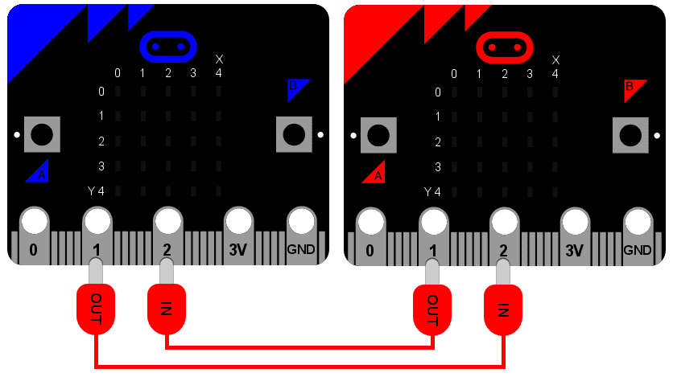

<!-- To get a box around the text about the playlist and to make it distinct from the rest of the exercise-->
# {.tip}

Denne oppgåva er den _siste_ i oppgåvesamlinga "Programmering i micro-python" og byggjer vidare på [Python: Rørsle](../python_movement/python_movement_nn.html){target=_blank}.

Me tilrår at du lastar ned og skriv koden din i [mu editor](https://codewith.mu/){target=_blank} når du jobbar med desse oppgåvene. Instruksjonar for korleis ein lastar ned Mu finn du på nettsida via linken.

Når Mu er installert kan du kople micro:biten din til datamaskinen via ein USB-kabel. Skriv koden din i editor-vindauget og trykk på “Flash”-knappen for å laste koden over på micro:biten. Dersom det ikkje fungerer, sørg for at micro:biten har dukka opp som ei USB-eining på datamaskinen din.

# Introduksjon {.intro}

Det er mogleg å kople saman einingar, og sende og motta meldingar frå kvarandre.
Det kallast for eit nettverk. Eit nettverk av samankopla nettverk kallast for
eit internett. Det du kjenner som "Internett" er faktisk eit internett av alle
internetta!

Å sende og motta meldingar over eit nettverk kan vere vanskeleg, og det er
reflektert i programmet som er beskrive under. Når det er sagt, så er det
nydelege med dette prosjektet at det inneheldt alle dei aspekta av
nettverksprogrammering du treng å vite om. Det er dessutan overraskande enkelt
og morosamt.

Men fyrst, la oss sette scena...

## Tilkopling

Teng deg eit nettverk som ein serie av lag. Heilt på botnen er det mest
fundamentale aspektet av kommunikasjon: det må vere ein måte for eit signal å
kome seg frå ei eining til ei anna. Nokre gonger blir det gjort via
radiosamband, men her skal me berre bruke to ledningar.



På denne grunnmuren skal me byggje alle dei andre laga i nettverket.

Som diagrammet viser er ein blå og ein raud micro:bit kopla saman via
krokodilleklemmer. Begge brukar pin 1 for utgang og pin 2 som inngang. Utgangen
frå ein eining er kopla til inngangen på den andre. Det er litt som å vite kva
veg ein skal halde ein telefon -- ei side har ein liten mikrofon (inn) og den
andre har ein høgtalar (ut). Opptaket av røysta di via mikrofonen vert spelt av
ut frå den andre personen sin høgtalar. Viss du heldt telefonen opp ned vil du
få merkelege resultat.

Det er akkurat det same her: du må kople ledningane riktig!

## Signal

Det neste laget i nettverket er signalet. Ofte er det avhengig av eigenskapane
til sambandet. I dømet vårt er det eit enkelt digitalt signal som anten er på
eller av, og sendt via IO-pin-ane.

Viss du hugsar det kan du bruke IO-pin-ane slik:

```python
  pin1.write_digital(1) # skru signalet på
  pin1.write_digital(0) # skru signalet av
  input = pin2.read_digital() # Les av verdien av signalet (enten 1 or 0)
```

## Protokoll

Viss du nokon gong møter Kongen er det forventningar til korleis du skal oppføre
deg. Når han kjem kan du bøye deg eller neie, om han rettar fram handa si kan du
riste den høfleg, du tiltalar han som "dykkar majestet", og så bortetter. Desse
reglane kallast den kongelege protokollen. Ein protokoll som forklarar korleis
ein skal oppføre seg i ein bestemt situasjon (som når ein møter kongen). Ein
protokoll er bestemt på førehand slik at alle forstår kva som går føre seg før
situasjonen skjer.


Dette er grunnen til at me definerer og brukar protokollar for å kommunisere
meldingar via eit datanettverk. Datamaskiner må ha blitt einige om korleis dei
skal sende og motta meldingar på førehand. Den kanskje best kjente protokollen
er hypertext transfer protocol (HTTP) som vert brukt på verdsveven (World Wide
Web).

Ein annan berømt protokoll for å sende meldingar (og som eksisterte lenge før
datamaskina) er morsekode. Den definerer korleis ein kan sende bokstavar via
signal som varar kort eller lenge. Ofte vart desse signala spelt av som toner.
Lange signal symboliserast med bindestrek (`-`) og korte signal med ein prikk
(`.`). Ved å kombinere bindestrekar og prikkar definerer morse ein måte å sende
alle bokstavane i det engelske alfabetet. Til dømes er det vanlege
morsealfabetet definert slik:

```python
  .-    A     -.-   K     ..-   U     .----  1
  -...  B     .-..  L     ...-  V     ..---  2
  -.-.  C     --    M     .--   W     ...--  3
  -..   D     -.    N     -..-  X     ....-  4
  .     E     ---   O     -.--  Y     .....  5
  ..-.  F     .--.  P     --..  Z     -....  6
  --.   G     --.-  Q     .-.-  Æ     --...  7
  ....  H     .-.   R     ---.  Ø     ---..  8
  ..    I     ...   S     .--.- Å     ----.  9
  .---  J     -     T                 -----  0
```

Frå tabellen over ser me at for å sende bokstaven "H" (`....`) må me slå på eit
kort signal fire gonger. For bokstaven "L" er det også fire signal, men det
andre signalet er litt lengre (`.-..`).

Det er klart at timingen til signalet er viktig, me må kunne skilje ein
bindestrek frå ein prikk. Alle som brukar protokollen må bli einige på førehand,
slik at me kan samarbeide med kvarandre. I dette tilfellet seier me at:

* Eit signal med varigheit mindre enn 250 millisekund er ein prikk.

* Eit signal med varighet frå og med 250 til 500 millisekund er ein bindestrek.

* Alle andre signal vert ignorerte.

* Ei pause eller eit mellomrom i signalet med lengde lengre enn 500 millisekund
  indikerer slutten på sendinga av teiknet.

På denne måten sender me bokstaven "H" ved å sende fire "på"-signal, som alle er
kortare enn 250 millisekund, og så ei pause på meir enn 500 millisekund (altså
slutten på bokstaven).

## Melding

No har me endeleg kome dit at me kan byggje ei melding -- ei melding som faktisk
har innhald for oss menneske. Dette er det øvste nivået i nettverket.

Ved å bruke protokollen definert over kan me sende den følgjande sekvensen av
signal langs den fysiske ledninga til den andre micro:bit-en:

```python
  ...././.-../.-../---/.--/---/.-./.-../-..
```

Klarar du å finne ut kva den seier?

## Applikasjon

Det er veldig bra å ha alle nettverkslaga, men du treng òg ein måte å samhandle
med det -- ein eller annan applikasjon som kan sende og motta meldingar. Medan
HTTP er interessant, så treng ikkje dei *fleste* menneske å vite om det, og kan
la nettlesaren ta seg av det. Dei underliggjande nettverkslaga på verdsveven er
skjulte (slik dei burde vere).

Så, kva type applikasjon skal me skrive for micro:bit-en? Korleis skal den virke
frå ein brukar sin ståstad?

Det er klart at du må velje når du vil sende bindestrekar og prikkar (me kan
bruke knapp A til det). Me burde òg ha moglegheita til å sjå meldinga me akkurat
sendte eller mottok (me kan bruke knapp B til det). Og sidan det er morsekode
kan me kople til ein høgtalar som skal spele av tonene som vert laga når
brukaren skriv inn meldinga si.

## Det endelege resultatet

```python
from microbit import *
import music

# Ein oppslagstabell av morsekode og tilhøyrande bokstavar
MORSE_CODE_LOOKUP = {
    ".-": "A",
    "-...": "B",
    "-.-.": "C",
    "-..": "D",
    ".": "E",
    "..-.": "F",
    "--.": "G",
    "....": "H",
    "..": "I",
    ".---": "J",
    "-.-": "K",
    ".-..": "L",
    "--": "M",
    "-.": "N",
    "---": "O",
    ".--.": "P",
    "--.-": "Q",
    ".-.": "R",
    "...": "S",
    "-": "T",
    "..-": "U",
    "...-": "V",
    ".--": "W",
    "-..-": "X",
    "-.--": "Y",
    "--..": "Z",
    ".----": "1",
    "..---": "2",
    "...--": "3",
    "....-": "4",
    ".....": "5",
    "-....": "6",
    "--...": "7",
    "---..": "8",
    "----.": "9",
    "-----": "0"
}


def decode(buffer):
    # Prøver å finne den tilhøyrande bokstaven frå tabellen
    # Viss teiknet ikkje eksisterer returnerast eit punktum
    return MORSE_CODE_LOOKUP.get(buffer, '.')

# Korleis vise fram ein einsleg PRIKK
DOT = Image("00000:"
            "00000:"
            "00900:"
            "00000:"
            "00000:")

# Korleis vise fram ein BINDESTREK
DASH = Image("00000:"
             "00000:"
             "09990:"
             "00000:"
             "00000:")

# For å lage ein PRIKK må du halde nede knappen i mindre enn 250 ms
DOT_THRESHOLD = 250
# For å lage ein BINDESTREK må du halde nede knappen i mindre enn 500 ms
DASH_THRESHOLD = 500

# Lagrar det innkomande morsesignalet
buffer = ''
# Lagrar det omsette morsesignalet som ein tekststreng
message = ''
# Tida eininga har venta til det neste tastetrykket skjer
started_to_wait = running_time()

# Let eininga gå i ei while-løkke for alltid, og reagerer på tastetrykk
while True:
    # Finn ut kor lenge eininga har venta på eit tastetrykk.
    waiting = running_time() - started_to_wait

    # Nullstiller tida for key_down_time.
    key_down_time = None

    # Viss knapp A er trykt, så...
    while button_a.is_pressed():
        # Spel av ei tone - dette er morsekode
        music.pitch(880, 10)

        # Set pin1 (output) til "on"
        pin1.write_digital(1)

        # ... og viss key_down_time ikkje er sett, sett den no
        if not key_down_time:
            key_down_time = running_time()

    # Alternativt, viss pin2 (input) mottek eit signal,
    # lat som om det er eit tastetrykk
    while pin2.read_digital():
        if not key_down_time:
            key_down_time = running_time()

    # Ta tida akkurat no, og lagre den i variabelen key_up_time
    key_up_time = running_time()

    # Sett pin1 (output) til "off"
    pin1.write_digital(0)

    # Viss det er ein key_down_time (laga når knapp A vart trykt)
    if key_down_time:
        # ... så finn ut kor lenge den vart trykt
        duration = key_up_time - key_down_time

        # Viss varigheita er mindre enn maks lengde for eit "PRIKK"-trykk
        if duration < DOT_THRESHOLD:
            # ... så legg til ein PRIKK til bufferen som inneheldt den
            # innkomande morsekoden og vis ein PRIKK på displayet
            buffer += '.'
            display.show(DOT)

        # Elles, viss varigheita er kortare enn maks lengde for ein BINDESTREK
        # trykk... (men lengre enn varigheita for ein PRIKK)
        elif duration < DASH_THRESHOLD:
            # ... så legg til ein BINDESTREK til buffer og vis ein BINDESTREK
            buffer += '-'
            display.show(DASH)

        # Viss ikkje, så blir alle andre lengder på tastetrykk ignorert (dette
        # er ikkje nødvendig, men lagt til for ordens skuld)
        else:
            pass

        # Tastetrykket har blitt handsama, så nullstill tida frå når eininga
        # starta og vent på eit tastetrykk på A-knappen.
        started_to_wait = running_time()

    # Viss ikkje har det ikkje skjedd eit A-tastetrykk i løpet av denne
    # køyringa av løkka. Så me sjekkar om det ikkje har vore ei pause for å
    # indikere enden av den innkomande morsekoden. Pausa må vere lengre enn
    # varigheita av ein BINDESTREK

    elif len(buffer) > 0 and waiting > DASH_THRESHOLD:
        # Viss et er teikn i bufferen og me har nådd enden på meldinga, så skal
        # me dekode det som er i bufferen
        character = decode(buffer)

        # Nullstill innhaldet i bufferen
        buffer = ''

        # Vis den dekoda bokstaven
        display.show(character)

        # Legg til bokstaven i meldinga
        message += character

    # Til slutt, viss knapp B var trykt medan alt dette skjedde
    if button_b.was_pressed():

        # ... vis heile den dekoda meldinga (scroll over displayet)
        display.scroll(message)

        # så skal me nullstille innhaldet i meldinga (gjere klar til neste)
        message = ''
```
