# Introduksjon: {.intro}

I denne oppgaven skal vi vise bilder ved å skrive kode i Processing. Det kan
være kult å bruke i presentasjoner på skolen, som bakgrunnsbilder i spill, eller
andre ting. Vi kommer til å lære deg hvordan du kan bytte bilde ved å klikke på
datamusa.

Når du er gjennom oppgava skal du greie å sette opp et vindu som ser slik ut:

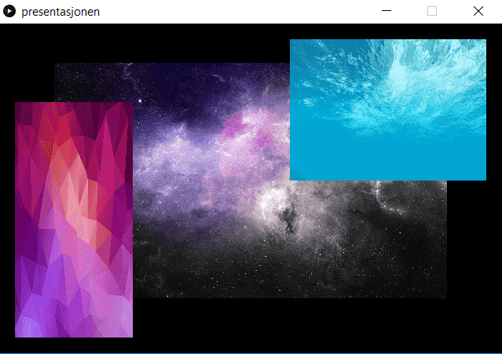


# Steg 1: Lag bildedeklarasjon {.activity}

Når du har åpna Processing, så kan du starte med å lagre det tomme vinduet. Kall
det hva du vil. Vi har valgt å kalle vårt bildevisningsprogram for
`presentasjonen`.

Når du har lagra programmet, så legger det seg i ei egen mappe. Høyreklikk på
bildet under og lagre det i samme mappa som programmet ditt.

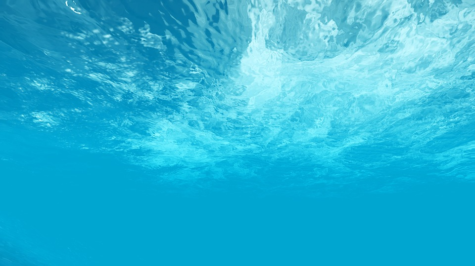

Den første koden som skal skrives er en deklarasjon for at pcen skal vite at vi
skal bruke et bilde. Deklarasjonen skriver du slik:

```processing
PImage sjoen;
```

## Sjekkliste {.check}

- [ ] Skriv kodelinja inn i Processingvinduet ditt.

- [ ] Sjekk at programmet kjører ved å trykke på `play`-knappen. Nå skal et lite
  vindu dukke opp. Det er forløpig tomt, men dersom det dukker opp, så er koden
  din uten skrivefeil.

- [ ] Trykk `ctrl + S`, slik at koden er lagra.

## Forklaring av koden {.protip}

`PImage` forklarer programmet at det skal brukes et bilde. `sjoen` er navnet vi
har valgt. Det er rett og slett bare fordi vi har tenkt å bruke et bilde av sjø,
men så har vi ikke lov å bruke `æ`, `ø`, eller `å` når vi koder. Du kan kalle
bilde noe annet om du vil, men da må du huske at hver gang vi skriver `sjoen`,
så må du bruke navnet du har valgt.

Å deklarere betyr at vi gir pcen beskjed om at vi trenger plass i minnet til ett
eller annet bilde. Når programmet starter, så går det først gjennom alle
deklarasjonene og Qsetter av plass til alt vi skal bruke.

__Her er koden så langt:__

```Processing
PImage sjoen;

```


# Steg 2: Lag setup-funksjon (lag vindu) {.activity}

Nå må vi lage en metode, og inni metoden skal vi bestemme størrelsen på vinuet.
Under ser du hvordan.

```processing
void setup(){
    size(640, 420);
}
```

## Sjekkliste {.check}

- [ ] Skriv inn koden under med en linje mellomrom fra `PImage img;` (for å ha
  det ryddig).

- [ ] Kan du forandre på størrelsen til vinduet ved å endre på tallene i
  `size(640, 420);`?

- [ ] Greier du få vinduet til å dekke hele skjermen din?

- [ ] Sett størrelsen tilbake til `(640, 420)` før du går videre.

- [ ] Trykk `ctrl + S` for å lagre koden.

Her er koden vi har så langt, husk å sjekke at du har med semikolon.

```processing
PImage sjoen;

void setup(){
  size(640, 420);
}
```


# Steg 3: Vis bildet! {.activity}

Nå skal vi få frem bildet i vinduet du har laget. Først må vi laste inn bildet,
det gjør vi inne i `setup`-metoden. Rett under linja med `size(640, 420);`
skriver du inn koden under.

```processing
    sjoen = loadImage("undersea.jpg");
```

Prøv å trykk på `play`-knappen og se hva som skjer! Ikke noe bilde? Vi trenger
litt mer kode!

La oss lage en ny funksjon som vi kaller for `draw`, og gi bildet en plassering
i vinduet vårt.

```processing
void draw(){
    image(sjoen, 0, 0);
}
```

Trykk på play nå og se om bildet vises! Dersom bildet ikke vises nå, så må du
dobbelsjekke koden din, for nå har du alt du trenger.

## Sjekkliste {.check}

- [ ] Prøv å endre tallene til `image(sjoen, 0, 0)`.

- [ ] Sett dem tilbake til `(0, 0)` før du går videre.

Her er koden så langt:

```processing
PImage sjoen;

void setup(){
  size(640, 420);
  sjoen = loadImage("undersea.jpg");
}

void draw(){
  image(sjoen, 0, 0);
}
```


# Steg 4: Endre størrelsen! {.activity}

Inni parentesen til `image`, så har du nå tre parametre. Altså tre forskjellige
ting som er separert med komma. Du kan legge til to parametre til. De må være
tall og de bestemmer størrelsen på bildet ditt.

## Sjekkliste {.check}

- [ ] Legg til to parametre til, slik at innholdet i parentesen til `image` ser
  slik ut: `(sjoen, 0, 0, 640, 200)`.

- [ ] få bildet til å dekke hele vinduet igjen, ved å bytte ut det siste
  parameteret med størrelsen på vinduet sin høyde.

- [ ] Forsøk å få bildet til å vises slik som dette:

  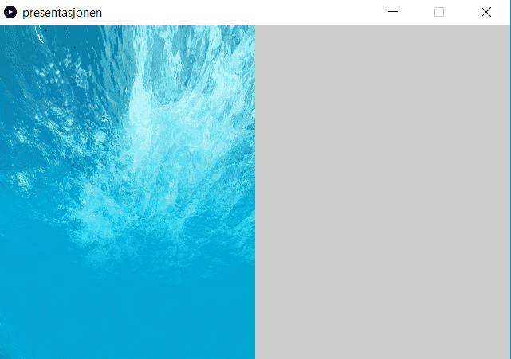

- [ ] Forsøk å få bildet til å vises slik som dette:

  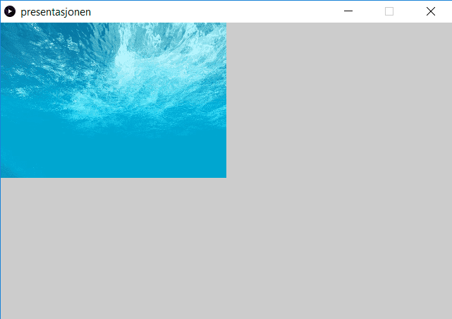

- [ ] Forsøk å få bildet til å vises slik som dette:

  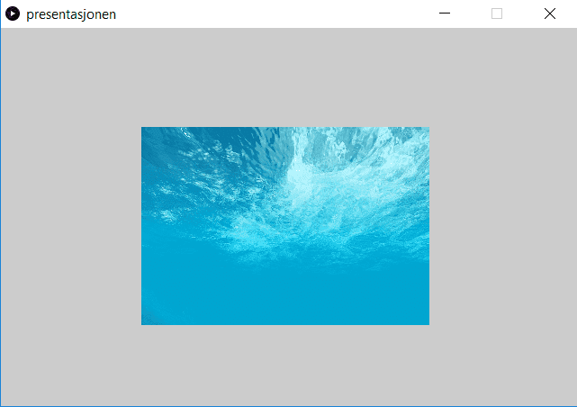

- [ ] Forsøk å få bildet til å vises slik som dette:

  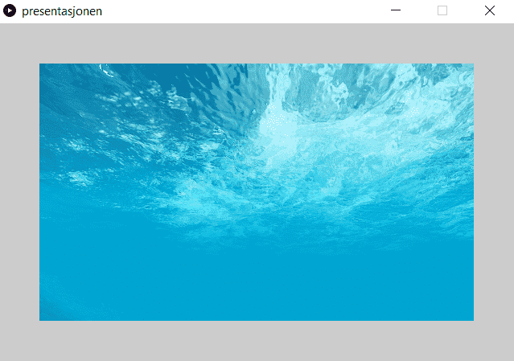

Her er koden med de to siste parameterne i `image`. Når denne koden kjører, så
skjer akkurat det samme som når koden i steg 3 kjørte. Bilde av sjøen vises i
hele vinduet.

```processing
PImage sjoen;

void setup(){
  size(640, 420);
  sjoen = loadImage("undersea.jpg");
}

void draw(){
  image(sjoen, 0, 0, 640, 420);
}
```


# Steg 5: Vis 2 bilder {.activity}

Her er det nye bildet vi har valgt å bruke. Lagre det på samme sted som det
forrige, eller finn et annet bilde du vil bruke. Gi bildet navnet `space.jpg`.

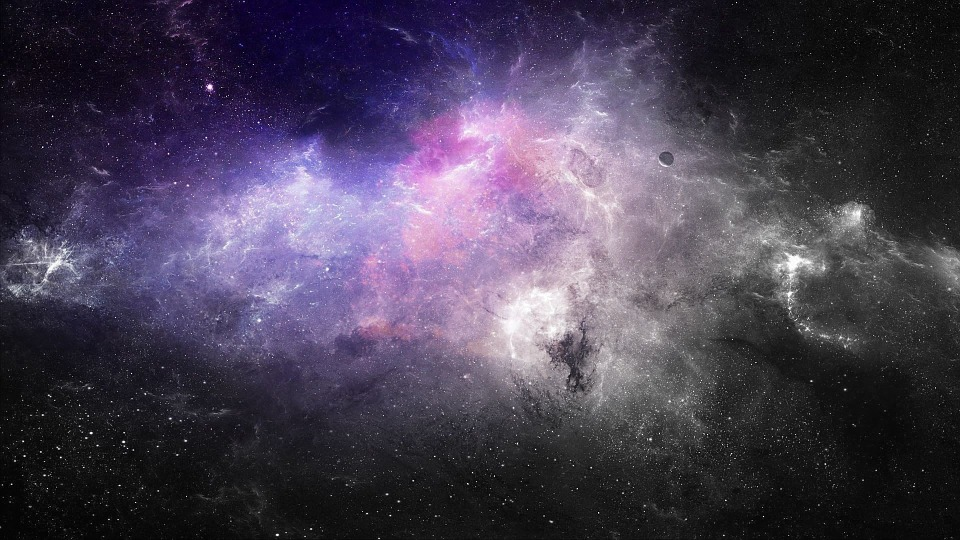

For hver kodelinje du skriver inn, må du kjøre koden din for å se at du ikke har
noen skrivefeil. Bildet vil ikke vises før du har skrevet inn alle linjene, men
du vil få feilmelding dersom du har skrivefeil, og da vil du vite hvilken linje
skrivefeilen er på.

Nå må du lage en ny bildedeklarasjon. Denne skrives rett under den første du
har.

Vi har valgt å kalle dette bildet verdensrommet, så vår bildedeklarasjone ser
slik ut:

```processing
PImage verdensrommet;
```

Husker du hva du må gjøre nå?

Nå må bildet lastes opp, da skriver vi denne kodelinja inni `setup`:

```processing
    verdensrommet = loadImage("space.jpg");
```

Nå gjenstår bare å fortelle programmet hvordan du vil at bildet skal vises. La
oss starte med å putte det inn oppå det andre bildet. Da skriver vi denne
kodelinja inn i `draw`-metoden:

```processing
    image(verdensrommet, 0, 0);
```

## Sjekkliste {.check}

- [ ] Sett koden `image(verdensrommet, 0, 0);` slik at den står på linja over
  `image(sjoen, 0, 0, 640, 200);` hva skjer?

- [ ] Sett koden `image(verdensrommet, 0, 0);` slik at den står på linja under
  `image(sjoen, 0, 0, 640, 200);` hva skjer?

- [ ] Pass på at `image(verdensrommet, 0, 0);` står under `image(sjoen, 0, 0,
  640, 200);`, så setter du inn de to parameterne som justerer størrelsen på
  bildet og gjør verdensrombildet halvparten så stort. Hva skjer?

- [ ] Forsøk å få bildene til å vises slik:

  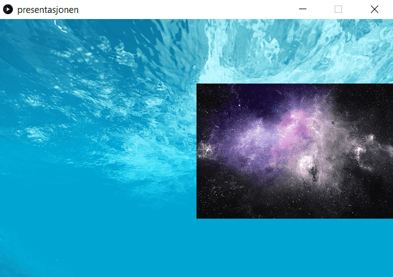

- [ ] Forsøk å få bildene til å vises slik:

  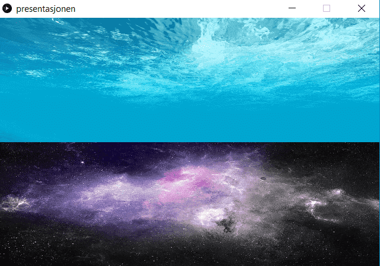

- [ ] Forsøk å få bildene til å vises slik:

  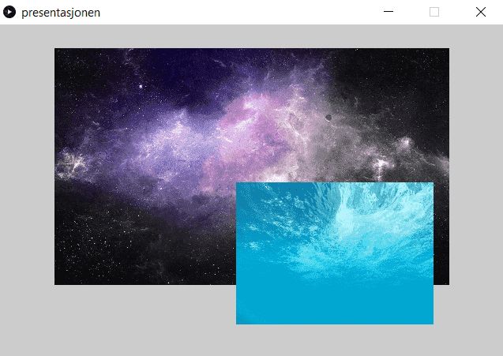

- [ ] Før du går videre, så gjør slik at verdensrombildet står på linja under
  sjøbildet, og pass også på at begge bildene dekker hele skjermen.

Her er koden så langt:

```processing
PImage sjoen;
PImage verdensrommet;

void setup(){
  size(640, 420);
  sjoen = loadImage("undersea.jpg");
  verdensrommet = loadImage("space.jpg");
}

void draw(){
  image(sjoen, 0, 0, 640, 420);
  image(verdensrommet, 0, 0, 640, 420);
}
```


# Steg 6: Bla mellom bildene {.activity}

Nå skal vi bla mellom bildene ved å bruke datamusa. Her kommer først en
skriftlig forklaring på hva vi skal gjøre, og så viser vi kodelinjene etterpå.

Vi skal nummerere bildene, med nummer `0` og `1`. Da bruker vi en variabel,
eller rett og slett bare et tall som holder styr på hvilket bilde som vises på
skjermen. Hver gang vi trykker på venstre musetast, så bytter vi bilde på
skjermen. For å få dette til, så må vi lage to if-setninger som sjekker hvilket
bilde som skal vises. I tillegg må vi lage en metode, eller en event-handler
som hele tiden følger med på om noen trykker på musetasten på datamusa. Inni
event-handleren, må vi skrive kode som oppdaterer variabelen vår, slik at hver
gang noen trykker på musetasten, så skifter den mellom `0` og `1`.

Vi deler dette opp i de tre neste stegene. Først lager vi variabelen, deretter
lager vi if-setningene som sjekker hvilket bilde som skal vises og til slutt
skriver vi koden for eventhandleren.

Vi viser ikke hvordan hele koden ser ut før på slutten av de tre neste stegene,
det er derfor viktig å lese nøye og forsøke å skrive inn de forskjellige
kodelinjene der du tror de skal være.


# Steg 7: Variabelen {.activity}

Vi må deklarere variabler på samme måte som vi deklarerte PImage. Variabelen vi
skal bruke er av typen `int` og vi har gitt den navnet `bildenummer `.
Variabelen deklareres på linja under `PImage`, og ser slik ut:

```processing
int bildenummer;
```

Nå må vi gi den en verdi, det gjør vi inni `setup`-metoden. Vi starter med `0`,
da må vi skrive denne kodelinja:

```processing
    bildenummer = 0;
```

## Sjekkliste {.check}

- [ ] Skriv inn begge kodelinjene over.

- [ ] Sjekk at programmet fremdeles kjører. Ingenting nytt skal skje.


# Steg 8: If-setningen {.activity}

Nå skal vi lage koden som sjekker hvilket bilde som skal brukes. Da må vi skrive
to if-setninger, de skal skrives i `draw`-metoden. Vi starter med å skrive de
med hverdagslige ord, og så gjør vi de om til kode:

```processing
Dersom bildenummeret er null,
    så skal bildet av verdensrommet vises

Dersom bildenummeret er en,
    så skal bildet av sjøen vises
```

Nå gjør vi den første av disse om til kode, da bli koden slik:

```processing
    if(bildenummer == 0){
        image(verdensrommet, 70, 30, 500, 300);
    }
```

Nå er metodekallet på image flytta inn i if-setningen.

## Sjekkliste {.check}

- [ ] Skriv if-setningen som er vist over inn i `draw`-metoden din.

- [ ] Sjekk at programmet kjører. Det vil ikke skje noe nytt.

- [ ] Skriv koden for den andre if-setningen selv.

- [ ] Test at koden din fungerer før du går videre.

- [ ] Du kan sjekke at begge bildene vises ved bytte fra `0` til `1` i `setup`
  metoden der hvor du bestemmer hva `bildenummer` skal starte med å være.

- [ ] I steg 5, så var kodelinjene som gjorde at bildene ble vist bare inne
  krøllparentesene til `draw`, nå skal de i tillegg være inni krøllparentesene
  til hver sin if-setning. Vær nøye på at du har flytta disse kodelinjene inn i
  if-setningene, slik at det fremdeles bare er en av hver.


# Steg 9: Event-handleren {.activity}

Når begge if-setningene er på plass er det på tide å lage koden som sjekker om
noen har trykka på venstre musetast. Da må vi skrive inn dette helt nederst i
Processing-koden din, det skal på utsiden av `draw`-metoden:

```processing
void mouseReleased(){

}
```

## Sjekkliste {.check}

- [ ] Skriv inn den nye koden og sjekk at programmet kjører.

## Hva er en event-handler? {.protip}

En event-handler er en slags innebygd metode. Det som er spesielt er at navnet
på event-handlere er allerede bestemt og når vi bruker dem i koden vår, så
fungerer de slik at de reagerer når noe spesielt skjer. Hva den reagerer på kan
man ofte lese ut fra navnet på metoden. Når eventen reagerer, har vi mulighet
til å bestemme hva som skal skje ved ved å skrive kode. Her er noen andre
event-handlere som også er klare til at vi kan skrive kode til de:

```processing
  mousePressed()
  mouseClicked()
  mouseMoved()
  mouseDragged()
  mouseWheel()
```

Event-handleren vi skal bruke heter `mouseReleased`.

## Få bildene til å rulle

Nå vet programmet at det hele tiden skal følge med musetasten, men programmet
har forløpig ingenting å gjøre dersom noen trykker. Det vi vil skal skje er at
når noen trykker, så skal vi bytte ut hvilket bilde som vises, vi skriver dette
med hverdagslige ord først:

```processing
Dersom bildenummeret er 0,
    så skal bildenummeret settes til å være 1,
ellers
    så skal bildenummeret settes til å være 0
```
Koden for dette blir:

```processing
if(bildenummer == 0){
    bildenummer = 1;
} else {
    bildenummer = 0;
}
```

Vi har brukt `else` for å få en av to ting til å skje. Dersom vi hadde skrevet
denne koden:

```processing
if(bildenummer == 0){
    bildenummer = 1;
}

if(bildenummer == 1) {
    bildenummer = 0;
}
```

så ville bildenummer først blitt til `1` og så til `0` igjen før `mouseReleased`
var ferdig, da ville aldri bilde blitt byttet. Når vi har en `else`, så vil bare
en av tingene skje. Vi kan også skrive dette på denne måten:

```processing
Dersom bildenummeret er 0,
    så skal det settes til å være 1,
eller dersom bildenummeret er 1,
    så skal det settes til å være 0
```

Da ville koden sett slik ut:

```processing
if(bildenummer == 0){
    bildenummer = 1;
} else if(bildenummer == 1) {
    bildenummer = 0;
}
```

Her vil koden bare sjekke den andre if-setningen dersom den første ikke stemte.
Test ut dette for å se hvordan det fungerer.

## Sjekkliste {.check}

- [ ] Skriv inn if-setningen som blir forklart over.

- [ ] Kjør koden og se at det fungerer, nå skal bilde byttes når du trykker på
  datamusa.

- [ ] Skrive om koden inni `mouseRelease` slik at det er to ifsetninger.

- [ ] Skriv om koden inni `draw`, slik at du får `if` og så `else`.

- [ ] Legg til dette bildet også:

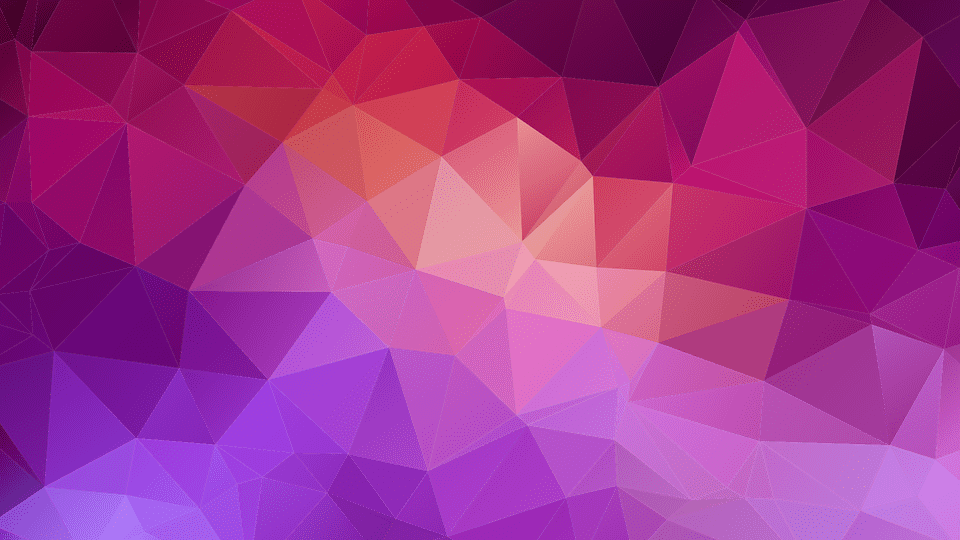

og ruller mellom alle tre bildene (da må du deklarere bilde, laste bilde, skrive
en if-setning inni `draw` og en if-setning inni `mouseReleased` med `else`
forran).

- [ ] Gjør om koden slik at alle tre bildene er like store som vinduet.

- [ ] Bytt om rekkefølgen, slik at trekantbilde vises rett etter bilde av
  verdensrommet.

Her er bilde av koden så langt, med to bilder som byttes på:

```processing
PImage sjoen;
PImage verdensrommet;
int bildenummer;

void setup(){
  size(640, 420);
  sjoen = loadImage("undersea.jpg");
  verdensrommet = loadImage("space.jpg");
  bildenummer = 0;
}

void draw(){
  background(0);

  if(bildenummer == 0){
    image(verdensrommet, 70, 30, 500, 300);
  }

  if(bildenummer == 1){
    image(sjoen, 300, 200, 250, 180);
  }
}

void mouseReleased(){
  if(bildenummer == 0){
    bildenummer = 1;
  } else {
    bildenummer = 0;
  }
}
```

Her er koden for hvordan du kan rullere mellom tre forskjellige bilder:

```processing
PImage sjoen;
PImage verdensrommet;
PImage trekant;
int bildenummer;

void setup(){
  size(640, 420);
  sjoen = loadImage("undersea.jpg");
  verdensrommet = loadImage("space.jpg");
  trekant = loadImage("trekant.jpg");
  bildenummer = 0;
}

void draw(){
  background(0);

  if(bildenummer == 0){
    image(verdensrommet, 70, 30, 500, 300);
  }

  if(bildenummer == 1){
    image(sjoen, 300, 200, 250, 180);
  }

  if(bildenummer == 2){
    image(trekant, 20, 160, 300, 240);
  }
}

void mouseReleased(){
  if(bildenummer == 0){
    bildenummer = 1;
  } else if(bildenummer == 1){
    bildenummer = 2;
  } else if(bildenummer == 2){
    bildenummer = 0;
  }
}
```
