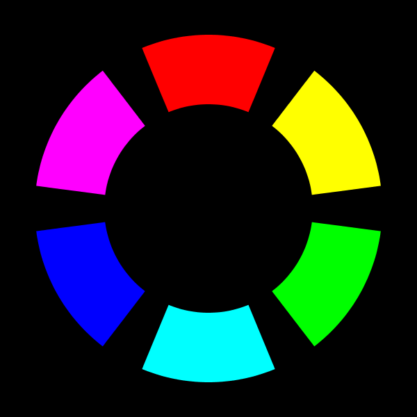
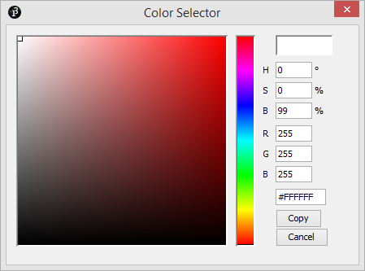
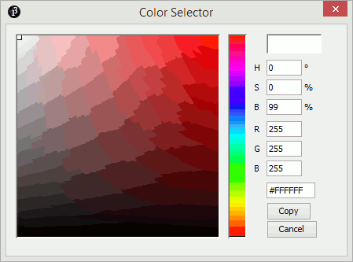

# Introduksjon {.intro}

På skulen lærer ein om farger og korleis dei kan blandast for å få andre farger.
Slik fungerer det med farger på datamaskina òg: me blandar primærfarger, og
mengda av kvar primærfarge avgjer kva farge me får. Viss me samanliknar blanding
av målingsfarger med blanding av farger på ein dataskjerm, så fungerer blandinga
litt annleis. Korleis blandinga fungerer på ein dataskjerm skal du lære i denne
oppgåva.


# Steg 1: Meir enn grått {.activity}

Her skal me sjå korleis bakgrunnsfarga blir bestemt. I det fyrste punktet viser
me heile programmet. Vidare ser me berre på `draw` fordi det er den delen av
koden som skal endrast. For kvart steg kan du køyre programmet med `ctrl + R` og
lagre med `ctrl + S`.

## Sjekkliste {.check}

- [ ] Me startar med å fylle bakgrunnen med svart farge:

  ```processing
  void setup() {
    // bestem storleiken til vindauget
    size(800, 600);
  }

  void draw() {
    background(0);
  }
  ```

  Dette har du kanskje sett før. Når me kallar på `background` med berre eitt
  tal før me ei gråtone der `0` er svart og `255` er kvit.

- [ ] La oss endre på `draw` slik at me får ein raud bakgrunn:

  ```processing
  void draw() {
    background(255, 0, 0);
  }
  ```

  Dette liknar på det me gjorde i det fyrste steget, men no brukar me plutseleg
  tre tal i staden for eitt. La oss utforske dei.

- [ ] La oss endre `background` ein gong til:

  ```processing
  void draw() {
    background(0, 255, 0);
  }
  ```

  Køyr programmet. Kva farge får bakgrunnen?

- [ ] La oss endre `background` endå ein gong:

  ```processing
  void draw() {
    background(0, 0, 255);
  }
  ```

  Kva farge fekk du no?

## Forklaring av additive fargar {.protip}

Som nemnt har du nok lært om farger på skulen, og brukt måling eller
fargeblyantar for å utforske dei. Du lærte nok om primærfargene raud, **gul** og
blå, og at du kunne lage nesten alle slags fargar ved å blande saman desse.

Di fleire fargar ein blandar når ein måler, di mørkare blir den ferdige farga.
Det er fordi målinga inneheldt farga pigment som absorberer lys. Di fleire
farger som vert absorbert, di færre fargar og mindre lys blir reflektert og
treff auga dine. Til dømes absorberer grøn måling raudt og blått lys, det grøne
lyset blir reflektert til auga dine. Gul måling absorberer blått lys, og blå
måling absorberer raudt og delar av det grøne lyset. Då er det berre grønt lys
som står att, så difor kan du blande gul og blå for å få grøn.

I ei datamaskin er det annleis. Har du tenkt over at skjermen lyser? Sidan
skjermen lyser angit me *kor mykje* kvar farge skal *lyse*. Auget reagerer på
raudt, grønt og blått lys, så det er desse me brukar som primærfarger i
dataskjermar. Viss du går nære nok ein gamal data- eller TV-skjerm kan du sjå
dei tre fargene kvar for seg.

Kva tre farger fekk du i stega over? No forstår du kanskje kvifor dei tre
verdiane `(255, 0, 0)`, `(0, 255, 0)` og `(0, 0, 255)` ga høvesvis raud, grøn og
blå?

Fordi primærfargene er raud, grøn og blå kallast systemet RGB. Det er eit
*additivt* system fordi me legg saman fargene, medan i teikning på papir
arbeider me med eit *subtraktivt* system der fargene blir trekt frå.

Me kan blande farger her òg, men det oppfører seg annleis frå det du er vant med
frå måling. Viss me blandar raudt og grønt får me gult. Viss me blandar grønt og
blått får me ein slags turkis, kalla cyan. Viss me blandar raudt og blått får me
ein slags rosa, kalla magenta. Når alle tre fargene er like sterke får me ei
gråtone. Med alle tre på fullt, `255`, får me kvitt.


Du har kanskje sett eit fargehjul før, der primærfargene blir plassert rundt
hjulet? Sekundærfargene, fargene ein får ved å blande to primærfarger, blir
plassert mellom dei. Me kan lage eit slikt for RGB.




# Steg 2: Fyllfarger og omriss {.activity}

Når me teiknar former er det stor sjanse for at me vil bruke andre farger enn
svart og kvit. Til no har me berre sett at me kan styre farga på bakgrunnen, så
la oss sjå kva me kan gjere med fargene til former.

## Sjekkliste {.check}

- [ ] Legg til ein disk i `draw`:

  ```processing
  void draw() {
    background(0, 0, 255);
    ellipse(width / 2, height / 2, 100, 100);
  }
  ```

  Viss du køyrer programmet ser du kanskje noko du ikkje har lagt merke til før.
  Kva er det som er rundt disken?

- [ ] Endre farga som disken blir fargelagt med, med funksjonen `fill`:

  ```processing
  void draw() {
    background(0, 0, 255);
    fill(255, 192, 64);
    ellipse(width / 2, height / 2, 100, 100);
  }
  ```

  No får du ein mørkegul disk midt i vindauget på ein blå bakgrunn.

- [ ] Endre farga på omrisset med funksjonen `stroke`:

  ```processing
  void draw() {
    background(0, 0, 255);
    fill(255, 192, 64);
    stroke(192, 96, 64);
    ellipse(width / 2, height / 2, 100, 100);
  }
  ```

  No er streken rundt disken ei raudleg brunfarge. Det er kanskje ikkje så lett
  å sjå farga på streken når den er så tynn.

- [ ] Gjer omrisset feitare med funksjonen `strokeWeight`:

  ```processing
  void draw() {
    background(0, 0, 255);
    fill(255, 192, 64);
    stroke(192, 96, 64);
    strokeWeight(3);
    ellipse(width / 2, height / 2, 100, 100);
  }
  ```

  No er omrisset tre pikslar breitt.

## Eksperimenter {.challenge}

- [ ] Prøv ulike bakgrunnsfarger. Korleis synest du ulike bakgrunnsfarger passar
  saman med fargene på disken?

- [ ] Prøv ulike fyllfarger. Korleis passar desse med farga på omrisset?

- [ ] Prøv ulike farger på omrisset. Korleis passar det med bakgrunnen og
  fyllfarga?

- [ ] Prøv andre tjukkleikar på omrisset. Kva synest du er passe tjukt?

- [ ] Kan du teikne to diskar på skjermen i ulike fargar?


# Steg 3: Fargeveljaren {.activity}

Nokre gonger kan det vere tungvint å skulle lage fargene ein vil ha ved å berre
tenke ut tala. Ein blir riktignok flinkare på dette etter kvart som ein har
gjort det nokre gonger. Men inntil ein blir komfortabel med det, så kan det vere
lurt å bruke fargeveljaren i Processing.

## Sjekkliste {.check}

- [ ] Åpne fargeveljaren ved å velge **Tools → Color Selector**

  

  Då får du opp eit vindauge som let deg velje farger. Her kan du fylle inn
  talverdiane me har sett før, i felta for R, G og B. Det er òg nokre andre
  felt: H, S og B. Desse høyrer til eit anna fargesystem som naturleg nok heiter
  HSB. Det er òg to område der du kan velje farge ved å klikke. Øvst til høgre
  ser du farga som er valt.

- [ ] Prøv å trykkje i det store fargefeltet til venstre. Her kan du velje kor
  sterk og kor lys farga skal vere.

  Kva skjer med verdiane til R, G og B for lyse farger? Kva skjer når du vel
  mørke farger?

- [ ] Prøv å trykkje i det vesle fargefeltet rett ved sidan av. Her kan du velje
  kva farge du vil ha.

  

  Kva skjer med verdiane til RGB no?

- [ ] Finn ei farge du likar som bakgrunnsfarge. Skriv inn verdiane for R, G og
  B i `background` og i `draw`.

- [ ] Finn ei farge du likar til disken. Trykk på knappen `Copy`. Visk ut alle
  verdiane frå `fill` og lim inn den kopierte fargekoden: anten med `Edit -->
  Paste` eller trykk `ctrl + V` (`cmd + V` viss du brukar Mac).

  Når du limer inn ser du at koden er på forma `#0123EF`. Dette er fargekoden
  som sto i det nedste tekstfeltet i fargeveljaren. Korleis denne fargekoden
  fungerer ser du forklart i boksen under.

## Web-farger - fargekoder i heksadesimalar {.protip}

Dei som jobbar med nettsider er vant til å angi farger med ei sekssifra kode:
`#0123EF`. Du tenker kanskje: "Kan `F` være eit siffer?". Ja, i heksadesimalar,
eller sekstentalssystemet, utvidar me sifra frå 0 til 9 med bokstavane A-F. Då
får me siffer frå 0 til F, altså tala frå null til femtan. Her symboliserer `A`
10, `B` 11, `C` 12 og så bortetter. Det er ingen skilnad på små og store
bokstavar i dette systemet.

Sidan me skal angi tre farger, RGB, brukar me tre tosifra tal i koden. I
`#0123EF` er dei tre tosifra tala `01`, `23` og `EF`. Dei to fyrste er mengda
raudt, dei to neste grønt og dei to siste blått.

Me kan rekne om `#0123EF` til raud, grøn og blå slik som dette:

- `raud = 0 * 16 + 1 = 1`

- `grøn = 2 * 16 + 3 = 35`

- `blå = 14 * 16 + 15 = 249`

Altså er det nesten ikkje noko raudt, litt grønt og mykje blått. La oss teste
det ut:

```processing
void setup() {
  size(800, 600);
}

void draw() {
  background(#0123EF);
}
```

Desse fargekodane kan vere nyttige viss ein kjenner dei frå før. Fargekodane
blir vanlegvis brukt direkte, og det er vanskeleg å bruke heksadesimale
fargekodar når farga skal variere. Til dømes er det mykje enklare å bruke
vanlege heiltal viss du skal la programmet vise alle raudfargene.

For program der me ikkje vil variere farga undervegs, så kan me gjerne bruke
heksadesimale fargekodar. Til dømes i `background`. Seinare skal me sjå på
korleis me kan lage *color*-variablar med desse kodane.


# Steg 4: HSB {.activity}

Då me såg på fargeveljaren såg me tre tekstfelt merka H, S og B. La du merke til
korleis desse oppførte seg då me endra fargevalet? Viss ikkje får du sjå det
under.

Systemet kallast HSB, kort for "Hue, Saturation, Brightness". På norsk blir det
fargetone/kulør, fargemetting og lysheit/valør. Det fyrste talet, `H`, bestemmer
kva farge det blir. Det andre, `S`, bestemmer kor sterk farga skal vere. Til
slutt har me `B` som bestemmer kor lys farga skal vere.

## Sjekkliste {.check}

- [ ] Sjå på korleis fargeveljaren og HSB heng saman. Åpne fargeveljaren att med
  `Tools --> Color Selector`.

- [ ] Bruk det store fargefeltet til venstre og sjå kva som skjer med dei tre
  verdiane H, S og B. Korleis oppfører dei seg når du gjer farga lysare,
  mørkare, sterkare og svakare? Klarar du å finne kva verdi som høyrer til
  rørsle opp og ned? Kva med sidevegs?

- [ ] Bruk det vesle fargefeltet ved sidan av og sjå kva som skjer med verdiane
  no. Kva verdi endrar seg når du endrar plassering i dette feltet?

- [ ] La oss prøve ut HSB no som du har sett korleis desse verdiane heng saman i
  fargeveljaren:

  ```processing
  void setup() {
    size(800, 600);
    colorMode(HSB, 360, 100, 100);
  }

  void draw() {
    background(0, 100, 100);
    fill(120, 100, 100);
    stroke(120, 75, 50);
    strokeWeight(3);
    ellipse(width / 2, height / 2, 100, 100);
  }
  ```

  Her kallar me på ein ny funksjon `colorMode` som tek imot fargesystemet som
  fyrste argument, og så maksverdiar for dei ulike *kanalane* (H, S og B). Du
  kan berre bruke **RGB** eller **HSB** som fargesystem.

  Du lurar kanskje på kvifor H har fått `360` som maksverdi? Det er fordi
  fargetona er basert på fargehjulet, og det har 360 gradar med fargetoner.
  Mettinga og lys blir ofte gitt i prosent. Du kan velje heilt andre maksverdiar
  viss du vil.

- [ ] Køyr programmet viss du ikkje har gjort det allereie.

- [ ] Me har sett at raud ligg på null grader, og grøn på `120` grader. La oss
  finne ut kva farger som befinn seg rundt hjulet ved å endre `draw`:

  ```processing
  void draw() {
    background(0);

    fill(0, 100, 100);
    ellipse(width / 4, height / 3, 100, 100);

    fill(60, 100, 100);
    ellipse(2 * width / 4, height / 3, 100, 100);

    fill(120, 100, 100);
    ellipse(3 * width / 4, height / 3, 100, 100);

    fill(180, 100, 100);
    ellipse(width / 4, 2 * height / 3, 100, 100);

    fill(240, 100, 100);
    ellipse(2 * width / 4, 2 * height / 3, 100, 100);

    fill(300, 100, 100);
    ellipse(3 * width / 4, 2 * height / 3, 100, 100);
  }
  ```

  Her går me gjennom fargetonene `60` gradar i gongen. Kva farger ligg på dei
  seks vinklane `0, 60, 120, 180, 240` og `300`? Kva trur du befinn seg på `360`
  gradar?

  Viss du lurar på reknestykka for plasseringane av diskane, så deer me breidda
  på fire fordi det blir fire tomrom med tre kolonner. Tilsvarande blir det tre
  tomrom i høgda når me har to rader. Ved å dele på antal tomrom får me breidda
  på avstanden mellom to nabodiskar eller vindaugekanten og den næraste disken.

- [ ] Køyr programmet viss du ikkje har gjort det.

- [ ] La oss sjå korleis mettinga og lysheita påverkar farga. Me legg til ein
  variabel for fargetone som skal endrast over tid, slik at me ser effekten på
  ulike fargetoner. Legg til det følgjande øvst i programmet, over både
  _setup()_ og _draw()_:

  ```processing
  float tone;
  ```

  Så endrar me `draw` til å teikne opp 9 diskar der radene har same metting, og
  kolonnene har same lysheit:

  ```processing
  void draw() {
    background(0);

    float metting = 100;
    float lysheit = 100;

    tone = tone + 1;
    if (tone > 360) {
      tone = 0;
    }

    fill(tone, metting, lysheit);
    ellipse(width / 4, height / 4, 100, 100);

    lysheit = lysheit - 40;
    fill(tone, metting, lysheit);
    ellipse(2 * width / 4, height / 4, 100, 100);

    lysheit = lysheit - 40;
    fill(tone, metting, lysheit);
    ellipse(2 * width / 4, height / 4, 100, 100);

    lysheit = 100;
    metting = metting - 40;
    fill(tone, metting, lysheit);
    ellipse(width / 4, 2 * height / 4, 100, 100);

    lysheit = lysheit - 40;
    fill(tone, metting, lysheit);
    ellipse(2 * width / 4, 2 * height / 4, 100, 100);

    lysheit = lysheit - 40;
    fill(tone, metting, lysheit);
    ellipse(2 * width / 4, 2 * height / 4, 100, 100);

    lysheit = 100;
    metting = metting - 40;
    fill(tone, metting, lysheit);
    ellipse(width / 4, 3 * height / 4, 100, 100);

    lysheit = lysheit - 40;
    fill(tone, metting, lysheit);
    ellipse(2 * width / 4, 3 * height / 4, 100, 100);

    lysheit = lysheit - 40;
    fill(tone, metting, lysheit);
    ellipse(2 * width / 4, 3 * height / 4, 100, 100);
  }
  ```

### Repetisjon av kode {.protip}

I koden over er det mykje repetisjon av kode for å setje farga og teikne opp
diskane. Sjølv om me ikkje skal gå gjennom løkker no, så kan det vere nyttig å
sjå korleis denne koden kunne vore gjort kortare og enklare ved hjelp av løkker.

```processing
void draw() {
  background(0);

  int metting = 100;
  int lysheit = 100;

  tone = tone + 1;
  if (tone > 360) {
    tone = 0;
  }

  for (int rad = 1; rad <= 3; rad++) {
    lysheit = 100;

    for (int kolonne = 1; kolonne <= 3; kolonne++) {
      lysheit = lysheit - 40;
      fill(tone, metting, lysheit);
      ellipse(kolonne * width / 4, rad * height / 4, 100, 100);
    }

    metting = metting - 40;
  }
}
```


# Steg 5: Fargevariablar og -funksjonar {.activity}

Nokre gonger er det nyttig å kunne ha variablar for å halde styr på farger. Over
såg me at me godt kan bruke tre variablar, ein for kvar fargekanal i systemet,
men no skal me sjå ein eigen type som kan brukast til farger: `color`.

Me skal òg sjå på nokre funksjonar for å jobbe med farger. Dette gjer at me kan
få meir nytte av fargevariablar utan å bruke ein variabel for kvar fargekanal.
Viss farger skal endre seg veldig mykje kan det likevel vere enklare med tre
variablar. Variablane blir, som før, definert utanfor _setup()_ og _draw()_.

## Sjekkliste {.check}

- [ ] Me startar heilt enkelt med ein fargevariabel for bakgrunn og ein for
  fyllfarge:

  ```processing
  color bakgrunn = color(32, 128, 64);
  color fyll = color(64, 128, 255);

  void setup() {
    size(800, 600);
  }

  void draw() {
    background(bakgrunn);
    fill(fyll);
    ellipse(width / 2, height / 2, 100, 100);
  }
  ```

  Viss du køyrer programmet ser du ein blå disk på ein grøn bakgrunn. Koden
  `color(32, 128, 64)` gir oss ein verdi som me kan setje inn i ein
  `color`-variabel. Når me brukar variabelen i `background(bakgrunn)`, er det
  som om me skreiv `background(32, 128, 64)`.

- [ ] La oss sjå korleis me kan lage ei farge som ligg ein stad mellom to kjente
  farger med `lerpColor`. Legg til ei ekstra farge for svart fyrst i programmet:

  ```processing
  color svart = color(0, 0, 0);
  ```

  Så set me omrisset til disken til å vere ein mellomting mellom svart og
  fyllfarga:

  ```processing
  void draw() {
    background(bakgrunn);
    fill(fyll);
    stroke(lerpColor(fyll, svart, 0.5));
    ellipse(width / 2, height / 2, 100, 100);
  }
  ```

  `lerpColor(farge1, farge2, blandingsForhold)` gir ei farge som ligg mellom
  `farge1` og `farge2`, eller `fyll` og `svart` i koden over. `blandingsForhold`
  er eit tal mellom `0` og `1`. Når det er `0` blir farga heilt lik `farge1`.
  Når det er `1` blir farga heilt lik `farge2`. `0.5` gir oss farga midt mellom
  dei to.

  Sidan resultatet av eit kall på `lerpColor` er ei farge kunne du ha lagt
  resultatet i ein `color`-variabel: `color omriss = lerpColor(fyll, svart,
  0.5);`

  Køyr programmet og merk at omrisset har blitt ein mørkare variant av blåfarga
  i staden for heilt svart.

- [ ] Viss du vil bruke HSB i staden for RGB går det an, men då må du bytte
  fargesystem før du lagar fargene:

  ```processing
  color bakgrunn;
  color fyll;

  void setup() {
    size(800, 600);
    colorMode(HSB, 360, 100, 100);
    bakgrunn = color(120, 75, 60);
    fyll = color(210, 75, 75);
  }

  void draw() {
    background(bakgrunn);
    fill(fyll);
    ellipse(width / 2, height / 2, 100, 100);
  }
  ```

  Køyr programmet.

  Kva skjer med fargane om du lagar dei før du byttar til HSB? Kva om du byttar
  til RGB, `colorMode(RGB, 255);`, etter at du har laga fargane over?

### Prøv sjølv {.challenge}

- [ ] Ta utgangspunkt i punktet der du blanda farger med `lerpColor`. Kan du
  teikne eit ansikt eller ein annan figur med ellipser der du blandar farger med
  `lerpColor` for omriss- og/eller fyllfargane? Viss du skal bruke
  blandingsfarger til både omriss og fyll kan det vere lurt å leggje resultata
  av blandinga i `color`-variablar.
