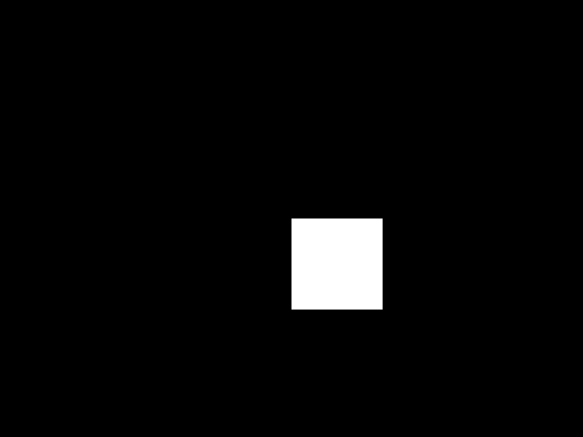
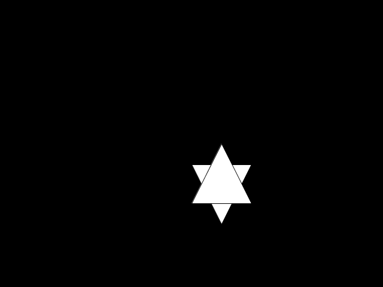
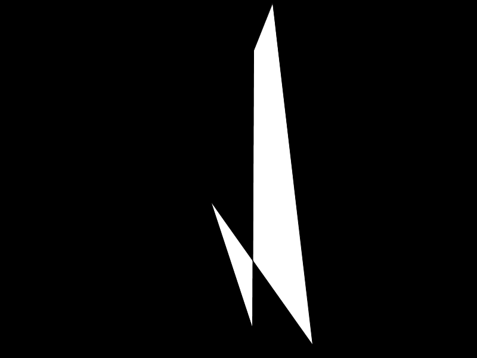

# Introduksjon: {.intro}

Her skal vi se på litt mer avansert opptegning og bevegelse. Vi skal
ta utgangspunkt i oppgaven om
[den sprettende ballen](../sprettende_ball/sprettende_ball.html), men
bytte ut ballen med trekanter, firkanter og mangekanter. Det anbefales
derfor at du har gjort den oppgaven før, eller at du har en forståelse
av `if`-setninger og koordinatsystemet fra før. Altså skal du lære å
tegne former med kanter, mange kanter.

# Steg 1: Enkle firkanter {.activity}

Vi begynner med rektangler: de firkantene som det er enklest å tegne
på datamaskinen.

## Sjekkliste {.check}

+ Start Processing og skriv dette:

  ```processing
  float x;
  float y;
  float xFart = 1.5;
  float yFart = 2;

  void setup() {
    size(640, 480);
    x = width / 2;
    y = height / 2;
  }

  void draw() {
    x += xFart;
    y += yFart;

    if (x < 0) {
      xFart = -xFart;
    }

    if (x > width - 100) {
      xFart = -xFart;
    }

    if (y < 0) {
      yFart = -yFart;
    }

    if (y > height - 100) {
      yFart = -yFart;
    }

    background(0);
    rect(x, y, 100, 100);
  }
  ```

  Dette programmet er ganske likt det som ble lagd i siste oppgave
  om den sprettende ballen, men det er noen små forskjeller:

  + Vi har endret tallene brukt i `if`-setningene. Hvorfor tror du
    dette er gjort? Hva skjer om du også tegner opp en sirkel med
    samme posisjon og størrelse som firkanten?

  + Vi har også tatt i bruk `+=`. `x += 1;` gjør det samme som `x =
  x + 1;` Dette er bare en forkortelse for det siste. Altså øk `x`
  med det som står på høyresiden av `+=`.

+ Kjør programmet ved å trykke på **Ctrl + R** eller knappen
  



+ Lagre programmet som Firkant ved å trykke på **Ctrl+S** eller
  velg **File --> Save** i menyen.

## Utfordringer {.try}

+ Kan du lage et rektangel som ikke er kvadratisk, altså hvor bredden
  og høyden er forskjellig? Husk at vi vil at den skal sprette idet
  den treffer kanten av vinduet.

# Enkle trekanter {.activity}

Å tegne rektangler var omtrent helt likt som å tegne sirkler, men nå
skal du lære å tegne trekanter. Om en trekant ble tegnet opp med en
posisjon og en bredde og høyde, hadde man ikke hatt så veldig god
kontroll over hvordan trekanten så ut. Derfor må vi si for hvert
hjørne befinner seg.

## Sjekkliste {.check}

+ Vi skal nå bytte ut firkanten med en enkel trekant. Endre `draw` som
  vist under:

  ```processing
  void draw() {
    x += xFart;
    y += yFart;

    if (x < 0) {
      xFart = -xFart;
    }

    if (x > width - 100) {
      xFart = -xFart;
    }

    if (y < 0) {
      yFart = -yFart;
    }

    if (y > height - 100) {
      yFart = -yFart;
    }

    background(0);
    triangle(x, y, x + 100, y, x + 50, y + 100);
  }
  ```

  Her har vi tatt i bruk `triangle` istedenfor `rect`. Denne tar
  imot seks argumenter, to for hvert hjørne i trekanten. `x, y` er
  posisjonen til det første hjørnet øverst til venstre, `x + 100, y`
  er posisjonen til det øverste høyre hjørnet og `x + 50, y + 100`
  er det siste hjørnet nederst i midten.

+ Lagre programmet som *Trekant* ved å velge **File -> Save as** eller
  trykke **Shift + Ctrl + S**.

+ Kjør programmet.


## Forbedre leseligheten {.protip}

Noen ganger kan det være vanskelig å lese kode med kall på funksjoner
som tar mange argumenter. I Processing tar de fleste funksjoner bare
imot noen få argumenter, men `triangle` tar seks. Da kan det være
nyttig å dele opp kallet over flere linjer. For eksempel kunne
setningen ovenfor vært skrevet slik at hvert hjørne var på hver sin
linje:

```processing
triangle(x, y,
  x + 100, y,
  x + 50, y + 100);
```

Hvis man fortsatt synes det er vanskelig å lese eller rotete, kan man
legge til noen ekstra mellomrom for å få ting på linje. Merk at om man
bruker automatisk formatering av koden i Processing, vil den fjerne
mellomrom den mener er overflødig.

## Utfordringer {.try}

+ Kan du tegne trekanten motsatt vei, sånn at den ser ut som en
  pil som peker oppover istedenfor nedover?


+ Kan du tegne to trekanter istedenfor en og lage en sekskantet
  stjerne?



+ **Vanskelig**: Trekanten i programmet er nesten likesidet, men den
  er litt for høy, så to av sidene er rundt 12 piksler for lange. Kan
  du endre regnestykket `y + 100` sånn at trekanten blir likesidet? Du
  kan bruke Pytagoras' læresetning, eller sinus-funksjonen,
  [`sin`](https://processing.org/reference/sin_.html) i Processing,
  for å finne den riktige høyden. Funksjonen
  [`radians`](https://processing.org/reference/radians_.html) kan være
  til hjelp for å gjøre om grader til radianer hvis du vil bruke
  sinus-funksjonen.

# Trekanter {.activity}

Nå skal vi se hvordan vi kan lage trekanter hvor hvert hjørne beveger
seg for seg selv. Da trenger vi variabler for posisjon og fart for
hvert hjørne. Til sammen blir dette fire variabler for hvert hjørne i
trekanten. En for x-posisjon, en for y-posisjon, en for x-fart og en
for y-fart. Ettersom trekanten har tre hjørner, blir dette totalt `3
hjørner * 4 variabler = 12 variabler`.

Vi kunne kalt dem f.eks. `x1`, `x2`, `x3` og tilsvarende lagt tall til
`y`, `xFart` og `yFart`. Isteden skal vi bruke noe som kalles en
*array*. Det er vanlig å bruke det engelske ordet også på norsk, men
det oversettes noen ganger til liste, vektor, rekke, tabell eller
matrise.

## Sjekkliste {.check}

+ Vi begynner med å endre variablene til *arrays*:

  ```processing
  float[] x = new float[3];
  float[] y = new float[3];
  float[] xFart = new float[3];
  float[] yFart = new float[3];
  ```

  Nå har vi endret typen av variablene fra `float` til
  `float[]`. Når vi putter firkantklammer etter en type, er det en
  *array* som inneholder verdier av typen foran klammene. Bak
  likhetstegnet ser vi også noe nytt `new float[3]` betyr at vi skal
  lage en ny `float`-*array* med tre tall i.

+ Nå må vi endre startverdiene til disse tallene, ellers vil de bare
  være `0` alle sammen:

  ```processing
  void setup() {
    size(800, 600);

    x[0] = width / 2;
    x[1] = width / 2;
    x[2] = width / 2;

    y[0] = height / 2;
    y[1] = height / 2;
    y[2] = height / 2;

    xFart[0] = 1.5;
    xFart[1] = 2.5;
    xFart[2] = 3.5;

    yFart[0] = -5;
    yFart[1] = 2.5;
    yFart[2] = -1.5;
  }
  ```

  Her ser vi hvordan vi jobber med verdiene i en *array*. Vi bruker
  firkantklammer med et tall i for å si hvilken verdi vi skal jobbe
  med. Den første verdien finnes på plass `0`, og den siste verdien
  er på plass `2` som er én lavere enn størrelsen. Tallet for
  plasseringen kalles *indeks*. Indeksen er alltid én lavere enn om
  vi skulle telle vanlig fordi vi begynner på `0`. Derfor er den
  siste indeksen én lavere enn størrelsen.

+ Og til slutt må vi flytte rundt på hjørnene og tegne opp trekanten
  vår:

  ```processing
  void draw() {
    for (int i = 0; i < x.length; i++) {
      x[i] += xFart[i];
      y[i] += yFart[i];

      if (x[i] < 0) {
        xFart[i] = -xFart[i];
      }

      if (x[i] > width) {
        xFart[i] = -xFart[i];
      }

      if (y[i] < 0) {
        yFart[i] = -yFart[i];
      }

      if (y[i] > height) {
        yFart[i] = -yFart[i];
      }
    }

    background(0);
    triangle(x[0], y[0], x[1], y[1], x[2], y[2]);
  }
  ```

  Her ser du en helt ny konstruksjon som vi skal se nærmere på i
  forklaringen nedenfor, men først kan du lagre og kjøre programmet.


## Forklaring {.protip}

I begynnelsen av `draw` har vi nå lagt inn noe som kalles en løkke,
*loop* på engelsk. En løkke er en del med kode som utføres flere
ganger. Det finnes andre slags løkker, og denne kalles en
*for-løkke*. Inne i parentesene etter `for` har vi tre setninger. Den
første, `int i = 0`, blir utført før løkken. Den neste, `i <
x.length`, bestemmer om koden i løkken skal utføres eller om løkken er
ferdig. Den siste, `i++`, utføres etter koden mellom krøllparentesene,
altså innholdet i løkken. `i` bruker vi inne i løkken som indeks når
vi jobber med arrayene istedenfor å skrive faste tall.

Så om vi går gjennom koden steg for steg, ser vi at først lages en
variabel `i` av typen `int` som starter med verdien `0`. `int` er
typen som brukes for tall uten desimaler, altså *heltall* eller
*integer* på engelsk. Så sjekker vi om `i` er mindre enn størrelsen
til arrayen `x`. Hvis den er det, og det er den, for størrelsen til
`x` er `3` og `i` er bare `0`, kjøres koden mellom
krøllparentesene. Når all koden mellom krøllparentesene er kjørt, så
kjøres `i++` som også er nytt for oss. `i++` gjør det samme som `i =
i + 1`, altså det øker `i` med `1`. Nå sjekker vi igjen om `i` er
mindre enn størrelsen til `x`. Og sånn fortsetter det helt til `i`
blir like stor eller større enn størrelsen til `x`.

Løkker som ser slik ut, med et heltall som økes med én og sjekkes mot
størrelsen på en array, er veldig vanlig og brukes til å jobbe med
arrayer. Du kommer til å se mange slike i fremtidige oppgaver. Løkker
kan kreve litt øving før man blir god på det, men etter hvert blir man
veldig glad for at man slipper å skrive den samme koden mange ganger.

## Utfordringer {.try}

+ Det går også an å lage firkanter hvor man plasserer hvert hjørne for
  seg. Da bruker man funksjonen `quad` istedenfor `rect`. Prøv å endre
  programmet til å lage en firkant med hjørner som spretter rundt på
  skjermen. Hvor mange flere variabler trenger du enn for trekanten?
  Hvor mange parametere tar `quad`?

# Mangekanter {.activity}

Nå skal vi se på hvordan vi kan lage mangekanter. Mangekanter er bare
et generelt navn for en form med flere kanter, som trekanter,
firkanter, femkanter, osv.

## Sjekkliste {.check}

+ Vi begynner med å endre på størrelsen på *arrayene* i forrige
oppgave:

  ```processing
  int KANTER = 5;
  float[] x = new float[KANTER];
  float[] y = new float[KANTER];
  float[] xFart = new float[KANTER];
  float[] yFart = new float[KANTER];
  ```

  Nå bruker vi en variabel for å sette størrelsen isteden. Dette
  hjelper leseligheten og gjør det enklere å endre antall kanter
  fordi vi bare trenger å endre tallet ett sted istedenfor fire
  steder.

+ Posisjonene og hastighetene til hjørnene ble satt til faste verdier,
  men hvis vi ikke vet nøyaktig hvor mange kanter det er fungerer ikke
  det så bra. Så vi endrer på `setup` til å bruke en løkke for å sette
  startverdiene:

  ```processing
  void setup() {
    size(800, 600);

    for (int i = 0; i < KANTER; i++) {
      x[i] = random(width);
      y[i] = random(height);
      xFart[i] = random(-5, 5);
      yFart[i] = random(-5, 5);
    }
  }
  ```

  Denne løkken likner en del på den vi har i `draw` fra før. Vi har
  derimot introdusert en funksjon som heter `random`. Denne gir oss
  tilfeldige tall. Hvis vi kaller den uten noen verdier, `random()`,
  får vi et tall mellom `0` og `1`. Hvis vi kaller den med én verdi,
  `random(width)`, får vi et tall mellom `0` og verdien. Hvis vi
  bruker to verdier, `random(-5, 5)`, får vi et tall mellom de to
  verdiene.

+ Nå skal vi tegne opp mangekanten vår. Vi trenger ikke å endre på den
  første løkken i `draw`, men jeg synes vi skal bytte testen så den
  likner den over. Vi skal bytte ut kallet på `triangle` med en løkke
  som tegner hver kant:

  ```processing
  void draw() {
    for (int i = 0; i < KANTER; i++) {
      x[i] += xFart[i];
      y[i] += yFart[i];

      if (x[i] < 0) {
        xFart[i] = -xFart[i];
      }

      if (x[i] > width) {
        xFart[i] = -xFart[i];
      }

      if (y[i] < 0) {
        yFart[i] = -yFart[i];
      }

      if (y[i] > height) {
        yFart[i] = -yFart[i];
      }
    }

    background(0);

    beginShape();
    for (int i = 0; i < KANTER; i++) {
      vertex(x[i], y[i]);
    }
    endShape(CLOSE);
  }
  ```

  Her ser vi tre nye funksjoner: `beginShape`, `vertex` og
  `endShape`. `beginShape` angir at vi skal tegne en form. `vertex`
  betyr at vi skal legge til et hjørne i formen, den tar inn to
  verdier for posisjonen til hjørnet. `endShape` sier at formen er
  ferdig og klar til å tegnes på skjermen. Hvis vi kaller `endShape`
  uten `CLOSE`, blir ikke formen lukket og fylt.



## Utfordringer {.try}

+ Kan du bruke `random` til å få hjørnene til å endre hastighet når de
  treffer kanten av vinduet?

  Pass på, om farten blir lavere enn den var, kan hjørnet bli
  sittende fast i kanten av vinduet. Det er fordi vi egentlig lar
  den bevege seg litt utenfor vinduet for så å snu. Sett `x` eller
  `y` til å være lik posisjonen til vinduskanten inne i
  `if`-setningene for å unngå det.
