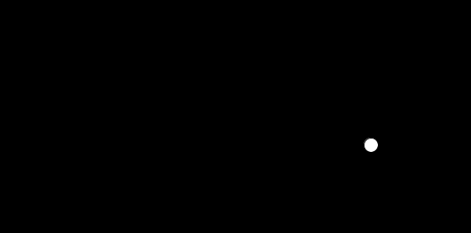
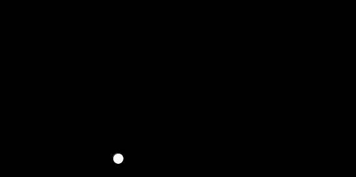
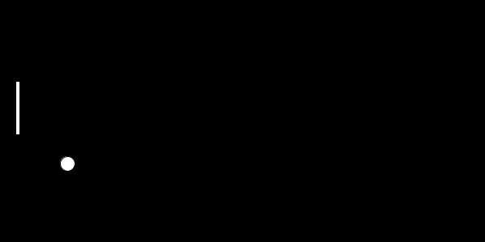
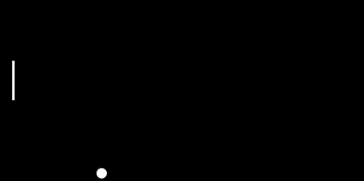
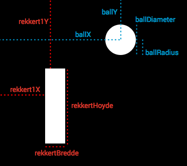
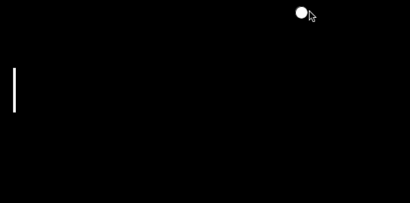

# Introdusjon: {.intro}

Her skal vi lage dataspillet Ping pong. Vi skal også lære om å hvordan du kan få programmene dine til å reagere på tastetrykk. Dette er veldig nyttig når du skal lage spill.

# Steg 1: Sprettende ball {.activity}

Vår begynnelse kommer til å ligne på det vi gjorde i [den sprettende ballen](../sprettende_ball/sprettende_ball.html).

## Sjekkliste {.check}

- Start Processing og skriv dette:

  ```processing
  float ballX;
  float ballY;
  float ballXFart = 2;
  float ballYFart = 2;
  float ballRadius = 9;
  float ballDiameter = ballRadius * 2;

  void setup() {
    size(600, 300);

    ballX = width / 2;
    ballY = height / 2;
  }

  void draw() {
    ballX = ballX + ballXFart;
    ballY = ballY + ballYFart;

    if (ballX < ballRadius) {
    ballXFart = -ballXFart;
    }
    if (ballX > width - ballRadius) {
    ballXFart = -ballXFart;
    }
    if (ballY < ballRadius) {
    ballYFart = -ballYFart;
    }
    if (ballY > height - ballRadius) {
    ballYFart = -ballYFart;
    }

    background(0);
    ellipse(ballX, ballY, ballDiameter, ballDiameter);
  }
  ```

  Koden er endret litt fra oppgaven om den sprettende ballen.
  Vi bruker andre navn på variablene våre. Det er også noen helt nye variabler.

  Hvorfor tror du vi har gjort dette?

+ Kjør programmet ved å trykke på **Ctrl + R** eller knappen




+ Lagre programmet som PingPong ved å trykke på **Ctrl+S** eller
velg **File --> Save** i menyen.

## Utfordringer {.try}

+ Kan du endre størrelsen på ballen?
+ Kan du endre farten til ballen?

# Steg 2: Ballen faller bak {.activity}

I Ping pong skal du hindre at ballen faller bak rekkerten. For at det skal være vits å gjøre dette må vi først sørge for at ballen ikke bare spretter tilbake når den treffer venstre vegg. Vi kan begynne med å sørge for at ballen ikke spretter tilbake.

+ Fjern koden som gjør at ballen spretter tilbake (denne ligger i den øverste ‘if’-en), slik at du går fra dette:

  ```processing
  if (ballX < ballRadius) {
    ballXFart = -ballXFart;
  }
  ```

  Til:

  ```processing
  if (ballX < ballRadius) {

  }
  ```

  

## Utfordringer {.try}

+ Kan du få ballen til å dukke opp et annet sted etter den har gått igjennom veggen?

# Steg 3: Legg til rekkerten {.activity}

Nå som ballen kan falle igjennom den venstre veggen, så må vi få på plass en rekkert, slik at du kan slå ballen tilbake. Det gjør vi ved å ha noen tallvariabler som representerer hvor rekkerten er og hvor stor den er. I tilegg så må vi ha kode som sender ballen tilbake.

+ Legge inn disse variablene nedenfor de som er der fra før:

  ```processing
  float rekkertHoyde = 66;
  float rekkertBredde = 5;
  float rekkert1X = 20;
  float rekkert1Y = 100;
  ```

  Disse variablene skal vi bruke til å holde styr på
  på størrelsen og plasseringen til rekkerten.

  Rett nedenfor background(0), legg til dette:

  ```processing
  rect(rekkert1X, rekkert1Y, rekkertBredde, rekkertHoyde);
  ```

  

  Vi kan nå se rekkerten når vi kjører programmet, men ballen går
  igjennom rekkerten. Det er fordi vi ikke har skrevet kode som
  stopper ballen og sender den tilbake.

  Legg til følgende i draw()-funksjonen:

  ```processing
  if (ballX-ballRadius < rekkert1X + rekkertBredde && ballX + ballRadius > rekkert1X) {
    if (ballY < rekkert1Y + rekkertHoyde && ballY > rekkert1Y) {
      ballX = ballX + rekkertBredde;
      ballXFart = -ballXFart;
    }
  }
  ```



## Utfordringer {.try}

+ Kan du gjøre rekkerten mindre?
+ Kan du endre plasseringen til rekkerten?

## Forklaring {.protip}

Her er et bilde som forklarer hva de forskjellige variablene står for:



# Steg 4: Styre rekkerten

Vi har en rekkert, men den er ikke til mye hjelp så lenge du ikke kan styre den. Derfor må du skrive kode som gjør at du kan styre den.

+ Skriv inn følgende i draw():

  ```processing
  if (keyPressed) {
    if (keyCode == UP) {
      rekkert1Y = rekkert1Y - 2;
    }
    if (keyCode == DOWN) {
      rekkert1Y = rekkert1Y + 2;
    }
  }
  ```

  Denne koden sjekker først om en knapp er trykket ned (keyPressed).
  Deretter sjekker den om det er opp- eller ned-knappen
  som blir trykket ned, og beveger rekkerten basert på dette.



Nå har du laget Ping pong!

## Bokstavtaster {.protip}

Hvis du vil styre ved å trykke på bokstavtaster istedenfor piltastene, må du endre litt på koden. Mange er vant til å styre opp med **W** og ned med **S**.

Hvis du endrer:

```processing
  if (keyCode == UP) {
````

Til:

```processing
  if (key == 'w') {
```

kan du styre opp med **W**. Hva tror du at du må gjøre for å kunne styre ned med **S**?

## Utfordringer {.try}

+ Kan du endre farten rekkerten beveger seg i?
+ Kan du legge til en rekkert på den andre siden slik at to spillere kan spille mot hverandre?
+ Kan du gjøre det slik at ballens vertikale retning (opp og ned) bestemmes av hvilken del av rekkerten den treffer?
+ Kan du gjøre noe som gjør at spillet blir vanskeligere etter hvert? For eksempel at ballen går raskere og raskere etter hvert, eller at rakkerten blir mindre.
