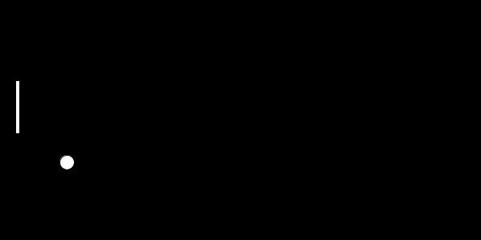
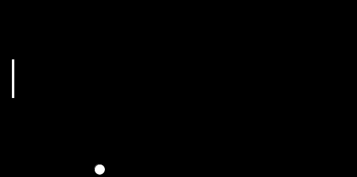
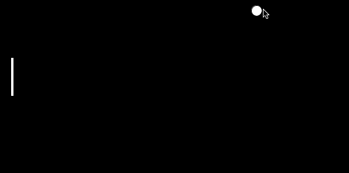

# Introdusjon: {.intro}

Her skal me lage dataspelet Ping pong. Ein del av det er å lære korleis du kan
få programma dine til å reagere på tastetrykk. Det er veldig nyttig når du skal
lage spel.


# Steg 1: Sprettande ball {.activity}

Starten vår kjem til å likne på det me gjorde i oppgåva om [den sprettande
ballen](../sprettende_ball/sprettende_ball_nn.html).

## Sjekkliste {.check}

- [ ] Start Processing og skriv dette:

  ```processing
  float ballX;
  float ballY;
  float ballXFart = 2;
  float ballYFart = 2;
  float ballRadius = 9;
  float ballDiameter = ballRadius * 2;

  void setup() {
    size(600, 300);

    ballX = width / 2;
    ballY = height / 2;
  }

  void draw() {
    ballX = ballX + ballXFart;
    ballY = ballY + ballYFart;

    if (ballX < ballRadius) {
    ballXFart = -ballXFart;
    }
    if (ballX > width - ballRadius) {
    ballXFart = -ballXFart;
    }
    if (ballY < ballRadius) {
    ballYFart = -ballYFart;
    }
    if (ballY > height - ballRadius) {
    ballYFart = -ballYFart;
    }

    background(0);
    ellipse(ballX, ballY, ballDiameter, ballDiameter);
  }
  ```

  Me har endra koden litt. Nokre stader bruker me andre namn på variablane våre,
  og det er nokre heilt nye variablar.

  Kvifor trur du me har gjort det?

- [ ] Køyr programmet ved å trykkje på `ctrl + R` eller knappen .


- [ ] Lagre programmet som PingPong ved å trykkje på `ctrl + S` eller vel `File
  --> Save` i menyen.

## Utfordringar {.challenge}

- [ ] Kan du endre storleiken på ballen?

- [ ] Kan du endre farta på ballen?


# Steg 2: Ballen går gjennom {.activity}

I Ping pong skal du hindre at ballen går forbi rekkerten. For at det skal vere
vits å gjere det må me fyrst syte for at ballen ikkje berre sprett attende når
den treff venstre vegg. Me startar med det.

- [ ] Fjern koden som gjer at ballen spretter attende (den ligg i den øvste
  "if"-en), slik at du går frå dette:

  ```processing
  if (ballX < ballRadius) {
    ballXFart = -ballXFart;
  }
  ```

  Til:

  ```processing
  if (ballX < ballRadius) {

  }
  ```

  

## Utfordringar {.challenge}

- [ ] Kan du få ballen til å dukke opp ein annan stad etter den har gått gjennom
  veggen?


# Steg 3: Legg til rekkerten {.activity}

No som ballen kan gå gjennom den venstre veggen, så må me få på plass ein
rekkert slik at du kan sjå ballen tilbake. Det gjer me ved å ha nokre
talvariablar som representerer kor rekkerten er og kor stor den er. I tillegg må
me ha kode som gjer at ballen sprett attende.

- [ ] Legg inn desse variablane under dei som er i koden frå før:

  ```processing
  float rekkertHogde = 66;
  float rekkertBreidde = 5;
  float rekkert1X = 20;
  float rekkert1Y = 100;
  ```

  Desse variablene skal me bruke til å halde styr på storleiken og plasseringa
  til rekkerten.

  Legg til dette rett under background(0):

  ```processing
  rect(rekkert1X, rekkert1Y, rekkertBreidde, rekkertHogde);
  ```

  

  No kan me sjå rekkerten når me køyrer programmet, men ballen går gjennom den!
  Det er fordi me ikkje har skrive kode som stoppar ballen og sender den
  attende.

  Legg til følgjande i draw()-funksjonen:

  ```processing
  if (ballX-ballRadius < rekkert1X + rekkertBreidde && ballX + ballRadius > rekkert1X) {
    if (ballY < rekkert1Y + rekkertHogde && ballY > rekkert1Y) {
      ballX = ballX + rekkertBreidde;
      ballXFart = -ballXFart;
    }
  }
  ```



## Utfordringar {.challenge}

- [ ] Kan du gjere rekkerten mindre?

- [ ] Kan du endre plasseringa til rekkerten?

## Forklaring {.protip}

Her er eit bilete som forklarar kva dei ulike variablane står for:


# Steg 4: Styre rekkerten {.activity}

Me har ein rekkert, men den er ikkje til mykje hjelp så lenge du ikkje kan styre
den. Difor må du skrive kode som let deg ta styringa.

- [ ] Skriv inn følgjande i draw():

  ```processing
  if (keyPressed) {
    if (keyCode == UP) {
      rekkert1Y = rekkert1Y - 2;
    }
    if (keyCode == DOWN) {
      rekkert1Y = rekkert1Y + 2;
    }
  }
  ```

  Koden sjekkar fyrst om ein knapp er trykka ned (`keyPressed`). Så sjekkar den
  om det er opp- eller ned-knappen som blir trykka ned, og beveger rekkerten
  basert på det.



No har du laga Ping pong!

## Bokstavtastar {.protip}

Viss du vil styre ved å trykkje på bokstavtastar i staden for piltastane, så må
du endre litt på koden. Mange er vant til å styre opp med `W` og ned med `S`.

Viss du endrar:

```processing
  if (keyCode == UP) {
```

Til:

```processing
  if (key == 'w') {
```

kan du styre opp med `W`. Kva trur du at du må gjere for å kunne styre ned med
`S`?

## Utfordringar {.challenge}

- [ ] Kan du endre farta rekkerten beveger seg i?

- [ ] Kan du leggje til ein rekkert på den andre sida slik at to spelarar kan
  spele mot kvarandre?

- [ ] Kan du gjere det slik at ballen sin vertikale retning (opp og ned) blir
  påverka av kva del av rekkerten den treff?

- [ ] Kan du gjere noko som gjer at spelet blir vanskelegare etter kvart? Til
  dømes kan ballen gå raskare og raskare etter kvart, eller rekkerten kan bli
  mindre.
