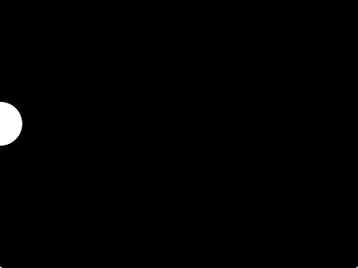

# Introduksjon: {.intro}

I denne delen skal me lære eit programmeringsspråk som heiter Processing. Det
vart laga for å gjere programmering enkelt for designarar og andre som ikkje har
programmert før. Processing eignar seg til å lage multimedieprogram, spel og
liknande. Mange likar Processing fordi det er raskt å lage program som vanlegvis
krev mykje arbeid.




# Steg 1: Vindauge {.activity}

Me skal starte heilt enkelt med å lage eit vindauge og fylle det med ei
bakgrunnsfarge. Det er grunnlaget for nesten alle program du lagar med
Processing, så det er ein fin stad å starte på.

## Sjekkliste {.check}

- [ ] Start Processing og skriv dette:

  ```processing
  void setup() {
    size(640, 480);
  }

  void draw() {
    background(0);
  }
  ```

- [ ] Køyr programmet ved å trykkje på pila .

- [ ] Lagre programmet som Ball ved å velje `File --> Save` i menyen.

### Tips: Korleis skrive krøllparentesar { } {.protip}

Her er ei oversikt over korleis ein skriv teikn me ofte brukar i både Processing
og andre programmeringsspråk.

| Teikn | Windows/Linux            | Mac                           |
| :---: | ------------------------ | ----------------------------- |
|  `;`  | `shift + ,`              | `shift + ,`                   |
|  `"`  | `shift + 2`              | `shift + 2`                   |
| `\'`  | `\'` (til høgre for Æ)   | `\'` (til venstre for 1)      |
| `\|'  | `\|` (til venstre for 1) | `alt + 7`                     |
| `\&`  | `shift + 6`              | `shift + 6`                   |
|  `+`  | `+` (til høgre for 0)    | `+` (til høgre for 0)         |
|  `-`  | `-` (til høgre for .)    | `-` (til høgre for .)         |
|  `*`  | `shift + '`              | `shift + @` (til høgre for Æ) |
|  `/`  | `shift + 7`              | `shift + 7`                   |
| `\[`  | `alt gr + 8`             | `alt + 8`                     |
| `\]`  | `alt gr + 9`             | `alt + 9`                     |
|  `{`  | `alt gr + 7`             | `shift + alt + 8`             |
|  `}`  | `alt gr + 0`             | `shift + alt + 9`             |

## Utforsking {.challenge}

Prøv dette:

- [ ] Kva skjer viss du endrar `640` i `size(640, 480);`?

- [ ] Kva skjer viss du endrar `480` same stad?

- [ ] Kva skjer viss du endrar `0` i `background(0);`?

- [ ] Kva skjer viss talet er større enn `255`?

- [ ] Kva skjer viss talet er negativt?

- [ ] Før du går vidare, fjern endringane du gjorde i utforskinga.

## Forklaring av koden {.protip}

Sjølv om du har utforska `size(640, 480)` og `background(0)` lurar du kanskje på
kva reisten av koden gjer? Her er ei forklaring:

- `void setup() {` lagar ein *funksjon* som heiter setup. Når `setup` blir kalla
  køyrast koden mellom krøllparentesane. Du lurar kanskje på kva ein funksjon er
  og kva det tyder å kalle den? Ein funksjon er *ein namngitt del med kode*. Den
  namngjevne koden kan køyrast når ein treng det ved *å kalle den* slik som
  dette: `setup();`. `setup` er ein spesiell funksjon som alltid blir køyrt av
  Processing når du trykkar på .

  Nokre funksjonar git tilbake ein verdi som resultat når dei er ferdige. Typen
  verdi som blir returnert står framfor namnet på funksjonen. Når det står
  `void` tyder det at funksjonen ikkje gir noko tilbake, slik som er tilfellet
  med `setup()`. Viss du til dømes har ein funksjon som skal gi eit heiltal, så
  ville du skrive `int namnPaFunksjonen() {`. Her står `int` for *integer*, som
  tyder heiltal på engelsk, altså 0, 1, 2, 3, -1, -2, -3 osb.

- `size(640, 480);` er eit kall på funksjonen `size` som åpnar eit vindauge med
  breidde 640 [pikslar](https://no.wikipedia.org/wiki/Piksel) og høgde 480
  pikslar. Legg merke til at du sender verdiar inn i size-funksjonen ved å
  leggje verdiane mellom `( )`. Semikolon, `;` fortel at setninga er ferdig. Det
  gjer det mogleg å ha fleire setningar på same linje (`size(1,2);
  background(3);`) eller fordele ei lang setning utover fleire linjer.

- `}` på linje tre tyder at funksjonen `setup` er ferdig.

- `void draw() {` på linje 5 tyder at me lagar ein funksjon som heiter `draw`.
  `draw` er spesiell, den blir køyrt om att og om att så lenge programmet ditt
  køyrer.

- `background(0);` set bakgrunnsfarga i vindauget. Talet `0` tyder at bakgrunnen
  skal vere svart. Kvit har verdien `255`. Tala mellom 0 og 255 gir ulike
  gråtoner. Seinare skal me sjå korleis me teiknar farger.

- `}` på siste linje tyder at funksjonen `draw` er ferdig.


# Steg 2: Ball {.activity}

Sidan oppgåva skal handle om ein sprettande ball er det på tide at me startar å
teikne. La oss teikne ein disk (ein fylt sirkel) midt i vindauget, dette skal
vere ballen vår.

## Sjekkliste {.check}

- [ ] Endre `draw` til det følgjande utan å endre `setup`:

  ```processing
  void draw() {
    background(0);
    ellipse(320, 240, 100, 100);
  }
  ```

- [ ] Lagre med `ctrl + S` og køyr programmet med `ctrl + R`. No skal du sjå ein
  kvit disk midt i vindauget, som i biletet under.

  

- [ ] Legg til ein disk til og køyr programmet att:

  ```processing
  void draw() {
    background(0);
    ellipse(320, 240, 100, 100);
    ellipse(0, 0, 200, 200);
  }
  ```

- [ ] La oss leggje til endå ein disk og køyre programmet endå ein gong:

  ```processing
  void draw() {
    background(0);
    ellipse(320, 240, 100, 100);
    ellipse(0, 0, 200, 200);
    ellipse(640, 480, 50, 50);
  }
  ```


## Forklaring av koden {.protip}

Klarar du å knekke koden for korleis `ellipse` fungerer?

- Det fyrste talet bestemmer kor langt til høgre i vindauget disken skal
  teiknast.

- Det andre talet bestemmer kor langt ned i vindauget den skal teiknast opp.

- Det tredje talet bestemmer kor brei disken skal vere.

- Det siste talet bestemmer kor høg disken er.

Det siste høyrest kanskje rart ut? Ein sirkel er jo like brei som den er høg! Ei
ellipse som er like høg som den er brei er ein sirkel, men ei ellipse kan vere
breiare enn ho er høg, eller høgare enn ho er brei. Difor heiter funksjonen
`ellipse` og ikkje `circle`.


I biletet over visast området utanfor bileteramma og to piler **X** og **Y**.

- Det fyrste talet i `ellipse` angir posisjon langs X-aksen, vist med X-pila.

- Det andre talet i `ellipse` angir posisjon langs Y-aksen, vist med Y-pila.

Der pilene kryssar kvarandre har både X og Y verdien `0`. Pilene strekk seg til
kanten av vindauget med verdiane `640` for X og `480` for Y. Dette vart bestemt
av `size(640, 480)`.

**Tips:** Ein kan teikne opp ting utanfor biletet med negative tal eller tal som
er større enn dei som vart brukt i `size`.


# Steg 3: Variablar {.activity}

Til no har me brukt faste tal over alt. Det fungerer ikkje alltid så bra. Til
dømes, kva skjer viss me endrar storleiken på vindauget? Vil den fyrste disken
vere i midten? Og korleis kan me få diskane til å bevege på seg?

Dette løyser me ved hjelp av noko som heiter *variablar*. Ein variabel er ein
verdi som har fått eit namn. Me kan endre verdien til variabelen, og det er
grunnen til at det heiter ein variabel: *verdien kan variere*.

## Sjekkliste {.check}

- [ ] La oss starte med å endre storleiken på vindauget i `setup`:

  ```processing
  void setup() {
    size(800, 600);
  }
  ```

  Legg merke til at to av diskane har "flytta" på seg. Dei er ikkje i midten og
  i høgre botn av vindauget lengre.

  

- [ ] No skal me ta i bruk to variablar som heiter `width` og `height`, altså
  breidde og høgde. Desse variablane får verdien til storleiken på vindauget når
  `size` blir kalla. Endre `draw` til å bruke `width` og `height`:

  ```processing
  void draw() {
    background(0);
    ellipse(width / 2, height / 2, 100, 100);
    ellipse(0, 0, 200, 200);
    ellipse(width, height, 50, 50);
  }
  ```

  Her brukar me reknestykka `width / 2` og `height / 2` for å teikne opp den
  fyrste disken. Skråstreken, `/`, tyder "delt på", altså gir `width / 2`
  halvparten av breidda. Kva gir `height / 2`?

  **Tips:** Me kunne ha brukt `width * 0.5` for å få det same, breidda ganga med
  ein halv. Nokre gonger er det enklare med deling, andre gonger med ganging.

- [ ] Lagre og køyr programmet, viss du ikkje har gjort det allereie.

- [ ] La oss lage våre eigne variablar, slik at me kan få formene til å bevege
  på seg:

  ```processing
  float x;
  float y;

  void setup() {
    size(800, 600);
    x = width / 2;
    y = height / 2;
  }
  ```

  `float x;` og `float y;` lagar to variablar med namna `x` og `y`. Typen av
  variablane er `float`, altså desimal- eller flyttal. Inne i `setup` gir me
  variablane verdiar, som er dei same reknestykka me brukte tidlegare.

- [ ] Det er ikkje nok å berre ha variablar, me må bruke dei òg. Endre `draw`
  til å bruke `x` og `y`:

  ```processing
  void draw() {
    x = x + 1;

    background(0);
    ellipse(x, y, 100, 100);
    ellipse(0, 0, 200, 200);
    ellipse(width, height, 50, 50);
  }
  ```

  No brukar den fyrste disken `x` og `y` som posisjon. I tillegg la me til linja
  `x = x + 1;` som seier at `x` skal auke med `1` for kvar gong `draw` blir
  køyrt. Kva vil skje med den eine disken når programmet blir køyrt?

- [ ] Lagre og køyr programmet, viss du ikkje har gjort det allereie.

### Tips: Lagre som {.protip}

Viss du ikkje bil miste dei ulike stega i denne oppgåva, så kan du bruke `File
--> Save as` (lagre som) i staden for `Save` (lagre). Hurtigtasten for det er
`ctrl + shift + S`. Då får du lagre programmet med eit anna namn slik at du
beheldt dei ulike variantane.

## Utforsking {.challenge}

Kan du endre `x` og `y` inni `draw` slik at disken bevegar seg...

- [ ] ... mot venstre i staden for høgre?

- [ ] ... opp i staden for sidelengs?

- [ ] ... ned i staden for opp?

- [ ] ... på skrå?


# Steg 4: Sprette i veggen {.activity}

Det er litt dumt at disken forsvinn ut av vindauget heile tida. No skal me få
disken til å snu når den treff kanten av vindauget, slik ein ball sprett tilbake
viss du kastar den i ein vegg.

## Sjekkliste {.check}

- [ ] Me treng eit par nye variablar for å styre retninga til disken. Legg til
  variablane `xFart` og `yFart` før `setup`:

  ```processing
  float xFart = 1.5;
  float yFart = 2;
  ```

  Variablane har type `float`, altså flyttal eller desimaltal. Det kan til dømes
  vere `1.1`, `3.14` eller `-2.01`. Variablane skal styre farta og retninga til
  disken. I Processing, og i dei fleste programmeringssoråk, brukar me punktum i
  staden for komma som desimalteikn. Det er fordi punktum er det som brukast på
  engelsk.

  **Notis:** La du merke til at variablane fekk verdiar med ein gong, medan me
  tidlegare ga dei verdiar inni `setup`? Grunnen til det er at me ikkje kan
  bruke `width` og `height` før `size` er køyrt, så me kunne ikkje gi `x` og `y`
  verdiar med ein gong.

- [ ] Legg til koden under i `draw` for å få ballen til å snu. Merk at me endrar
  setninga det me aukar `x` og fjernar to av diskane.

  ```processing
  void draw() {
    x = x + xFart;
    y = y + yFart;

    if (x < 50) {
      xFart = -xFart;
    }

    if (x > width - 50) {
      xFart = -xFart;
    }

    if (y < 50) {
      yFart = -yFart;
    }

    if (y > height - 50) {
      yFart = -yFart;
    }

    background(0);
    ellipse(x, y, 100, 100);
  }
  ```

- [ ] Lagre og køyr programmet.

### Forklaring {.protip}

I `draw` ser me ein del ting du ikkje har sett før.

- `if (x < 50)`, *viss x er under 50*, let oss køyre `xFart = -xFart;` berre
  viss `x` er mindre enn 50. Kva tyder dei andre `if`-setningane?

- `xFart = -xFart;` endrar forteiknet til farta. Viss farta er positiv (+) blir
  den negativ (-), og viss farta er negativ vil den bli positiv.

## Utfordringar {.challenge}

- [ ] Kan du kombinere to og to av `if`-setningane ved å bruke `||`? Teikna `||`
  saman tyder "eller". Til dømes tyder koden `if (x < 1 || x > 10)` "viss x er
  under 1 *eller* x er over 10".

- [ ] Kan du få ballen til å sprette sidelengs som dette?

  

- [ ] Kan du få ballen til å endre form samstundes?

  

- [ ] Kan du få ballen til å endre fart avhengig av posisjonen?

  
