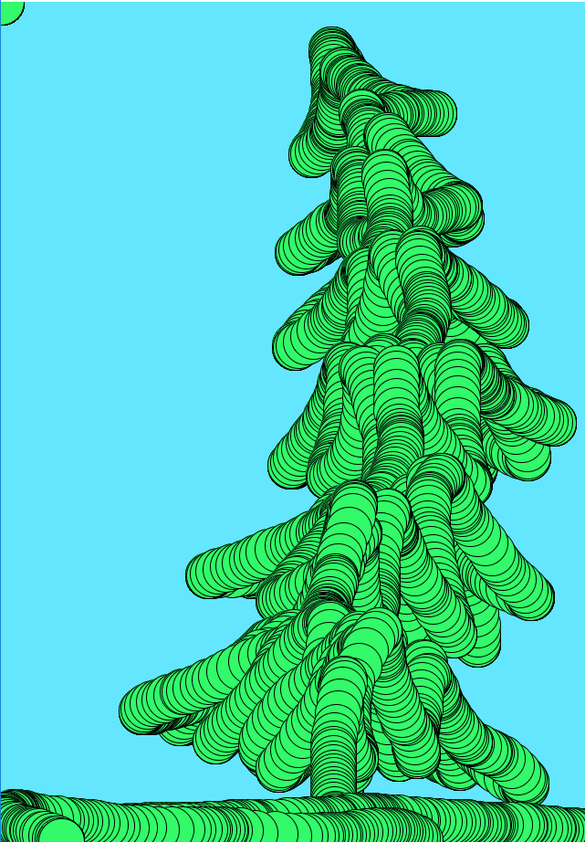

# Om oppgaven {.activity}

I dette prosjektet lager vi et tegneprogram slik at man etterpå kan lage sin
egen kunst. Man kan tegne med forskjellige farger, og lage figurer som ligner på
blant annet denne:

## Oppgaven passer til: {.check}

__Fag__: Kunst og håndverk, Matematikk, Programmering

__Anbefalte trinn__: 8. trinn - VG3

__Tema__: Spill, Tegne, Koordinater, Brukerinteraksjon

__Tidsbruk__: Dobbelttime eller mer

## Kompetansemål {.challenge}

- [ ] __Kunst og håndverk, 7. trinn__: bruke digitale verktøy til å planlegge og presentere prosesser og produkter

- [ ] __Kunst og håndverk, 7. trinn__: bruke programmering til å skape interaktivitet og visuelle uttrykk

- [ ] __Kunst og håndverk, 10. trinn__: visualisere form ved hjelp av frihåndstegninger, arbeidstegninger, modeller og digitale verktøy

- [ ] __Matematikk, 6. trinn:__ bruke variabler, løkker, vilkår og funksjoner i programmering til å utforske geometriske figurer og mønster

- [ ] __Fordypning i matematikk, 10. trinn:__ bruke teknologi som verktøy for kunnskapssøking, kommunikasjon, kreativitet og læring i matematikk

- [ ] __Programmering, 10. trinn:__ bruke flere programmeringsspråk, deriblant minst ett som er tekstbasert

- [ ] __Programmering, 10. trinn:__ bruke grunnleggende prinsipper i programmering, slik som variabler, løkker, vilkår og funksjoner, og reflektere over bruken av disse

## Forslag til læringsmål {.challenge}

- [ ] Elevene kan lage og bruke enkle funksjoner for bildebehandling.

- [ ] Elevene kan bruke kode til å lese av posisjonen til musepekeren i et
  koordinatsystem, og bruke denne informasjonen videre.

- [ ] Elevene kan bruke kode til å endre funksjoner og verktøy etter
  brukerinteraksjon.

## Forslag til vurderingskriterier {.challenge}

Det er mange ulike måter en kan vurdere et programmeringsprosjekt, og her må en
selv vurdere hva som er den beste måten ut ifra hvilket fag man jobber i,
hvilken aldergruppe og hvilket nivå elevene er på, hva man ønsker å teste og hvor
mye tid man har til rådighet til å jobbe med prosjektet. I vårt lærerdokument
har vi blant annet beskrevet ulike måter dette kan gjøres på, i tillegg til en
del andre nyttige tips til hvordan man underviser i programmering.

## Forutsetninger og utstyr {.challenge}

- [ ] __Forutsetninger__: Elevene bør kjenne til Processing.

- [ ] __Utstyr__: Datamaskiner med
  [Processing](https://www.processing.org/download/){target=_blank} installert.
  Elevene kan gjerne jobbe to og to sammen.

## Fremgangsmåte

[Klikk her for å se
oppgaveteksten.](../tegnespillet/tegnespillet.html){target=_blank} _Vi har
dessverre ikke noen tips, erfaringer eller utfordringer tilknyttet denne
oppgaven enda._

## Variasjoner {.challenge}

- [ ] Elevene kan lage en blyant som endrer farge av seg selv.

- [ ] Elevene kan lage tastatursnarveier for å endre farge uten å måtte klikke.

- [ ] Elevene kan lage et verktøy som endrer størrelsen på blyantstreken.

## Eksterne ressurser {.challenge}

- [ ] Foreløpig ingen eksterne ressurser...
