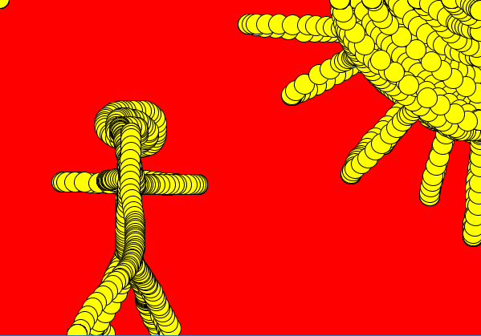
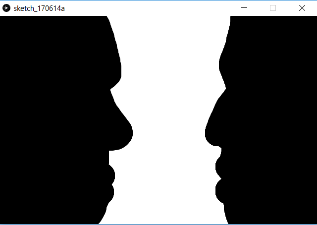

# Introduksjon {.intro}

Denne oppgåva går ut på å lage eit teiknespel. Målet er å skrive kode slik at du
kan teikne teikningar som liknar på desse:






Oppgåva er lagt opp slik at du les og gjer det som står i oppgåveteksten. På
slutten av kvart steg kan du dobbeltsjekke koden din med eit forslag til kode
som me har lagt ved.


# Steg 1: Lag eit vindauge - teiknebrettet {.activity}

No skal me lage eit vindauge med ei enkel bakgrunnsfarge. Det er noko me gjer
til nesten alle program me lagar i Processing.

## Sjekkliste {.check}

- [ ] Start Processing og skriv dette:

```processing
void setup(){
    size(640, 420);
    background(0, 0, 0);
}
```

- [ ] No kan du starte programmet ved å trykkje `ctrl + R`, eller trykkje
  `play`-pila øvst.

- [ ] Lagre programmet ved å trykkje `ctrl + S`, eller ved å trykkje `File -->
  Save` i menyen øvst.

### Tips: Korleis skrive krøllparentesar { } {.protip}

Her er ei oversikt over korleis ein skriv teikn me ofte brukar i både Processing
og andre programmeringsspråk.

| Teikn | Windows/Linux            | Mac                           |
|:-----:| ------------------------ | ----------------------------- |
|  `;`  | `shift + ,`              | `shift + ,`                   |
|  `"`  | `shift + 2`              | `shift + 2`                   |
|  `\'` | `\'` (til høgre for Æ)   | `\'` (til venstre for 1)      |
|  `\|` | `\|` (til venstre for 1) | `alt + 7`                     |
|  `\&` | `shift + 6`              | `shift + 6`                   |
|  `+`  | `+` (til høgre for 0)    | `+` (til høgre for 0)         |
|  `-`  | `-` (til høgre for .)    | `-` (til høgre for .)         |
|  `*`  | `shift + '`              | `shift + @` (til høgre for Æ) |
|  `/`  | `shift + 7`              | `shift + 7`                   |
|  `\[` | `alt gr + 8`             | `alt + 8`                     |
|  `\]` | `alt gr + 9`             | `alt + 9`                     |
|  `{`  | `alt gr + 7`             | `shift + alt + 8`             |
|  `}`  | `alt gr + 0`             | `shift + alt + 9`             |

## Prøv dette {.check}

- [ ] Prøv å endre `0` i `background(0, 0, 0);` til andre tal.

- [ ] Sjå kva som skjer viss du endrar eitt av tala til `255`.

- [ ] Kva skjer når du set talet til å vere større enn `255` eller mindre enn
  `0`?

- [ ] Prøv å endre storleiken på vindauget ved å endre på tala i `size`.

- [ ] Finn ei bakgrunnsfarge du likar og behald den til neste del av oppgåva.

## Forklaring av koden {.protip}

Lurar du på korleis koden du har skrive fungerer?

- `void setup() {` er ein metode som heiter `setup`. Merk at du berre kan ha éin
  metode med kvart namn! `setup` er spesiell, sidan den berre blir køyrt ein
  gong - heilt fyrst når du startar programmet ditt. Nokre metoder gir tilbake
  informasjon. Det gjer ikkje `setup`, og det viser me ved å skrive `void`
  framfor `setup`.

- `size(640, 420);` er det som bestemmer kor stort vindauget ditt er. Denne er
  inne i `void setup(){`-metoden fordi me berre må bestemme storleiken på
  vindauget ein gong - når me startar.

- Me har brukt `background(0, 0, 0);`, denne bestemmer bakgrunnsfarga i
  vindauget. Talet `0` seier at det ikkje er farge, og `(0, 0, 0)` gir svart.
  Viss me skriv `255`, som er det høgste talet me kan bruke, så set me på full
  fargestyrke på den vesle lyspæra i PC-skjermen. Det tyder at viss me skriv
  `background(255, 255, 255)` så blir det kvitt. Dei ulike tala står for raud,
  grøn og blå, og når me endrar desse verdiane blandar me fargane.

- På linje 1 og 4 har me `{` og `}`. Desse krøllparentesane åpnar og lukkar
  metoden. Metoden inneheldt all koden me skriv mellom desse teikna.

Koden din skal sjå slik ut så langt. Hugs at tala inni parentesane ikkje
nødvendigvis er heilt lik det du har, det tyder berre at du har ein anna
storleik på vindauget ditt, eller ei anna bakgrunnsfarge.

```processing
void setup(){
    size(640, 420);
    background(0, 0, 0);
}
```

# Steg 2: Teikne med diskar! {.activity}

Me lagar ein ny metode som me kallar `draw`, den skal òg vere `void`.

## Sjekkliste {.check}

- [ ] Skriv denne koden:

```processing
void draw(){

}
```

- [ ] Start programmet og sjå at det køyrer. Det skal ikkje skje noko nytt, men
  viss programmet ikkje køyrer har du skrive noko feil i den nye koden.

- [ ] Skriv denne koden i `draw`-metoden for å få noko å teikne med!

```processing
    fill(100, 100, 255);
    ellipse(mouseX, mouseY, 50, 50);
```

- [ ] Start programmet og teikn litt.

## Sjekkliste {.check}

- [ ] Byt farga du teiknar med. Det gjer du ved å endre tala i `fill(100, 100,
  255);`.

- [ ] Prøv å teikne grønt.

- [ ] Prøv å teikne blått.

- [ ] Byt ut det fyrste `50`-talet som står i parentesen bak `ellipse` med
  `200`, og sjå kva som skjer.

- [ ] Kan du få `ellipse` til å bli like høg som vindauget ditt?

- [ ] Prøv det du har lyst til.

Når du har prøvd litt forskjellig kan du prøve deg på å teikne det me viste deg
i starten. Prøv å endre bakgrunnsfarge, storleiken på vindauget og farga du
teiknar med, slik at du kan lage teikningar som liknar på bileta du såg fyrst.
Me viser dei att under. Det kan vere vanskeleg å finne nøyaktig same farge og
storleik, men noko som liknar er godt nok!


## Forklaring av koden {.protip}

Lurar du på korleis koden du har skrive fungerer?

- `void draw(){` er ein ny metode, slik som `void setup(){`, men med nytt namn
  og nytt innhald.

- `ellipse` tyder at du lagar ein disk, og `mouseX, mouseY` bestemmer at den
  skal følgje etter musepeikaren når du flyttar på den. Tala `50, 50` bestemmer
  storleiken til disken.

- `fill(100, 100, 255);` bestemmer kva farge disken skal ha. På same måte som
  før står dei for raud, grøn og blå, og kan blandast slik du har prøvd før.

Til slutt ser du eit bilete av heile koden vår. Sjekk om koden din liknar på den
me har. Hugs at tala inne i parentesane heilt sikkert er ulike frå dei du har i
koden din, men oppsettet bør vere likt.

```processing
void setup(){
  size(640, 420);
  background(0, 0, 0);
}

void draw(){
  fill(100, 100, 255);
  ellipse(mouseX, mouseY, 50, 50);
}
```
