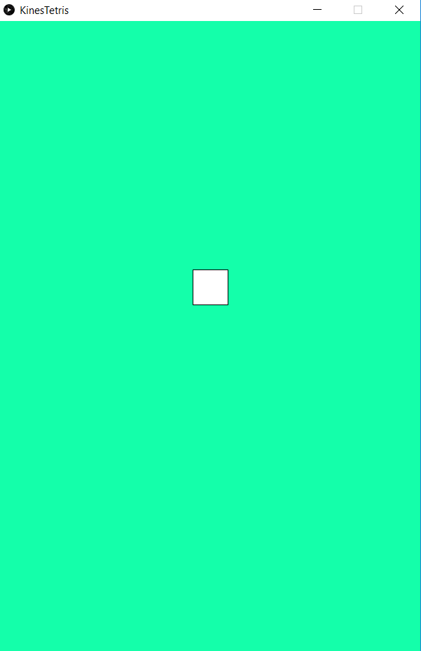

# Om oppgaven {.activity}

I dette prosjektet skal elevene lage en animasjon av en firkant som faller
nedover på skjermen. Dette er starten på en enkel versjon av det klassiske
spillet tetris.

## Oppgaven passer til: {.check}

__Fag__: Kunst og håndverk, Matematikk, Programmering

__Anbefalte trinn__: 8. trinn - VG3

__Tema__: Koordinater, Variabler, Form, Farger

__Tidsbruk__: Dobbelttime

## Kompetansemål {.challenge}

- [ ] __Kunst og håndverk, 7. trinn__: bruke programmering til å skape interaktivitet og visuelle uttrykk

- [ ] __Matematikk, 6. trinn:__ bruke variabler, løkker, vilkår og funksjoner i programmering til å utforske geometriske figurer og mønster

- [ ] __Fordypning i matematikk, 10. trinn:__ diskutere, planlegge, lage og vurdere spilldesign og egne spill

- [ ] __Programmering, 10. trinn:__ bruke flere programmeringsspråk, deriblant minst ett som er tekstbasert

- [ ] __Programmering, 10. trinn:__ bruke grunnleggende prinsipper i programmering, slik som variabler, løkker, vilkår og funksjoner, og reflektere over bruken av disse

## Forslag til læringsmål {.challenge}

- [ ] Elevene kan lage kvadrater digitalt.

- [ ] Elevene kan plassere en figur i et koordinatsystem.

- [ ] Elevene kan bruke et tekstbasert programmeringsspråk.

- [ ] Elevene kan bruke variabler for å få en figur til å flytte seg.

## Forslag til vurderingskriterier {.challenge}

Det er mange ulike måter en kan vurdere et programmeringsprosjekt, og her må en
selv vurdere hva som er den beste måten ut ifra hvilket fag man jobber i,
hvilken aldergruppe og hvilet nivå elevene er på, hva man ønsker å teste og hvor
mye tid man har til rådighet til å jobbe med prosjektet. I vårt lærerdokument
har vi blant annet beskrevet ulike måter dette kan gjøres på, i tillegg til en
del andre nyttige tips til hvordan man underviser i programmering.

## Forutsetninger og utstyr {.challenge}

- [ ] __Forutsetninger__: Elevene bør kjenne til Processing.

- [ ] __Utstyr__: Datamaskiner med
  [Processing](https://www.processing.org/download/){target=_blank} installert.
  Elevene kan gjerne jobbe to og to sammen.

## Fremgangsmåte

[Klikk her for å se oppgaveteksten.](../tetris/tetris.html){target=_blank}

_Vi har dessverre ikke noen tips, erfaringer eller utfordringer tilknyttet denne
oppgaven enda._

## Variasjoner {.challenge}

_Vi har dessverre ikke noen variasjoner tilknyttet denne oppgaven enda._

## Eksterne ressurser {.challenge}

- [ ] Se denne
  [YouTube-videoen](https://www.youtube.com/watch?v=yTCTxdBKoSQ){target=_blank}
  av et tetrisspill på Facebook.
