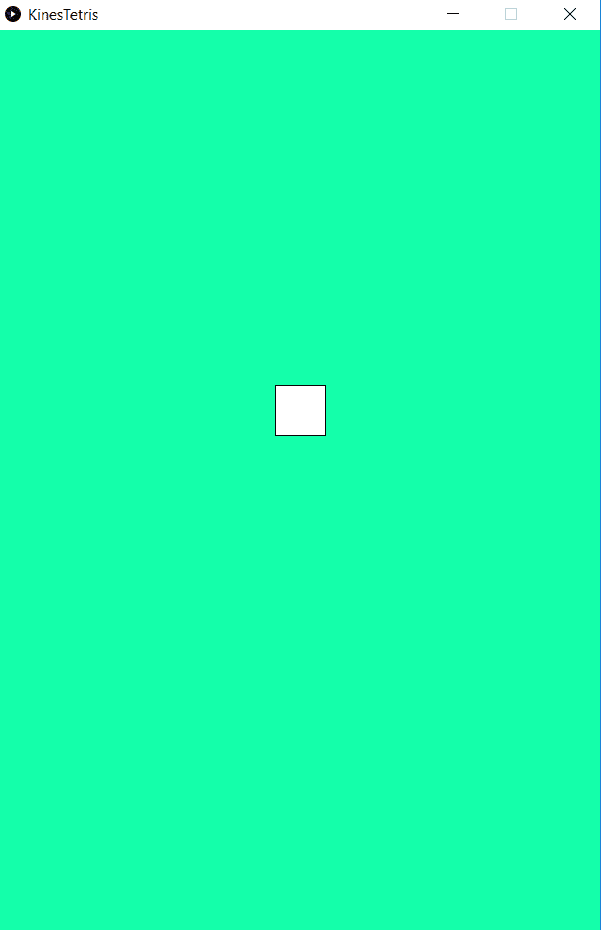

# Introduksjon {.intro}

Lag starten på ditt eige tetris-spel!

Det du skal gjere i denne oppgåva er fyrst å setje opp bakgrunnen til spelet, og
så få firkantar til å falle over skjermen.

Slik vil det sjå ut når du er ferdig med oppgåva:




# Steg 1: Lag dine fyrste to metodar {.activity}

For kvart steg får du ei forklaring med eit døme, og på slutten av steget kjem
eit bilete av heile koden. Bruk biletet av koden viss du treng det, men prøv å
skrive koden på eiga hand ved hjelp av forklaringa fyrst.

## Fyrste gjeremål {.check}

- [ ] La oss starte med å setje opp eit vanleg vindauge. Viss du ikkje har åpna
  Processing endå må du gjere det no.

- [ ] Lagre programmet ditt, det gjer du ved å velje `File` og `Save As`.

Me anbefalar at du gir koden din eit namn som har noko med spelet å gjere, slik
at det er lett å finne den att. Det er òg lurt å lagre koden ein stad som er
lett å hugse.

Processing er ein kodeeditor, det tyder at du kan skrive kode i den. Den fyrste
koden du skal skrive er ein kodesnutt med to metodar. Ein metode ser ut som
dette:

```processing
void setup(){

}
```

Denne metoden heiter `setup`. Alt som blir skrive inni metoden `setup` skjer éin
gong, når programmet startar, medan det som står inni metoden `draw` skjer om
att og om att heilt til programmet blir avslutta.

## Prøv sjølv {.check}

- [ ] Prøv å skrive begge metodane sjølv. Dei to metodane skal vere heilt like
  bortsett frå namnet.

- [ ] No må du køyre koden for å sjekke at metodane fungerer. For å køyre koden
  trykkar du på **play**-knappen ! oppe
  til venstre i Processing-programmet.

Viss all koden din er riktig skal du få opp eit lite vindauge som ser slik ut:


Her er heile koden slik den skal sjå ut no:

```processing
void setup(){

}

void draw(){

}
```

- [ ] Dobbeltsjekk at du har skrive alt riktig før du går vidare.


# Steg 2: Storleik på vindauget {.activity}

No skal du bestemme storleiken på vindauget. Det gjer du ved å bruke ein metode
som nokon allereie har skrive ferdig. Når me brukar ein metode skriv me namnet
på metoden, så må me ha parentesar, og til slutt eit semikolon. Når ein brukar
ein metode som allereie er skrive, så seier me at ein *kallar på metoden*.

Her er eit døme som kallar på metoden med namnet `size`:

```processing
size();
```

Mellom parentesane må du ofte setje inn informasjon, denne informasjonen kallast
ein (eller fleire) parameter. Parametrane som du må oppgi for å setje storleiken
på eit vindauge er rett og slett kor stort det skal vere. Viss metoden treng
fleire parametrar brukar ein komma (`,`) for å skilje dei:

```processing
size(100, 200);
```

I dømet over er `100` og `200` parametrar.

Parametrane som bestemmer storleiken på vindauget er i eininga pikslar, så det
kjem an på skjermen din kor mange pikslar du vil at vindauget skal vere. Prøv
til dømes med `600` og `900`, og så kan du endre eitt og eitt tal heilt til du
får eit vindauge du synest passar.

Slik kallar du på metoden som bestemmer storleiken på vindauget:

```processing
size(600, 900);
```

Denne kodelinja må stå inne i `setup`, altså mellom dei to krøllparentesane (`{`
og `}`) som står etter `setup()`.

### Kor mange parametrar? {.protip}

Når ein skal kalle på ein metode er det ikkje alltid ein veit nøyaktig kva
parametrar som skal leggjast ved. Då kan ein sjå i
[manualen](https://Processing.org/reference/), søke etter svaret på Internett,
eller gjere eit metodekall utan parametrar. Viss du gjer det siste får du ei
feilmelding nedst på skjermen. I feilmeldinga står det kor mange og kva type
parametrar som skal stå mellom parenterane `(` og `)`. Kvar parameter skal
skiljast frå dei andre med komma.

## Prøv sjølv {.check}

- [ ] Lag eit vindauge som er kvadratisk (like høgt som breitt).

- [ ] Lag eit vindauge som når heilt frå venstre til høgre side av skjermen din.

- [ ] Lag eit vindauge som er om lag like stort som eit russekort.

- [ ] Lag eit vindauge som du synest er passe å spele tetris i.


# Steg 3: Bakgrunnsfarge {.activity}

På same måte som `size` sette storleiken finst det ein ferdigskrive metode som
kan bestemme bakgrunnsfarga. Denne heiter `background` og treng anten eitt eller
tre parametrar for å fungere. Alle parametrane må vere heiltal (`int`, som det
heiter når ein programmerer). Tala som brukast i `background` må vere mellom 0
og 255. Tala bestemmer kor sterkt lyspærene inne i PC-skjermen skal lyse.

### Kvifor heiter det int? {.protip}

Heiltal er tal som kan skrivast utan komma, slik som 3, 110 og 77. Heiltal på
engelsk er *integer*, så `int` er rett og slett ei forkorting for det engelske
ordet for heiltal.

Viss du berre brukar ein parameter, så får du kvit farge ved å skrive 255, svart
ved å skrive 0. Kva trur du det blir for 128? Kva med 200? Her er eit døme:

```processing
background(70);
```

Viss du brukar tre tal kallar me det RGB-farger. RGB står for raud, grøn og blå.
Her er eit døme:

```processing
background(20, 255, 170);
```

Det fyrste talet (`20`) bestemmer styrken på det raude lyset, det andre (`255`)
på det grøne lyset og det siste (`170`) på det blå lyset. Ved å endre RGB-tala
kan du blande akkurat den farga du vil.

Hugs å avslutte linja med semikolon. Og hugs at `background` skal stå inni
`setup`-metoden, på same måte som `size`.

## Prøv sjølv {.check}

- [ ] Test med berre å ha eitt tal inne i parentesen og endre på talet. Kva får
  du? Endre talet minst fire gonger og sjå kva som skjer.

- [ ] Få bakgrunnsfarga til å bli svart.

- [ ] Få bakgrunnsfarga til å bli heilt lysegrå.

- [ ] Få bakgrunnsfarga til å bli kvit.

- [ ] Prøv å setje inn tre ulike tal, og så endrar du på eitt og eitt av desse.
  Kva skjer?

- [ ] Kva farge får du viss alle parametrane til `background` er 0?

- [ ] Kva farge får du viss alle parametrane til `background` er 255?

- [ ] Få bakgrunnsfarga til å bli raud.

- [ ] Få bakgrunnsfarga til å bli gul.

- [ ] Prøv tilfeldige tal og sjå kva farge du får.

- [ ] Finn ei bakgrunnsfarge du likar og gå til neste steg.

Her er eit bilete av korleis koden din skal sjå ut no. Hugs at du sikkert har
andre tal enn me har, og det er heilt greitt.

```processing
int posisjonY;

void setup(){
  size(600, 900);
  background(20, 255, 170);
}

void draw(){

}
```


# Steg 4: Lag ein firkant {.activity}

No skal du lage firkanten som seinare skal falle over skjermen. For å lage ein
firkant brukar me metodekallet `rect`. Dette treng fire parametrar. Dei
bestemmer kor firkanten skal plasserast og kor stor den skal vere. Metodekallet
på `rect` skal stå inne i `draw`-metoden.

Start til dømes med desse tala:

```processing
rect(275, 10, 50, 50);
```

## Prøv sjølv {.check}

- [ ] Endre dei ulike tala slik at du finnr ut kva dei står for.

- [ ] Endre plasseringa og storleiken til firkanten slik at den når frå toppen
  til botnen av vindauget ditt.

- [ ] Teikn firkanten slik at den står midt i vindauget.

- [ ] La firkanten dekke heile vindauget. **Hint:** Du kan bruke minus framfor
  tala.


# Steg 5: Gi firkanten farge {.activity}

No skal du setje ei farge på firkanten ved å gjere metodekall på `fill`. `fill`
tek tre parametrar, slik som background, men den fargelegg figurar i staden for
heile bakgrunnen. Den må skrivast inni `draw` og den må stå på linja over koden
for firkanten.

## Prøv sjølv {.check}

- [ ] Prøv å gjere firkanten lilla.

- [ ] Gi firkanten ei farge du likar.

Her er koden vår så langt.

```processing
void setup(){
  size(600, 900);
  background(20, 255, 170);
}

void draw(){
  fill(255);
  rect(275, 10, 50, 50);
}
```


# Steg 6: Lag ein variabel {.activity}

For å få firkanten til å falle må me gjere to ting. Me må opprette ein variabel
som endrar seg, og så må me bruke variabelen i firkanten.

### Forklaring av variabel {.protip}

Ein variabel er noko som kan endre seg. Me vil jo gjerne at firkanten skal
bevege seg nedover skjermen, altså må firkanten endre posisjon. Det gjer me ved
å setje inn ein variabel i staden for talet som bestemmer posisjonen til
firkanten.

I den verkelege verda finst det òg variablar som ein må endre, og andre tal som
alltid er dei same. Til dømes er det mange tal i ein handballkamp. Alle
spelarane har sitt eige nummer på drakta. Ingen av spelarane skal bytte nummer
under kampen, så nummeret er trykt rett på drakta. Det er tal som vider kva
stillinga i kampen er, ofte vist på ei stor lystavle. Desse tala endrar seg
gjennom kampen. Det hadde vore lite praktisk å trykke stillinga på eit tøystykke
og henge opp under kampen, difor har me tavler me kan styre undervegs. På same
måte lagar me variablar i programmering slik at me kan oppdatere talet etter
kvart som noko skjer. Alle variablar får sitt eige namn, til dømes `poeng`,
`liv`, `fart` eller liknande. Når dei skal oppdaterast kan me til dømes skrive
`liv = 2`.

For å lage ein variabel må me fyrst setje av plass i minnet til PC-en, slik at
den kan ta vare på noko for oss. PC-en treng ikkje vite kva talet er endå, men
den set av plassen slik at det er rom når me er klare til å bruke variabelen.

Når me skal lage ein variabel i Processing må me seie kva datatype variabelen
skal innehalde. Døme på datatyper er `int` for heiltal, `float` for desimaltal
og `string` for tekst.

###

Me startar med å setje av plass i minnet. Det heiter å *deklarere* eller å
opprette variabelen. Typen her skal vere `int`. Me må gi eit namn til
variabelen, her har me valt `posisjonY`, men du kan velje det namnet du vil.
Kodelinja ser slik ut, og må stå over `setup`-metoden:

```processing
int posisjonY;
```

Så skal me bestemme kva `posisjonY` skal vere når me startar programmet. Det
skriv me inne i `setup`-metoden. Kodelinja skal sjå slik ut (hugs at her må du
bruke same namn som over):

```processing
posisjonY = 20;
```

Så set me variabelen inn i firkanten vår. Det er argument nummer to som må
bytjast ut, og kodelinja der me lagar firkanten ser slik ut:

```processing
rect(275, posisjonY, 50, 50);
```

Prøv sjølv og sjekk at det fungerer før du går vidare til steg 7.

## Prøv sjølv {.check}

- [ ] Bytt ut `20` med til dømes `200` i `setup`-metoden der du skriv kva
  `posisjonY` skal vere. Kva skjer?

- [ ] Set `posisjonY` til talet som får firkanten til å bli plassert heilt på
  botnen av vindauget.

- [ ] Plasser firkanten så langt opp at du berre ser botnen av firkanten.
  **Hint:** Du kan bruke negative tal.

Her er koden så langt.

```processing
int posisjonY;

void setup(){
  size(600, 900);
  background(20, 255, 170);
  posisjonY = 20;
}

void draw(){
  fill(255);
  rect(275, posisjonY, 50, 50);
}
```


# Steg 7: Beveg firkanten {.activity}

No må me få firkanten til å bevege seg. Som me skreiv heilt i starten fungerer
`draw`-metoden slik at den repeterast. All koden inne i `draw` blir lest gjennom
frå toppen og til botnen. Når programmet kjem til botnen hoppar det opp til
starten og les koden ein gong til. Dette skjer heilt til me avsluttar
programmet.

For å få firkanten til å flytte seg, så må me oppdatere `posisjonY`. Det gjer me
ved å skrive dette i `draw`-metoden:

```processing
posisjonY = posisjonY + 1;
```

For kvar gong programmet les denne linja, så endrar den posisjonen til å bli det
same som den er *pluss ein*. Det tyder at viss posisjonen er `20`, så vil den
bli til `20 + 1 = 21` neste gong, og så `21 + 1 = 22` gongen etter, og slik
fortset det. Når ein brukar eitt `=`-teikn i koding, så tyder det at me gir noko
ein verdi, ikkje at tala på begge sider av `=`-teikner er like.

Køyr programmet og sjekk at firkanten fell.

## Prøv sjølv {.check}

- [ ] Kvifor trur du det blir teikna ei stripe over skjermen?

- [ ] Kva skjer viss du set `+ 10` i staden for `+ 1` når du endrar `posisjonY`?

- [ ] La endringa i `posisjonY` vere større enn høgda på firkanten. Kva skjer
  då?

- [ ] Finn ei fart firkanten kan falle i som du synest ser passande ut.

Her er heile koden så langt:

```processing
int posisjonY;

void setup(){
  size(600, 900);
  background(20, 255, 170);
  posisjonY = 20;
}

void draw(){
  fill(255);
  rect(275, posisjonY, 50, 50);
  posisjonY = posisjonY + 1;
}
```


# Steg 8: Fjerne stripa som firkanten lagar {.activity}

Grunnen til at det blir teikna ei stripe over skjermen er at bakgrunnsfarga i
vindauget berre blir teikna heilt i starten, inne i `setup`-metoden. For at det
skal sjå ut som firkanten fell må metodekallet `background` bli flytta inn i
`draw`-metoden. Det er vanleg å kalle på `background` heilt fyrst i
`draw`-metoden.

## Prøv sjølv {.check}

- [ ] Flytt kallet på `background` fram og tilbake mellom `draw` og `setup`
  nokre gonger, til du er sikker på at du forstår kva som skjer.

- [ ] Kall på `background` øvst i `draw`-metoden.

Her er heile koden:

```processing
int posisjonY;

void setup(){
  size(600, 900);
  posisjonY = 20;
}

void draw(){
  background(20, 255, 170);
  fill(255);
  rect(275, posisjonY, 50, 50);
  posisjonY = posisjonY + 1;
}
```
