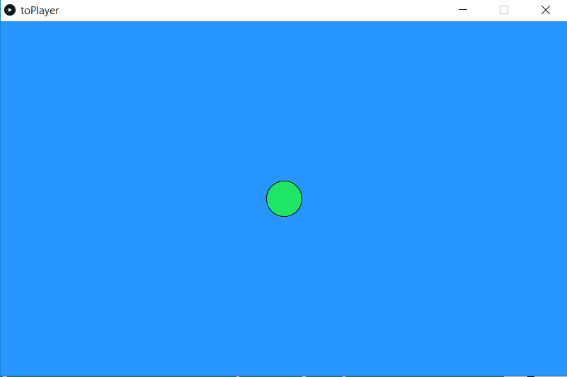

# Introduksjon: {.intro}

Nå skal vi lage et spill som to personer kan spille mot hverandre. Vi har kalt det ToPlayer, men du kan kalle det hva du vil. Målet er å dytte en figur, eller en spillebrikke ut av vinduet på motstanderen sin side. Spillet ser ganske enkelt ut, men du kan etter hvert pimpe det opp som du vil. Når du har kommet deg gjennom hele denne oppgaven skal spillet ligne på bildet under. Du får bestemme farger og litt annet selv, så det vil avhenge av hva du liker.



# Steg 1: Kom i gang med metodene `setup` og `draw` {.activity}

Start med å åpne Processing. Når det er gjort, så må du skrive to metoder. Alle metoder har sitt eget navn, og to metoder kan ikke hete det samme. De to metodene du skal skrive er `setup` og `draw`. Bortsett fra metodenavnet, så skrives de på akkurat samme måte. Derfor viser vi deg hvordan du skal skrive `setup`-metoden, og så må du selv forsøke å skrive `draw`-metoden.

Slik ser `setup`-metoden ut:

```processing
void setup(){

}
```
## Gjør dette: {.check}

- [ ] Skriv `draw`-metoden under `setup`-metoden.

- [ ] Sjekk at metodene fungerer ved å kjøre programmet. Klikk på pilen oppe til venstre for å gjøre det.


Dersom programmet kjører og alt er i orden så vil det dukke opp et nytt bitte lite vindu på skjermen din. Dersom du fikk opp vinduet, så er det bare å gå videre til steg 2. Dersom ikke, så kan du sjekke at du har fått med alle detaljene i koden din, ved å sammenligne med bildet under.


Lagre koden din før du går videre.

## Forklaring av setup og draw {.protip}

Alt innholdet i `setup` skjer én gang når programmet starter, deretter går programmet videre til `draw`. Alt innholdet i `draw` skjer på nytt og på nytt helt til programmet stopper.

# Steg 2: Bestem størrelse og bakgrunnsfarge på vinduet

Nå er det størrelsen på vinduet og bakgrunnsfargen som skal kodes. For å gjøre det, trengs bare to kodelinjer. Begge skal skrives inn i `setup`-metoden. Å skrive kode inni en metode vil si at vi skriver mellom krøllparentesene, altså mellom disse to: `{` og `}`.

Størrelsen bestemmes ved å skrive denne kodelinja:

```processing
	size(200, 600);
```

Tallene mellom parentesene bestemmer størrelsen på vinduet.

Koden som bestemmer bakgrunnsfargen ser slik ut:

```processing
	background(40, 150, 255);
```

Tallene inni parentesene bestemmer fargen.

Her er en sjekkliste med ting du kan gjøre for å sjekke at du forstår koden din. For hvert punkt må du starte programmet og se hva som endrer seg. Det er viktig at du har forståelse for koden din før du går videre til neste steg.

## Sjekkliste {.check}

- [ ] Gjør det første tallet i parentesene til `size` dobbelt så stort.
- [ ] Forsøk å få vinduet til å dekke hele skjermen din.
- [ ] Sett tallene inni parentesene til `background` til å være dette: (255, 0, 0)
- [ ] Sett tallene inni parentesene til `background` til å være dette: (0, 255, 0)
- [ ] Sett tallene inni parentesene til `background` til å være dette: (0, 0, 255)
- [ ] Sett tallene inni parentesene til `background` til å være dette: (0, 255, 255)
- [ ] Sett alle tallene inni parentesene til `background` til å være 0.
- [ ] Forsøk å få bakgrunnen til å bli hvit.
- [ ] Forsøk å få bakgrunnen til å bli lilla.
- [ ] Finn en størrelse du liker på vinduet ditt.
- [ ] Finn en bakgrunnsfarge på vinduet ditt som du liker.

Kjør programmet ditt og sjekk at du får vinduet til å vises før du går videre. Her er koden vi har laga så langt, husk at dine tall kanskje er litt forskjellig fra våre tall.


# Steg 3: Spillbrikke {.activity}

Vi skal lage spillbrikka, deretter skal vi gjøre slik at den kan bevege seg.

Her er koden som skal brukes:

```processing
	fill(30, 230, 100);
	ellipse(400, 250, 50, 50);
```

## Gjør dette: {.check}

- [ ] Skriv inn de to kodelinjene i `draw`-metoden og test at programmet kjører.
- [ ] Bytt ut ett og ett av tallene inni parentesen til `ellipse` og finn ut hva de gjør.
- [ ] Bytt ut ett og ett av tallene inni parentesen til `fill` og finn ut hva de gjør.
- [ ] Forsøk å få spillbrikka til å bli rosa.
- [ ] Forsøk å få spillbrikka til å bli så stor at den dekker hele vinduet.
- [ ] Still tilbake størrelsen på spillbrikka og velg en farge du liker.

Nå skal vi gjøre slik at ellipsen er klar til å bevege seg sidelengs. Som du sikkert har funnet ut, så bestemmer det første tallet i parentesen hvor ellipsen står plassert sidelengs. Vi ønsker å gjøre dette tallet til en variabel, altså til et tall som kan variere.

For å får det til, så deklarerer vi variabelen helt i toppen av programmet vårt (utenfor `setup`- og `draw`-metodene). Dette gjør vi ved å skrive denne kodelinja:

```processing
	int x;
```

Denne lille koden er ganske enkel, `int` forteller PC-en at vi skal ha et heltall, og `x` er navnet vi har valgt å gi tallet vårt. Vi kunne kalt tallet noe helt annet som `pute` eller `boks`.

Vi må gi `x` en verdi som den har til å begynne med, det gjør vi inni `setup` metoden. Alt vi trenger å skrive er dette:

```processing
	x = 90;
```

Så må vi bytte ut det første tallet i parentesen til `ellipse` med `x`. Da ser koden for ellipse slik ut:

```processing
	ellipse(x, 250, 50, 50);
```

## Gjør dette: {.check}
- [ ] Skriv inn de tre kodelinjene som ble forklart over, pass på at du plasserer dem på riktig plass i koden..
- [ ] Test at programmet ditt kjører, ingenting nytt skal skje, bortsett fra at spillebrikken kanskje har flytta litt på seg.
- [ ] Bytt ut verdien til `x` med for eksempel `180` og se at ellipsa flytter seg.
- [ ] Se om du får til å plassere ellipsen så lagt ut til den høyre sida av vinduet at du bare kan se halve ellipsen.
- [ ] Plasser ellipsen midt på skjermen sideveis.

Her er koden vi har laga så langt.


# Steg 4: Lag kontrollere! {.activity}

Nå skal vi lage en `if`-setning som registrerer om du trykker på en knapp.

Skriv denne koden inni `draw`-metoden etter ellipsa:

```processing
if(keyPressed && key == 'a'){
	x+=10;
}
```

Denne koden skal gjøre slik at dersom man har trykka på en knapp og den knappen er `a`, så skal `x`, altså plasseringen til ellipsa vår, flytte seg 10 piksler til høyre.

## Forklaring av if {.protip}
En `if`-setning sjekker om noe er sant. Dersom det er sant, så skjer det som står inni `if`-setningen. En `if`-setning er bygd opp av en test og så noe som blir utført:

```processing
if(test){
	her utføres noe bare dersom testen er sann.
}
```

`If`-tester er lette å sette opp som muntlige setninger og så gjøre dem om til kode etterpå. Vi skriver det på samme måte som en ordentlig `if`-setning, slik at det er lett å gjøre om til kode. Inni `if`-setningen har vi kommet med noen eksempler.  

```processing
Dersom ( et eller annet er sant) så skal dette skje{
	vi får mer liv
	vi hopper,
	noe flytter på seg,
}
```
Noe som er vanlig å sjekke i en `if`-setning er om man har trykka på en spesiell knapp, eller om datamusa er innenfor et bestemt område. Eller man kan sjekke hvor mange liv man har igjen, og dersom det er 0 så kan man skrive "GAME OVER".

#
Når vi skriver if-setningen vår med ord blir det slik:

```processing
Dersom (man trykker en knapp og knappen er 'a') så skal dette skje{
	ellipsen skal bevege seg til høyre;
}
```

Vi forsøker å gjøre setningen mer lik kode:

```processing
dersom ( enKnappErPressaNed og knappen er lik 'a'){
	så skal x bli 10 større;
}
```

Så gjør vi det til kode:

```processing
if(keyPressed && key == 'a'){
	x+=10;
}
```

## Prøv dette {.check}

- [ ] Skriv inn if-setningen i `draw`-metoden.
- [ ] Kjør programmet, trykk på `a`, hva skjer?
- [ ] Flytt kodelinja som setter bakgrunsfargen fra `setup`-metoden til `draw`metoden. Putt den øverst inni `draw`.
- [ ] Kjør programmet på nytt og se hva som skjer.
- [ ] Bytt ut 10-tallet med ett annet tall.
- [ ] Bytt ut `a` med en annen bokstav.
- [ ] Flytt kodelinja som setter bakgrunnsfargen frem og tilbake mellom `setup` og `draw` noen ganger og se om du forstår hva som skjer.
- [ ] Forsøk nå å skrive en `if`-setning til. Denne skal stå under den forrige, og nå kan du velge en annen bokstav. I stede for at `x` blir større, så må du skrive koden slik at `x` blir mindre. Dersom det er litt vanskelig, så kan du forsøke å sette opp `if`-setningen som en vanlig setning slik vi har vist i forklaringen over.
- [ ] Bytt ut tallet inni den nye `if`-setningen, slik at du får ellipsen til å gå dobbelt så raskt til venstre.

Dersom ikke koden din fungerer helt som den skal, så kan du sjekke her hva som er feil.


## Steg 5: Vi trenger en vinner! {.activity}

Vi trenger flere `if`-setninger, disse skal skrive en beskjed på skjermen hvis en spiller vinner. Man vinner med å dytte ellipsen ut av skjermen.

Her er `if`-setningen som trengs for å sjekke om venstre spiller har vunnet. Denne skal skrives under de to forrige `if`-setningene:

```processing
	if(x > 800){
		text("Venstre spiller vant!", 350, 200);
	}
```

## Prøv dette {.check}
- [ ] Skriv inn den nye `if`-setningen.
- [ ] Sjekk at programmet fungerer ved å få ellipsen ut av skjermen på høyre side. Da skal teksten vises.
- [ ] Hva tror du skjer hvis du forandrer `800` tallet som står inni `(x > 800)` til ett annet tall?
- [ ] Bytt ut `800` med noe mye mindre og finn ut hva som skjer.
- [ ] Hva skjer hvis du forandrer teksten til "Høyre spiller har vunnet"?
- [ ] Finn ut hva tallene som står inni parentesene til `text` gjør ved å bytte dem ut.
- [ ] Gjør størrelsen på vinduet ditt større og se hvordan det påvirker `if`-setningen.
- [ ] Still tilbake alle tallene, slik at teksten dukker opp på skjermen bare når spillbrikka er ute av skjermen.
- [ ] Lag en ny `if`-setning som gjør nesten akkurat det samme, men som heller sjekker om ellipsen går ut av skjermen på venstre side.
- [ ] Test at koden din fungerer.

Her er hele koden, sjekk om din er lik.


