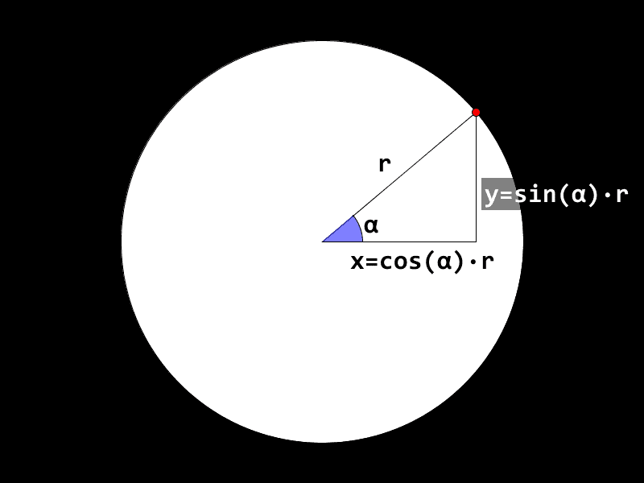
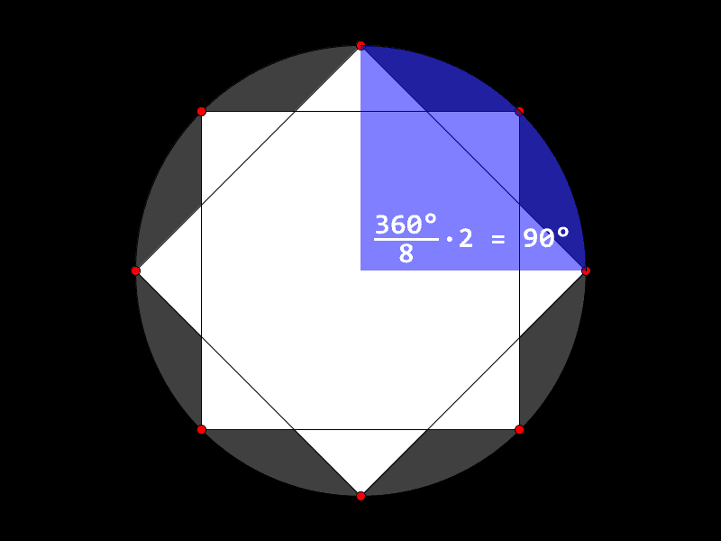
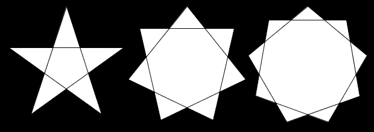

# Introduksjon {intro}

Nå som du kan tegne [mangekanter](../mangekanter/mangekanter.html)
(hvis du ikke har gjort leksjonen om mangekanter, bør du gjøre dem
først), skal vi se på en litt spesiell type mangekanter: de regulære
mangekantene. Det vil si de mangekantene hvor lengden av hver kant er
lik og vinkelen i hvert hjørne er lik. Vi skal også tegne deres nære
slektninger, de regulære stjernene.

Det er en stor fordel å kunne litt trigonometri før man slår seg løs
på disse oppgavene, men vi skal prøve å gi korte forklaringer av de
konseptene som brukes i leksjonen.

## Sinus og cosinus {.protip}

Før vi begynner å tegne regulære mangekanter, skal vi bare ta en liten
titt på to trigonometriske funksjoner som vi kommer til å bruke mye:
sinus og cosinus. Vi skal se på dem spesifikt i forbindelse med
sirkler.

+ Ethvert punkt langs omrisset av sirkelen befinner seg like langt fra
  midten av sirkelen. Denne avstanden er radius i sirkelen, som regel
  skriver vi bare `r` i figurer og formler.


+ Vi kan tegne en rettvinklet trekant som ligger vannrett og strekker
  seg fra midten av sirkelen til ett av disse punktene.


+ Hvis vi sier at sentrum av sirkelen ligger i punktet (0, 0), altså X
  og Y er null i midten av sirkelen, kan vi enkelt regne ut X og Y for
  punktet i omrisset. To av sidene i trekanten ovenfor viser da X og
  Y. Den siste siden er linjen fra sentrum med lengde `r`. Her har vi
  kalt sidene `a`, `b` og `c`; navnet kan brukes for lengdene til
  sidene også. I dette tilfellet har vi `c = r` når vi snakker om
  lengden. For vinkler er det vanlig å bruke greske bokstaver, og vi
  har her brukt `α`, alfa.

+ Lengden på de to andre sidene, `a` og `b`, er gitt av funksjonene
  sinus og cosinus, vinkelen `α` og lengden til `c`, altså radien til
  sirkelen. De korte sidene som sammen lager det rettvinklede hjørnet,
  kalles kateter og den lange siden med lengde `r` kalles
  hypotenus. Lengden på kateten som er med på hjørnet med vinkelen
  `α`, har lengden `cos(α) * r`. Denne kateten kalles gjerne den
  hosliggende kateten, og mange bruker huskeregelen: Hos blir cos, for
  å huske hvilken av de to sidene som bruker cosinus og sinus. Lengden
  på det andre katetet er `sin(α) * r`.



# Regulære mangekanter {.activity}

La oss tegne opp noen regulære mangekanter. Det vil si mangekanter der
avstanden mellom hvert hjørne er lik, altså de er likesidede, og
vinkelen i hvert hjørne er lik, altså de er likevinklede. Da lurer du
kanskje på hvordan du skal få til dette. Hjørnene i en regulær
mangekant fordeler seg jevnt langs omrisset av en sirkel. Derfor kan
vi bruke formlene for katetene for å regne ut hvor hjørnene skal
være. Opptegningen ellers er som for vanlige
[mangekanter](../mangekanter/mangekanter.html).

+ Vi begynner med å tegne opp en regulær pentagon (femkant).
  
  ```processing
  int KANTER = 5;
  float vinkel = 360.0 / KANTER;
  
  void setup() {
    size(600, 600);
  }
  
  void draw() {
    background(0);
    
    beginShape();
    for (int hjorne = 0; hjorne < KANTER; hjorne++) {
      vertex(300 + cos(radians(vinkel * hjorne)) * 200,
             300 + sin(radians(vinkel * hjorne)) * 200);
    }
    endShape(CLOSE);
  }
  ```

  Her har vi noen nye utregninger inne i kallet på `vertex`. Her
  bruker vi tre nye funksjoner `cos` og `sin` som har blitt forklart
  litt lenger opp, og `radians` som regner om grader til radianer, en
  annen måleenhet for vinkler. Sinus og cosinus i dataprogrammer
  bruker vanligvis radianer, så om vi vil jobbe med vinkler i grader,
  må vi gjør denne konverteringen. Du ser at vi har med en variabel
  for vinkelen mellom hvert punkt og denne har vi beregnet i grader ut
  fra at en sirkel er 360°.


+ Hva er tallet `200` her? Hva skjer om du endrer det til noe annet?

+ Hva med tallet `300`?

+ Kan du få snudd på femkanten sånn at hjørnet som nå peker rett til
  høyre, peker opp?


+ Hvis du har fått femkanten til å peke opp, kan du legge til en
  variabel som du bruker til denne justeringen? Kan du bruke denne
  variabelen til å få femkanten til å snurre?


+ Kan du styre hvilken vei femkanten peker med musa eller tastaturet?

+ Hva skjer hvis du endrer `KANTER` til en annen verdi enn `5`?

# Regulære stjerner 1 {.activity}

Regulære stjerner med et odde antall spisser kan tegnes nesten helt
likt som man tegner en regulær mangekant. De kan nesten sees på som en
variant av mangekanter. Hvis du har tegnet en femkantet stjerne før,
har du kanskje lagt merke til at dette likner på en femkant, men at du
hopper over et hjørne når du tegner streken mellom to spisser.


+ Siden vi skal hoppe over et hjørne hver gang vi tegner opp neste
  spiss, trenger vi å gange vinkelen med `2`. Endre derfor kallet på
  `vertex` til:

  ```processing
  vertex(300 + cos(radians(vinkel * hjorne * 2)) * 200,
         300 + sin(radians(vinkel * hjorne * 2)) * 200);
  ```

  Kunne du ganget med `2` et annet sted i koden og fått den samme
  effekten?

+ Kan du tegne en syvkantet stjerne? Eller en nikantet stjerne?

+ Hvis du har en stjerne med flere kanter enn fem, kan du gange med
  andre tall enn to og få andre varianter av mangekantede
  stjerner. Prøv forskjellige tall for syv-, ni- og ellevekantede
  stjerner. Hva skjer når du hopper over flere kanter enn halvparten
  av antallet spisser?

# Regulære stjerner 2 {.activity}

Stjerner med et likt antall spisser, kan tegnes som to regulære
mangekanter med halvparten så mange hjørner som stjernen har
spisser.

+ Fjern ganging med to om du nå tegner opp stjerner med odde antall
  spisser.

+ Lag en kopi av løkken som tegner opp mangekanten, med `beginShape();`
  og `endShape(CLOSE);`.

+ I den nye løkken, endrer du `int hjorne = 0` til `int hjorne = 1`,
  slik at denne løkken tegner kantene mellom de odde hjørnene.

+ Endre `hjorne++` til `hjorne += 2` sånn at vi bare tegner kanter
  mellom annenhvert hjørne.

+ Pass på at `KANTER` settes til et partall som er minst `6`.



## Utfordring {.try}

+ Nå ser det nok ut som om det mangler noen streker i stjernen
  din. Kan du få tegnet opp de siste kantene ved å tegne opp den første
  av de to mangekantene på nytt og bruke
  [`noFill()`](https://processing.org/reference/noFill_.html),
  [`noStroke()`](https://processing.org/reference/noStroke_.html) og
  [`stroke()`](https://processing.org/reference/stroke_.html).

+ Kan du tegne opp flere mangekanter eller stjerner på skjermen
  samtidig? For eksempel en femkantet, en syvkantet og en nikantet
  stjerne som vist under?



+ Hvis stjernene dine ikke snurrer allerede, kan du få dem til å gjøre
  det?


