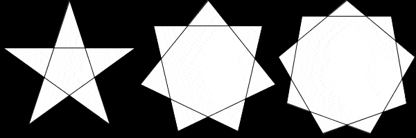

# Introduksjon {.intro}

No som du kan teikne [mangekantar](../mangekanter/mangekanter_nn.html) (viss du
ikkje har gjort oppgåva om mangekantar bør du gjere den fyrst), skal me sjå på
ein spesiell type mangekantar: dei regulære mangekantane. Det vil seie dei
mangekantane der lengda av kvar side er lik, og vinkelen i kvart hjørne er lik.
Me skal dessutan teikne nokre av dei nære slektningane deira: dei regulære
stjernene.

Det er ein stor fordel om du kan litt trigonometri før du startar med denne
oppgåva, men me skal prøve å gi korte forklaringar slik at du kan kome gjennom
sjølv om du ikkje gjer det.

## Sinus og cosinus {.protip}

For me startar å teikne, så skal me sjå på to trigonometriske funksjonar me kjem
til å bruke mykje: *sinus* og *cosinus*. Me skal spesielt sjå på dei i samband
med sirklar.

- Eit kvart punkt på ein sirkel befinn seg like langt frå midten av sirkelen.
  Denne avstanden er *radius* i sirkelen, som regel forkorta `r` i figurar og
  formlar.


- Me kan teikne ein rettvinkla trekant som ligg vassrett og strekk seg frå
  sentrum til sirkelbogen.


- Viss me seier at sentrum av sirkelen ligg i punktet `(0, 0)`, altså at X og Y
  er 0 i midten, så kan me enkelt rekne ut X og Y for punktet på sirkelen. To av
  sidene i trekanten viser då X og Y. Den siste sida er linja frå sentrum med
  lengde `r`. Difor har me kalla sidene `x`, `y` og `r`: me kan bruke namna for
  lengdene til sidene òg. For vinklar er det vanleg å bruke greske bokstavar, og
  her har me brukt `α`, alfa.

- Lengda på sidene `x` og `y` kan me finne med funksjonane sinus og cosinus,
  vinkelen `α` og `r`, altså radiusen til sirkelen. Dei korte sidene som saman
  lagar det rettvinkla hjørnet kallast katetar, og den lange sida med lengda `r`
  kallast hypotenus. Lengda på kateten som er med på hjørnet med vinkelen `α`
  har lengda `cos(α) * r`. Denne kateten kallast gjerne den hjåliggande kateten.
  På bokmål kan du skrive hugseregelen "hos blir cos" for å hugse kva side som
  brukar cosinus-funksjonen. Lengda på den andre kateten, kalla den motståande
  kateten, er `sin(α) * r`.


- Det virkar kanskje merkeleg når du berre får formlane på denne måten. Men dei
  er altså definert slik at sinus og cosinus gir forholdet mellom hypotenusen og
  katetane: `sin(α) = y / r` og `cos(α) = x / r`. Me skal ikkje sjå på korleis
  ein finn desse tala ut frå vinkelen, det skal datamaskina gjere for oss!


# Regulære mangekantar {.activity}

No skal me teikne nokre regulære mangekantar. Det vil seie mangekantar der
avstanden mellom kvart hjørne er lik, altså er dei likesida, og vinkelen i kvart
hjørne er lik, altså er dei likevinkla. Du lurar kanskje på korleis du skal få
til dette. Hjørnene i ein regulær mangekant fordeler seg jamnt langs ein sirkel.
Difor kan me bruke formlane for katetane til å reikne ut kor hjørna skal vere.
Elles teiknar med figuren akkurat som alle andre mangekantar, slik du gjorde i
ei anna oppgåve.

- [ ] Me startar med å teikne opp ein regulær (femkant).

  ```processing
  int KANTAR = 5;
  float vinkel = 360.0 / KANTAR;

  void setup() {
    size(600, 600);
  }

  void draw() {
    background(0);

    beginShape();
    for (int hjorne = 0; hjorne < KANTAR; hjorne++) {
      vertex(300 + cos(radians(vinkel * hjorne)) * 200,
             300 + sin(radians(vinkel * hjorne)) * 200);
    }
    endShape(CLOSE);
  }
  ```

  Inne i kallet på `vertex` ser du nokre nye utrekningar. Her brukar me tre nye
  funksjonar. Funksjonane `sin` og `cos` vart forklart [lengre
  opp](#sinus-og-cosinus). Me brukar `radians` for å rekne om gradar til
  radianar, ei anna måleeining for vinklar.

  I dataprogram brukar sinus og cosinus vanlegvis radianar, så viss me vil jobbe
  med vinklar i gradar må me gjere denne konverteringa. Du ser at me har med ein
  variabel for vinkelen mellom kvart punkt, og den har me berekna i gradar ut
  frå at ein sirkel er 360°.

  Til slutt fortel `CLOSE` i `endShape` at siste kant i figuren skal setjast
  saman med den fyrste, altså at me lukkar og fyller figuren.


- [ ] Kva er talet `200` her? Kva skjer viss du endrar det til noko anna?

- [ ] Kva med talet `300`?

- [ ] Kan du få snudd på femkanten så hjørnet som no peikar rett til høgre
  peikar rett opp?


- [ ] Viss du har fått femkanten til å peike opp, kan du leggje til ein variabel
  som du brukar til denne justeringa? Kan du bruke denne variabelen til å få
  femkanten til å snurre?


- [ ] Kan du styre kva veg femkanten peikar med musa eller tastaturet?

- [ ] Kva skjer viss du endrar `KANTAR` til ein annan verdi enn `5`?


# Regulære stjerner 1 {.activity}

Regulære stjerner med eit odde antal spissar kan teiknast nesten heilt likt som
ein teiknar ein regulær mangekant. Dei er på ein måte ein slags variant av
mangekantar. Viss du har teikna ei femkanta stjerne før, så har du kanskje lagt
merke til at det liknar på ein femkant, men at du hoppar over eit hjørne når du
teiknar streken mellom to spissar.


- [ ] Sidan me skal hoppe over eit hjørne kvar gong me teiknar opp neste spiss
  må me gangen vinkelen med `2`. Endre kallet på `vertex` til:

  ```processing
  vertex(300 + cos(radians(vinkel * hjorne * 2)) * 200,
         300 + sin(radians(vinkel * hjorne * 2)) * 200);
  ```

  Kunne du ganga med `2` ein annan stad i koden og fått den same effekten?

- [ ] Kan du teikne ei sjukanta stjerne? Eller ei nikanta stjerne?

- [ ] Viss du har ei stjerne med fleire kantar enn fem, så kan du gange med
  andre tal enn to og få andre variantar av mangekanta stjerner. Prøv ulike tal
  for sju-, ni- og ellevekanta stjerner. Kva skjer når du hoppar over fleire
  kantar enn halvparten av antalet spissar?


# Regulære stjerner 2 {.activity}

Stjerner med likt antal spissar (altså at det er eit partal) kan bli teikna som
to regulære mangekantar med halvparten så mange hjørne som stjerna har spissar.

- [ ] Fjern ganging med to frå programmet som teiknar stjerner med eit odde
  antal spissar.

- [ ] Lag ein kopi av løkka som teiknar opp mangekanten, med `beginShape();` og
  `endShape(CLOSE);`.

- [ ] I den nye løkka endrar du `int hjorne = 0` til `int hjorne = 1`, slik at
  denne løkka teiknar kantane mellom dei odde hjørna.

- [ ] Endre `hjorne++` til `hjorne += 2` slik at me berre teiknar kantar mellom
  annakvart hjørne.

- [ ] Pass på at `KANTAR` blir sett til eit partal som er minst `6`.

  

## Utfordring {.challenge}

- [ ] No ser det nok ut som det manglar nokre strekar i stjerna di. Kan du
  teikne opp dei siste kantane ved å teikne den fyrste av dei to mangekantane på
  nytt og bruke [`noFill()`](https://processing.org/reference/noFill_.html),
  [`noStroke()`](https://processing.org/reference/noStroke_.html) og
  [`stroke()`](https://processing.org/reference/stroke_.html)?

- [ ] Kan du teikne fleire mangekantar eller stjerner på skjermen samstundes?
  Til dømes ei femkanta, ei sjukanta og ei nikanta stjerne, som vist under?

  

- [ ] Viss stjernene dine ikkje snurrar allereie, kan du få dei til å gjere det?

  
