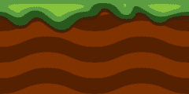
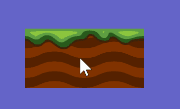
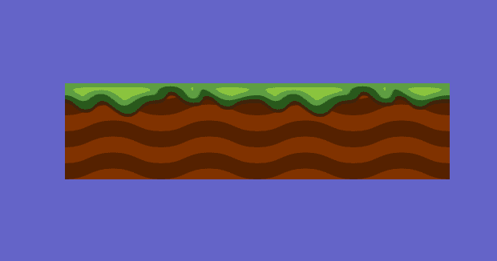

# Introduksjon {.intro}

I denne oppgava skal vi få underlaget til å bevege seg uendelig langt bortover.
Det skal vi gjøre ved å ha to like bilder ved siden av hverandre som beveger seg
til venstre. Med en gang et av bildene er kommet på utsiden av skjermen, så
flytter vi det til høyre siden av det andre bildet slik at det ser ut som om vi
har et langt bilde som beveger seg.

Når all koden er skrevet ferdig vil du ha begynnelsen av et spill som ser slik
ut:


# Steg 1: Oppsett {.activity}

Først må vi sette opp programmet vårt med en `draw `og en `setup`-metode.

```processing
void setup(){

}

void draw(){

}
```

Nå kan vi lagre programmet vårt slik at vi kan finne det igjen senere. Trykk
`ctrl + S` på tastaturet og gi det et navn som du husker, for eksempel
`rulling`. Processing lagrer filer i `.pde` format.

Nå kan du også høyreklikke på dette bildet av en bakke, og lagre det i samme
mappe som spillet ditt ble lagret i.



Så kan vi sette opp størrelsen på vinduet og en bakgrunnsfarge i vinduet.

## Gjør dette {.check}

- [ ] I `setup`-metoden, altså mellom krøllparentesene etter `setup` skriv:
  `size(800, 800);`

- [ ] I `draw`-metoden, skriv: `background(100, 100, 200);`

## Forklaring av innebygde metoder {.challenge}

Både `size` og `background` er innebygde metoder, det betyr at noen har skrevet
dem ferdig for oss og dermed kan vi bare bruke de når de treng. Når vi bruker
metoder kalles å gjøre metodekall.

Tallene i metodekallet på `size` betyr hvor høyt og hvor bredt vinduet skal
være. Tallene i `background` bestemer hvor mye rødt, grønt og blått det skal
være. Hvert av de tallene kan bare være mellom 0 og 255.

Alt som står inni parentesene på en metode vi bruker er argumentene, eller
parameterne, til metoden.

## Gjør dette {.check}

- [ ] Endre argumentene til `background` til du finner en farge du liker.

# Steg 2: Hente inn bilde {.activity}

I Processing kan et bilde bli lagret i en variabel av typen `PImage`, og hentes
inn ved å bruke metoden `loadImage();`. Denne metoden tar navnet på bildet som
et argument, og brukes gjerne inne i `setup`.

```processing
PImage bilde1;

void setup(){
  size(800, 800);
  bilde1 = loadImage("bakke.png");
}

void draw(){
  background(100, 100, 200);
  image(bilde1, 150, 150, 240, 120);
}
```

## Forklaring av image {.challenge}

Det neste steget nå er å tegne bilde på skjermen, det gjør vi ved hjelp av
metoden `image();`.

- `image` er en metode som tar fem argumenter: `image(img, x, y, b, h);`

- `img` er bildet vi vil tegne, feks `bilde1`

- `x` er hvor vi vil starte å tegne bildet på x-aksen

- `y` er hvor vi vil starte å tegne bildet på y-aksen

- `b` er hvor bredt vi vil at bildet skal være

- `h` er hvor høyt vi vil at bildet skal være.

##



## Prøv dette {.check}

- [ ] Endre tallene som er på plassen til `x`, `y`, `b`, `h` en om gangen og se
  hva som skjer.

- [ ] Finn tall som du liker.


# Steg 3: Flere bilder {.activity}

Nå vil vi legge til enda et bilde, og få begge bildene til å bevege seg.

Først så gjør vi alt vi nettopp gjorde i steg 2, men vi kaller variabelen vår
for `bilde2`. Vi plasserer bildet til høyre for det første slik at de ligger
helt inntil hverandre.

```processing
PImage bilde1;
PImage bilde2;

void setup(){
  size(800, 800);
  bilde1 = loadImage("bakke.png");
  bilde2 = loadImage("bakke.png");
}

void draw(){
  background(100, 100, 200);

  image(bilde1, 150, 150, 240, 120);
  image(bilde2, 390, 150, 240, 120);
}
```



For å få bildene til å bevege på seg må vi få tallet i `x` plassen i
`image`-metoden til å endre seg, for å få til dette må vi bruke to variabler,
for eksempel `x1` og `x2`. disse oppretter vi av typen `int`, og setter utenfor
metodene våre.

I `setup` gir vi de verdier, feks 150 og 390 da begynner den første 150 pixler
til høyre for venstresiden av vinduet. Den neste begynner 240 pixler til høyre
for der igjen, som da blir helt tett intill det første bildet. (Bildet er 240
pixler bredt)

Nå bytter vi ut variablene med `x` plassen i `image`-metoden.

```processing
PImage bilde1;
PImage bilde2;
int x1;
int x2;

void setup(){
  size(800, 800);
  bilde1 = loadImage("bakke.png");
  bilde2 = loadImage("bakke.png");
  x1 = 150;
  x2 = 390;
}

void draw(){
  background(100, 100, 200);
  image(bilde1, x1, 150, 240, 120)
  image(bilde2, x2, 150, 240, 120)
}
```

Fortsatt beveger de seg ikke når vi kjører koden, hva tror du det kan skyldes?
For å gjøre det kan vi ta `x1 -= 2;` som betyr "ta verdien av x1, trekk ifra 2
og putt den nye verdien inn i x1". Putt denne koden nederst i `draw`-metoden.

```processing
image(bilde2, x2, 150, 240, 120);

x1 -= 2;
x2 -= 2;
```

## Prøv selv {.check}

- [ ] Hva skjer dersom du bytter ut minus tegnet med pluss tegn?

- [ ] Hva skjer dersom du øker tallet til 5? eller 10?


# Steg 4: Putt bildet tilbake {.activity}

Når bildet forsvinner ut av skjermen vil vi at det skal bli puttet til høyre for
det andre bildet slik at vi hele tiden har mer bakke.

For å få til det trenger vi en `if`-test for hver `x` variabel, det vil si at vi
teste om høyresiden av bildet er ute av vinduet. Det kan vi skrive først med ord
og så mer og mer til kode:

```processing
Hvis høyresiden av bildet er ute av vinduet,
    så flytt bildet tilbake dit det starta
```
```processing
Hvis x1 pluss bildebredden er mindre enn 0,
    pluss 480 på x1
```
```processing
Hvis(x1 + 240 < 0) {
    x1 += 480
}
```
```processing
if(x1 + 240 < 0) {
    x1 += 480;
}
```

Dette må vi gjøre for begge x variablene. Legg merke til at vi kan skrive alt på
en linje om vi vil, men det er lettere å lese om vi bruker flere linjer.

```processing
x1 -= 2;
x2 -= 2;

if(x1 + 240 < 0){ x1 += 480; }
if(x2 + 240 < 0){ x2 += 480; }

```

## Testing {.protip}

Nå vet du det du trenger for å lage en uendeleg bevegelig bakke. For at det ikke
skal se rart ut, prøv å sett bredden på vinduet til 240 bredt i `size`-metoden,
da vil du ikke se at bakken popper frem på høyresiden, men det vil se ut som om
bakken er uendelig lang og bare kommer og kommer.

##

Hele koden ser nå slik ut, og dette er starten på et Runner spill som du finner
i Nybegynner-delen.

```processing
PImage bilde1;
PImage bilde2;
int x1;
int x2;

void setup(){
  size(240, 800);
  bilde1 = loadImage("bakke.png");
  bilde2 = loadImage("bakke.png");
  x1 = 150;
  x2 = 390;
}

void draw(){
  background(100, 100, 200);
  image(bilde1, x1, 150, 240, 120)
}

void y(){
  image(bilde2, x2, 150, 240, 120)

  x1 -= 2;
  x2 -= 2;

  if(x1 + 240 < 0){ x1 += 480; }
  if(x2 + 240 < 0){ x2 += 480; }
}

```
