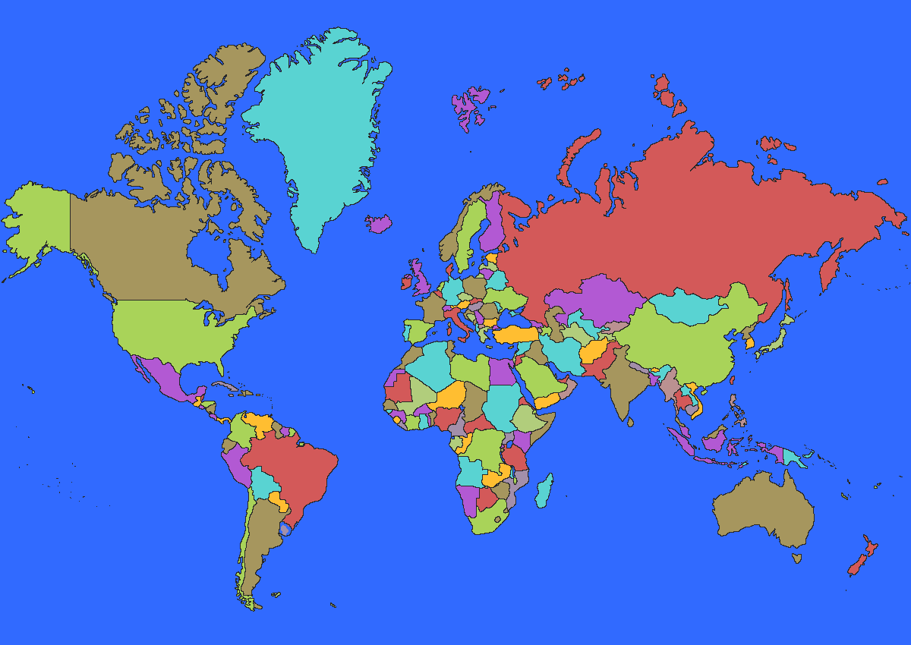

# Om oppgaven {.activity}

Verden er et program som viser navnet på en verdensdel når musepekeren holdes
over den. Oppgaven viser framgangsmåten for Europa, men kan lett utvides til
resten av verdensdelene, og eventuelt andre områder. Se også [Verden del
2](../verden_del2/verden_del2.html){target=_blank}.

## Oppgaven passer til: {.check}

__Fag__: Geografi, Matematikk, Programmering

__Anbefalte trinn__: 8. trinn - VG3

__Tema__: Spill, Geografi, Kart, Koordinater, Brukerinteraksjon, Vilkår

__Tidsbruk__: Hver del passer til en dobbelttime, men kan også fungere i et
undervisningsopplegg over lengre tid.

## Kompetansemål {.challenge}

- [ ] __Matematikk, 3. trinn:__ eksperimentere med og forklare plasseringer i koordinatsystemet

- [ ] __Matematikk, 3. trinn:__ lage og følge regler og trinnvise instruksjoner i lek og spill knyttet til koordinatsystem

- [ ] __Matematikk, 6. trinn:__ bruke variabler, løkker, vilkår og funksjoner i programmering til å utforske geometriske figurer og mønster

- [ ] __Fordypning i matematikk, 10. trinn:__ diskutere, planlegge, lage og vurdere spilldesign og egne spill

- [ ] __Programmering, 10. trinn:__ bruke flere programmeringsspråk, deriblant minst ett som er tekstbasert

- [ ] __Programmering, 10. trinn:__ bruke grunnleggende prinsipper i programmering, slik som variabler, løkker, vilkår og funksjoner, og reflektere over bruken av disse

- [ ] __Geografi, VG1 og VG2 SF:__ utforske og presentere geografiske forhold og prosesser ved å bruke ulike kilder, inkludert kart

## Forslag til læringsmål {.challenge}

- [ ] Elevene kan plassere ulike elementer på bestemte plasser i et
  koordinatsystem.

- [ ] Elevene kan skrive ryddig kode med hensiktsmessige kommentarer, slik at de
  selv kan videreutvikle koden senere.

- [ ] Elevene kan registrere musepekerens posisjon på skjermen, og bruke dette i
  koden sin.

- [ ] Elevene kan lese et digitalt verdenskart.

- [ ] Elevene kan plassere verdensdelene på kartet.

## Forslag til vurderingskriterier {.challenge}

Det er mange ulike måter en kan vurdere et programmeringsprosjekt, og her må en
selv vurdere hva som er den beste måten ut ifra hvilket fag man jobber i,
hvilken aldergruppe og hvilet nivå elevene er på, hva man ønsker å teste og hvor
mye tid man har til rådighet til å jobbe med prosjektet. I vårt lærerdokument
har vi blant annet beskrevet ulike måter dette kan gjøres på, i tillegg til en
del andre nyttige tips til hvordan man underviser i programmering.

## Forutsetninger og utstyr {.challenge}

- [ ] __Forutsetninger__: Elevene bør kjenne til Processing.

- [ ] __Utstyr__: Datamaskiner med
  [Processing](https://www.processing.org/download/){target=_blank} installert.
  Elevene kan gjerne jobbe to og to sammen.

## Fremgangsmåte

[Klikk her for å se
oppgaveteksten.](../verden_del1/verden_del1.html){target=_blank} _Vi har
dessverre ikke noen tips, erfaringer eller utfordringer tilknyttet disse
oppgavene enda._

## Variasjoner {.challenge}

- [ ] Elevene kan markere resten av verdensdelene på tilsvarende måte.

- [ ] Elevene kan lage bedre tilpassinger av grensene ved å bruke irregulære
  mangekanter.

- [ ] Elevene kan lage tilsvarende program på egne kart (en enkelt verdensdel,
  Norge, solsystemet...)

## Eksterne ressurser {.challenge}

Ingen eksterne ressurser...
