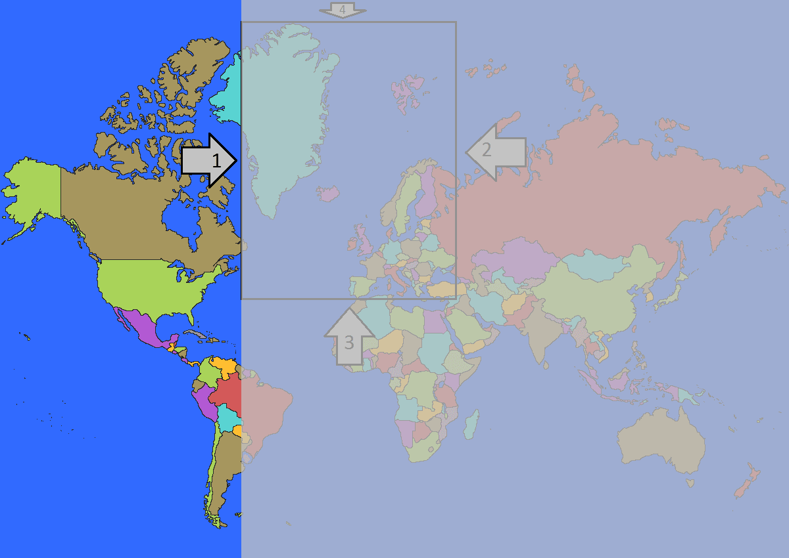
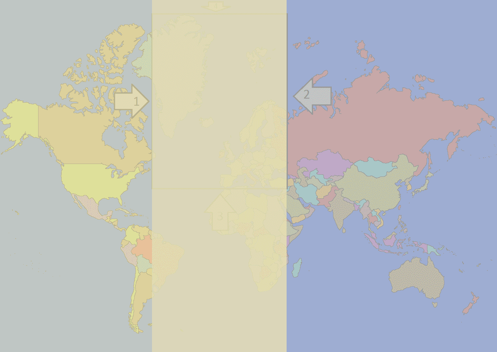

# Introduksjon {.intro}
Velkommen til verdensspillet! Her skal vi lage begynnelsen av et spill hvor man skal gjette hvilke verdensdeler som er hvor. Så kan du utvide oppgava til å heller gjelde for land, hav, fjell, eller noe annet du finner på! Denne oppgava viser deg hvordan du kan skrive kode som gjør at navnet på verdensdeler dukker opp når man holder datamusa over dem.

Slik skal spillet se ut når vi er ferdig med denne oppgaven. Oppe i høyre hjørnet ser du det står "EUROPA", det skal det bare stå når datamusa holdes over Europa på kartet.


# Steg 1: Vinduet {.activity}
Aller først må du starte Processing. Når du har åpna programmet så har du en tom teksteditor foran deg, denne skal du fylle med kode! Det er to metoder som er vanlige å bruke i processing, disse er `setup` og `draw`. Så nå kan du starte med å skrive først `setup` på ei linje og så `draw` på neste linje. Forsøk å trykke på playknappen, altså denne:


Nå får du opp en feilmelding nederst i programmet. Det er den linja som er rød med hvit skrift. Det kommer litt an på hvilken utgave av Processing du har, men feilmeldingen kommer til å se ut som dette:


`Syntax error, maybe a missing semicolon?` her foreslår Processing at vi kanskje mangler et semikolon, i tillegg så har den markert linje 2 med gult. Det betyr at det er linje 2 som kanskje mangler et semikolon.

Veldig ofte er det semikolon som mangler, men akkurat nå er det mye mer. For at programmet vårt skal forstå at vi forsøker å skrive to metoder, så må vi skrive ordet `void` foran metodenavnene, slik som dette:


Det er fremdeles en rød linje under både `setup` og `draw`, så det mangler fremdeles en del, men ordet `void` fikk fargen blå og det betyr at Processing kjenner igjen ordet og vet hvordan det skal brukes.

Neste steg for å lage metoder er at de må ha parenteser rett etter navnet sitt. Når vi legger til disse vil koden se slik ut:


Nå begynner det å ligne på noe, både `setup` og `draw` ble blå. Det betyr at Processing kjenner igjen de to ordene også. Forsøk å kjøre programmet ved å trykke på playknappen nå, hva skjer? Nok en feilmelding! Nå er vi veldig nære til å få Processing til å forstå at vi skal lage to metoder. Det eneste vi mangler er å åpne og å stenge metodene. Vi åpner metoden med dette tegnet: `{` og så stenger vi metoden med dette tegnet: `}`, så da bli koden slik:


Nå kan du førsøke å kjøre programmet igjen. Hva skjer?

Nå som vi endelig får opp et lite vindu må vi fikse litt innhold, dette gjør vi inni metodene. Det betyr at vi skal skrive kode mellom tegnet som åpner og tegnet som stenger metoden.

Vinduet er ganske lite. Vi kan bestemme størrelsen på vinduet ved å kalle på en metode, det betyr at vi bruker en metode som noen allerede har skrevet ferdig for oss. Når vi kaller en metode skriver vi metodenavnet etterfulgt av parenteser og til sist et semikolon, slik som dette:

```processing
    size(1200, 850);
```

Som du ser har vi satt tall inne i parentesene, disse bestemmer størrelsen på vinduet som dukker opp når du trykker på play og programmet kjøres. Kjør programmet og se at det fungerer.

## Prøv dette {.check}
- [ ] Gjør vinduet høyt og smalt.
- [ ] Få vinduet til å strekke seg fra venstre til høyre side av skjermen.
- [ ] Sett vinduet tilbake til å være 1200 piksel bredt og 850 piksel høyt.
- [ ] Lagre spillet, når du gjør det opprettes en mappe som heter det samme som spillet ditt. Du må huske hvor denne plasseres, for den skal vi bruke videre.

Her er koden så langt, se over at din kode ser lik ut. `size` er et stykke inn på linja fordi det er slik det er vanlig å skrive kode. Det gjør det lettere å lese.


# Steg 2: Vis verdenskartet {.activity}

Nå skal vi få på plass verdenskartet. Her er kartet, last det ned og plasser det i samme mappe som programmet ditt ligger.


For å få bildet til å vise må vi deklarere bildet, det vil si å gi PC-en beskjed om at vi skal bruke et bilde. Deklarasjoner skjer helt øverst i programmet, før de to metodene våre.

Vi har valgt å kalle bildet for `verdenskartet`, og kodelinja ser slik ut:

```processing
PImage verdenskartet;
```

Sjekk at programmet fremdeles kjører. Ingenting nytt skal skje, men du får feilmelding dersom du har skrivefeil på den nye kodelinja.

Nå må vi laste bildet opp i programmet, det gjør vi bare én gang, og derfor putter vi denne kodelinja i `setup`. Kodelinja ser slik ut:

```processing
    verdenskartet = loadImage("world-map.png");
```

Sjekk at programmet fremdeles kjører, det er ikke noe nytt som vil skje.

Nå er det viktig å skille på at `verdenskartet` er navnet vi har valgt å kalle bildet vårt i koden vår, mens `world-map.png` er navnet på selve bildet når det ligger som en fil i mappa på PC-en din.

Nå må vi få vist bildet i vinduet ditt, da skal vi skrive en kodelinje i `draw` metoden. Kodelinja vi trenger ser slik ut:

```processing
    image(verdenskartet, 0, 0);
```


# Steg 3: Hva er datamusas plassering {.activity}

For å finne ut hvor i vinduet de forskjellige verdensdelene er plassert må vi vite hva koordinatene på grensa mellom de forskjellige verdensdelene er. Vi starter med å vise koordinatene til datamusa på skjermen, slik at det er lettere å forstå hva koordinater er og hvordan de fungerer i Processing.

Vi trenger bare to kodelinjer for å få til dette, og de må skrives inni `draw`-metoden. Vi vil ha en tekst som oppdaterer seg etter hvor på skjermen datamusa er, da trenger vi denne kodelinja:

```processing
    text("X: " + mouseX, 50, 50);  
    text("Y: " + mouseY, 50, 100);
```

Test at programmet kjører, nå skal du få opp noen tall som endrer seg når du beveger datamusa over vinduet.

## Forklaring av koden {.protip}
Det som skjer i denne kodelinja er at vi bruker metoden `text();` som allerede er ferdig skrevet for oss. Inni parentesen har vi tre parametre, disse er skilt ved hjelp av kommategn. I den første parameteren gir vi beskjed om hva som skal skrives ut. Det to siste parameterne bestemmer hvor i vinduet det skal skrives ut.

Teksten vi skal skrive ut er koordinatene til datamusa. Disse er lagret i to forskjellige variabler som heter `mouseX` og `mouseY`. Det betyr at når den første parameteren vårt i text ser slik ut: `"X: " + mouseX`,så vil programmet først lese `"X: "` som vanlig tekst og ikke gjøre noe annet enn å vise teksten på skjermen. For ` + mouseX` derimot, så forstår programmet at dette er en variabel og da viser programmet oss verdien til variabelen i stedet for å skrive ut navnet til variabelen.

## Prøv dette {.check}
- [ ] Lag en ny kodelinje som skriver ut navnet ditt.
- [ ] Flytt kodelinjen med mouseX, slik at den står ca. på midten nederst på skjermen.
- [ ] Finn ut hvor i vinduet X er minst.
- [ ] Finn ut hvor i vinduet Y er høyest.
- [ ] Hvilken X og Y verdi vises når du holder datamusa over Island?

Her er koden så langt.


# Steg 4: Vis Europa {.activity}

Nå skal vi få ordet `Europa` til å dukke opp på skjermen når vi holder datamusa over verdensdelen.

Da må vi først finne ut hvor grensa til Europa egentlig er. Nå gjør vi en veldig forenkla utgave av grensa til Europa, la oss si at Europa er helt firkanta, og at denne firkanten er grensa til Europa:


For å gjøre kodingen enklere, så bytter vi ut bildet vi har av verden med dette bildet. Last ned bildet og lagre det på samme sted som det forrige verdenskartet. Vi trenger bare å endre den ene kodelinja som forteller programmet hvilket bilde det skal laste inn. Det gjorde vi i `setup`-metoden. Da blir kodelinja slik etter at den er endra:

```processing
verdenskartet = loadImage("mapEuropa3.png");
```

## Gjør dette før du går videre: {.check}
- [ ] Start programmet
- [ ] Forsøk å skrive en kommentar i koden din. Alle kommentarer starter med to stråstreker, slik som dette: `//`. Alt som skrives bak skråstrekene blir grått og det betyr at programmet ikke leser det. Dette kan brukes som egne notater i koden, slik at man kan notere hva som skjer eller lignende. Test at du får til å skrive en kommentar i kode. Når du gjør de neste punktene skal du notere svaret du får som kommentarer i koden din. Gå gjennom de neste tre punktene fire ganger, en gang for hver av sidene i firkanten som vi har laga som grensa til Europa.
- [ ] Beveg musepekeren langs grensa (frem og tilbake, eller opp og ned) noen ganger og finn ut hvilken av X- og Y-koordinatene som nesten ikke endrer seg. Bare den koordinaten som nesten ikke endrer seg når du begever datamusa langs grensa skal brukes i de neste punktene.
- [ ] Skriv ned tallet som koordinaten har når den er akkurat på grensa.
- [ ] Beveg musa ut og inn over grensa, finn ut om verdien på koordinaten er større eller mindre på innsiden enn på utsiden av grensa og skriv dette ned.

Har du funnet svare på alt? Her er svarene vi kom frem til:


Nå skal vi sjekke om musepekeren er innenfor en og en av kantene, da må vi bruke `if`-setninger. De fungerer slik at man skriver en test, dersom det man tester stemmer, eller er sant, så blir en bestemt kode gjenomført. La oss starte med grense nummer 1.

Først skriver vi `if`-setningen med vanlig ord og så gjør vi det om til kode. Nå skal vi bruke tallene og resultatet av det vi fant.

```processing
Dersom musepekeren er innenfor grense nummer 1,
    så skal teksten "Europa" vises på skjermen
```

Vi vet at X-koordinaten akkurat på grense nummer 1 er 367, i tillegg vet vi at X-koordinaten er større innenfor grense 1 enn utenfor grense 1, la oss putte dette inn:

```processing
Dersom musepekeren sin X-koordinat er større enn 367,
    så vis teksten "EUROPA" på skjermen
```

Nå kan vi gjøre dette om til kode, da ser det slik ut:

```processing
    if(mouseX > 365){
        text("EUROPA", 950, 50);
    }
```

## Gjør dette: {.check}
- [ ] Skriv `if`-setningen inn i `draw`-metoden.
- [ ] Sjekk at koden kjører.
- [ ] Se at du får opp `EUROPA` opp til høyre i vinduet når musepekeren er innenfor grense nummer 1.

Legg merke til at `EUROPA` dukker opp på skjermen selv om du holder musepekeren over selve Europa på kartet, eller om du holder den over Madagaskar. Dette er fordi vi bare har én `if`-setning, vi må legge til de tre andre også for at `EUROPA` bare skal dukke opp når vi er innenfor alle fire grensene. Akkurat nå vises `EUROPA` uansett hvor musepekeren er i det grå området.



La oss legge til kode for grense nummer to, da er målet at `EUROPA` skal vises i det grå området her:


Forsøk å skriv `if`-setningen for å få dette til med vanlige ord før du går videre.

Her er vårt forslag til hvordan `if`-setningen for grense 2 kan skrives:

```processing
Dersom musepekeren sin X-koordinat er innenfor grense 2,
    så skal teksten "EUROPA" vises
```

Vi har sjekka at grenseverdien er 649 og vi vet at X-koordinaten er mindre innenfor grensa enn utenfor grensa. Vi går videre og skriver `if`-setningen i kode:

```processing
    if(mouseX < 694){
        text("EUROPA", 950, 50);
    }
```

## Gjør dette: {.check}
- [ ] Skriv `if`-setningen inn i `draw` metoden.
- [ ] Sjekk at koden kjører.
- [ ] Hva skjer når du beveger musepekeren rundt på skjermen?

Nå står det `EUROPA` på skjermen hele tiden, det er jo feil, la oss feilsøke!

## Gjør dette: {.check}
- [ ] Bytt ut plasseringen av teksten i den siste `if`-setningen. Dette gjør vi ved å skrive `100` i stedet for `50` som den siste parameteren inni parentesen bak `text` (du kan også ).
- [ ] Kjør koden igjen, nå skal den nye teksten dukke opp litt under den første.

Nå ser vi at `EUROPA` vises på skjermen to steder, oppe og nede. Oppe, står det `EUROPA` uansett hvor musepekeren er, så lenge den er til høyre for grense 1. Nede står det `EUROPA` uansett hvor datamusa er så lenge den er til venstre for grense 2. De to `if`-setningene gjør det de skal, men de gjør det hver for seg. Nå har kan koden sees på som bildet under. I sted var område på høyre side markert med grått, nå har vi markert venstre sida også. Vi må skrive om koden, slik at vi får sjekka om musepekeren er innenfor grense 1 og grense 2 samtidig ikke hver for seg.



Vi må koble sammen `if`-setningene, det er enkelt, vi skriver de inni hverandre! Slik blir `if`-setningene da:

```processing
    if(mouseX > 365){
        if(mouseX < 694){
            text("EUROPA", 950, 50);
        }
    }
```

Nå vil vi bare få skrive ut `EUROPA` i vinduet dersom begge `if`-setningene er sanne.

## Gjør dette: {.check}
- [ ] Skriv om koden din, slik at `if`-setningene står inni hverandre, slik som koden over viser.
- [ ] Test koden og se om det fungerer.

Nå skal vi skrive de to siste `if`-setningene som skal sjekke om musepekeren er innenfor grense 3 og 4. De må skrives inni de to `if`-setningene vi allrede har. Vi kommer til å få en `if`-setning inni en `if`-setning inni en `if`-setning inni en `if`-setning.

Nå er det på tide med grense nummer 3. Nå hjelper vi deg bare med å skrive `if`-setningen med nesten helt vanlige ord, så må du skrive nesten all koden selv:

```prcessing
Dersom musepekeren sin Y-koordinat er mindre enn grense 3,
    så skal teksten "EUROPA" vises
```

Her er litt av koden, fyll ut resten selv:

```processing
    if(mouseX > 365){
        if(mouseX < 694){
            if(               ){
                text("EUROPA", 950, 50);
            }
        }
    }
```

## Gjør dette: {.check}
- [ ] Skriv koden du tror er riktig.
- [ ] Test om koden fungerer. Dersom den gjør det, så skal `EUROPA` vises når musepekeren er innenfor det grå området:


Nå må du forsøke deg på koden til den siste `if`-setningen helt selv!

## Gjør dette: {.check}
- [ ] Skriv den siste `if`-setningen med vanlig tekst.
- [ ] Skriv inn koden for den siste `if`-setningen inni de andre `if`-setningene.
- [ ] Kjør programmet og se at det fungerer. Når alt er i orden skal `EUROPA` vises bare når du er innenfor den firkanta grensa til Europa som vi har laga.

Her har du bilde av koden, så kan du dobbelsjekke alt dersom det er noe som ikke fungerer helt som det skal.


Husk å bytte bildet tilbake til bildet av verdenskartet som ikke har grensa til Europa tegna inn!
