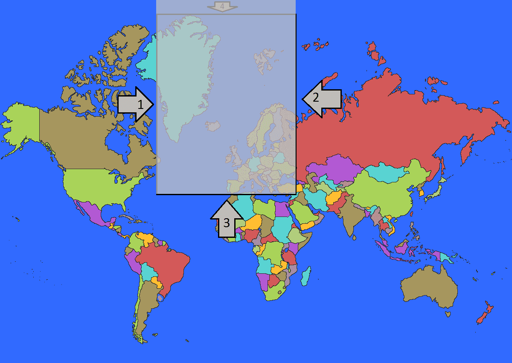

# Introduksjon {.intro}

Velkomen til verdsspelet! Her skal me lage starten av eit spel der ein skal
gjette kva verdsdelar som er kor på kartet. Så kan du utvide oppgåva sjølv til å
gjelde for land, hav, fjell eller noko anna du finn på! Denne oppgåva viser deg
korleis du kan skrive kode som gjer at namnet på verdsdelar dukkar opp når ein
heldt musepeikaren over dei.

Slik skal spelet sjå ut når me er ferdig med denne oppgåva. Oppe i høgre hjørne
set du det står "EUROPA", det skal det stå når me heldt musepeikaren over Europa
på kartet.


# Steg 1: Vindauget {.activity}

Det fyrste du må gjere er å starte Processing. Når du har åpna programmet har du
ein tom teksteditor framfor deg, denne skal du fylle med kode! Det er to metodar
som er vanlege å bruke i Processing: `setup` og `draw`. Start med å skrive
`setup` på ei linje og så `draw` på neste linje. Prøv å trykkje på play-knappen,
altså denne:


No får du ei feilmelding nedst i programmet. Det er den raude linja med kvit
skrift. Det er litt avhengig av kva versjon av Processing du har, men
feilmeldinga kjem til å sjå ut som dette:


Med teksten `Syntax error, maybe a missing semicolon?` foreslår Processing at me
kanskje manglar eit semikolon, og den har markert linje 2 med gult. Det tyder at
det er linje 2 som kanskje manglar eit semikolon.

Veldig ofte er det nettopp semikolon som manglar, men akkurat no er det mykje
meir. For at programmet vårt skal forstå at me prøver å skrive to metodar, så må
me skrive ordet `void` framfor metodenamna, slik som dette:

```processing
void setup
void draw
```

Det er framleis ei raud linje under både `setup` og `draw`, så det manglar
framleis noko. I det minste fekk ordet `void` blå farge. Det tyder at Processing
kjenner att ordet og veit korleis det skal brukast.

Neste steg for å lage metodar er at dei må ha parentesar rett etter namnet sitt.
Når me legg til desse ser koden slik ut:

```processing
void setup()
void draw()
```

No er det i ferd med å likne på noko! Både `setup` og `draw` vart blå. Det tyder
at Processing kjenner att desse orda òg. Prøv å køyre programmet ved å trykkje
på play-knappen att. Kva skjer?

Endå ei feilmelding? No er me veldig nære å få Processing til å forstå at me
skal lage to nye petoder. Det einaste me manglar er å åpne og å stenge metodane.
Me åpnar og lukkar metoden med krøllparentesar, `{ }`, så då blir koden slik:

```processing
void setup(){}
void draw(){}
```

No kan du prøve å køyre programmet att. Kva skjer?

Endeleg får me opp eit lite vindauge. Då kan me starte på innhaldet. Det gjer me
inne i metodane. Det tyder at me skal skrive kode mellom krøllparentesane.

Vindauget er ganske lite. Me kan bestemme storleiken på vindauget ved å kalle på
ein metode, altså bruke ein metode nokon allereie har skrive ferdig for oss. Når
me kallar ein metode skriv me metodenamnet etterfølgd av parentesar og eit
semikolon, slik som dette:

```processing
    size(1200, 850);
```

Som du ser har me sett inn tal i parentesane. Desse bestemmer storleiken på
vindauget du får opp når du trykkar play og programmet køyrer. Køyr programmet
og sjekk at det fungerer.

## Sjekkliste {.check}

- [ ] Gjer vindauget høgt og smalt.

- [ ] Få vindauget til å strekke seg frå venstre til høgre side av skjermen.

- [ ] Sett vindauget tilbake til å vere 1200 pikslar breitt og 850 pikslar høgt.

- [ ] Lagre spelet. Når du gjer det blir det oppretta ei mappe som heiter det
  same som spelet ditt. Du må hugse kor den blir plassert, for den skal me bruke
  vidare.

Her er koden så langt. Sjekk at koden din ser lik ut. Me skriv `size` eit stykke
inn på linja fordi det er vanleg, og det gjer koden lettare å lese.

```processing
void setup(){
  size(1200, 850);
}
void draw(){

}
```


# Steg 2: Vis verdskartet {.activity}

No skal me få på plass verdskartet. Høgreklikk på biletet under, vel "Lagre
bilete som" eller noko liknande, og plasser det i same mappe som der programmet
ditt ligg.


For å kunne vise biletet må me *deklarere* det, altså gi PC-en beskjed om at me
skal bruke eit bilete. Deklarasjonar skjer heilt fyrst i programmet, før dei to
metodane våre.

Me har valt å kalle biletet for `verdskartet`, og kodelinja ser slik ut:

```processing
PImage verdskartet;
```

Sjekk at programmet framleis køyrer. Det skal ikkje skje noko nytt, men du får
feilmelding viss du har skrive noko feil i den nye kodelinja.

No må me laste opp biletet i programmet. Det gjer me berre ein gong, difor set
me kodelinja i `setup`. Kodelinja ser slik ut:

```processing
    verdskartet = loadImage("world-map.png");
```

Sjekk at programmet framleis køyrer. Det skal framleis ikkje skje noko nytt.

No er det viktig å skilje mellom at `verdskartet` er namnet me har valt å kalle
biletet i koden vår, medan `world-map.png` er namnet på sjølve fila når biletet
ligg i mappa på PC-en din.

No må me få vist biletet i vindauget ditt. Det gjer me ved å skrive ei kodelinje
i `draw`-metoden. Kodelinja me treng ser slik ut:

```processing
    image(verdskartet, 0, 0);
```

Etter steg 2 ser koden slik ut:

```processing
PImage verdskartet;

void setup(){
  size(1200, 850);
  verdskartet = loadImage("world-map.png");
}
void draw(){
  loadImage(verdskartet, 0, 0);
}
```


# Steg 3: Kor er musepeikaren? {.activity}

For å finne ut kor i vindauget dei ulike verdsdelane er plassert må me vite kva
koordinata på grensene mellom dei ulike verdsdelane er. Me startar med å vise
koordinatane til musepeikaren på skjermen, slik at det er enklare å forstå kva
koordinatar er og korleis dei fungerer i Processing.

Me treng berre to kodelinjer for å få til dette, og må skrive dei inne i
`draw`-metoden. Me vil ha ein tekst som oppdaterer seg etter kor å skjermen
datamusa er, då treng me denne koden:

```processing
    text("X: " + mouseX, 50, 50);
    text("Y: " + mouseY, 50, 100);
```

Test at programmet køyrer. Du skal få opp nokre tal som endrar seg når du
beveger musepeikaren over vindauget.

## Forklaring av koden {.protip}

I denne koden brukar me metoden `text();` som allereie er ferdig skrive for oss.
Inne i parentesen har me tre parametrar, desse er skilt frå kvarandre med komma.
I den fyrste paramtereren seier me kva som skal skrivast ut. Dei to siste
bestemmer kor i vindauget teksten skal skrivast.

Teksten me skal skrive ut er koordinatane til datamusa. Desse er lagra i to
variablar som heiter `mouseX` og `mouseY`. Når den fyrste parameteren ser slik
ut: `"X: " + mouseX`, så vil progammet lese den fyrste delen som vanleg tekst,
og ikkje gjere anna enn å vise `X: ` på skjermen. For den siste delen, derimot,
så forstår programmet at det er ein variabel, og då får me sjå verdien til
variabelen i staden for namnet.

## Sjekkliste {.check}

- [ ] Lag ei ny kodelinje som skriv ut namnet ditt.

- [ ] Flytt kodelinja med `mouseX`, slik at den står om lag på midten nedst på
  skjermen.

- [ ] Finn ut kor i vindauget X er minst.

- [ ] Finn ut kor i vindauget Y er høgast.

- [ ] Kva X- og Y-verdi visast når du heldt musepeikaren over Island?

Her er koden så langt.

```processing
PImage verdskartet;

void setup(){
  size(1200, 850);
  verdskartet = loadImage("world-map.png");
}
void draw(){
  loadImage(verdskartet, 0, 0);
  text("X: " + mouseX, 50, 50);
  text("Y: " + mouseY, 50, 100);
}
```


# Steg 4: Vis Europa {.activity}

No skal me få ordet `Europa` til å dukke opp på skjermen når me heldt
musepeikaren over verdsdelen.

Då må me fyrst finne ut kor grensa til Europa eigentleg er. No gjer me ei veldig
forenkla utgåve av grensa til Europa. La oss seie at Europa er heilt firkanta,
og at denne firkanten er grensa til Europa:


For å gjere kodinga enklare, så byttar me ut verdskartet vårt med dette biletet.
Last det ned og lagre det same stad som det førre verdskartet. Me må berre endre
den eine kodelinja som fortel programmet kva biletet det skal laste inn. Det
gjorde me i `setup`-metoden. Då blir kodelinja slik etter at den er endra:

```processing
verdskartet = loadImage("mapEuropa3.png");
```

## Gjer dette før du går vidare {.check}

- [ ] Start programmet.

- [ ] Prøv å skrive ein kommentar i koden din. Alle kommentarar startar med to
  skråstrekar, slik som dette: `//`. Alt som blir skrive bak skråstrekane blir
  grått, og det tyder at programmet ikkje les det. Det kan brukast som eigne
  notat i koden, til dømes for å skrive kva som skjer. Prøv å skrive ein
  kommentar. Når du gjer dei neste punkta skal du notere svaret du får som
  kommentarar i koden din. Gå gjennom dei neste tre punkta fire gonger, ein gong
  for kvar av sidene i firkanten som me har laga som grense til Europa.

- [ ] Beveg musepeikaren langs grensa (fram og attende, eller opp og ned) nokre
  gonger, og finn ut om det er X- eller Y-koordinaten som nesten ikkje endrar
  seg. Du skal berre bruke den koordinaten som nesten ikkje endrar seg i dei
  neste punkta.

- [ ] Skriv ned talet som koordinaten har når musepeikaren er akkurat på grensa.

- [ ] Beveg musa ut og inn over grensa. Finn ut om verdien på koordinaten er
  større eller mindre på innsida enn på utsida av grensa og skriv det ned.

Har du gjort dette for alle grensene? Her er svara me kom fram til:

```processing
// Grense 1: X-koordinaten beveger seg nesten ikkje, den er ca. 367 på heile
  // grensa, og innanfor er den større enn utanfor
// Grense 2: X-koordinaten beveger seg nesten ikkje, den er ca. 694 på heile
  // grensa, og innanfor er den mindre enn utanfor
// Grense 3: Y-koordinaten beveger seg nesten ikkje, den er ca. 455 på heile
  // grensa, og innanfor er den mindre enn utanfor
// Grense 4: Y-koordinaten beveger seg nesten ikkje, den er ca. 33 på heile
  // grensa, og innanfor er den større enn utanfor
```

No skal me sjekke om musepeikaren er innanfor ein og ein av kantane, då må me
bruke `if`-setningar. Dei fugnerer slik at ein skriv ein test, og viss det som
blir testa er sant, så blir ein bestemt kode utført. La oss starte med grense
nummer 1.

Fyrst skriv me `if`-setninga med vanlege ord, og så gjer me det om til kode. No
skal me bruke tala og resultatet av det me fann.

```processing
Viss musepeikaren er innanfor grense nummer 1,
    så skal teksten "Europa" visast på skjermen
```

Me veit at X-koordinaten akkurat på grense nummer 1 er 367, i tillegg veit me at
X-koordinaten er større innanfor grense 1 enn utanfor grense 1. La oss setje inn
dette:

```processing
Viss musepeikaren sin X-koordinat er større enn 367,
    så vis teksten "EUROPA" på skjermen
```

Det kan me gjere om til kode, då ser det slik ut:

```processing
    if(mouseX > 365){
        text("EUROPA", 950, 50);
    }
```

## Sjekkliste {.check}

- [ ] Skriv `if`-setninga inni `draw`-metoden.

- [ ] Sjekk at koden køyrer.

- [ ] Sjå at du får opp `EUROPA` oppe til høgre i vindauget når musepeikaren er
  innanfor grense nummer 1.

Merk at `EUROPA` dukkar opp på skjermen både når du heldt musepeikaren over
Europa, men òg om du heldt over Madagaskar utanfor Afrika. Det er fordi me berre
har ei `if`-setning, no må me leggje til dei tre andre for at teksten `EUROPA`
berre skal kome opp når me er innanfor alle dei fire grensene. Akkurat no viser
me `EUROPA` uansett kor musepeikaren er i det grå området på biletet under.


La oss leggje til kode for grense nummer to. No er målet at `EUROPA` skal visast
i det grå området på biletet under:


Prøv å skrive `if`-setninga for å få det til med vanlege ord før du går vidare.

Her er forslaget vårt til korleis du kan skrive `if`-setninga for grense 2:

```processing
Viss musepeikaren sin X-koordinat er innanfor grense 2,
    så skal teksten "EUROPA" visast
```

Me har sjekka at grenseverdien er 649 og me veit at X-koordinaten er mindre
innanfor grensa enn utanfor grensa. Me går vidare og skriv `if`-setninga i kode:

```processing
    if(mouseX < 694){
        text("EUROPA", 950, 50);
    }
```

## Sjekkliste {.check}

- [ ] Skriv `if`-setninga inni `draw` metoden.

- [ ] Sjekk at koden køyrer.

- [ ] Kva skjer når du beveger musepeikaren rundt på skjermen?

No står det `EUROPA` på skjermen heile tida! Det er jo feil, så la oss feilsøke.

## Sjekkliste {.check}

- [ ] Bytt ut plasseringa av teksten i den siste `if`-setninga. Det gjer me ved
  å skrive `100` i staden for `50` som den siste parameteren inne i parentesen
  bak `text`.

- [ ] Køyr koden ein gong til, no skal den nye teksten dukke opp litt under den
  fyrste.

No ser me at det står `EUROPA` to stader, oppe og nede. Oppe står det `EUROPA`
så lenge musepeikaren er til høgre for grense 1. Neder står det `EUROPA` så
lenge musepeikaren er til venstre for grense 2. Dei to `if`-setningane gjer det
dei skal, men dei gjer det kvar for seg! Me må skrive om koden slik at me får
sjekka om musepeikaren er innanfor grense 1 og grense 2 samstundes, ikkje kvar
for seg.


Me må kople saman `if`-setningane. Det er enkelt, me skriv dei inni kvarandre!
Då blir dei slik:

```processing
    if(mouseX > 365){
        if(mouseX < 694){
            text("EUROPA", 950, 50);
        }
    }
```

No blir teksten `EUROPA` berre skrive ut i vindauget viss begge `if`-setningane
er sanne.

## Sjekkliste {.check}

- [ ] Skriv om koden din, slik at `if`-setningane står inni kvarandre.

- [ ] Test koden og sjå om det fungerer.

No skal me skrive dei to siste `if`-setningane som skal sjekke om musepeikaren
er innanfor grense 3 og 4. Dei må skrivast inne i dei to `if`-setningane me
allereie har. Me kjem til å få ei `if`-setning inni ei `if`-setning inni ei
`if`-setning inni ei `if`-setning.

For grense 3 skal me berre hjelpe deg å skrive `if`-setninga med nesten heilt
vanlege ord, og så må du skrive koden sjølv:

```processing
Viss musepeikaren sin Y-koordinat er mindre enn grense 3,
    så skal teksten "EUROPA" visast
```

Her er litt av koden, fyll ut reisten sjølv:

```processing
    if(mouseX > 365){
        if(mouseX < 694){
            if(               ){
                text("EUROPA", 950, 50);
            }
        }
    }
```

## Sjekkliste {.check}

- [ ] Skriv koden du trur er riktig.

- [ ] Test om koden fungerer. Viss den gjer det, så skal teksten `EUROPA` visast
  når musepeikaren er innanfor det grå området på biletet under:



No må du prøve deg på koden til den siste `if`-setninga heilt sjølv!

## Sjekkliste {.check}

- [ ] Skriv den siste `if`-setninga med vanleg tekst.

- [ ] Skriv inn koden for den siste `if`-setninga inni dei andre
  `if`-setningane.

- [ ] Køyr programmet og sjå at det fungerer. Når alt er i orden skal det berre
  stå `EUROPA` når musepeikaren er innanfor den firkanta grensa til Europa som
  me har laga.

Her ser du koden, så kan du dobbeltsjekke at alt ser riktig ut.

```processing
PImage verdskartet;

void setup(){
  size(1200, 850);
  verdskartet = loadImage("world-map.png");
}
void draw(){
  loadImage(verdskartet, 0, 0);
  text("X: " + mouseX, 50, 50);
  text("Y: " + mouseY, 50, 100);

  if(mouseX > 365){
      if(mouseX < 694){
          if(mouseY < 455){
              if(mouseY > 33){
                text("EUROPA", 950, 50);
              }
          }
      }
  }
}

// Grense 1: X-koordinaten beveger seg nesten ikkje, den er ca. 367 på heile
  // grensa, og innanfor er den større enn utanfor
// Grense 2: X-koordinaten beveger seg nesten ikkje, den er ca. 694 på heile
  // grensa, og innanfor er den mindre enn utanfor
// Grense 3: Y-koordinaten beveger seg nesten ikkje, den er ca. 455 på heile
  // grensa, og innanfor er den mindre enn utanfor
// Grense 4: Y-koordinaten beveger seg nesten ikkje, den er ca. 33 på heile
  // grensa, og innanfor er den større enn utanfor
```

Hugs at du må laste inn det opphavlege verdskartet utan firkanten på!
