# Intro {.intro}
Denne oppgaven bygger på oppgaven med samme navn som ligger på introduksjonsnivå her i Processingoppgavene. [Klikk her for å gå til introduksjonsoppgaven av verden](../verden_del1/verden_del1.html){target=blank}.

I denne oppgaven skal vi fortsette med verdenspillet! Nå skal vi komme så langt på spillet at det skal dukke opp navnet på en verdensdel i vinduet, og så er det om å gjøre å trykke på verdensdelen.

Slik skal oppgaven se ut når vi er ferdig å kode alt sammen:

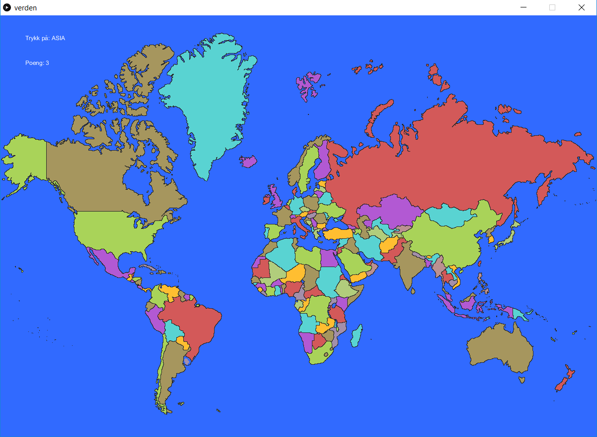

# Steg 0: Oppsummering fra introduksjonsoppgaven {.activity}

Her er koden vi gjorde i introduksjonsoppgaven:

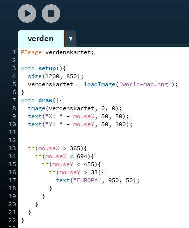

Hittil har vi fått det til å dukke opp "EUROPA" på skjermen når musepekeren holdes over verdensdelen Europa på kartet.

Dette ble gjort ved å først si at Europa er firkanta. Deretter ble koordinatene til musepekeren vist som tekst i vinduet og så holdt vi musepekeren nøyaktig på grensene som var tegna opp, slik at vi kunne se hva koordinatene var og bruke disse for å lage if-setninger til å sjekke med.

Vi lagde en if-setning for hver side i firkanten som utgjorde grensa til Europa. Disse fant vi ut at måtte skrives inni hverandre slik at man sjekket om man var innenfor alle fire grensene samtidig.

Under har vi laga ei sjekkliste, dersom du får til alle punktene i lista, så er det ikke noe problem for deg å gjøre resten av denne oppgaven. Dersom du synes sjekklista er vanskelig, så anbefaler vi at du forsøker deg på introduksjonsdelen av oppgaven før du går videre.

## Sjekkliste {.check}
- [ ] Skriv inn koden som ble gjort i introduksjonsdelen av oppgaven og få det til å kjøre.
- [ ] Flytt teksten som viser koordinatene ned til høyre hjørne av skjermen.
- [ ] Få teksten "EUROPA ER 10 180 000 KVADRATMETER" til å vises på skjermen i stede for bare "EUROPA" når du holder musepekeren over Europa.
- [ ] Bytt størrelsen på vinduet, slik at det når fra toppen til bunnen av skjermen din.

Fikk du til alle punktene? Still tilbake alt sammen før du går videre.

# Steg 1: Legg til Asia {.activity}
Du lærte i introduksjonsdelen hvordan du la til Europa, så nå skal du få legge til Asia på samme måte. Vi har delt opp dette i mindre deler for deg. Under har vi laga ei sjekkliste som du må følge. Dersom noen av punktene er vanskelige, så husk at du kan sjekke med introduksjonsoppgaven.

## Sjekkliste {.check}
- [ ] Last ned dette bilde og få det til å vise i vinduet i stedet for det du har nå:
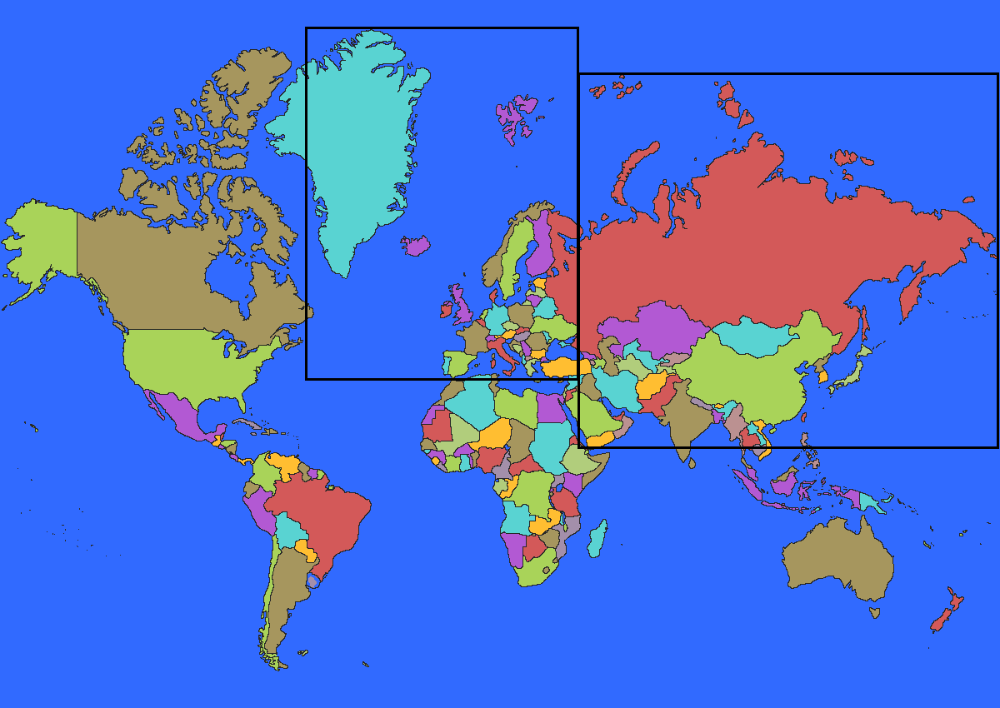
- [ ] Finn ut hvor grensene til Asia er og lagre dem som kommentarer i koden din. Kommentarer lages ved å sette to skråstreker først, slik som dette: `//`.
- [ ] Skriv `if`-setningen for den første grensa og sjekk at det fungerer.
- [ ] Gjør et metodekall på `text();` inni `if`-setningen hvor den første parameteren er "ASIA". De to neste parameterne kan være det samme som de to siste i metodekallet som får "EUROPA" til å vises på skjermen.
- [ ] Skriv `if`-setningen for den andre grensa og sjekk at det fungerer. Husk at alle `if`-setningene må stå inni hverandre.
- [ ] Skriv `if`-setningen for den tredje grensa og sjekk at det fungerer.
- [ ] Skriv `if`-setningen for den fjerde grensa og sjekk at det fungerer.
- [ ] Bytt tilbake til bildet av verdenskartet uten firkanta grenser på.
- [ ] Test at alt fungerer, nå skal "ASIA" vises i vinduet når du holder musepekeren over Asia, mens "EUROPA" skal vises i vinduet når du holder musepekeren over Europa.

Her er koden så langt.

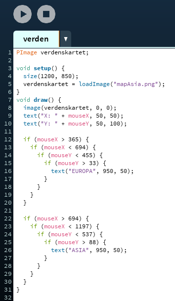

# Steg 2: Slå sammen if-setninger {.activity}
Nå som du har vært gjennom hvordan du setter opp `if`-setninger inne hverandre, så er det på tide å vise hvordan du kan slå `if`-setninger sammen. Når du if-setninger settes inni hverandre så kan det leses som dette:

```processing
Dersom musepekeren er innenfor venstre grense
    og dersom musepekeren er innenfor høyre grense
        og dersom musepekeren er innenfor nedre grense
            og dersom musepekeren er innenfor øvre grense,
                så skal vi vise "EUROPA" på skjermen.
```

Gjør vi dette om til litt mer vanlig tale, så ville vi sagt:

```processing
Dersom musepekeren er innenfor venstre grense og musepekeren er innenfor høyre grense og musepekeren er innenfor nedre grense og musepekeren er innenfor øvre grense,
    så skal vi vise "EUROPA" på skjermen.
```

Dette har vi lov å gjøre når vi koder også. La oss bytte ut det vi har så langt med kode i setningen over, da får vi dette:

```processing
if(mouseX > 365 og mouseX < 694 og mouseY < 455 og mouseY > 33)]{
    text("EUROPA", 950, 50);
}
```

Så langt har vi ikke lagt til noe ny kode. Vi har bare satt alle testene på samme linje med "og" mellom. Vi har ikke lov å bruke "og", men vi har lov å bruke `&&` som betyr akkurat det samme. La oss sette inn `&&` der hvor vi har "og", da får vi:

```processing
if(mouseX > 365 && mouseX < 694 && mouseY < 455 && mouseY > 33)]{
    text("EUROPA", 950, 50);
}
```

Dette blir en ganske lang `if`-setning som kanskje er litt vanskelig å lese, men det sparer mye plass i koden.

## Gjør dette: {.check}
- [ ] Dersom du ikke har gjort det allerede, så må du nå slå sammen de fire `if`-setningene som sjekker grensene til Europa til å være bare en `if`-setning.
- [ ] Sjekk at koden fungerer.
- [ ] Skriv om `if`-setningene for Asia, slik at du sjekker alle grensene i en `if`-setning.
- [ ] Sjekk at koden fungerer.

Her er bilde av koden så langt.  

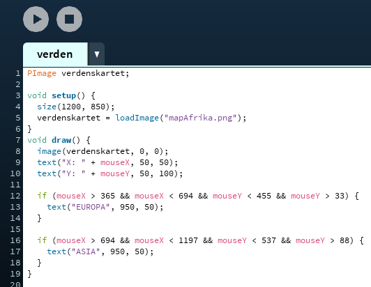

# Steg 3: Sjekk Afrika med to if-setninger {.activity}
Nå skal vi legge til Afrika, dette skal gjøres i en `if`-setning. Nå kan du velge om du vil følge sjekklista under bilde for å sette opp koden som trengs, eller om du vil forsøke å skrive den alene. Her er bilde av grensa til Afrika:


## Sjekkliste: {.check}
- [ ] Bytt ut verdenskartbilde med bildet over.
- [ ] Finn koordinatene på de fire grensene til Afrika og skriv dem inn som kommentarer i koden din.
- [ ] Kall på `text();` og bruk "AFRIKA" som første parameter.
- [ ] Skriv koden til den første grensa.
- [ ] Sjekk at koden fungerer og at if-setningen gjør det den skal.
- [ ] Skriv `&&` og legg til testen for den andre grensa til Afrika i samme `if`-setning, muntlig blir dette:
```processing
if(er musepekeren innenfor den første grensa && er musepekeren innenfor den andre grensa){
    vis teksten "AFRIKA" i vinduet.
}
```
- [ ] Test at koden fungerer som den skal.
- [ ] Skriv `&&` og legg til testen for den tredje grensa til Afrika i samme `if`-setning.
- [ ] Test at dette fungerer som det skal.
- [ ] Skriv `&&` og legg til testen for den fjerde grensa til Afrika i samme `if`-setning.
- [ ] Test at koden fungerer og at "AFRIKA" vises i vinduet når du holder musepekeren over Afrika.

Nå som Afrika også fungerer, så skal vi legge til en liten rute til, fordi som du ser på kartet, så er ikke Madagaskar, Somalia, halve Etiopia og Djibouti tatt med i firkanten, så når vi holder musepekeren over disse landene, så kommer ikke "AFRIKA" opp på skjermen. Det må vi fikse.

Vi har laga en ny firkant som bare inkluderer disse landene. Nå har du skrevet så mange `if`-setninger at denne tror vi du greier uten en sjekkliste. Dersom det er vanskelig, så er det bare å bruke sjekklista over, det er akkurat det samme som skal gjøres, bare med nye koordinater på grensene.

## Gjør dette: {.check}
- [ ] Lag en ny `if`-setning som sjekker grensene til den nye firkanten. Her er bildet:
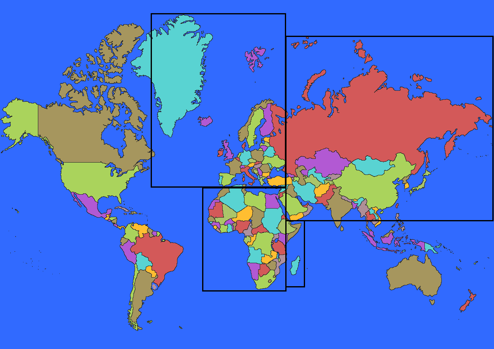

Her er koden vår så langt. Nå begynner det å bli en del `if`-setninger!

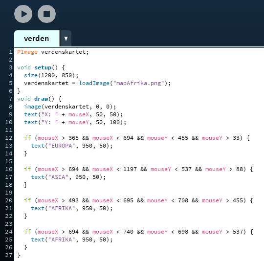

# Steg 4: Lag en metode i steden for alle if-setningene {.activity}
Nå skal vi gjøre koden vår enda mindre. Det er fordi vi skal legge til mange flere `if`-setninger og da vil vi skrive kode som er så enkel som mulig.

Når du ser etter på `if`-setningene, så er de nesten helt like. Det er bare grenseverdiene som er forskjellige. Når vi oppdager at vi kommer til å måtte skrive mye kode som ligner veldig, så kan man ofte putte det som er likt over i en metode og så foreta metodekall i stedet for å skrive samme kode på nytt og på nytt.

`setup` og `draw` er metoder vi har skrevet, mens `text();` er en metode vi har kalt på. Når du trykker på play, så gjøres det automatisk et kall på `setup`, det skjer bare en gang. Deretter kalles `draw` på nytt og på nytt helt til programmet slås av.

La oss skrive en ny metode, den plasseres unden `draw`. Vi har valgt å gi metoden navnet `sjekkVerdensdel`. Da blir det slik:

```processing
void sjekkVerdensdel(){


}
```

Inni krøllparentesene skal vi skrive den koden vår som blir gjentatt, altså de lange `if`-setningene.

La oss starte med å putte inn en av if-setningene. Vi har valgt å kopiere inn `if`-setningen som sjekker om musepekeren er innenfor Europa sin grense, så nå ser metoden slik ut:

```processing
void sjekkVerdensdel(){
    if(mouseX > 365 && mouseX < 694 && mouseY < 455 && mouseY > 33)]{
        text("EUROPA", 950, 50);
    }
}
```

Vi har ikke lyst å skriv inn en `if`-setning for hver verdensdel i den nye metoden. For å bare ha en `if`-sentning, så bytter vi ut alle de tallene som er forskjellig fra verdensdel til verdensdel med variabler. Vi gir variabelnavn som er logiske, da er det lettere å lese koden senere. En variabel kan endres mens programmet kjører, men tall som er skrevet direkte inn kan ikke endres mens programmet kjører. I den første testen sjekker vi om musepekeren er innenfor den første grensa, altså den grensa som er til høyre. Vi har ikke lov å bruke `æ`, `ø` eller `å`, så da skriver vi `høyre` med `o`, altså `hoyreGrense`. Vi putter dette inn i stede for tallet `365` og får:

```processing
void sjekkVerdensdel(){
    if(mouseX > hoyreGrense && mouseX < 694 && mouseY < 455 && mouseY > 33)]{
        text("EUROPA", 950, 50);
    }
}
```

Vi gjør det samme med de andre tre grensene også.

## Gjør dette: {.check}
- [ ] Finn passende navn til de andre grensene også og bytt ut tallene i `if`-setningen med de navna du har funnet.  
- [ ] Kjør programmet, hva skjer?

Nå fikk vi en feilmelding som ser slik ut:

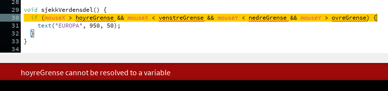

Programmet sier at `hoyreGrense` ikke kan bli en variabel. Det er fordi vi ikke har skrevet kode som forteller programmet at `hoyreGrense` er en variabel. Forløpig tror programmet at vi har gjort en skrivefeil. Programmet vet at vi skal sammenligne musepekeren sin koordinat med et eller annet tall, men akkurat nå er ikke `hoyreGrense` noe tall, det er bare noen bokstaver.

Vi må gjøre om `hoyreGrense` til en variabel av typen `int`, det betyr heltall. Det heter å deklarere variabelen. Vi kan deklarere variabelen flere steder, inni den nye metoden, utenfor alle metodene, eller inni parentesene til metoden. Hvor vi velger å deklarere variabelen avhenger av hvordan vi skal bruke metoden.

Ettersom vi ønsker å sjekke forskjellige grenser hver gang vi kaller metoden, så er det lurt å deklarere variabelen `hoyreGrense` inni parentesene til den nye metoden. Når deklarasjonen er plassert her, så må vi legge ved grenseverdien som parameter hver gang vi kaller på metoden.

Metoden ser slik ut:

```processing
void sjekkVerdensdel(int hoyreGrense, int ...., int ...., int .... ){
    if(mouseX > hoyreGrense && mouseX < .... && mouseY < .... && mouseY > ....)]{
        text("EUROPA", 950, 50);
    }
}
```

I stede for punktum så skal det være de navna du har valgt for de forskjellige grensene.

## Gjør dette: {.check}
- [ ] Deklarer alle de fire variablene dine inni parentesen til den nye metoden din.
- [ ] Sjekk om programmet kjører.

Nå er det en ting som mangler. Det er navnet på verdensdelen. Alle verdensdelene skal ikke hete "EUROPA". Da må vi gjøre denne om til en `String`, det betyr en tekst.

## Gjør dette: {.check}
- [ ] Bytt ut det første parameteret inni metodekallet på `text();` inni `if`-setningen som er inni den nye metoden og skriv heller `verdensdel` (du kan velge et annet navn enn `verdensdel`).
- [ ] Kjør programmet, hva skjer?
- [ ] Deklarer `verdensdel` til å være en `String` inni parentesene til den nye metoden.
- [ ] Kjør programmet, hva skjer?

Nå har vi laget en ny metode, men vi har ikke kalt på den nye metoden noe sted. Så forløpig så kjører programmet vårt en gang gjennom `setup` og deretter på nytt og på nytt gjennom `draw` uten å gå til den nye metoden.  

Her er koden så langt, husk at vi sikkert har valgt litt forskjellige variabelnavn for de forskjellige grensene. Så lenge programmet kjører er ikke det noe problem. Det kan være greit om deklarasjonene på de forskjellige grensene, samt navnet på verdensdelen ligger i samme rekkefølge, men det er bare for å gjøre det lettere å feilsøke i koden seinere.

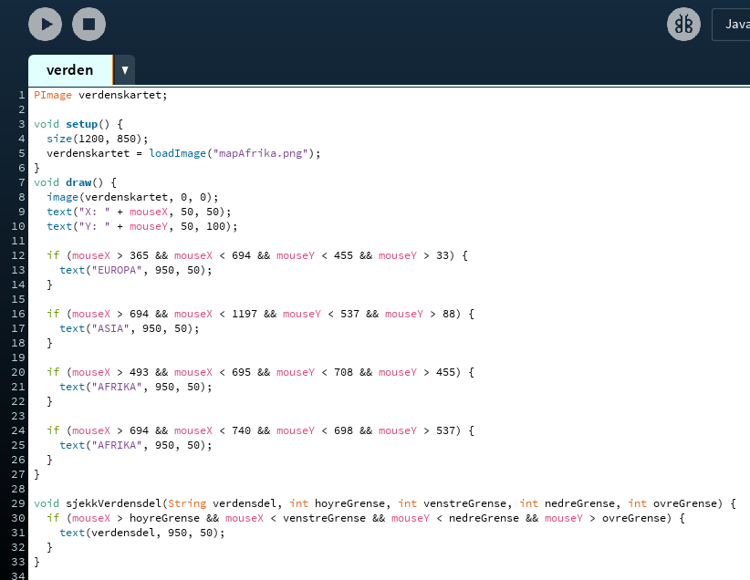

# Steg 5: Bruk den nye metoden {.activity}
For å bruke den nye metoden må vi gjøre et metodekall på den. På samme måte som at vi har gjort et metodekall på `text();` og `size();`, så skal vi nå gjøre et metodekall på `sjekkVerdensdel();`. Dette gjør vi inni `draw`-metoden.

## Gjør dette: {.check}
- [ ] Gjør et metodekall på `sjekkVerdensdel();` inni `draw`-metoden.
- [ ] Kjør koden, hva skjer, forstår du hva feilmeldingen betyr?
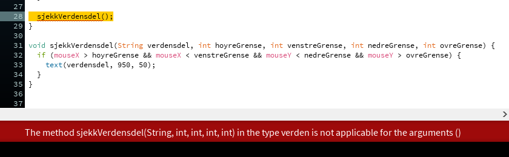
- [ ] Gjør metodekallet om til en kommentar ved å sette to skråstreker først på linja.
- [ ] Ta bort parameterne inni ett av metodekallene på `text();`.
- [ ] Kjør programmet. Hva skjer, forstår du feilmeldingen?
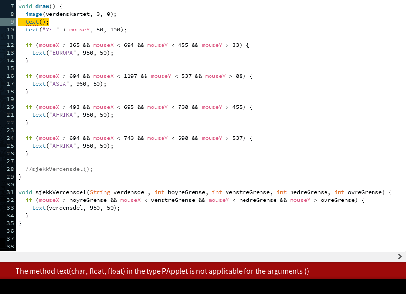


Det mangler rett og slett parametre i metodekallene. For metodekallet på `text();` trengs det først en `char` og deretter to `float`. Det betyr først den teksten som skal vises i vinduet, deretter to tall som bestemmer hvor teksten skal vises.

For metodekallet på `sjekkVerdensdel();` så trengs det først en `String`, som sier hvilken verdensdel vi sjekker om musepekeren er i, deretter fire `int`, som forteller hvor de fire grensene til verdensdelen er.

Da må vi putte inn parametere i metodekallet.

## Gjør dette: {.check}
- [ ] Sett inn igjen parameterne i metodekallet på `text();`
- [ ] Start med Europa. Den første parameteren skal da være `"EUROPA"`. Husk hermetegnene, ellers vet ikke programmet at det er en tekst. Skill hver av parameterne med komma. Den neste parameteren er den første grensa, altså 365. Så kommer den andre grensa, altså den på venstre side av firkanten vi har brukt, som er 694. Nå er det den nedre grensa sin tur, den fant vi ut var 455 og til slutt må vi ha den øvre grensa til Europa, som vi fant ut at var 33.  
- [ ] Kjør programmet, hva skjer?
- [ ] Nå vil "EUROPA" vises på skjermen dobbelt opp, fordi nå sjekker vi om musepekeren er over Europa først i `if`-setningen inni `draw`-metoden og deretter i det nye metodekallet vårt. Ta derfor bort `if`-setningen som er skrevet inni `draw` og som sjekker Europa.
- [ ] Kjør programmet på nytt, fungerer det fremdeles som det skal?

Her er bilde av koden, vi har bare tatt med metodene `draw` og `sjekkVerdensdel`, ettersom det bare er der det er gjort endringer. Det er viktig at du har fjernet riktig `if`-setning og at du har brukt riktige parametre inni metodekallet på `sjekkVerdensdel();`.

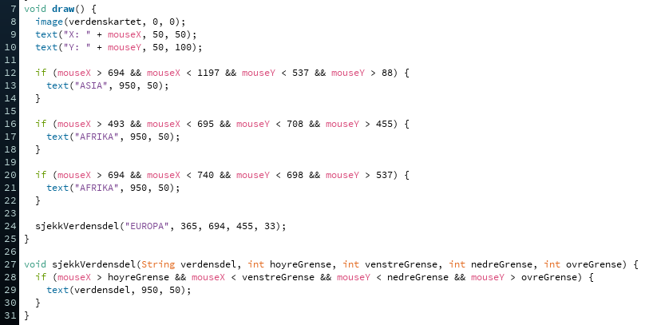

# Steg 6: Bruk `sjekkVerdensdel`-metoden til alle verdensdelene {.activity}
Nå skal du få bruke metoden `sjekkVerdensdel();` til å sjekke Asia og Afrika. Siden du allerede har funnet ut hva koordinatene er akkurat på grensa, så trenger du ikke å gjøre det på nytt.

## Gjør dette: {.check}
- [ ] Gjør et metodekall på `sjekkVerdensdel();` hvor de forskjellige parameterne er de du har funnet for Asia.
- [ ] Fjern `if`-setningen som sjekker om musepekeren holder over Asia.
- [ ] Kjør koden og sjekk at "ASIA" kommer opp når du holder musepekeren innen for grensene til Asia.
- [ ] Gjør to metodekall på `sjekkVerdensdel();` og få den til å sjekke om musepekeren er innenfor Afrika.
- [ ] Fjern de to `if`-setningene som sjekker om musepekeren er innenfor Afrika.
- [ ] Sjekk at koden fungerer.

Her er koden vår så langt.

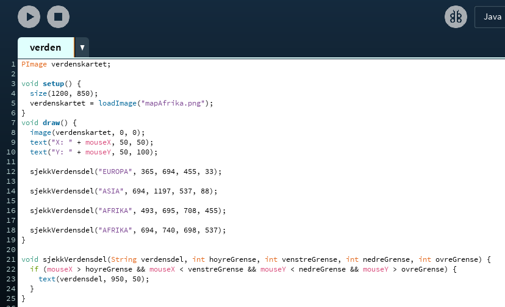

Nå må vi legge til de siste verdensdelene. Her har vi et kart hvor vi har vist alle sammen. Nå skal vi gjøre metodekall på `sjekkVerdensdel();` og legge til grenseverdiene til Nord-Amerika, Sør-Amerika og Oseania. Kartet vårt mangler verdensdelen Antarktis (Sydpolen), men det kan du ordne ved å velge et annet kart.

## Gjør dette: {.check}
- [ ] Bytt ut slik at dette bildet vises:
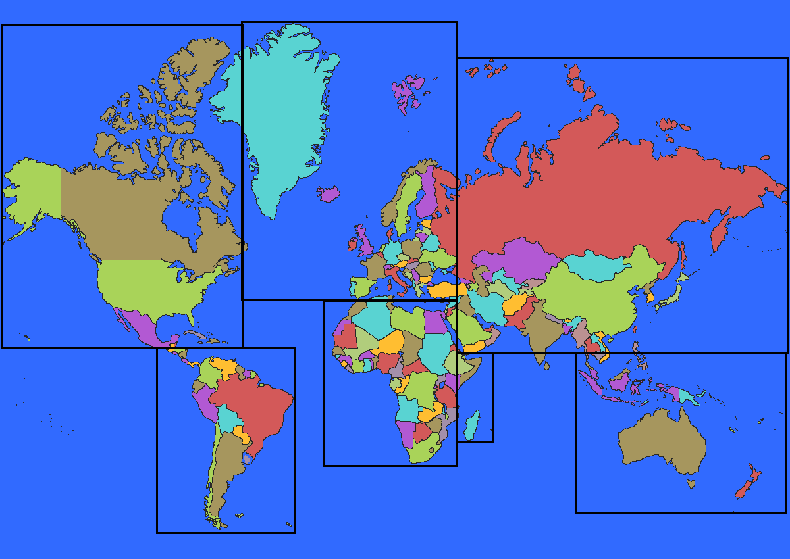
- [ ] Gjør et metodekall på `sjekkVerdensdel();`.
- [ ] Sett inn den første parameteren til metoden, som er `"OSEANIA"`.
- [ ] Finn grenseverdiene til Oseania og skriv disse rett inn som parameter i metodekallet i stedet for å skrive dem som kommentarer i koden først. Start med den venstre grensa, så den høyre, deretter den nedre grensa og til slutt den øvre.
- [ ] Sjekk at koden fungerer. Nå skal "OSEANIA" vises på skjermen når du holder musepekeren over Oseania. Dersom det ikke fungerte som det skulle, så forsøk å skrive grensene til Oseania som kommentarer først, slik at du er helt sikker på hva som er hva av tallene. Sjekk også at rekkefølgen på parameterne er riktig.
- [ ] Gjør et nytt metodekall på `sjekkVerdensdel();` og putt inn parameterne for Nord-Amerika. Siden du akkurat har gjort det for Oseania, så er det bare å gjøre det samme her.
- [ ] Test at koden fungerer, nå skal alle verdensdelene bortsett fra Sør-Amerika dukke opp på skjermen når du holder musepekeren over dem.
- [ ] Skriv kode slik at Sør-Amerika også vises på skjermen når du holder musepekeren over verdensdelen.
- [ ] Test at koden fungerer.

Her er koden vår så langt.

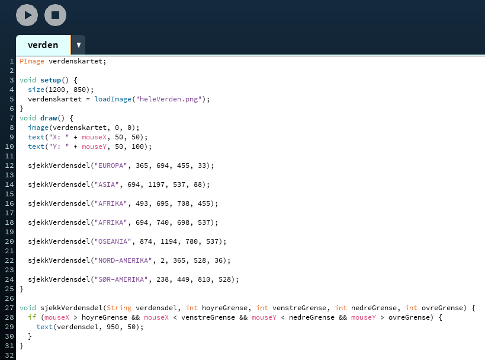

# Steg 7: Trekk en tilfeldig verdensdel {.activity}
Nå har vi fått alle verdensdelene til å vises når vi holder musepekeren over dem, da er det på tide å få dette til å bli mer som et spill. Vi ønsker at det skal dukke opp navnet på en tilfeldig verdensdel på skjermen og så skal vi få poeng dersom vi greier å trykke på riktig verdensdel.

Det vi trenger for å få dette til å skje, er en liste med alle verdensdelene og deretter noe kode for å trekke tilfeldig fra lista.

Vi starter med lista. Denne skal inneholde ordene "AFRIKA", "ASIA", "EUROPA", "SØR-AMERIKA", "NORD-AMERIKA" og "OSEANIA". Dette er tekst, så da bruker vi en liste for å lage tekst. Da vi oppretta metoden `sjekkVerdensdel`, så brukte vi `String` inni parentesen for å ta i mot en tekst, men dette var bare ett ord, eller en tekst. Nå trenger vi noe som kan inneholde mange separate tekster. Det er ganske enkelt, alt vi trenger å gjøre er å sette `[]` bak `String` og så vet programmet at det er en liste med tekster vi skal ha. Vi vet nøyaktig hva lista skal inneholde, så vi fyller den opp samtidig som vi deklarerer den.

Vi deklarerer lista vår helt i toppen av programmet, utenfor alle metodene. Vi kan gi lista hvilket navn vi vil. Her har vi valgt `alleVerdensdelene`, så kodelinja ser slik ut:

```processing
 String[] alleVerdensdelene = {"ASIA", "EUROPA", "NORD-AMERIKA", "SØR-AMERIKA", "OSEANIA", "AFRIKA"};
```
Dette er alt vi trenger for å lage lista, denne typen liste heter `String array`.

## Gjør dette: {.check}
- [ ] Deklarer et `String array`. Du kan gi det hvilket navn du vil, men vi anbefaler `alleVerdensdelene`, slik at det er lettere å sammenligne din kode med vår.
- [ ] Kjør programmet og se at det kjører som det skal.

`random();` er en metode som vi kan kalle på for å få et tilfeldig tall. Til forskjell fra `text();` og `size();`, så gjør ikke `random();` noe med vinduet vårt, det som skjer når vi bruker random er at vi får tibake et tall og det tallet må vi putte i en variabel, slik at vi kan bruke det.

La oss derfor først deklarere en variabel. `random();` gir oss et tall av typen `float`, derfor skulle egentlig variabelen vært av typen `float`, men når vi skal bruke tallet senere må det være av typen `int`. Derfor skal vi gjøre noe som heter å `caste` til `int`. Det betyr rett og slett bare at vi gjør verdien fra `random();` om til en `int`. Navnet til variabelen kan vi bestemme selv, her har vi valgt at den skal hete `tilfeldigTall`. Denne deklarasjonen skal skje øverst i koden, enten rett over eller rett under deklarasjonen av lista. Kodelinja blir slik:

```processing
int tilfeldigTall;
```

Nå må vi få `tilfeldigTall` til å inneholde et tilfeldig tall, det gjør vi inni `setup`-metoden. Vi starter med muntlig kode:

```processing
    variabelen tilfeldigTall skal være ett tilfeldig tall;
```

Nå bruker vi `random();` med casting til `int`, da blir det:

```processing
    tilfeldigTall = (int)random(6);
```

Parameteret til `random();` forteller hvor hvilke tall det skal velges tilfeldig mellom. Siden vi har 6 forskjellige verdensdeler med i lista, så vil vi at `random();` skal gi oss ett tall mellom 0 og 6. Derfor skriver vi 6 som parameter.

## Gjør dette: {.check}
- [ ] Deklarer en variabel av typen `int`, gi variabelen et passende navn, vi anbefaler `tilfeldigTall`.
- [ ] Sjekk at koden kjører.
- [ ] Sett variabelen til å bli et tilfeldig tall mellom 0 og 6, ved å gjøre et metodekall på `random();` og cast `int`.
- [ ] Sjekk at koden kjører.
- [ ] Gjør et metodekall på `text();` der første parameter er: `"Variabelen tilfeldigTall er: " + tilfeldigTall`. De to neste parameterne bestemmer du selv. Nå skal vi bare sjekke hvilke tall `tilfeldigTall` er blitt til.
- [ ] Kjør programmet noen ganger og sjekk at det variabelen `tilfeldigTall` blir forskjellige tall.
- [ ] Gjør et nytt metodekall på `text();` der det første parameteret er: `"Trykk på: " + alleVerdensdelene[tilfeldigTall]`. De to neste parameterne bestemmer du selv. `alleVerdensdelene` er lista med verdensdeler, så det vi gjør her er å si at vi skal vise verdensdelen som er på plassen til det tallet som variabelen `tilfeldigTall` inneholder.
- [ ] Sjekk at koden kjører. Start programmet flere ganger og sjekka at forskjellige verdensdeler blir valgt.

Når vi skal velge noe fra et String array, så må vi skrive navnet på arrayet, så `[]`. Alt som ligger i lista er nummerert i den rekkefølgen vi har skrevet lista. Inni `[]` skriver vi nummeret på den tingen i lista vi vil ha, dette nummeret må være av typen `int`. Dette er grunnen til at vi caster til `int` når vi gjør metodekall på `random();`. Sjekk at tallene stemmer ved å sammenligne tallet som `tilfeldigTall` er med hvilken plass i lista verdensdelen som vises på skjermen er.

Før vi går videre er det på tide å fjerne litt unødvendig kode.

## Gjør dette: {.check}
- [ ] Fjern de to metodekallene på `text();` som viser oss hva musepekerens X og Y koordinat er.
- [ ] Fjern metodekallet på `text();` som vi har skrevet inni `if`-setningen inni `sjekkVerdensdeler`-metoden. I neste steg putter vi inn en helt annen kode her.
- [ ] Fjern metodekallet på `text()` som viser hvilket tall `tilfeldigTall` er.

Her er koden så langt.


# Steg 8: Sjekk om man trykker på riktig verdensdel {.activity}
Nå skal vi sjekke om den som spiller trykker på riktig verdensdel. Da starter vi med å sjekke om spilleren trykker på knappen på musepekeren.

På samme måte som at vi kan bruke `mouseX` og `mousY`, så kan vi også bruke `mousePressed`. Forskjellen er at mens `mouseX` og `mousY` hele tiden oppdateres med tall som forteller oss hvor i vinduet musepekeren er, så er mousePressed en boolsk variabel, det betyr at den enten er `true` eller `false`, derfor kan vi bruke den direkte i en `if`-setning.

Muntlig skal vi gjøre dette:

```processing
 Dersom musepekeren er klikka på,
    så skal vi sjekke om musepekeren er over en og en verdensdel
```

Det å sjekke om musepekeren er over en og en av verdensdelene har vi allerede gjort inni `draw`-metoden ved å kalle på `sjekkVerdensdel();` mange ganger. Da gjenstår bare å putte alle disse inni en `if`-setning.

## Gjør dette: {.check}
- [ ] Skriv en `if`-setning hvor du sjekker om musepekeren er trykka på. Nå skal bare `mousePressed` stå inni parentesen til `if`-setningen.
- [ ] Putt alle metodekallene `sjekkVerdensdel();` inni `if`-setningen.
- [ ] Sjekk at koden kjører. Ingenting nytt skal skje.

Neste steg nå er å sjekke om spilleren har trykke på riktig verdensdel. Dette gjør vi inni `if`-setningen som er inni metoden `sjekkVerdensdel`. Nå skal vi sjekke om verdensdelen fra strengen som blir sendt inn til metoden er lik som den verdensdelen som er trekt tilfeldig. Muntlig blir dette:

```processing
Dersom verdensdelen som er trekt tilfeldig er lik verdelsdelen fra Stringen,
    så viser vi teksten "RIKTIG" i vinduet.
```

Vi putter inn de tingene vi har, da blir `if`-setningen slik:

```processing
if(alleVerdensdelene[tilfeldigTall] er lik verdensdel){
    text("RIKTIG", 950, 50);
}
```
Nå skal vi sjekke om en tekst er lik en annen tekst. Da må vi bruke en metode som hører til klassen `String`, metoden heter `equals();` og som parameter tar den det ordet vi skal sjekke. Når vi skal bruke en metode som hører til en klasse trenger vi bare sette punktum i mellom. Koden blir slik:

```processing
if(alleVerdensdelene[tilfeldigTall].equals(verdensdel)){
    text("RIKTIG", 950, 50);
}
```

## Gjør dette: {.check}
- [ ] Skriv inn `if`-setningen som nettopp ble forklart.
- [ ] Sjekk at koden fungerer. Nå skal teksten "RIKTIG" vises på skjermen når du trykker på riktig verdensdel.

Her er koden så langt.


# Steg 9: Få ny verdensdel å trykke på {.activity}
Det er kjipt å starte programmet på nytt hver gang spilleren har trykka på riktig verdensdel. Derfor må vi velge ett nytt tilfeldig tall inni `if`-setningen som sjekker om riktig verdensdel er trykka på.

Da gjør vi akkurat det samme som vi gjorde i `setup`-metoden da vi satt `tilfeldigTall`  til å være ett tilfeldig tall.

## Gjør dette: {.check}
- [ ] Sett `tilfeldigTall` til å bli et nytt tilfeldig tall inni `if`-setningen som sjekker om spilleren har trykka på riktig verdensdel.
- [ ] Kjør koden og se at det fungerer. Nå skal du få opp en ny verdensdel hver gang du trykker på riktig verdensdel.

Her er koden så langt. Siden vi bare har lagt til en kodelinje inni metoden `sjekkVerdensdel` så viser vi bare den metoden:

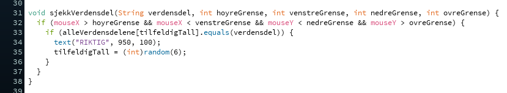

# Steg 10: Få poeng {.activity}
Til sist skal vi gi spilleren poeng hver gang riktig verdensdel blir trykka på. Siden vi hele tiden ønsker å få flere og flere poeng, så må vi lage en variabel som vi kan oppdatere når riktig verdensdel blir trykka på.

Variabelen skal være av typen `int` og kan for eksempel hete `poeng`.

## Gjør dette: {.check}
- [ ] Deklarer en variabel av typen `int` med navnet `poeng` sammen med de andre deklarasjonene du har skrevet i toppen av koden. Husk at du også her kan gi variabelen et annet navn dersom du vil.
- [ ] Sett variabelen til å være `0`. Det gjør du ved å skrive denne kodelinja inni `setup`-metoden:
```processing
    poeng = 0;
```
- [ ] Få poengene til å vises i vinduet ved å gjøre et metodekall på `text();`. Den første parameteren skal være først en passende tekst inni hermetegnene og deretter ` + poeng`. De to neste bestemmer du selv.  
- [] ] Test at koden fungerer så langt. Nå skal poengene vises på skjermen, men du vil forløpig ikke få flere poeng selv om du trykker på riktig verdensdel.
- [ ] Forsøk å skrive den neste kodelinja der du tror den skal være. Den gjør at hver gang programmet leser den, så bli verdien til `poeng` en større. Her er kodelinja:
```processing
    poeng = poeng + 1;
```
- [ ] Test om koden fungerer, dersom du har skrevet kodelinja på riktig plass, så skal du nå få poeng hver gang du trykker på riktig verdensdel.

Nå gjenstår bare å få minuspoeng når man trykker på feil verdensdel. Muntlig blir koden slik:

```processing
Dersom verdensdelen som er trekt tilfeldig er lik verdelsdelen fra stringen,
    Så viser vi teksten "RIKTIG" i vinduet.
    trekk et nytt tilfeldig tall
    få et poeng
ellers
    så skal vi få minus ett poeng
```

Vi har allerede de `if`-setningene som utfører sjekken, og vi har alt som skjer dersom vi trykker på riktig verdensdel. Det eneste som mangler er hva som skjer fra `ellers` og nedover.

Når vi skriver en `if`-setning, så kan vi alltid legge til en `ellers`, på engelsk `else`. Dersom vi legger til en `else` etter en `if`-setning, så vil koden inni `else` skje dersom testen i `if`-setningen er usann. Så dersom man trykker på riktig verdensdel, så får man poeng, ellers får man minuspoeng.

En `else` åpnes og stenges på samme måte som en `if`-setning, altså med krøllparenteser `{` og `}`.

## Gjør dette: {.check}
- [ ] Legg til en `else` rett etter at `if`-setningen som sjekker om verdensdelene er like er avslutta.
- [ ] Kodelinja som du brukte for å legge til et poeng, skal du nå bruke for å trekke fra et poeng. Alt du trenger å gjøre er å skrive `-` i steden for `+`. Skriv denne kodelinja inni `else`.
- [ ] Sjekk at koden kjører. Hva skjer? Får du et minuspoeng hver gang du trykker på feil verdensdel? Hva skjer når du trykker på riktig verdensdel, får du poeng?

Grunnen til at du får for mange minuspoeng er at du ikke rekker å slippe knappen på musepekeren før programmet har endre hvilken verdensdel du skal trykke på. Programmet kjører gjennom all koden din ca. 30 eller 60 ganger i sekundet. Det betyr at du må trykke veldig raskt for å ikke få minuspoeng for hver gang du trykker, selv om du trykker på riktig verdensdel. Du kan sjekke hvor raskt koden blir kjørt ved å gjøre et metodekall på `text();` og så sette det første parameteret til å være `frameRate`. Tallet som vises på skjermen er antall ganger koden blir kjørt i sekundet.

Vi kan fikse alle minuspoengene ved å gjøre et metodekall på `delay();`, denne tar som parameter antall millisekunder koden skal ta pause. Et sekund er det samme som 1000 millisekunder. Du må være veldig forsiktig med å bruke `delay();` i andre sammenhenger, fordi den pauser hele programmet, det betyr at absolutt ingenting blir sjekket så lenge programmet står og har pause.

## Gjør dette: {.check}
- [ ] Gjør et metodekall på `delay();` rett etter at du har avslutta `else`. La den ta 50 millisekunder som parameter.
- [ ] Test at koden kjører.
- [ ] Bytt til 5000 millisekunder og test programmet igjen. Hva skjer?
- [ ] Forsøk med andre tider og finn ut hva du synes er best.
- [ ] Dersom du ikke har gjort det allerede, så må du bytte bildet av verdenskartet tilbake til bildet uten firkanta grenser på.

Det var det! Nå har du et lite spill. Utvid spillet som du selv ønsker. Det er mange muligheter. Under finner du noen ekstraoppgaver som du kan gjøre dersom du har lyst.

Her er koden så langt. Husk at vår kode og din kode kan være forskjellig dersom du har valgt andre variabelnavn eller andre verdier enn det vi har. Det viktigste er at den fungerer!

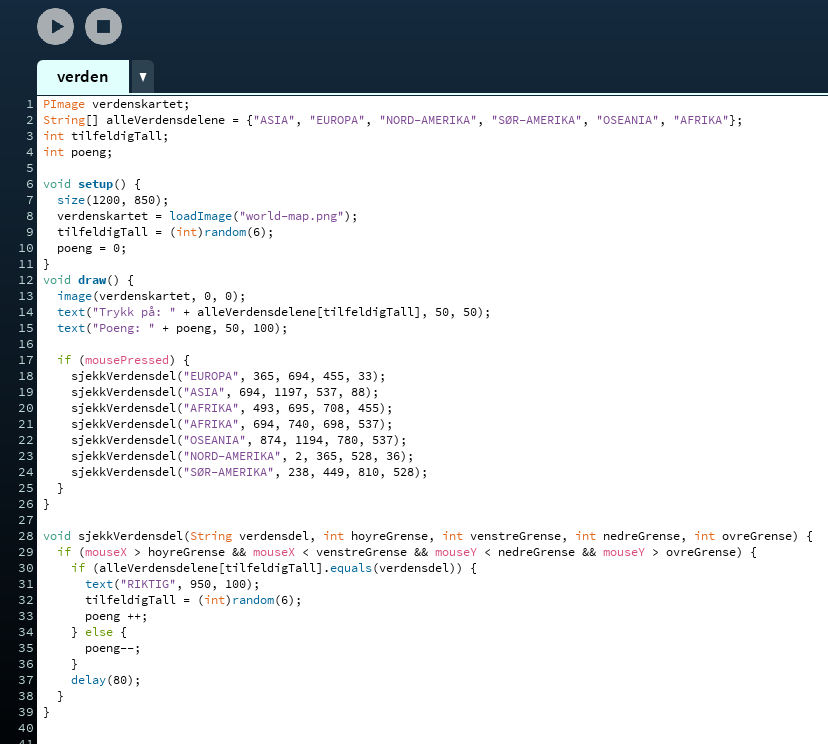

# Steg 11: Ekstra {.activity}
Dette er ekstraoppgaver som du kan gjøre dersom du vil.

## Prøv dette: {.check}
- [ ] Legg inn igjen tekst som viser hva koordinatene på musepekeren er.

## Forbedre verdenskartet: {.check}
- [ ] Finn koordinatene for tuppen av India og Sri Lanka og skriv kode som gjør at dette området også blir regnet med som Asia.
- [ ] Finn ut nøyaktig hvilke av øyene mellom Oseania og Asia som høyrer til hvor og fiks grensen mellom de to verdensdelene slik at den blir mer riktig.
- [ ] Skriv kode som gjør at Nord-Amerika ikke inkluderer den vestlige biten av Grønland, men fremdeles inkluderer alt av Nord-Amerika.
- [ ] Fiks koden slik at hele Grønland hører til Europa.


## Fylker i Norge: {.check}
- [ ] Bytt ut kartet over verden med et kart over Norge.
- [ ] Lag firkanter som du bruker til å skille fylkene i Norge.
- [ ] Skriv kode som sjekker om musepekeren er innenfor fylkene i Norge.

## Helt andre oppgaver: {.check}
- [ ] Finn et kart for Game of Thrones og lag spill hvor spilleren kan gjette hvor de forskjellige folkene hører hjemme.
- [ ] Finn et bilde av forskjellige dyr, lag en liste med navna på dyrene på engelsk, eller et helt annet språk. Lag grenser rundt dyrene og la spilleren gjette hva de forskjellige dyrene heter på forskjellige språk.
- [ ] Finn et bilde av en menneskekropp som er laga for undervisning, slik at man kan se hva som er inni, slik som hjertet, lungene, nyrene, ribbein, og lignende. Lag grenser rundt de forskjellige tingene og la spilleren gjette hvor de er.
