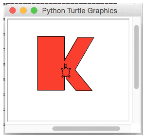

# Introduksjon
Her skal vi bruke det vi lærte i oppgaven [Skilpadder](../skilpadder/skilpadder.html)
til å skrive bokstaver og lagefigurer. Forsøk å bruke det du kan om vinkler til
å tenke deg frem til hvordan problemet må løses. Med litt trening kan du se for
deg i hodet hvordan resultatet kommer til å bli - før koden kjøres!

# Oppgave 1: Skriv navnet ditt {.activity}
- [ ] Bruk turtle-komandoene som `forward()`, `left()`, `right()`, `penup()` og
`pendown()` til å skrive navnet ditt i Python.

# Oppgave 2: Fylte bokstaver {.activity}
- [ ] Som neste utfordring skal du lage den første bokstaven i navnet ditt som en
fyllt bokstav. Her kan det være lurt å dele bokstaven opp i enkle figurer som
firkanter, trekanter og halvsirkler, og tegne én og én del.

# Oppgave 3: Figurer {.activity}
- [ ] Lek deg med ulike farger, og tegn et hus, en bil eller noe annet du har lyst
til å lage. Bruk fantasien!
