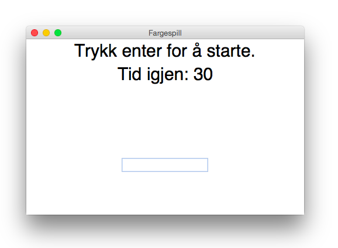

# Introduksjon

Hjernen vår lar seg lett lure, og det kan av og til være vanskelig for den å tolke forskjellig inntrykk samtidig. I det spillet vi nå skal lage  vil du både få testet hjernen og skrivehastigheten. Vi skal lage et fargespill!



# Steg 1: Klargjør og importerer bilioteker{.activity}
I dette spillet skal vi lage et grafisk brukergrensesnitt (et GUI). Til dette bruker vi et bibliotek som heter `tkinter`. Vi trenger også hjelp for å generere tilfeldige tall.

## Sjekkliste {.check}

+ Åpne IDLE, og lag en ny fil.
+ La oss importere bibliotekene. Skriv inn følgende kode:
  ```python
  import tkinter
  from random import randint
  ```
+ Vi vil etterhvert bruke boxtaver som *æøå*. For å gjøre dette må vi legge til noe øverst i koden vår. Gjør om koden din slik at den ser slik ut:

  ```python
  #!/usr/bin/python
  # -*- coding: UTF-8 -*-

  import tkinter
  from random import randint
  ```

## Kommentering av kode {.protip}
For å gjøre koden  lettere å forstå kan vi legge inn kommentarer som ikke påvirker programmet. Dette gjør vi ved å skrive inn tegnet `#`. All tekst som kommer på samme linje etter dette tegnet vil bli ignorert av datamaskinen, men er veldig fint for å hjelpe oss mennesker. Heretter bruker jeg dette for å forklare hva som skjer, du trenger ikke å skrive inn kommentarene hvis du ikke vil!

# Steg 2: Lage grafisk brukergrensesnitt {.activity}

Nå skal vi begynne på GUI. Les kommentarene for å forstå hva som skjer.

## Sjekkliste {.check}

+ Vi skal begynne med å lage hovedvinduet. Dette kaller vi `root` Vi tilkaller funksjoner fra `tkinter` biblioteket for å hjelpe oss med dette. Legg til dette nederst i koden:
  ```python
  root = tkinter.Tk()

  root.title("Fargespill")
  root.geometry("475x300")

  root.mainloop()
  ```
+ Nå har vi laget hovedvinduet. La oss legge til noen felter med tekst. Vi kommer tilbake til hva disse skal fylles med etterhvert, nå skal vi bare definere områdene. Gjør om koden din slik at den ser ut som dette:

  ```python
  #!/usr/bin/python
  # -*- coding: UTF-8 -*-

  import tkinter
  from random import randint

  root = tkinter.Tk()

  root.title("Fargespill")
  root.geometry("475x300")

  # Lager en label kalt instructions  med tekst:
  instructions = tkinter.Label(root,
                               text="Skriv inn fargen PÅ ordet, ikke selve ordet!",
                               font=('Helvetica', 15))
  instructions.pack()

  points_label = tkinter.Label(root,
                               text="Trykk enter for å starte.",
                               font=('Helvetica', 30))
  points_label.pack()

  label = tkinter.Label(root, font=('Helvetica', 100))
  label.pack()

  box = tkinter.Entry(root)

  root.mainloop()
  ```

## I koden over skjer det mye, la oss se på noen deler {.protip}

`tkinter.Label` lager et felt i vinduet vårt. I disse feltene kan vi putte blant annet tekst eller tall. `.pack` forteller programmet vårt at den skal "tegne" disse feltene slik at de synes for oss, og hvor den skal tegne de. `tkinter.Entry(root)` lager et tekstfelt som spilleren kan skrive i.

## Test prosjektet {.flag}
+ Kjør koden
+ Viser den et vindu?
+ Det er fortsatt ganske lite som skjer, la oss gå videre.

# Steg 3: Vi lager tidskontroll {.activity}
## Sjekkliste {.check}

+ Vi skal nå få programmet vårt til å telle 30 sekunder. Vi lager en funksjon `countdown()` som tar seg av dette. Legg til dette i programmet ditt:

  ```python
  def countdown():
      global time_left

      if time_left > 0:
          # Tell ned ett sekund
          time_left = time_left - 1
          time_label.config(text="Tid igjen: " + str(time_left))

          # Denne kjører automatisk countdown() igjen etter 1 sekund
          time_label.after(1000, countdown)
      else:
          time_label.pack_forget()
          label.pack_forget()
          box.pack_forget()
  ```
+ Denne funksjonen jobber på en global variabel `time_left`, vi må lage den. Programmet ditt skal nå se slik ut:

  ```python
  #!/usr/bin/python
  # -*- coding: UTF-8 -*-

  import tkinter
  from random import randint

  time_left = 30

  def countdown():
      global time_left

      if time_left > 0:
          time_left = time_left - 1
          time_label.config(text="Tid igjen: " + str(time_left))
          time_label.after(1000, countdown)
      else:
          time_label.pack_forget()
          label.pack_forget()
          box.pack_forget()

  root = tkinter.Tk()

  root.title("Fargespill")
  root.geometry("475x300")

  # Lager en label kalt instructions  med tekst:
  instructions = tkinter.Label(root,
                               text="Skriv inn fargen PÅ ordet, ikke selve ordet!",
                               font=('Helvetica', 15))
  instructions.pack()

  points_label = tkinter.Label(root,
                               text="Trykk enter for å starte.",
                               font=('Helvetica', 30))
  points_label.pack()


  label = tkinter.Label(root, font=('Helvetica', 100))
  label.pack()

  box = tkinter.Entry(root)

  root.mainloop()
  ```

# Steg 4: Definere fargene. {.activity}

Nå må vi definere fargene som programmet skal bruke.

## Sjekkliste {.check}

+ Fargene legger vi til som en liste. Legg til denne koden under `from random import randint`
  ```python
  colours_eng = ['Red', 'Blue', 'Green', 'Pink', 'Black',
                 'Yellow', 'Orange', 'Purple', 'Brown']
  ```
+ Siden vi vil at programmet vårt skal skrive ut de norske ordene, lager vi en liste til, med de norske navnene. Legg til dette rett under den andre listen.
  ```python
  colours = ['Rød', 'Blå', 'Grønn', 'Rosa', 'Svart',
             'Gul', 'Oransje', 'Lilla', 'Brun']
  ```
+ Vi må også lage en variabel for å holde orden på hvor mange poeng spilleren har. Samt en variabel for å holde nummeret på  fargene som skal vises. Disse settes til tilfeldig tall etterpå. Legg til disse over `time_left`-variabelen.
  ```python
  # Brukes til å velge tilfeldig farge
  colour = 0
  points = 0

  ```
+ Nå må vi lage funksjonen som genererer en tilfeldig farge og viser denne til spilleren. Her er det mye som skjer, så vi skal ta det stegvis. Først definerer vi funksjonen og legger til variablene. Legg denne funksjonen over `countdown()`:

  ```python
  def next_color():
      # Henter inn globale variabler:
      global points
      global colour
  ```

+ Så skal vi sette tekstboxen brukeren kan skrive i aktiv hvis det er tid igjen på klokka. Legg til denne inne i `next_color()`:

  ```python
  if time_left > 0:
      box.focus_set()
  ```

+ Så vil vi sammenligne det brukeren skriver inn i boxen med den norske fargelisten vår. `.lower()` gjør om alt til små bokstaver, slik at man ikke får feil om man skriver "Rød" i steden for "rød". Legg til dette under:

  ```python
  # Hvis det spilleren skrev er riktig farge.
  if box.get().lower() == colours[colour].lower():
      # Pluss på ett points
      points = points + 1
  ```
+ Nå vil vi slette det som brukeren skrev inn. Slik at alt er klart for neste runde. Legg til dette under `points = points + 1`:
  ```python
  box.delete(0, tkinter.END)
  ```
+ Nå skal vi få tkinter til å displaye farge og tekst. Til dette bruker vi `randint()` funksjonen. Den lager et tilfeldig tall mellom to ytterpunkter. Lag denne under `box.delete(0, tkinter.END)`

  ```python
  # Lager tilfeldig tall mellom 0 og 8
  colour = randint(0, len(colours)-1)

  # Lager tilfeldig tall til teksten.
  text = randint(0, len(colours)-1)
  ```
+ Nå gjenstår det bare å vise teksten og fargen i vinduet. Vi oppdaterer feltene, og legger til en poenglabel.  Funksjonen skal nå se slik ut:

  ```python
  def next_color():
      global points
      global colour

      if time_left > 0:
          box.focus_set()

      if box.get().lower() == colours[colour].lower():
          points = points + 1

      box.delete(0, tkinter.END)

      colour = randint(0, len(colours)-1)
      text = randint(0, len(colours)-1)

      # Oppdaterer labels
      label.config(fg=str(colours_eng[colour]), text=str(colours[text]))
      points_label.config(text="Poeng: " + str(points))
  ```

## Test prosjektet {.flag}
+ Kjør koden, får du noen feilmeldinger?
+ Hvis du får feilmeldinger prøv å se etter hvor de er og fiks de.

# Steg 5: La oss starte programmet! {.activity}
Det skjer fortsatt lite i spillet vårt, men det er fordi vi ikke har startet selve spilldelen. Det skal vi gjøre nå!

## Sjekkliste {.check}

+ Vi lager en funksjon som starter spillet. Legg til denne funksjonen i programmet:

  ```python
  def start_game(event):
      if time_left == 30:
          countdown()
      next_color()
  ```
+ Siste steg er å kjøre denne funksjonen når spilleren trykker *enter*. Legg til dette rett over `root.mainloop`:

  ```python
  # Kjører funksjonen start_game() når enter trykkes
  root.bind('<Return>', start_game)
  box.pack()
  box.focus_set()
  ```
+ Programmet ditt skal nå se slik ut:

  ```python
  #!/usr/bin/python
  # -*- coding: UTF-8 -*-

  import tkinter
  from random import randint


  colours_eng = ['Red', 'Blue', 'Green', 'Pink', 'Black',
                 'Yellow', 'Orange', 'Purple', 'Brown']
  colours = ['Rød', 'Blå', 'Grønn', 'Rosa', 'Svart',
             'Gul', 'Oransje', 'Lilla', 'Brun']
  colour = 0

  points = 0

  time_left = 30


  def start_game(event):
      if time_left == 30:
          countdown()
      next_color()


  def next_color():
      global points
      global colour

      if time_left > 0:
          box.focus_set()

      if box.get().lower() == colours[colour].lower():
          points = points + 1

      box.delete(0, tkinter.END)

      colour = randint(0, len(colours)-1)
      text = randint(0, len(colours)-1)

      label.config(fg=str(colours_eng[colour]), text=str(colours[text]))
      points_label.config(text="Poeng: " + str(points))


  def countdown():
      global time_left

      if time_left > 0:
          time_left = time_left - 1
          time_label.config(text="Tid igjen: " + str(time_left))
          time_label.after(1000, countdown)
      else:
          time_label.pack_forget()
          label.pack_forget()
          box.pack_forget()


  root = tkinter.Tk()

  root.title("Fargespill")
  root.geometry("475x300")

  instructions = tkinter.Label(root,
                               text="Skriv inn fargen PÅ ordet, ikke selve ordet!",
                               font=('Helvetica', 15))
  instructions.pack()

  points_label = tkinter.Label(root,
                               text="Trykk enter for å starte.",
                               font=('Helvetica', 30))
  points_label.pack()

  time_label = tkinter.Label(root,
                             text="Tid igjen: " + str(time_left),
                             font=('Helvetica', 30))
  time_label.pack()

  label = tkinter.Label(root, font=('Helvetica', 100))
  label.pack()

  box = tkinter.Entry(root)

  root.bind('<Return>', start_game)
  box.pack()
  box.focus_set()

  root.mainloop()
  ```

## Test prosjektet {.flag}
+ Starter spillet og countdownen når du trykker enter?
+ Får du ny farge etter du har skrevet inn svar?
+ Får du +1 points når du skriver riktig farge på ordet?
+ Slutter programmet etter 30 sek?
