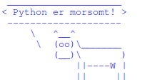
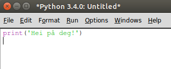
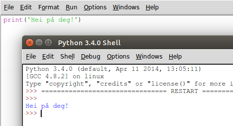

# Introduksjon {.intro}

I dette kurset skal vi introdusere programmeringsspråket Python. Dette
er et veldig populært programmeringsspråk som kan brukes til det
meste. Python brukes av mange av de største og mest kjente selskapene
i verden som for eksempel Google, NASA, CERN og andre.

Vi begynner ganske enkelt med å se på hvordan vi kan lage små
programmer i Python som kan lese og vise tekst. Spesielt vil vi lage
vår egen versjon av et historisk program som heter `Cowsay`
([http://www.cowsays.com/](http://www.cowsays.com/)) hvor en smart ku
sprer sin visdom.



# Steg 1: Hei Verden {.activity}

For å sjekke at Python virker som det skal begynner vi med å lage et
kjempeenkelt program. Vi vil bare skrive en enkel hilsen på skjermen.

## Sjekkliste {.check}

+ Åpne IDLE, editoren som følger med Python. Vi vil bruke denne til å
  både skrive og kjøre programmene vi skriver.

  **Windows**: Åpne IDLE fra startmenyen.

  **Mac**: Åpne terminal.app, skriv `idle` og trykk enter.

  **Linux**: Åpne en terminal, skriv `idle` og trykk enter.

  Dette vil åpne et vindu som heter `Python Shell`. Hvis du ikke
  finner IDLE, eller vinduet ikke åpner seg kan det være fordi
  Python ikke er installert. I såfall kan du laste ned siste versjon
  fra [http://www.python.org/](http://www.python.org/). Spør gjerne
  om hjelp til dette om nødvendig.

+ Vinduet `Python Shell` som åpnet seg er der du vil se resultatet av
  programmet ditt. For å skrive et nytt program må vi åpne et
  programmeringsvindu i tillegg. I menyen, velg `File > New File`. Pass på at begge vinduene er synlige.

+ I dette nye vinduet skal vi nå skrive vårt første Python-program.
  Skriv følgende:

  

+ Vi skal nå lagre og kjøre dette programmet. Velg først `File >
  Save`, og gi programmet ditt navnet `hei.py`. Deretter kan du kjøre
  programmet ved å klikke `Run > Run Module`. Du skal nå se at Python
  skriver en liten hilsen i det første vinduet.

  

  Gratulerer! Du har nå skrevet og kjørt ditt første Python-program!

### Feilmeldinger {.protip}

Python krever at du er veldig nøyaktig når du programmerer, og hvis du
skriver noe Python ikke forstår vil den skrive en feilmelding til deg
når du velger `Run > Run Module`. Du har kanskje allerede opplevd
dette! Hvis ikke kan du prøve å bytte ut `print` med `pint` i koden
din, og prøve å kjøre programmet en gang til.

Når du får en feilmelding må du gå tilbake til koden, og sjekke ekstra
nøye at du har skrevet alt riktig. Dette vil bli enklere etterhvert
som du får mer trening i å programmere.

## Sjekkliste {.check}

+ Vårt første program bestod av bare en kommando, nemlig funksjonen
`print` som brukes for å fortelle Python at vi vil skrive noe ut på
skjermen. Det vi vil skrive til skjermen putter vi inn i paranteser.
I dette tilfellet ville vi at Python skulle skrive teksten `Hei på
deg!`. For å fortelle Python at `Hei på deg!` skal tolkes som ren
tekst og ikke som en Python-kommando må vi skrive teksten mellom
fnutter, `'`.

+ Vi kan enkelt endre på hva Python skriver til skjermen. Prøv å endre
  programmet ditt til det følgende:

  ```python
  print('Hei alle sammen!')
  ```

  Lagre filen på nytt, og kjør programmet.

+ Prøv å endre teksten til noe du finner på selv, og kjør programmet
  igjen!

### Python-filer {.protip}

Vi har nettopp lagd et Python-program som heter `hei` og som vi har
lagret i en vanlig tekstfil som heter `hei.py`. Python kaller en slik
tekstfil for en `module`. Du kan selv bestemme hva du vil kalle
Python-programmene dine, men filene hvor du lagrer programmene må ha
etternavnet `.py` for at Python skal kjenne dem igjen.

Det er også en god ide å unngå å bruke norske tegn som `æ`, `ø` og
`å`, samt mellomrom i programnavnet. I stedet for mellomrom kan du
bruke understrek, `_`, for eksempel `mitt_program.py`.

# Steg 2: Hva heter du? {.activity}

Vi skal nå se hvordan vi kan få Python til å stille oss spørsmål. For
å gjøre dette bruker vi en ny funksjon som heter `input`.

Når du bruker funksjonen `input`, venter datamaskinen din med å kjøre
resten av programmet til du har skrevet noe og trykket på enter-tasten
på tastaturet.

## Sjekkliste {.check}

+ Endre programmet ditt slik at det nå ser slik ut:

  ```python
  navn = input('Hva heter du? ')
  print('Hei ' + navn)
  ```

  Lagre og kjør programmet. Skriv inn navnet ditt når du blir spurt
  om det, og trykk enter-tasten. Hilser Python deg med navn?

+ For at teksten skal se bra ut må du passe på at du bruker
  mellomrom. Det ser best ut med et mellomrom mellom `?` og `'` i
  input-funksjonen, og også et mellomrom mellom `Hei` og `'` i
  print-funksjonen.

+ Legg merke til at i programmet bruker vi en variabel `navn` som
  husker navnet du skriver inn. Slike variabler bruker vi hele tiden
  når vi programmerer. Variabler lages automatisk når vi bruker `=`.
  Du kan selv bestemme hva variablene skal hete, og det er lurt å
  velge navn som beskriver det variabelen skal huske for deg.

+ Prøv å legg inn flere linjer i programmet ditt. Kanskje Python kan
  spørre deg hvor du bor, hvem som er bestevennen din eller kanskje
  hva som er favorittfargen din? Bruk variabler for å huske disse
  tingene slik at Python kan skrive dem tilbake på skjermen etterpå.

### Hurtigtaster {.protip}

Når vi programmerer kan det være greit å slippe å lete inne i menyen
for å lagre og kjøre programmene. I stedet kan vi bruke hurtigtaster.
Hvis du ser etter vil du se i menyen at til høyre for kommandoene står
hurtigtastene listet opp. For eksempel kan du trykke `Ctrl` og `S` for
å lagre (`Cmd` og `S` på Mac) eller `F5` for å kjøre programmet (`Fn`
og `F5` på Mac).

# Steg 3: Kuprat {.activity}

La oss lage en enkel versjon av et klassisk program som heter Cowsay
([http://www.cowsays.com/](http://www.cowsays.com)), og som ble laget
av Tony Monroe. Med dette programmet kan man få en stilig ku til å si
omtrent hva som helst.

## Sjekkliste {.check}

+ Vi begynner med å tegne kua. Start et nytt IDLE-vindu ved å velge
  `File > New File`. Skriv inn følgende
  program:

  ```python
  print('^__^')
  print('(oo)\_______')
  print('(__)\       )')
  print('    ||----W |')
  print('    ||     ||')
  ```

  Lagre programmet som `kuprat.py` og kjør det. En ganske stilig ku!

+ Men nå må vi få kua til å si noe. Legg til og endre kodelinjene dine
  slik at dette ser bra ut:

  ```python
  print(' ____________________')
  print('< Python er morsomt! >')
  print(' --------------------')
  print('     \   ^__^')
  print('      \  (oo)\_______')
  print('         (__)\       )')
  print('             ||----W |')
  print('             ||     ||')
  ```

+ Nå kan vi bruke det vi har lært tidligere for å enkelt endre på
  meldingene som kua sier. Ved hjelp av `input` kan vi spørre om hva
  kua skal si. Endre programmet slik at det ser ut som følger:

  ```python
  melding = input('Hva skal kua si? ')

  print(' ____________________')
  print('< ' + melding + ' >')
  print(' --------------------')
  print('     \   ^__^')
  print('      \  (oo)\_______')
  print('         (__)\       )')
  print('             ||----W |')
  print('             ||     ||')
  ```

+ Hvordan virker programmet når du kjører det nå? Prøv med
  forskjellige tekster. Ser du et problem?

+ Snakkeboblen til kua er ikke tilpasset lengden av meldingen, slik at
  av og til blir snakkeboblen for stor og av og til blir den for
  liten. For å fikse dette skal vi bruke en ny funksjon som heter
  `len` (`len` er en forkortelse for *length* som betyr lengde). Denne
  kan finne lengden til en tekst. For å teste denne funksjonen, prøv å
  legge inn denne linjen rett etter `input`-linjen i programmet ditt:

  ```python
  print(len(melding))
  ```

  Dette vil skrive ut lengden av meldingen før kua skrives ut.

+ Vi kan bruke denne lengden av meldingen til å regne ut hvor lang
  snakkeboblen må være. Siden vi har mellomrom på begge sider av
  meldingen bør snakkeboblen være 2 tegn lengre enn meldingen.

  ```python
  boblelengde = len(melding) + 2
  ```

+ For å tegne snakkeboblen kan vi bruke et Pythontriks som kan
  repetere tekst. Vi har allerede sett at vi kan sette sammen tekst
  ved å bruke `+`, for eksempel `'Hei ' + navn`. For å repetere tekst
  kan vi gange den med et tall. For eksempel vil `'hei' * 3` bli til
  `'heiheihei'`. Vi kan derfor gange `'-'` med snakkeboblelengden for
  å tegne snakkeboblen i riktig størrelse.

+ Endre programmet ditt slik at det blir seende ut som følger:

  ```python
  melding = input('Hva skal kua si? ')
  boblelengde = len(melding) + 2

  print(' ' + '_' * boblelengde)
  print('< ' + melding + ' >')
  print(' ' + '-' * boblelengde)
  print('     \   ^__^')
  print('      \  (oo)\_______')
  print('         (__)\       )')
  print('             ||----W |')
  print('             ||     ||')
  ```

  Lagre og kjør programmet. Blir snakkeboblen riktig størrelse?

### Prøv selv {.try}

Kan du tegne andre dyr eller figurer som også kan snakke? Prøv
eventuelt å gjøre små endringer på utseendet til kua, for eksempel kan
du forandre øynene (med `--` vil det se ut som om den sover) eller
kanskje legge til en tunge?

Du kan også legge til flere forskjellige figurer i samme program, slik
at det virker som om de snakker sammen. Prøv deg fram!
