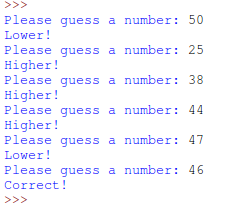

# Gjett eit tal! {.intro}

I denne oppgåva skal du lage eit spel som kallast gjetteleik. Det er meininga at
du skal skrive all koden sjølv, men sjølvsagt får du nokre hint.

Spelet er som følgjer:

1. Programmet finn eit tilfeldig tal mellom 1 og 100.

2. Spelaren gjettar eit tal mellom 1 og 100.

3. Programmet skriv ut:

  - `Høgare!` viss talet var for lågt.

  - `Lågare!` viss talet var for høgt.

  - Viss brukaren gjettar riktig tal skal programmet skrive ut `Korrekt!` og
    avslutte.

4. Så lenge spelaren ikkje har gjetta riktig tal, så må programmet spørje om eit
  nytt tal (brukaren har uendeleg mange forsøk).

Slik ser det ut når programmet køyrer:




# Klar, ferdig, programmer! {.activity}

No er det berre å setje i gang! Pass på at du forstår korleis spelet fungerer
før du startar å programmere! Her er nokre hint for å hjelpe deg på veg:

## randint() {.protip}

For å generere tilfeldige tal kan det vere lurt å bruke funksjonen `randint()`.
For å bruke `randint()`, må me importere funksjonen:

```python
from random import randint
```

Kva gjer desse funksjonskalla?

* `randint(1, 100)`

* `randint(1000, 1000000)`

* `randint(101, 102)`

## int() {.protip}

Når ein får input frå spelaren får ein ein *tekststreng*, sjølv om brukaren
skreiv inn eit tal. Då kan det vere greitt å kunne konvertere teksten til eit
tal, ved hjelp av `int()`.

Kva er skilnaden på desse kodesnuttane? Køyr koden og test sjølv!

```python
tal = input("Skriv eit tal: ")
svar = 3 + tal
print(svar)
```

```python
tal = int(input("Skriv eit tal: "))
svar = 3 + tal
print(svar)
```

## Kontrollstrukturar {.protip}

Kva slags kontrollstrukturar treng du?

Døme på kontrollstrukturar er `for`-løkker, `while`-løkker og
`if-elif-else`-uttrykk.

- Me brukar `for`-løkker når me vil gjere noko mange gonger.

  __Døme:__

  ```python
  # skriv ut ti tal
  for i in range(10):
      print('variabelen i er: ' + str(i))
  ```

- Me brukar `while`-løkker når me vil gjere noko heilt til ein variabel endrar
  seg.

  __Døme:__

  ```python
  a = 0
  # så lenge variabelen `a` ikkje er lik `10`
  while a != 10:
       print(a)
       a = a + 1
  ```

  Prøv å sjå kva som skjer viss du ikkje tek med linja `a = a + 1`.

- Me kan bruke `if-elif-else`-uttrykk for å bestemme om me skal køyre ein
  spesiell kode.

  __Døme:__

  ```python
  a = 1
  if a == 2:
    print('a er 2')
  elif a == 3:
    print('a er 3')
  else:
    print('a er ikkje 2 og ikkje 3')
  ```

  Prøv å endre verdien `a` på toppen til `2` eller `3` og sjå kva som skjer.


# Test programmet ditt {.activity}

- [ ] Fungerer det slik som i beskrivinga i starten av oppgåva? Viss ikkje må du
  rette feila dine.

## 7 forsøk {.challenge}

- [ ] Sidan me berre har tal mellom 1 og 100 kan me alltid gjette talet på 7
  forsøk eller betre. Klarar du det sjølv?

## Avgrens spelaren sine forsøk {.challenge}

- [ ] Til no har brukaren hatt uendeleg mange forsøk. Klarar du å skrive om
  koden din slik at brukaren berre får 12 forsøk?
