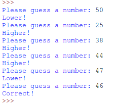

# Gjett et tall!  {.intro}

I denne oppgaven skal du lage en spill som kalles gjetteleken. Det er meningen at du i denne oppgaven skal skrive all koden selv, ved hjelp av litt hint.

Spillet er som følger:

1. Programmet finner et tilfeldig tall mellom 1 og 100
1. Brukeren gjetter et tall mellom 1 og 100.
2. Programmet skriver ut:
  * `Higher!` hvis tallet var for lavt.
  * `Lower!` hvis tallet var for høyt.
  *  Hvis brukeren gjetter riktig tall skal programmet skrive ut `Correct!` og avslutte.
3. Så lenge brukeren ikke har gjettet tallet, så må programmet spørre om et nytt tall (brukeren har uendelig mange forsøk).


Slik ser det ut når programmet kjører:



# Klar, ferdig, programmer! {.activity}

Nå er det bare å sette i gang! Pass på at du forstår hvordan spillet fungerer før du begynner å programmere! Her er noen hint for å hjelpe deg på vei:

## randint() {.protip}

For å generere tilfelige tall kan det være lurt å bruke funksjonen `randint()`.
For å bruke `randint()`, må vi importere funksjonen:

```python
from random import randint
```

Hva gjør disse funksjonskallene?

* `randint(1, 100)`
* `randint(1000, 1000000)`
* `randint(101, 102)`

## int() {.protip}

Når man får input fra brukeren får man en *tekststreng*, selv om brukeren skrev et tall, da kan det være greit å kunne konvertere teksten til et tall, ved hjelp av `int()`.

Hva er forskjellen på disse kodesnuttene? (Kjør koden og test selv!)
```python
tall = input("Skriv et tall: ")
svar = 3 + tall
print(svar)
```

```python
tall = int(input("Skriv et tall: "))
svar = 3 + tall
print(svar)
```

## Kontrollstrukturer {.protip}

Hva slags kontrollstrukturer trenger du?

Eksempel på kontrollstrukturer er `for`-løkker, `while`-løkker og `if-elif-else`-uttrykk.

- `for`-løkker bruker vi når vi vil gjøre noe mange ganger.

  **Eksempel:**
  ```python
  # skriv ut ti tall
  for i in range(10):
      print('variabelen i er: ' + str(i))
  ```

- `while`-løkker brukes når vi vil gjøre noe mange ganger inntil en variabel
  endrer seg.

  **Eksempel:**
  ```python
   a = 0
   # så lenge variablen `a` ikke er lik `10`
   while a != 10:
       print(a)
       a = a + 1
  ```

  Prøv å se hva som skjer dersom du ikke tar med linjen `a = a + 1`.

- `if-elif-else`-uttrykk kan bestemme om vi skal kjøre en spesiell kode.

  **Eksempel:**
  ```python
  a = 1
  if a == 2:
    print('a er 2')
  elif a == 3:
    print('a er 3')
  else:
    print('a er ikke 2 og ikke 3')
  ```

  Prøv å endre verdien `a` på toppen til `2` eller `3` og se hva som skjer.


# Test programmet ditt {.activity}

Fungerer det slik som i beskrivelsen i begynnelsen av oppgaven? Hvis ikke må du rette feilene dine.

## 7 forsøk {.challenge}

Ettersom vi bare har tall mellom 1 og 100 kan vi alltid gjette tallet på 7 forsøk eller bedre. Klarer du dette selv?

## Begrense brukerens forsøk {.challenge}

Til nå har brukeren hatt uendelig mange forsøk. Klarer du å skrive om koden din slik at brukeren bare får 12 forsøk?
