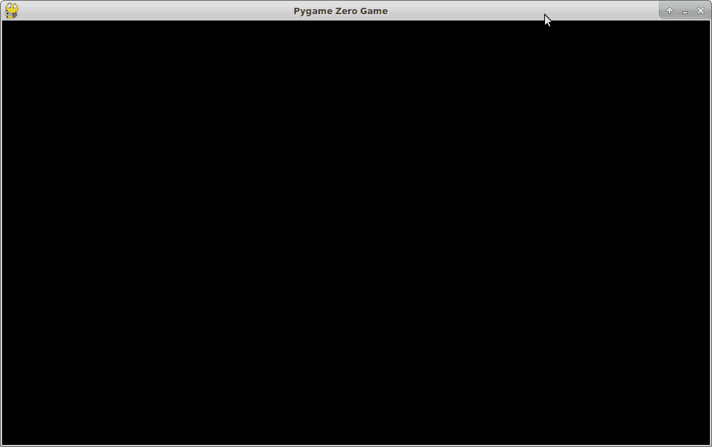
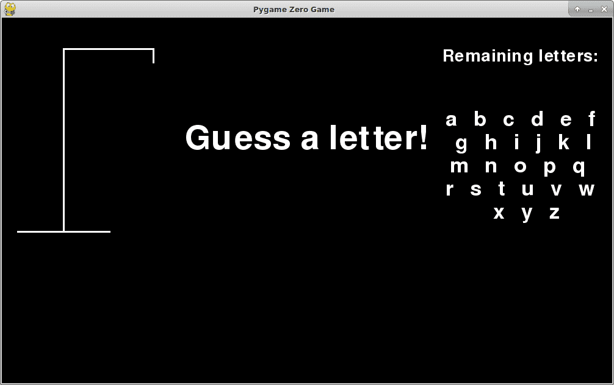
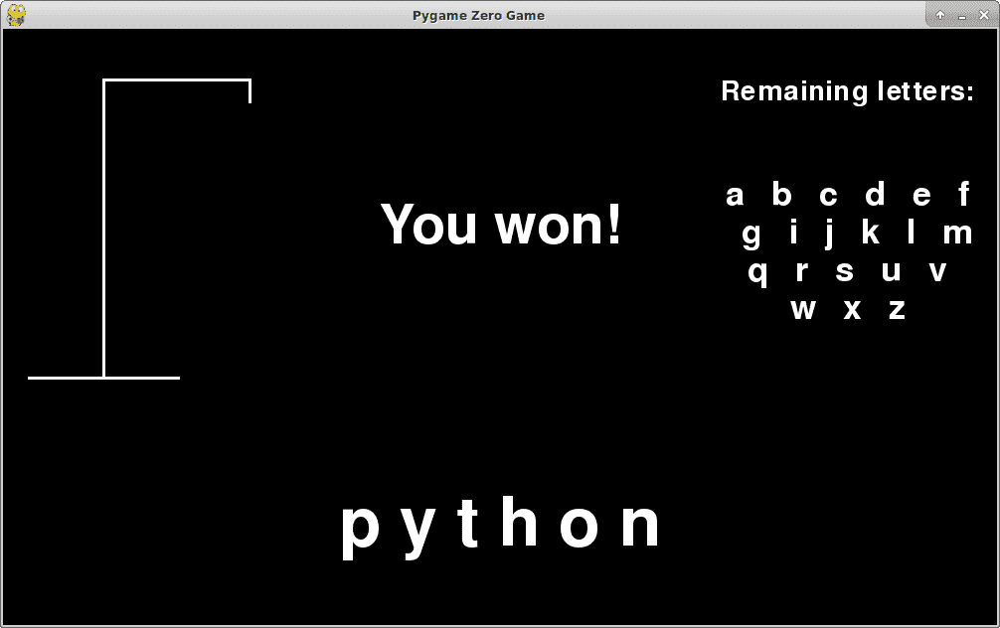
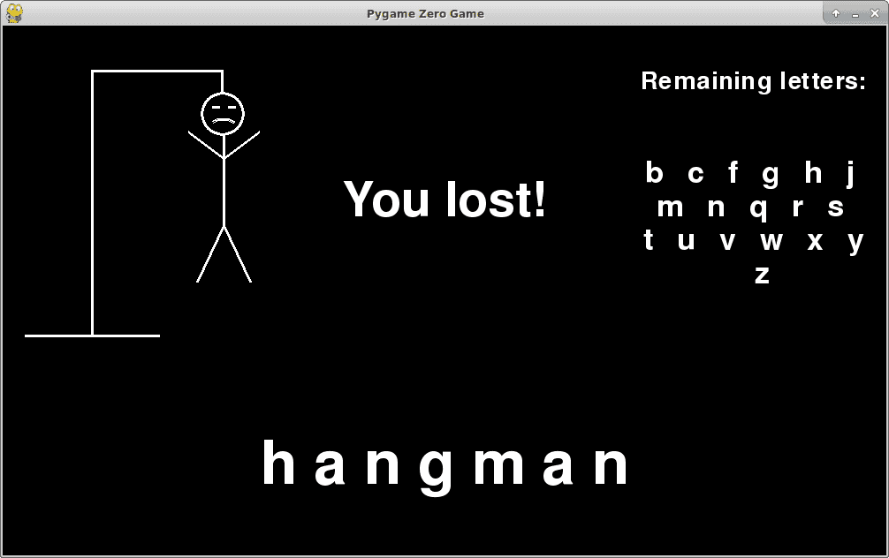

# Introduksjon {.intro}

I denne oppgaven skal vi lage vårt eget hangman-spill.  Vi har laget litt
ferdigskrevet kode for å hjelpe deg på vei. Den kan du [laste ned
her](./hangman.py). Lagre den der du pleier å lagre Python-koden din.

Det kan se ut som mye kode, men det bare den øverste delen du skal endre på. Et
lite stykke ned vil det være en overskrift som ser slik ut:

```python
###############################################################################
# Library code
###############################################################################
```

All koden under denne overskriften kan du bare overse. Dette er koden som
hjelper deg med å tegne figurer og hente input fra brukeren.

I koden over overskriften har vi laget noen variabler:

* `TRIES` som angir hvor mange forsøk brukeren har. Ettersom det bare er
  tegnet figurer for 7 feil, så er det lurt å la denne være slik den er.

* `WORDS` er en liste over ord som kan gjettes, men ingen av disse ordene kan
  inneholde æ, ø eller å.

* `state` er en ordbok som inneholder spillets tilstand.

Vi har begynt å lage fire funksjoner for deg. Disse skal du gi innhold i steg 1 til 4.

# Steg 0: Test at alt fungerer {.activity}

Ved å kjøre kommandoen

```sh
pgzrun hangman.py
```

skal du få opp et vindu som ser slik ut:



# {.tip}

Dersom du ikke får opp et vindu som beskrevet over, pass på at du har
installert Python på riktig måte, lastet ned
[hangman.py](./hangman.py) og er i samme mappe som fila.

Dersom du fremdeles sitter fast bør du snakke med en veileder.

# Steg 1: Lage det hemmelige ordet {.activity}

Nå skal vi skrive koden som skal kjøres når `create_display_string()` kalles.
Denne funksjonen har to parametere - `secret_word` (det hemmelige ordet) og
`remaining_letters` (en liste med de bokstavene brukeren ikke har gjettet).

Her er et eksempel på hvordan funksjonen kan fungere:

```python
>>> remaining_letters =['b', 'c', 'd', 'e', 'f', 'g', 'h', 'i', 'j', 'k', 'l',
                        'm', 'n', 'o', 'p', 'q', 'r', 's', 't', 'u', 'v', 'w',
                        'x', 'y', 'z'] # alle bokstaver fra b til z
>>> secret_word = 'banan'
>>> create_display_string(secret_word, remaining_letters)
'_ a _ a _'
>>> remaining_letters.remove('b')
>>> create_display_string(secret_word, remaining_letters)
'b a _ a _'
>>> create_display_string(secret_word, [])
'b a n a n'
```

Her er alle bokstaver i `secret_word` som også er i `remaining_letters`
erstatte med `_`. Vi har også lagt inn et mellomrom mellom hvert tegn.

For å lage denne funksjonen trenger vi noen av tekstfunksjonene vi lærte i
[Tekst ABC](../tekst_abc/tekst_abc.html). Dersom du ikke husker disse kan det
være lurt å gå tilbake og lese igjennom alle de gule boksene i oppgaven.

Du skal nå skrive kode i funksjonen. Dette må du gjøre:

* For å konvertere `secret_word` til ei liste må du bruke funksjonen `list()`.
  Du kan gi en streng som argument til `list()`, også returneres en liste av
  bokstaver.

  ```python
  >>> list("ord")
  ['o', 'r', 'd']
  ```

* Slå sammen bokstavene til en streng igjen, med ett mellomrom mellom hver
  bokstav.

  **Hint:** `s.join(lst)`

* Bytt ut hver bokstav som er i det nye ordet vårt og i `remaining_letters`
  med `_`, slik som i eksempelet over.

  **Hint:** `s.replace()`

* Husk å returnere det hemmelige ordet.

# Steg 2: Å starte spillet {.activity}

Nå skal vi kode funksjonen `start_game()`. Denne funksjonen lager
nøkkel/verdi-parene i `state`. Dersom du ikke husker hvordan ordbøker fungerer
kan det være lurt å repetere [oppgaven om ordbøker](../ordboeker/ordboeker.html).

Nøklene i `state` er som følger:

* `"running"` forteller hjelpefunksjonene om spillet kjører
* `"used_tries"` er hvor mange forsøk brukeren har brukt
* `"secret_word"` er det ordet brukeren skal gjette
* `"pressed_button"` er den siste knappen som ble trykket av brukeren
* `"help_text"` er hjelpetekst for brukeren, som forklarer hva brukeren skal
  gjøre
* `"remaining_letters"` er en liste over de bokstavene brukeren ikke har
  gjettet
* `"display_string"` er det ordet som vises til brukeren (etter at vi har satt
  inn `_`).


Dette må du gjøre:

* Lag følgende nøkkel/verdi-par:

  * Nøkkel: `"running"` Verdi: `True`
  * Nøkkel: `"used_tries"` Verdi: `0`
  * Nøkkel: `"pressed_button"` Verdi: `""` (En tom streng)
  * Nøkkel: `"help_text"` Verdi: `"Guess a letter!"`

* For å velge et tilfeldig ord skal vi bruke `random.choice()`. Ved å gi denne
  funksjonen en liste som argument returneres et tilfeldig element i lista.

  * Gi `WORDS` som argument og bruk det returnerte ordet som verdien som
    tilhører nøkkelen `"secret_word"`.

* Vi skal nå lage lista over bokstaver som brukeren ikke har gjettet. For å
  gjøre dette bruker vi de 26 første bokstavene i `string.ascii_letters`, og
  legger disse til lista.

  * La den tilhørende verdien til `"remaining_letters"` være en tom liste.
  * Bruk `enumerate()` og gå igjennom de 26 første bokstavene i
    `string.ascii_letters`, og legg disse til `state["remaining_letters"]`.

    **Hint:** Bruk `lst.append(elm)`
* For å lage verdien som hører til `"display_string"` må vi bruke funksjonen
  vi lagde i [steg 1](#steg-1-lage-det-hemmelige-ordet). Hvilke to argumenter
  skal vi gi til funksjonen?

## Test spillet ditt {.flag}

Lagre endringene dine i `hangman.py`, og kjør spillet ditt:

```sh
pgzrun hangman.py
```

Du skal nå få opp et vindu som ser slik ut:



# Steg 3: Å avslutte spillet {.activity}

I funksjonen `game_over()` skal vi endre `state` slik at både bruker og
hjelpefunksjoner får beskjed om at spillet er over.

Dette må du gjøre:

* Endre `state["running"]` til `False`.

* Endre verdien til `state["display_string"]` slik at brukeren kan se løsningen, selv
  om brukeren ikke har vunnet.  Dette kan du gjøre ved hjelp av funksjonen fra
  [steg 1](#steg-1-lage-det-hemmelige-ordet).

  **Hint:** Hva skal listen vi gir som argument inneholde når vi ønsker å
  vise alle bokstavene?

# Steg 4: main() {.activity}

I dette steget skal vi skrive hovedfunksjonaliteten til spillet. Vi skal skrive
koden i `main()`, som kjøres hver gang spillet oppdateres. Her skal vi finne ut
hvilken bokstav brukeren trykket på, og så sjekke om den bokstaven er inneholdt
i ordet vårt. Vi må også oppdatere antall brukte forsøk, og til slutt sjekke om
brukeren har brukt opp alle forsøkene sine eller om han har gjettet riktig ord.

Dette må du gjøre:

* Du finner bokstaven brukeren trykket på i `state["pressed_button"]`. Det kan
  være lurt å lagre denne i en egen variabel, så du slipper å skrive
  `state["pressed_button"]` mange ganger.

* Dersom bokstaven finnes i `state["remaining_letters"]`, må programmet gjøre
  det følgende:

  * Fjern bokstaven fra lista
  * Dersom bokstaven finnes i det hemmelige ordet vårt må du oppdatere
    `state["display_string"]`, hvis ikke har brukeren brukt opp ett forsøk,
    og du må legge til en til `state["used_tries"]`.

* Sjekk om brukeren har brukt opp alle forsøkene sine. Dersom det er tilfelle
  må du endre på `state["help_text"]` til `"You lost!"`. Til slutt må du kalle
  funksjonen `game_over()`.

  **Hint:** Sjekk om `state["used_tries"]` er større eller lik `TRIES`.

* Vi må også sjekke om brukeren har gjettet ordet. En måte dette kan gjøres på
  er å sjekke hvor mange `"_"` det er i `state["display_string"]`. Bruk
  `s.count("_")` for å telle antall understreker. Dersom det ikke er flere
  understreker har brukeren vunnet spillet, og du må da endre
  `state["help_text"]` til `"You won!"` og kalle `game_over()`.

## Test spillet ditt {.flag}

Lagre endringene dine i `hangman.py`, og kjør spillet ditt:

```sh
pgzrun hangman.py
```

Spillet skal nå fungere fullt og helt. Nå er det noen ting vi må teste:

* Slik kan det se ut når spilleren vinner.

  

* Når spilleren taper kan det se ut omtrent som i bildet under. Pass på det
  følgende:
  * Det skal ikke være mulig å taste inn flere bokstaver. Dersom du har
    mulighet til dette har du glemt å sette `state["running"] = False` i
    `game_over()`.
  * Pass på at du viser løsningsordet nederst.

  
