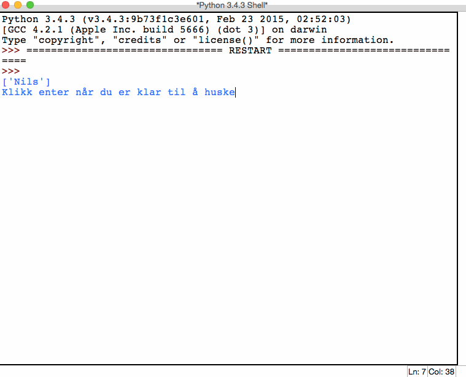

# Huskespill {.intro}
I denne oppgaven skal du lage et huskespill hvor spilleren skal huske flest mulig ord i riktig rekkefølge. Spilleren skal få opp en liste med ord, deretter skal listen forsvinne og spilleren skal så skrive inn ordene i riktig rekkefølge. Skrives ordene inn i riktig rekkefølge, vil listen utvides med et nytt ord som må huskes. Programmet holder på slik helt til spilleren gjetter feil. Når spillet er ferdig får spilleren vite hvor mange ord han eller hun klarte å huske etter hverandre.

Vi vil bygge programmet gradvis steg for steg. I hvert steg vil det gis viktige tips som ligner på slik en bør løse steget.

**Eksempel på hvordan programmet skal fungere: **




# Steg 1: Utvid en liste med tilfeldige element {.activity}
- [ ] Lag en funksjon som tar inn en liste som parameter.
- [ ] Funksjonen skal legge til et tilfeldig ord på slutten av lista.
- [ ] Funksjonen skal returnere den utvidede lista.
- [ ] **Før du går videre til steg 2, sjekk at funksjonen din fungerer som den skal.**

## Tips: Lister {.protip}
**Hva:** En liste er en variabel som kan lagre flere verdier på en gang.

**Hvordan lage lister:**
```python
liste = ['sau', 'gris', 'menneske']
tom_liste = []
print(liste)
print(tom_liste)
```
**Hvordan hente ut verdier fra en liste:**
```python
print(liste[2])
```
Husk at vi begynner å telle på 0, så første posisjon i lista er posisjon 0. Deretter teller vi oppover 0,1,2,3...

**Hvordan finne lengden til liste:**
```python
lengde = len(liste)
print(lengde)
```

**Hvordan legge til ny verdi på slutten av liste:**
```python
print(liste)
liste.append('nils')
print(liste)
```
Prøv ut eksemplene for å forstå hvordan du kan bruke dem til å løse oppgaven.

## Tips: Velge et tilfeldig element i en liste {.protip}
For å hente et tilfeldig element i en liste kan man bruke
[`choice()`](https://docs.python.org/3.4/library/random.html#random.choice)
i random-biblioteket.

**Eksempel:**
```python
import random
liste = ['asdf', 'qwerty', 'nils']

tilfeldig = random.choice(liste)
print(tilfeldig)
```
Prøv å kjør denne koden mange ganger!


# Steg 2: Hent inn tekst og lag liste av den {.activity}

- [ ] Lag en funksjon som tar inn tekst og lager en liste av den.
- [ ] Teksten som tas inn skal splittes ved `-`.
- [ ] Funksjonen skal returnere listen.
- [ ] Før du går videre til steg 3, sjekk at funksjonen din fungerer som den skal.

## Tips: Hente innputt {.protip}
For å hente innputt og lagre det til en variabel kan vi bruke [`input()`].

**Eksempel:**
```python
tekst = input('Skriv noe')
```
Det som brukeren skriver inn vil lagres i variabelen `tekst`.

[`input()`]: https://docs.python.org/3.4/library/functions.html#input

## Tips: Splitte tekst til en liste {.protip}
Siden spilleren ikke kan skrive inn en liste, men kun tekst, må vi forandre teksten til en liste. Dette kan vi gjøre med [`split()`]. Hvis vi skiller ordene som skal være i lista med et bestemt tegn, kan [`split()`] hente ut alle ordene og legge dem i en liste.

**Eksempel:**
```python
tekst = 'giraff-neshorn-bjørn-pelikan'
liste = tekst.split('-')
print(liste)
```
Merk `'-'` som står i parentesen `split('-')`. Denne forteller hvilket tegn som skiller ordene fra hverandre.

**Test ut eksempelet for å se hva som skjer.**

[`split()`]: https://docs.python.org/3/library/stdtypes.html#str.split


# Steg 3: Lag spillet {.activity}
- [ ] Bruk funksjonene fra steg 1 og 2 til å lage programmet.
- [ ] Programmet skal benytte to lister. En som utvides for hver runde, og en som lages ved hjelp av ordene som brukeren skriver inn.
- [ ] Så lenge listene er like skal programmet kjøre.
- [ ] Når programmet er ferdig, skriv ut hvor mange ord spilleren klarte å huske.


## Sjekkliste for oppgaven {.check}
- [ ] Avsluttes spillet når det huskes feil?
- [ ] Får spilleren vite hvor mange han eller hun husket riktig?
- [ ] Blir lista som skal huskes usynlig for spilleren? (Tips: Skriv ut tomrom mange ganger.)
