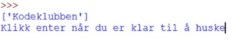
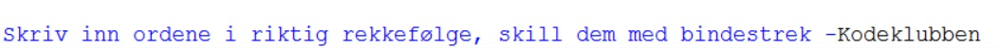
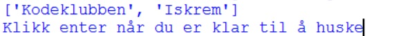

---
title: Huskespill
level: 3
author: Sindre O. Rasmussen, Kodeklubben Trondheim
---

# Huskespill {.intro}
I denne oppgaven skal du lage et huskespill hvor spilleren skal huske flest mulig ord i riktig rekkefølge. Spilleren skal få opp en liste med ord, deretter skal listen forsvinne og spilleren skal så skrive inn ordene i riktig rekkefølge. Skrives ordene inn i riktig rekkefølge, vil listen utvides med et nytt ord som må huskes. Programmet holder på slik helt til spilleren gjetter feil. Når spillet er ferdig skal spilleren få vite hvor mange ord han eller hun klarte å huske etter hverandre.
Vi vil bygge programmet gradvis steg for steg. I hvert steg vil det gis viktige tips som ligner på slik en bør løse steget.
**Eksempel på hvordan programmet skal fungere: **

Først kommer:





Deretter:





Hvis spilleren husker rett utvides lista og en ny runde startes slik:





# Steg 1: {.activity}
Lag en funksjon som tar inn en liste som parameter. Funksjonen skal så legge til et tilfeldig ord på slutten av lista og returnere den utvidede lista. Et tips til hvordan man kan legge til et tilfeldig ord er at man  lager en liste med mange ord. Deretter bruker man et tilfeldig tall som listeposisjonen til det tilfeldige ordet man skal legge til parametterlista.
**Før du går videre til steg 2 bør du sjekke at funksjonen din fungerer som den skal**

## Tips: Lister {.protip}
**Hva:** En liste er en slags variabel som kan lagre flere verdier på en gang.

Eksempler på hvordan lister lages: 
```python
liste = ['sau', 'gris', 'menneske']
tomListe = []
print(liste)
print(tomListe)
```
Eksempler på hvordan man kan hente ut verdier fra liste:
```python
print(liste[2])
```
**Husk at vi begynner å telle på 0, så første posisjon i lista er posisjon 0, deretter teller vi oppover 0,1,2,3...**

Hvordan finne lengden til liste:
```python
lengde = len(liste)
print(lengde)
```

Hvordan legge til ny verdi på slutten av liste:
```python
print(liste)
liste.append('nils')
print(liste)
```
**Prøv ut eksemplene for å forstå hvordan du kan bruke dem til å løse oppgaven**

## Tips: Tilfeldige tall{.protip}
For å få et tilfeldig tall må man benytte random-biblioteket

Eksempel på bruk av random-biblioteket:
```python
import random
tilfeldigTall = random.randint(0, 20)
```
Variabelen med navn tilfeldigTall vil nå bli et tilfeldig tall mellom 0 og 20

# Steg 2: {.activity}
Lag en funksjon som tar inn to lister som parametere og sjekker om de er like. Funksjonen skal returnere True hvis listene er like, og False hvis de er ulike.
**Før du går videre til steg 3 bør du sjekke at funksjonen din fungerer som den skal**

# Steg 3: {.activity}
Nå skal du bruke funksjonene fra steg 1 og 2 til å lage programmet. Programmet skal benytte to lister. En som utvides for hver runde, og en som lages ved hjelp av ordene som brukeren skriver inn. Så lenge listene er like skal programmet kjøre.

## Tips: Bruke input{.protip}
For å lagre det spilleren skriver i en variabel, brukes input. Nedenfor ser du et eksempel.
```python
tekst = input('Skriv noe')
```
Det som brukeren skriver inn vil nå lagres i variabelen tekst

## Tips: Benytte split for å lage en liste av det som spilleren skriver inn{.protip}
Siden spilleren ikke kan skrive inn en liste, men kun en tekst, må vi forandre teksten til en liste. Dette gjøres med noe som kalles split. Hvis vi skiller ordene som skal være i lista med et bestemt tegn, kan split hente ut alle ordene og legge dem i en liste. Nedenfor er et eksempel på hvordan man gjør dette:
```python
tekst = 'giraff-neshorn-bjørn-pelikan'
liste = tekst.split('-')
print(liste)
```
Merk '-' som står i parentesen bak split. Denne forteller hvilket tegn som skiller ordene fra hverandre

**Test ut eksempelet for å se hva som skjer**

## Sjekkliste for oppgaven {.check} 
* Avsluttes spillet når det huskes feil?
* Får spilleren vite hvor mange han eller hun husket riktig?
* Blir lista som skal huskes usynlig for spilleren? (Tips: Skriv ut tomrom mange ganger)
