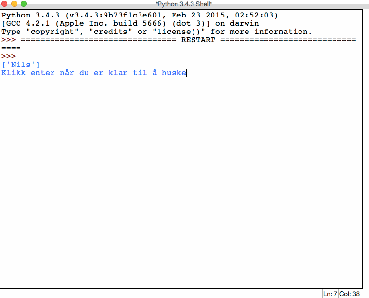

# Hugsespel {.intro}

I denne oppgåva skal du lage eit hugsespel der spelaren skal hugse flest mogleg
ord i riktig rekkefølgje. Spelaren skal få opp ei liste med ord, så skal lista
forsvinne og spelaren skal skrive inn orda i rett rekkefølgje. Viss orda blir
skrive inn riktig vil lista utvidast med eit nytt ord spelaren må hugse.
Programmet fortset slik til spelaren gjettar feil. Når spelet er ferdig får
spelaren vite kor mange ord han eller ho klarte å hugse etter kvarandre.

Me vil byggje programmet steg for steg. I kvart steg blir det gitt viktige tips
som liknar på det du må gjere for å løyse steget.

**Døme på korleis programmet skal fungere:**




# Steg 1: Utvid ei liste med tilfeldige element {.activity}

- [ ] Lag ein funksjon som tek inn ei liste som parameter.

- [ ] Funksjonen skal leggje til eit tilfeldig ord på slutten av lista.

- [ ] Funksjonen skal returnere den utvida lista.

- [ ] **Før du går vidare til steg 2, sjekk at funksjonen din fungerer som den
  skal.**

## Tips: Lister {.protip}

**Kva:** Ei liste er ein variabel som kan lagre fleire verdiar på ein gong.

**Korleis lage lister:**

```python
liste = ['sau', 'gris', 'menneskje']
tom_liste = []
print(liste)
print(tom_liste)
```

**Korleis hente ut verdiar frå ei liste:**

```python
print(liste[2])
```

Hugs at me startar å telje på 0, så i dømet over hentar me det tredje elementet
i lista. Me tel altså `0, 1, 2, 3, ...`.

**Korleis finne lengda til ei liste:**

```python
lengde = len(liste)
print(lengde)
```

**Korleis leggje til ny verdi på slutten av ei liste:**

```python
print(liste)
liste.append('nils')
print(liste)
```

Prøv ut døma for å forstå korleis du kan bruke dei til å løyse oppgåva.

## Tips: Velje eit tilfeldig element i ei liste {.protip}

For å hente eit tilfeldig element frå ei liste kan du bruke
[`choice()`](https://docs.python.org/3.4/library/random.html#random.choice) i
random-biblioteket.

**Døme:**

```python
import random
liste = ['asdf', 'qwerty', 'nils']

tilfeldig = random.choice(liste)
print(tilfeldig)
```

Prøv å køyre denne koden mange gonger!


# Steg 2: Hent inn tekst og lag liste av den {.activity}

- [ ] Lag ein funksjon som tek inn tekst og lagar ei liste av den.

- [ ] Teksten som blir tatt inn er delt med `-`.

- [ ] Funksjonen skal returnere lista.

- [ ] Før du går vidare til steg 3, sjekk at funksjonen din fungerer som den
  skal.

## Tips: Hente innput {.protip}

For å hente innput og lagre det til ein variabel kan me bruke [funksjonen
`input()`].

**Døme:**

```python
tekst = input('Skriv noko')
```

Det som brukaren skriv inn blir lagra i variabelen `tekst`.

[funksjonen `input()`]: https://docs.python.org/3.4/library/functions.html#input

## Tips: Splitte tekst til ei liste {.protip}

Sidan spelaren ikkje kan skrive inn ei liste, berre tekst, må me forandre
teksten til ei liste. Dette kan me gjere med [funksjonen `split()`]. Viss me
skil orda som skal vere i lista med eit spesielt teikn, så kan `split()` hente
ut alle orda og leggje dei i ei liste.

**Døme:**

```python
tekst = 'giraff-nasehorn-bjørn-pelikan'
liste = tekst.split('-')
print(liste)
```

Merk `'-'` som står i parentesen `split('-')`. Den fortel kva teikn som skil
orda frå kvarandre.

**Test ut dømet for å sjå kva som skjer.**

[funksjonen `split()`]:
https://docs.python.org/3/library/stdtypes.html#str.split


# Steg 3: Lag spelet {.activity}

- [ ] Bruk funksjonane frå steg 1 og 2 til å lage programmet.

- [ ] Programmet skal bruke to lister. Ei som utvidast for kvar runde, og ei som
  lagast ved hjelp av orda brukaren skriv inn.

- [ ] Så lenge listene er like skal programmet køyre.

- [ ] Når programmet er ferdig, skriv ut kor mange ord spelaren klarte å hugse.

## Sjekkliste for oppgåva {.check}

- [ ] Blir spelet avslutta når spelaren hugsar feil?

- [ ] Får spelaren vite kor mange ord han eller ho hugsa riktig?

- [ ] Blir lista som skal hugsast usynleg for spelaren? Tips: skriv ut tomrom
  mange gonger.
