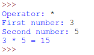
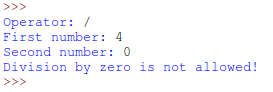
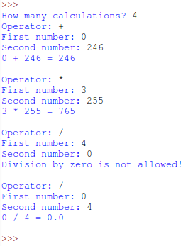

# Kalkulator {.intro}

I denne oppgaven skal du lage en kalkulator helt på egenhånd. Det er meningen at du  i denne oppgaven skal skrive all koden selv, ved hjelp av noen hint.

Vi ønsker at kalkulatoren skal kunne addere (`+`), subtrahere (`-`), multiplisere (`*`) og dividere (`/`). Vi kaller `+`, `-`, `*` og `/` for *operatorer*, og i denne oppgaven skal du lage <u>en funksjon for hver operator</u> (disse kan du for eksempel kalle `add`, `subtract`, `multiply` og `divide`). Hver funksjon skal ha to tall som parametre og skal utføre regneoperasjonen, samt skrive ut svaret.

Brukeren skal selv skrive inn hva slags regneoperasjon som skal utføres.

Eksempel på bruk av programmet:



# Klar, ferdig, programmer! {.activity}

Da er det bare å sette i gang!

Her er noen ting å tenke på:

* Hvordan avgjør du hvilken operasjon som skal utføres?
* Har rekkefølgen på tallene noen betydning? (Er `4-2` lik `2-4`?)
* Hvis du sitter fast kan det være lurt å lese tipsene i de gule boksene.

## int() {.protip}

Når man får input fra brukeren får man en *tekststreng*, selv om brukeren skrev et tall, da kan det være greit å kunne konvertere teksten til et tall, ved hjelp av `int()`.

Hva er forskjellen på disse kodesnuttene? (Kjør koden og test selv!)
```python
tall = input("Skriv et tall: ")
svar = 3 + tall
print(svar)
```

```python
tall = int(input("Skriv et tall: "))
svar = 3 + tall
print(svar)
```

## Funksjoner med parametre {.protip}

En funksjon deklareres ved hjelp av `def`-nøkkelordet. Den kan brukes ved å skrive funksjonsnavnet med parenteser bak.

**Eksempel:**
```python
def hello_word():
    print("Hello World!")

hello_world()
```

En funksjon som har *parametre* deklareres med parametre på innsiden av parentesene i funksjonsdefinisjonen.

**Eksempel:**
```python
def greet(firstName, lastName):
    print("Hello, " + firstName + " " + lastName)
```

Når vi senere kaller funksjonen, så gir vi den *argumenter*.

**Eksempel:**
```python
greet("Ola", "Nordmann")
```

Du la kanskje merke til at vi skiller mellom *parametre* og *argumenter*. Et parameter er det navnet vi gir til variabelen i funksjonendefinisjonen, slik som `firstName` og `lastName`. Argumenter er de verdiene vi gir til funksjonen når vi kaller den, slik som `"Ola"` og `"Nordmann"`.

# Test programmet {.activity}

- [ ] Fungerer programmet som det skal? Hvis ikke må du rette på det.

## Delt på null {.challenge}

- [ ] Hva skjer når du deler på null? Prøv for eksempel `4 / 0`.

Hvis programmet ditt feiler nå, så har du trolig fått en delt-på-null-feil. Man kan nemlig ikke dele på null. Fiks programmet ditt slik at programmet skriver ut `"Division by zero is not allowed!"` hvis brukeren forsøker å dele på null. Slik:



## Flere utregninger {.challenge}

- [ ] Endre programmet ditt slik at brukeren kan skrive inn hvor mange utregninger kalkulatoren skal utføre. Programmet vil da fungere slik:



## Flere operasjoner {.challenge}

- [ ] Prøv å legge til flere operatorer. Du kan for eksempel legge til `**`-operatoren. `**`-operatoren opphøyer et tall i et annet. F.eks. er `2**3` lik `8` fordi `2*2*2` er lik `8`.

- [ ] Kommer du på andre operatorer som kan legges til i kalkulatoren din?
