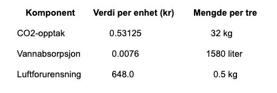

# Python-oppgave: Hvor mye er et tre i Oslo verdt?
**Tallene i denne oppgaven kommer fra Klimaetaten, og er basert på gjennomsnittsverdier for trær i Oslo: [lenke til kilder](https://brage.nina.no/nina-xmlui/handle/11250/3134268?show=full&locale-attribute=no#:~:text=Kartlegging%20og%20verdisetting%20av%20bytr%C3%A6rs%20betydning%20for%20%C3%B8kosystemtjenester,Oslo.%20NINA%20Rapport%202391.%20Norsk%20institutt%20for%20naturforskning.)**
  
# Introduksjon {.intro}
  
​​Jorda blir varmere fordi det har blitt for mye klimagasser i atmosfæren. CO2 er den viktigste klimagassen. Heldigvis er trær helt supre til å suge CO2 ut av lufta. Hvis du ser ut av vinduet, og ser på det nærmeste treet så suger det CO2 ut av lufta akkurat nå. Helt magisk, ikke sant? 

Men hvor mye CO2 kan et tre fange opp? Og hva annet kan et tre bidra med?

I denne oppgaven skal du bruke Python til å regne ut hvor stor økonomisk verdi et tre har basert på ulike egenskaper som CO2-opptak, vannabsorbering og fjerning av luftforurensning. Dette er en super måte å lære grunnleggende programmering på, samtidig som du får innsikt i miljø og bærekraft.

Hva skal du lære?
- Å bruke variabler i Python


- Å gjøre enkle utregninger


- Å bruke print() og f-tekststrenger


- Hvordan programmering kan brukes til å forstå og kommunisere viktige miljødata

## Bakgrunn
I Oslo er det litt over 600 000 trær. I gjennomsnitt er de 12 meter høye, 35 cm i diameter, og med kroneareal på 80 m2. Disse trærne tar opp CO2 fra lufta, suger opp vann fra bakken og dermed begrenser overvannsproblemer og fjerner forurensning i lufta. 

Tabellen under viser hva ett enkelt tre gjør i løpet av et år, og hvor mye dette utgjør i økonomisk verdi (kroner).



Et gjennomsnittlig tre i Oslo tar opp 32 kg CO2, suger opp 1580 liter vann og fjerner 0,5 kg luftforurensning hvert år.

Dette har økonomiske verdier på henholdsvis 17 kr, 12 kr og 324 kr per år. Til sammen kan man si at disse tjenestene gjør at de tre har en økonomisk verdi på 353 kr per år.


# Oppgave {.activity}

### 1. Definer variabler
Start med å lage variabler for alle tallene i tabellen i Python. Gjør det samme for vann og luftforurensning.

```
co2 = 32
co2_verdi = 0.53125
```


### 2. Regn ut verdi per tre

Regn ut hvor mye hvert tre er verdt for hver komponent ved å multiplisere mengden med verdi.

Tips:
- Tekst herDu kan bruke round() til å runde av svaret til nærmeste heltall.


- Bruk en f-tekststreng (f"") for å skrive ut teksten på en pen måte.


```
co2_verdi_per_tre = round(co2 * co2_verdi)
print(f"Et tre tar opp {co2} kg CO2 til en verdi av {co2_verdi_per_tre} kroner")
```

### 3. Totalverdi per tre
Legg sammen verdiene fra CO2, vann og luftforurensning for å finne den totale verdien ett tre har per år.

Eksempel:
```
tre_verdi = co2_verdi_per_tre + vann_verdi_per_tre + forurensning_verdi_per_tre
print(f"Et tre har en økonomisk verdi på {tre_verdi} kroner per år")
```


### 4.  Samlet verdi for alle trær i Oslo (Vanskeligere)

Det er ca. 600 000 trær i Oslo. Kan du regne ut hvor mye alle trærne er verdt til sammen hvert år?

Fasit:

```
# Hint: Du kjenner antall trær
antall_trær_i_oslo  = 600_000


# Sett inn verdien for ett tre (fra oppgaven din)
total_verdi = antall_trær_i_oslo * ... #fyll inn selv 

print(total_verdi)

```
## Prøv selv! {.flag}


# Fasit
```
Her er hele koden samlet. Du kan bruke den for å sjekke svarene dine eller kjøre den for å se resultatet:
# CO2
co2 = 32
co2_verdi = 0.53125
co2_verdi_per_tre = round(co2 * co2_verdi)

# Vann
vann = 1580
vann_verdi = 0.0076
vann_verdi_per_tre = round(vann * vann_verdi)

# Luftforurensning
forurensning = 0.5
forurensning_verdi = 648
forurensning_verdi_per_tre = round(forurensning * forurensning_verdi)

# Utskrift av verdier per tre
print(f"Et tre tar opp {co2} kg CO2 til en verdi av {co2_verdi_per_tre} kroner")
print(f"Et tre suger opp {vann} liter vann til en verdi av {vann_verdi_per_tre} kroner")
print(f"Et tre fjerner {forurensning} kg luftforurensning til en verdi av {forurensning_verdi_per_tre} kroner")

# Totalverdi per tre
tre_verdi = co2_verdi_per_tre + vann_verdi_per_tre + forurensning_verdi_per_tre
print(f"Et tre har en økonomisk verdi på {tre_verdi} kroner per år")

# Verdi for alle trær i Oslo
antall_trær_i_oslo = 600_000
oslo_verdi = antall_trær_i_oslo * tre_verdi
print(f"Trærne i Oslo har en samlet verdi på {oslo_verdi} kroner per år")

```


