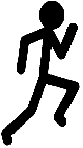

# Introduksjon {.intro}

I denne oppgaven skal du lage et spill der du styrer en strekmann som hopper over hindringer.


# Steg 1: Ny fil {.activity}

Begynn med å lage en fil som kan kjøres med Pygame Zero.

## Sjekkliste {.check}

+ Lag en ny fil `run_stickman.py`.

+ Du starter med å bestemme hvor stort vindu vi skal bruke:

  ```python
  WIDTH = 550
  HEIGHT = 250
  ```

+ Lagre og kjør programmet med `pgzrun run_stickman.py`. Se til at du får opp et vindu.


# Steg 2: Hindringer {.activity}

Du skal nå lage boksene som strekmannen løper mot. Dette skal gjøres ved hjelp av en klasse.


## Sjekkliste {.check}

+ Klassen skal hete Box og skal ha egenskapene: `height`, `width`, `color`,
  `x`, `y` og en funkson som heter `draw()`:

  ```python
  class Box:
      # Skriv egenskaper her

      def draw(self):
          # Skriv koden som tegner boksen her
  ```

  **Tips:**
  Bruk kommandoen `screen.draw.filled_rect()` for å tegne rektangler. En rød
  boks som er 50 piksler bred og høy tegnes i venstre topp med:

  ```python
  screen.draw.filled_rect( Rect(0, 0, 50, 50) , (255, 0, 0) )
  ```

  En blå boks i høyre bunn blir:

  ```python
  screen.draw.filled_rect( Rect(WIDTH-50, HEIGHT-50, 50, 50) , (0, 0, 255) )
  ```

+ Opprett en boks ved å legge til denne linjen i koden:

  ```python
  box = Box()
  ```

+ Lagre og kjør programmet for å sjekke at du ikke får noen feilmeldinger.

+ Hvis du vil se boksen i vinduet må du tegne den med:

  ```python
  def draw():
      box.draw()
  ```


# Steg 3: Strekmann {.activity}
Du skal nå lage en strekmann som vi skal kalle `stick_man`.


## Sjekkliste {.check}

+ Lag en strekmann (`stick_man`) fra klassen [`Actor`] som bruker bildet
  `running_man`.

  ```python
  stick_man = Actor('running_man')
  ```

+ Sett posisjonen til strekmannens venstre bunn til å være `50, HEIGHT`.

  ```python
  stick_man.bottomleft = 50, HEIGHT
  ```

 + For at koden skal kjøre må du lagre bildet av strekmannen under som `running_man.png` i mappen `images` der du har lagret `run_stickman.py`.

  

+ Mappen din skal nå se ut som dette:

  


[`Actor`]: https://pygame-zero.readthedocs.org/en/latest/builtins.html?highlight=actor#actor


# Steg 4: Funksjonene draw() og update() {.activity}

De fleste spill i [Pygame Zero] har funksjonene [`draw()`] og [`update()`].
Draw-funksjonen sørger for at spillvinduet blir tegnet og update-funksjonen
gjør endringer i spillet før de tegnes med `draw()`.

[Pygame Zero]: https://pygame-zero.readthedocs.org/
[`draw()`]: https://pygame-zero.readthedocs.org/en/latest/hooks.html?highlight=draw#draw
[`update()`]: https://pygame-zero.readthedocs.org/en/latest/hooks.html?highlight=update#update


## Sjekkliste {.check}

+ Lag `draw()` med koden i blokken under. Forstår du hva koden gjør?

  ```python
  def draw():
          screen.clear()
          screen.fill((255, 255, 255))
          stick_man.draw()
          box.draw()
  ```

+ Du må nå lage `update()`. Du trenger følgende:
  - Få boksen til å flytte seg mot venstre.
  - Hvis boksen er ute av bildet på venstre side, flytt den til høyre side av
    vinduet.
  - Hvis strekmannen er truffet, skriv "Du ble truffet!" til terminalen.

  ```python
  def update():
      # Flytt boksen mot venstre

      if "boksen er ute av bildet":
          # Flytt boksen til høyre side av bildet

      if "strekmannen er truffet":
          print("Du ble truffet!")
  ```


## Tips {.protip}

**Flytt boksen**

For å få boksen til å flytte seg kan du endre x-posisjonen til boksen.


**Sjekk om strekmannen blir truffet**

Legg merke til at y-aksen til spillvinduet er positiv nedover, motsatt av det
som er vanlig i matematikk. Boksens x- og y-posisjon er hvor boksens øverste
venstre hjørne er plassert, som er merket i bildet som **(x, y)**.


Den røde firkanten illustrerer hvor stort bildet til strekmannen er. I
tilfellet merket **1** ser du at boksens øverste venstre hjørne er
inni bildet til strekmannen. Dette må du sjekke i if-setningen.

I tilfelle **2** er boksens øvre høyre hjørne inne den røde firkanten, dette må
du også sjekke i if-setningen.


**Hvordan finne posisjonen til strekmannen?**

- `stick_man.bottom` gir posisjonen til bunnen av `stick_man`.

- `stick_man.left` gir posisjonen til venstre side av `stick_man`.


# Steg 5: Animasjoner {.activity}

Du skal nå gjøre det mulig for strekmannen å hoppe med "space" tasten.


## Sjekkliste {.check}

+ Lag funksjonen `on_key_down(key)`.

  ```python
  def on_key_down(key):
      #(Din kode)
  ```

  [`on_key_down()`] kjøres hver gang spilleren trykker på en tast. Hvilken
  tast som trykkes sendes til funksjonen som `key`.

+ Lag en `if`-setning som sjekker at det er tasten "space" (`keys.SPACE`) som
  trykkes.

+ Sjekk i samme `if`-setning om strekmannen er på bakken, det skal kun være lov
  å hoppe da.

+ For å få strekmannen til å hoppe, bruk [`animate()`]:

  ```python
  jump_up = animate(stick_man, 'decelerate', duration=0.4, bottom=(HEIGHT - box.height*1.5))
  ```

  Koden forteller at:

  - Vi skal lage en animasjon med `stick_man`.
  - Bevegelsen skal være av type `decelerate`, som er høy hastighet i begynnelsen,
    deretter saktere og saktere.
  - Animasjonen skal vare i 0.4 sekunder.
  - `bottom` av `stick_man` skal flyttes til `HEIGHT - box.height*1.5`, altså
    1,5 gang av høyden til boksen.
  - Animasjonen gis navnet `jump_up`.

+ Prøv programmet. Hopper strekmannen?

+ Vi trenger nå en animasjon som gjør at strekmannen kommer ned til bakken
  igjen. Lag funksjonen `back_down()`:

  ```python
  def back_down():
      animate(stick_man, 'accelerate', duration=0.4, bottom=HEIGHT)
  ```

  Forstår du hva koden skal animere?

+ Sett verdien `jump_up.on_finished` til `back_down`. `back_down()` vil da kjøres
  når opp-animasjonen er ferdig:

  ```python
  jump_up.on_finished = back_down
  ```

[`on_key_down()`]: https://pygame-zero.readthedocs.org/en/latest/hooks.html?highlight=on_key_down#on_key_down
[`animate()`]: https://pygame-zero.readthedocs.org/en/latest/builtins.html?highlight=rect#animations


## Tips {.protip}

Dette er en skisse på hvordan koden din skal se ut:

```python
def on_key_up(key):
    if ("key er space" and
        "strekmannen er på bakken"):
        # Animasjon oppover
        # Når animasjon oppover er ferdig, animer ned

def back_down():
    # Animasjon ned
```


# Steg 6: Poeng {.activity}
Vi skal nå gi poeng ettersom hvor mange bokser vi klarer å hoppe over. Vi
trenger to variabler, en for poeng og en for å huske om strekmannen har blitt
truffet av boksen.


## Sjekkliste {.check}

+ Lag en variabel som heter `SCORE` og gi den verdien `0`.

+ Lag variabelen `stick_man.hit` og gi den verdien `False`.

+ Inne i `update()`, bestem at av du skal bruke den globale variablen `SCORE`:

  ```python
  def update():
      global SCORE
      # resten av din kode
  ```

+ Hvis strekmannen blir truffet, sett `SCORE = 0` og `stick_man.hit = True`.

+ Øk poengsummen med 10 poeng hvis boksen er ute av bildet og strekmannen ikke
  er truffet.

+ Før boksen flyttes til høyre side, nullstill `stick_man.hit` til `False`.

+ Tegn poengsummen på skjermen inni `draw()`:

  ```python
  screen.draw.text("Poeng: " + str(SCORE), (400, 30), color = (0, 0, 0))
  ```


## Test spillet ditt {.flag}


## Utfordringer: {.challenge}

- Endre hastigheten på boksen.

- Endre høyden på hoppet.

- Endre hvor lang tid et hopp tar.

- Finn en kombinasjon av boksens hastighet og strekmannens hopp slik at spillet
  er akkurat passe vanskelig.

- Øk hastigheten på boksen når man har fått 100 poeng.

- Øk poengsummen med 20 når man har fått 100 poeng.

- Gi boksen forskjellig høyde for hver gang.

- Gi boksen forskjellig bredde for hver gang.

- Send flere bokser inn på skjermen samtidig.

- Send flere bokser med ulik hastighet inn på skjermen samtidig.

- Dine egne ideer?
