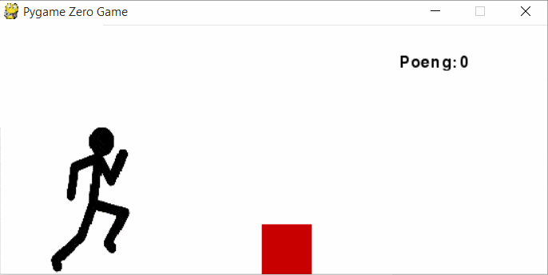
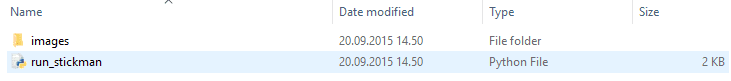

# Introduksjon {.intro}

I denne oppgåva skal du lage eit spel der du styrer ein strekmann som hoppar
over hindringar.




# Steg 0: Installere Pygame Zero {.activity}

For å gjere denne oppgåva må du installere [Pygame
Zero](https://pygame-zero.readthedocs.io/en/latest/installation.html). Start med
å sjekke at du har installert Python 3, altså at Python-versjonen din er
nummerert på forma 3.X.X.

Åpne kommandolinja (engelsk: command prompt) på datamaskina di. Brukar du
Windows kan du åpne start-menyen og skrive cmd (eventuelt *Ledetekst*, som er
det norske namnet på programmet som skal køyre). På Mac og Linux åpnar du
terminalvindauget. Skriv inn følgjande:

__Windows og Mac:__

```
pip install pgzero
```

__Linux:__

```
sudo pip install pgzero
```

Nokre Linux-system kallar den `pip3`, i så fall må du skrive det i staden for
`pip` i koden over. Viss pip ikkje er installert kan du prøve å skrive

```
sudo python3 -m ensurepip
```

før du prøver `sudo pip install pgzero` att.


# Steg 1: Ny fil {.activity}

Start med å lage ei fil som kan køyrast med Pygame Zero.

## Sjekkliste {.check}

- [ ] Lag ei ny fil `run_stickman.py`.

- [ ] Du startar med å bestemme kor stort vindauge me skal bruke:

  ```python
  WIDTH = 550
  HEIGHT = 250
  ```

- [ ] Lagre og køyr programmet med `pgzrun run_stickman.py`. Sjekk at du får opp
  eit vindauge.


# Steg 2: Hindringar {.activity}

No skal du lage boksane som strekmannen spring mot. Dette skal du gjere ved
hjelp av ei klasse.

## Sjekkliste {.check}

- [ ] Klassa skal heite `Box` og skal ha eigenskapane `height`, `width`,
  `color`, `x`, `y` og ein funksjon som heiter `draw()`:

  ```python
  class Box:
      # Skriv eigenskapar her

      def draw(self):
          # Skriv koden som teiknar boksen her
  ```

  **Tips:** Bruk kommandoen `screen.draw.filled_rect()` for å teikne rektangel.
  Ein raud boks som er 50 pikslag brei og høg blir teikna oppe til venstre med:

  ```python
  screen.draw.filled_rect( Rect(0, 0, 50, 50) , (255, 0, 0) )
  ```

  Ein blå boks nede til høgre blir:

  ```python
  screen.draw.filled_rect( Rect(WIDTH-50, HEIGHT-50, 50, 50) , (0, 0, 255) )
  ```

- [ ] Lag ein boks ved å leggje til denne linja i koden:

  ```python
  box = Box()
  ```

- [ ] Lagre og køyr programmet for å sjekke at du ikkje får ei feilmelding.

- [ ] Viss du vil sjå boksen i vindauget må du teikne den med:

  ```python
  def draw():
      box.draw()
  ```


# Steg 3: Strekmann {.activity}

Du skal du lage ein strekmann me kallar `stick_man`.

## Sjekkliste {.check}

- [ ] Lag ein strekmann (`stick_man`) frå klassa [`Actor` (les meir)] som brukar
  biletet `running_man`.

  ```python
  stick_man = Actor('running_man')
  ```

- [ ] Set posisjonen til strekmannen sin venstre botn til å vere `50, HEIGHT`.

  ```python
  stick_man.bottomleft = 50, HEIGHT
  ```

  - For at koden skal køyre må du lagre biletet av strekmannen under som
    `running_man.png` i mappa `images` der du har lagra `run_stickman.py`.

  

- [ ] No skal mappa di sjå slik ut:

  

[`Actor` (les meir)]:
https://pygame-zero.readthedocs.org/en/latest/builtins.html?highlight=actor#actor


# Steg 4: Funksjonane draw() og update() {.activity}

Dei fleste spela i [Pygame Zero] har funksjonane [`draw()` (les meir)] og
[`update()` (les meir)]. Draw-funksjonen syt for at spelvindauget blir teikna,
og update-funksjonen gjer endringar i spelet før dei blir teikna med `draw()`.

[Pygame Zero]: https://pygame-zero.readthedocs.org/ [`draw()` (les meir)]:
https://pygame-zero.readthedocs.org/en/latest/hooks.html?highlight=draw#draw
[`update()` (les meir)]:
https://pygame-zero.readthedocs.org/en/latest/hooks.html?highlight=update#update

## Sjekkliste {.check}

- [ ] Lag `draw()` med koden i blokka under. Forstår du kva koden gjer?

  ```python
  def draw():
          screen.clear()
          screen.fill((255, 255, 255))
          stick_man.draw()
          box.draw()
  ```

- [ ] Du må lage `update()`. Du treng det følgjande:

  - Få boksen til å flytte seg mot venstre.

  - Viss boksen er ute av biletet på venstre side, flytt den til høgre side av
    vindauget.

  - Viss strekmannen blir treft av boksen, skriv "Du traff boksen!!" til
    terminalen.

  ```python
  def update():
      # Flytt boksen mot venstre

      if "boksen er ute av biletet":
          # Flytt boksen til høgre side av biletet

      if "strekmannen er treft":
          print("Du traff boksen!")
  ```

## Tips {.protip}

**Flytt boksen**

For å få boksen til å flytte seg kan du endre x-posisjonen til boksen.

**Sjekk om strekmannen blir treft**

Legg merke til at y-aksen til spelvindauget er positiv nedover, motsett av det
som er vanleg. Boksen sin x- og y-posisjon er der boksen sitt øvre venstre
hjørne er plassert. Det er merka i biletet som `(x, y)`.


Den raude firkanten illustrerer kor stort biletet til strekmannen er. I
tilfellet merka **1** ser du at boksen sitt øvre venstre hjørne er inni biletet
til strekmannen. Dette må du sjekke i if-setninga.

I tilfelle **2** er boksen sitt øvre høgre hjørne inne i biletet til
strekmannen. Det må du òg sjekke i if-setninga.

**Korleis finne posisjonen til strekmannen?**

- `stick_man.bottom` gir posisjonen til botnen av `stick_man`.

- `stick_man.left` gir posisjonen til venstre side av `stick_man`.


# Steg 5: Animasjonar {.activity}

No skal du gjere det mogleg for strekmannen å hoppe med mellomromtasten.

## Sjekkliste {.check}

- [ ] Lag funksjonen `on_key_down(key)`.

  ```python
  def on_key_down(key):
      #(Koden din)
  ```

  [`on_key_down()` (les meir)] blir køyrt kvar gong spelaren trykkar på ein
  tast. Kva tast som blir trykka blir sendt til funksjonen som `key`.

- [ ] Lag ei `if`-setning som sjekkar at det er mellomromtasten (`keys.SPACE`)
  som blir trykka.

- [ ] Sjekk i same `if`-setning om strekmannen er på bakken, det er berre lov å
  hoppe om han er det.

- [ ] For å få strekmannen til å hoppe, bruk [`animate()` (les meir)]:

  ```python
  jump_up = animate(stick_man, 'decelerate', duration=0.4, bottom=(HEIGHT - box.height*1.5))
  ```

  Koden fortel at:

  - Me skal lage ein animasjon med `stick_man`.

  - Rørsla skal vere av typen `decelerate`, som tyder høg hastigheit i starten,
    og så saktare og saktare.

  - Animasjonen skal vare i 0,4 sekund.

  - `bottom` av `stick_man` skal flyttast til `HEIGHT - box.height*1.5`, altså
    1,5 gonger høgda til boksen.

  - Animasjonen får namnet `jump_up`.

- [ ] Prøv programmet. Hoppar strekmannen?

- [ ] No treng me ein animasjon som gjer at strekmannen kjem ned til bakken att.
  Lag funksjonen `back_down()`:

  ```python
  def back_down():
      animate(stick_man, 'accelerate', duration=0.4, bottom=HEIGHT)
  ```

  Forstår du kva koden skal animere?

- [ ] Set verdien `jump_up.on_finished` til `back_down`. Då vil `back_down()`
  bli køyrt når opp-animasjonen er ferdig:

  ```python
  jump_up.on_finished = back_down
  ```

[`on_key_down()` (les meir)]:
https://pygame-zero.readthedocs.org/en/latest/hooks.html?highlight=on_key_down#on_key_down
[`animate()` (les meir)]:
https://pygame-zero.readthedocs.org/en/latest/builtins.html?highlight=rect#animations

## Tips {.protip}

Dette er ei skisse for korleis koden din skal sjå ut:

```python
def on_key_up(key):
    if ("key er mellomrom" and
        "strekmannen er på bakken"):
        # Animasjon oppover
        # Når animasjon oppover er ferdig, animer ned

def back_down():
    # Animasjon ned
```


# Steg 6: Poeng {.activity}

No skal me gi poeng etter kor mange boksar me klarar å hoppe over. Me treng to
variablar, ein for poeng, og ein for å hugse om strekmannen blir treft av
boksen.

## Sjekkliste {.check}

- [ ] Lag ein variabel som heiter `SCORE` og gi den verdien `0`.

- [ ] Lag variabelen `stick_man.hit` og gi den verdien `False`.

- [ ] Inne i `update()` må du bestemme at du skal bruke den globale variablen
  `SCORE`:

  ```python
  def update():
      global SCORE
      # reisten av koden din
  ```

- [ ] Viss strekmannen blir treft, set `SCORE = 0` og `stick_man.hit = True`.

- [ ] Auk poengsummen med 10 poeng viss boksen er ute av biletet og strekmannen
  ikkje er treft.

- [ ] Før boksen blir flytta til høgre side, set `stick_man.hit` til `False`.

- [ ] Teikn poengsummen på skjermen, inne i `draw()`:

  ```python
  screen.draw.text("Poeng: " + str(SCORE), (400, 30), color = (0, 0, 0))
  ```

## Test spelet ditt {.flag}

Test spelet ditt! Kor mange poeng klarar du å få?

## Utfordringar {.challenge}

- [ ] Endre hastigheita på boksen.

- [ ] Endre høgda på hoppet.

- [ ] Endre kor lang tid eit hopp tek.

- [ ] Finn ein kombinasjon av boksen si hastigheit og strekmannen sitt hopp slik
  at spelet er akkurat passe vanskeleg.

- [ ] Auk hastigheita på boksen når du har fått 100 poeng.

- [ ] Auk poengsummen med 20 når du har fått 100 poeng.

- [ ] Gi boksen ei tilfeldig høgde kvar gong.

- [ ] Gi boksen ei tilfeldig breidde kvar gong.

- [ ] Send fleire boksar inn på skjermen samstundes.

- [ ] Send fleire boksar med ulik hastigheit inn på skjermen samstundes.

- [ ] Har du eigne idear?
