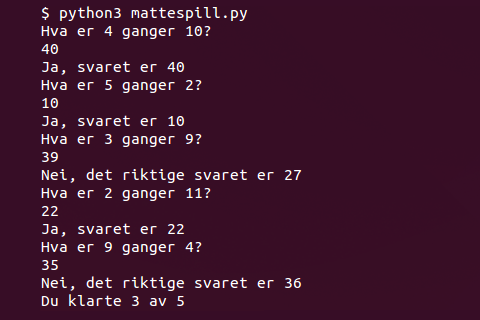

---
title: Mattespill
level: 2
---

# Introduksjon {.intro}

I denne leksjonen vil vi se litt nærmere på hvordan Python jobber med
tall, og vi vil lage et enkelt mattespill. Vi vil også se hvordan vi
kan gjøre ting tilfeldige.



# Steg 1: En kalkulator! {.activity}

Python er, som de fleste programmeringsspråk, veldig glad i å regne.
La oss se hvordan vi kan få Python til å regne for oss.

## Sjekkliste {.check}

+ Lag et nytt IDLE-vindu ved å velge `File > New File`.

+ Vi begynner med å utforske hvordan vi kan bruke Python til å regne
  ut enkle mattestykker. Skriv det følgende nye programmet:

  ```python
  print(2 + 3)
  print(17 - 8)
  print(3 * 4)
  print(22 / 7)
  ```

  Lagre programmet med navnet `kalkulator.py` og kjør det.

+ Når programmet kjører vil det skrive ut 4 tall. Kjenner du igjen
  disse tallene? Skjønner du hva symbolene `*` og `/` betyr? Endre
  gjerne på programmet og kjør det flere ganger til du skjønner
  hvordan Python bruker pluss, minus, gange og dele.

# Steg 2: Vi kaster terning {.activity}

For å lage et mattespill vil vi bruke tilfeldige tall. Tilfeldige tall
blir omtrent som å slå terning for å finne et tall.

## Sjekkliste {.check}

+ For å lage tilfeldige tall skal vi bruke en ny Python-funksjon som
  heter `randint` (her er `rand` en forkortelse for *random* som betyr
  tilfeldig, og `int` en forkortelse for *integer* som betyr
  heltall). Denne funksjonen er ikke med i grunnpakken til Python, men
  ligger i stedet i et bibliotek kalt `random`. Vi må derfor fortelle
  Python at vi vil bruke dette biblioteket. Lag et nytt program,
  `terning.py` som ser slik ut:

  ```python
  from random import randint
  print(randint(1, 6))
  ```

  Når du kjører programmet vil det skrive ut et tilfeldig tall
  mellom 1 og 6. Kjør programmet flere ganger. Forandrer tallet seg?

+ Prøv selv å forandre programmet slik at det skriver ut tilfeldige
  tall mellom 1 og 20! Eller mellom -1 og 1.

+ Programmet `terning.py` viser hvordan vi kan late som om vi slår èn
  terning i Python. Men hvordan kan vi late som om vi slår to
  terninger, og ser summen av dem?

+ Vi kan også utvide programmet slik at det slår terning mange
  ganger. Dette gjør vi enklest med __for-løkker__. Hvis du for
  eksempel utvider programmet ditt som følger vil det se ut som om du
  slår to terninger 25 ganger:

  ```python
  from random import randint

  for i in range(25):
      print(randint(1, 6) + randint(1, 6))
  ```

# Steg 3: En liten matteprøve {.activity}

Vi kan nå bruke tilfeldige tall til å lage et enkelt mattespill.

## Sjekkliste {.check}

+ Lag et nytt program som heter `mattespill.py`. Vi begynner med å
  trekke to tilfeldige tall, og la Python gange dem sammen:

  ```python
  from random import randint

  tall1 = randint(2, 12)
  tall2 = randint(2, 12)
  ```

+ Vi vil nå at Python skal gi oss en matteoppgave, kan vi bli spurt om
  å gange sammen `tall1` og `tall2`? Prøv å legg til denne linjen
  nederst i programmet ditt:

  ```python
  print('Hva er ' + tall1 + ' ganger ' + tall2 + '?')
  ```

  Hva skjer når du prøver å kjøre programmet?

+ Du husker kanskje at vi kan bruke `+` for å sette sammen tekst? Men
  vi bruker også `+` for å plusse sammen tall. I linjen over prøver vi
  å bruke `+` på både tekst og tall, og da skjønner ikke Python helt
  hva vi mener.

  For å fortelle Python at her vil vi egentlig sette sammen tekst må
  vi bruke funksjonen `str` for å gjøre om tallene til
  tekststrenger. Endre den siste linjen slik at den ser slik ut i
  stedet:

  ```python
  print('Hva er ' + str(tall1) + ' ganger ' + str(tall2) + '?')
  ```

  Virker programmet ditt bedre nå? Prøv å kjøre programmet flere
  ganger. Blir du stilt forskjellige spørsmål?

+ Neste steg er at vi vil kunne svare på mattestykket. Til dette
  bruker vi igjen funksjonen `input`. Legg til linjen

  ```python
  svar = input()
  ```

  nederst i programmet.

+ Vi skal nå få programmet til å sjekke at vi har svart riktig. For å
  gjøre dette skal vi bruke noe som heter __if-tester__. Disse kan
  sjekke om noe er sant, og vi vil bruke dem for å sjekke om det er
  sant at svaret ditt er likt med det faktiske svaret. Legg til en
  __if-test__ nederst i programmet ditt slik som dette:

  ```python
  from random import randint

  tall1 = randint(2, 12)
  tall2 = randint(2, 12)

  print('Hva er ' + str(tall1) + ' ganger ' + str(tall2) + '?')
  svar = input()

  if svar == tall1 * tall2:
      print('Ja, svaret er ' + svar)
  else:
      print('Nei, det riktige svaret er ' + str(tall1 * tall2))
  ```

  Pass på at som i __for-løkker__ må du skyve koden i __if-testen__
  inn mot høyre.

+ Kjør programmet ditt. Virker det? Hva skjer om du svarer feil på en
  oppgave? Hva skjer om du svarer riktig?

  Hmm ... det er et problem med programmet vårt. Programmet sier at
  vi svarer feil selv om vi svarer riktig!

### Bugs {.protip}

Dette er et eksempel på noe vi kaller en bug i et program. Programmet
kjører, men det gjør ikke slik som vi hadde ment og forventet. Selve
ordet *bug* betyr insekt, og grunnen til at dette ordet brukes er at i
gamle dager var det faktisk et problem at insekter fløy inn i
datamaskiner og ødela programmer!

## Sjekkliste {.check}

+ Problemet med programmet vårt er ikke helt lett å finne, men siden
  programmet alltid sier at svaret vårt er feil må det bety at `svar`
  aldri er helt lik `tall1 * tall2`. Igjen er problemet at Python
  mener at tekst og tall er forskjellige ting.

  Når vi bruker `input` til å lese inn `svar` vil dette alltid være
  tekst, selv om vi bare skriver inn tall. På samme måte som vi kan
  bruke `str` for å gjøre om tall til tekst kan vi bruke `int` for å
  gjøre om tekst til tall (husk at `int` er en forkortelse for
  *integer* som betyr heltall).

  Endre `if`-linjen i programmet ditt til

  ```python
  if int(svar) == tall1 * tall2:
  ```

  Virker programmet bedre nå?

# Steg 4: Telle riktige svar {.activity}

Det er litt kjedelig å alltid starte programmet på nytt. La oss prøve
å stille flere mattestykker etter hverandre.

## Sjekkliste {.check}

+ Hvordan kan vi lage en løkke slik at programmet stiller oss for
  eksempel 5 mattestykker på rad før det avsluttes. Prøv litt selv før
  du går videre.

+ Til slutt vil vi at programmet også skal telle hvor mange riktige
  svar vi klarer. For å gjøre dette skal vi bruke en variabel som vi
  for eksempel kan kalle `ant_rett`. Når vi begynner spillet passer
  vi på at denne er `0` siden vi ikke har svart noenting enda. Hver
  gang vi svarer riktig kan vi så øke verdien av variabelen med 1. Om
  vi også legger til en melding til slutt om hvor mange riktige svar
  spilleren klarte vil programmet se omtrent ut som følger:

  ```python
  from random import randint

  ant_stykker = 5
  ant_rett = 0

  for i in range(ant_stykker):
      tall1 = randint(2, 12)
      tall2 = randint(2, 12)

      print('Hva er ' + str(tall1) + ' ganger ' + str(tall2) + '?')
      svar = input()

      if int(svar) == tall1 * tall2:
          print('Ja, svaret er ' + svar)
          ant_rett = ant_rett + 1
      else:
          print('Nei, det riktige svaret er ' + str(tall1 * tall2))

  print('Du fikk ' + str(ant_rett) + ' av ' + str(ant_stykker))
  ```

# Steg 5: Rekursjon, hva er det? {.activity}

Vi avslutter med å se på noe som heter rekursjon. Dette er en veldig
stilig ide, som brukes en del i programmering.

Vi vil skrive et program som kan regne ut fakultetet av et tall.
Fakultetet finner man ved å gange tallet med alle tall som er mindre
enn seg. For eksempel er fakultetet av 4

```
fakultet(4) = 4 * 3 * 2 * 1 = 24
```

Trikset med rekursjon er at vi kan redusere oppgaven til noe som er
veldig likt, men litt enklere. For eksempel kan vi her se at hvis vi
hadde visst fakultetet av 3 kunne vi funnet fakultetet av 4 bare ved å
gange med 4:

```
fakultet(4) = 4 * 3 * 2 * 1 = 4 * fakultet(3)
```

Videre kan vi finne fakultetet av 3 hvis vi vet fakultetet av 2 og så
videre:

```
fakultet(3) = 3 * 2 * 1 = 3 * fakultet(2)
fakultet(2) = 2 * 1 = 2 * fakultet(1)
fakultet(1) = 1
```

## Sjekkliste {.check}

+ La oss se om vi kan skrive et program som jobber på denne måten.
  Lag et nytt program som du kaller `fakultet.py`:

  ```python
  def fakultet(tall):
      if tall == 1:
          return 1

  print(fakultet(1))
  ```

  Her bruker vi flere ting du har sett tidligere. Husk at `def`
  brukes for å lage egne funksjoner. Her lager vi funksjonen
  `fakultet` som vi etterpå kaller inne i `print`-funksjonen.

+ Foreløbig har vi bare sagt at vi vet at fakultetet av 1 er 1. Men nå
  kommer det stilige. Vi kan regne ut fakultetet av __alle__ andre
  tall ved å legge på en enkelt kodelinje:

  ```python
  def fakultet(tall):
      if tall == 1:
          return 1
      return tall * fakultet(tall-1)

  print(fakultet(4))
  ```

  Denne linjen sier at fakultetet til et tall er tallet selv ganget
  med fakultetet til tallet som er en mindre.

  Prøv å regne ut fakultetet av andre tall. Skjønner du hvordan
  dette virker? Det er en litt merkelig måte å tenke på, så du må
  kanskje venne deg til det?
