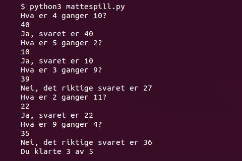

# Introduksjon {.intro}

I denne oppgåva skal me sjå meir på korleis Python arbeider med tal, og me skal
lage eit enkelt mattespel. Me skal òg sjå på korleis me kan gjere ting
tilfeldige.




# Steg 1: Ein kalkulator! {.activity}

Som dei fleste andre programmeringsspråk er Python glad i å rekne. La oss sjå
korleis me kan få Python til å rekne for oss.

## Sjekkliste {.check}

- [ ] Lag eit nytt IDLE-vindauge ved å velje `File > New File`.

- [ ] Me startar med å utforske korleis me kan bruke Python til å rekne ut enkle
  reknestykke. Skriv det følgjande nye programmet:

  ```python
  print(2 + 3)
  print(17 - 8)
  print(3 * 4)
  print(22 / 7)
  ```

  Lagre programmet med namnet `kalkulator.py` og køyr det.

- [ ] Når programmet køyrer vil det skrive ut 4 tal. Kjenner du att desse tala?
  Forstår du kva symbola `*` og `/` tyder? Du må gjerne endre på programmet og
  køyre det fleire gonger, slik at du er sikker på at du forstår korleis Python
  brukar pluss, minus, gange og dele.


# Steg 2: Me kastar terning {.activity}

For å lage eit mattespel vil me bruke tilfeldige tal. Tilfeldige tal blir omlag
som å slå terning for å finne eit tal.

## Sjekkliste {.check}

- [ ] For å lage tilfeldige tal skal me bruke ein ny Python-funksjon som heiter
  `randint` (her er `rand` ei forkorting for *random* som tyder tilfeldig, og
  `int` ei forkorting for *integer* som tyder heiltal). Denne funksjonen er
  ikkje med i grunnpakka til Python, men ligg i eit bibliotek som heiter
  `random`. Difor må me fortelje Python at me vil bruke dette biblioteket. Lag
  eit nytt program, `terning.py`, som ser slik ut:

  ```python
  from random import randint
  print(randint(1, 6))
  ```

  Når du køyrer programmet vil det skrive ut eit tilfeldig tal mellom 1 og 6.
  Køyr programmet fleire gonger. Forandrar talet seg?

- [ ] Prøv sjølv å forandre programmet slik at det skriv ut tilfeldige tal
  mellom 1 og 20! Eller mellom -1 og 1.

- [ ] Programmet `terning.py` viser korleis me kan late som om me slår ein
  terning i Python. Men korleis kan me late som me slår to terningar og så få
  summen av dei?

- [ ] Me kan utvide programmet til å slå terning mange gonger. Det er enklast å
  gjere med __for-løkker__. Viss du til dømes brukar koden under, så vil det sjå
  ut som du slår to terningar 25 gonger:

  ```python
  from random import randint

  for i in range(25):
      print(randint(1, 6) + randint(1, 6))
  ```


# Steg 3: Ei lita matteprøve {.activity}

No kan me bruke tilfeldige tal til å lage eit enkelt mattespel.

## Sjekkliste {.check}

- [ ] Lag eit nytt program som heiter `mattespel.py`. Me startar med å trekkje
  to tilfeldige tal, og lar Python gange dei saman:

  ```python
  from random import randint

  tal1 = randint(2, 12)
  tal2 = randint(2, 12)
  ```

- [ ] No vil me at Python skal gi oss eit reknestykke. Kan me bli spurt om å
  gange saman `tal1` og `tal2`? Prøv å leggje til denne linja nedst i programmet
  ditt:

  ```python
  print('Kva er ' + tal1 + ' ganger ' + tal2 + '?')
  ```

  Kva skjer når du køyrer programmet no?

- [ ] Du hugsar kanskje at me kan bruke `+` for å setje saman tekst? Det gjer me
  òg for å leggje saman tal. I linja over brukar me `+` på både tekst og tal, og
  då forstår ikkje Python heilt kva me meiner.

  For å fortelje Python at me vil setje saman tekst må me bruke funksjonen `str`
  for å gjere tala om til tekststrengar. Endre den siste linja så den ser slik
  ut i staden:

  ```python
  print('Kva er ' + str(tal1) + ' ganger ' + str(tal2) + '?')
  ```

  Virkar programmet ditt betre no? Prøv å køyre programmet fleire gonger. Blir
  du stilt forskjellige spørsmål?

- [ ] Neste steg er at me skal kunne svare på reknestykket. Til det brukar me
  igjen funksjonen `input`. Legg til linja

  ```python
  svar = input()
  ```

  nedst i programmet.

- [ ] No skal me få programmet til å sjekke at me har svart riktig. For å gjere
  det skal me bruke noko som heiter __if-testar__. Desse sjekkar om noko er
  sant, og me vil bruke dei for å sjekke om det er sant at svaret ditt er likt
  det faktiske svaret. Legg til ein __if-test__ nedst i programmet ditt slik som
  dette:

  ```python
  from random import randint

  tal1 = randint(2, 12)
  tal2 = randint(2, 12)

  print('Kva er ' + str(tal1) + ' ganger ' + str(tal2) + '?')
  svar = input()

  if svar == tal1 * tal2:
      print('Ja, svaret er ' + svar)
  else:
      print('Nei, det riktige svaret er ' + str(tal1 * tal2))
  ```

  Pass på at som i __for-løkker__ må du skyve koden i __if-testen__ inn mot
  høgre.

- [ ] Køyr programmet ditt. Virkar det? Kva skjer viss du svarar feil på ei
  oppgåve? Kva skjer viss du svarar riktig?

  Hmm... Det er eit problem med programmet vårt. Det seier at me svarar feil
  sjølv om me svarar riktig!

### Bugs {.protip}

Dette er eit døme på noko me kallar ein *bug* i eit program. Programmet køyrer,
men det gjer ikkje det me meinte og forventa at det skulle gjere. Sjølve ordet
*bug* tyder insekt, og grunnen til at me brukar det ordet er at i gamle dagar
var det faktisk eit problem at insekt flaug inn i datamaskinene og øydela
progam!

## Sjekkliste {.check}

- [ ] Problemet med programmet vårt er ikkje så lett å finne. Men sidan
  programmet alltid seier at svaret vårt er feil må det tyde at `svar` aldri er
  heilt lik `tal1 * tal2`. Igjen er problemet at Python meiner at tekst og tal
  er ulike ting.

  Når me brukar `input` til å lese inn `svar` vil det alltid vere tekst, sjølv
  om me berre skriv inn tal. På same måte som me kan gjere om tal til tekst med
  `str` kan me bruke `int` for å gjere om tekst til tal (hugs at `int` er ei
  forkorting for *integer* som tyder heiltal).

  Endre `if`-linja i programmet ditt til

  ```python
  if int(svar) == tal1 * tal2:
  ```

  Virkar programmet betre no?


# Steg 4: Telje riktige svar {.activity}

Det er litt keisamt å alltid starte programmet på nytt. La oss prøve å setje opp
fleire reknestykke etter kvarandre.

## Sjekkliste {.check}

- [ ] Korleis kan me lage ei løkke slik at programmet stiller oss, til dømes, 5
  reknestykke på rad før det blir avslutta? Prøv litt sjølv før du går vidare.

- [ ] Til slutt vil me at programmet skal telje kor mange riktige svar me
  klarar. For å gjere det skal me bruke ein varaibel som me kan kalle `ant_rett`
  (antal rette svar). Når me startar spelet passar me på at den er `0`, sidan me
  ikkje har svart noko endå. Kvar gong me svarar riktig kan me auke verdien av
  variabelen med 1. Om me legg til ei melding for å vise kor mange riktige svar
  spelaren klarte, så kan programmet sjå slik ut:

  ```python
  from random import randint

  ant_stykker = 5
  ant_rett = 0

  for i in range(ant_stykker):
      tal1 = randint(2, 12)
      tal2 = randint(2, 12)

      print('Kva er ' + str(tal1) + ' ganger ' + str(tal2) + '?')
      svar = input()

      if int(svar) == tal1 * tal2:
          print('Ja, svaret er ' + svar)
          ant_rett = ant_rett + 1
      else:
          print('Nei, det riktige svaret er ' + str(tal1 * tal2))

  print('Du fekk ' + str(ant_rett) + ' av ' + str(ant_stykker))
  ```


# Steg 5: Rekursjon, kva er det? {.activity}

Til slutt skal me sjå på noko som heiter rekursjon. Det er ein veldig stilig
idé, og brukast mykje i programmering.

Me vil skrive eit program som kan rekne ut fakultetet av eit tal. Fakultetet
finn ein ved å gange talet med alle tal som er mindre enn seg. Til dømes er
fakultetet av 4

```
fakultet(4) = 4 * 3 * 2 * 1 = 24
```

Trikset med rekursjon er at me kan redusere oppgåva til noko som er veldig likt,
men litt enklare. Til dømes kan me sjå at viss me hadde visst fakultetet av 3,
så hadde me funne fakultetet av 4 ved å berre gange det med 4:

```
fakultet(4) = 4 * 3 * 2 * 1 = 4 * fakultet(3)
```

Vidare kan me finne fakultetet av 3 viss me veit fakultetet av 2 og så vidare:

```
fakultet(3) = 3 * 2 * 1 = 3 * fakultet(2)
fakultet(2) = 2 * 1 = 2 * fakultet(1)
fakultet(1) = 1
```

## Sjekkliste {.check}

- [ ] La oss prøve å skrive eit program som jobbar på denne måten. Lag eit nytt
  program som du kallar `fakultet.py`:

  ```python
  def fakultet(tal):
      if tal == 1:
          return 1

  print(fakultet(1))
  ```

  Her brukar me fleire ting du har sett tidlegare. Hugs at `def` brukast for å
  lage eigne funksjonar. Her lagar me funksjonen `fakultet` som me etterpå
  kallar inne i `print`-funksjonen.

- [ ] Til no har me berre sagt at me veit at fakultetet av 1 er 1. Men no kjem
  det stilige. Me kan rekne ut fakultetet av __alle__ andre tal ved å leggje på
  ei enkelt kodelinje:

  ```python
  def fakultet(tal):
      if tal == 1:
          return 1
      return tal * fakultet(tal-1)

  print(fakultet(4))
  ```

  Denne linja seier at fakultetet til eit tal er talet sjølv ganger fakultetet
  til talet som er ein mindre.

  Prøv å rekne ut fakultetet av andre tal. Forstår du korleis det virkar? Det er
  nok ein uvant måte å tenke på, så det kan ta litt tid å bli vant til det.
