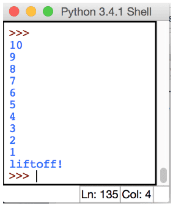
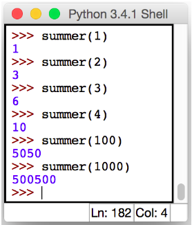

# Introduksjon

En ting som mennesker ikke er så flinke til, men som datamaskiner er eksperter
på, er å gjenta noe mange ganger etter hverandre. I python kan vi gjøre dette
med løkker, og dere vil snart se at dette kan spare oss for mye tid og skriving.


# Hello world! {.activity}

La oss ta et eksempel der vi vil ha Python til å si **Hei!** 100 ganger. En
mulighet er da å sette i gang å skrive:

```python
print("Hello  world!")
print("Hello  world!")
print("Hello  world!")
...
```

Som du ser vil dette ta lang tid. Programmerere vil gjerne løse en oppgave på
enklest mulig måte, og derfor har man funnet opp løkker som kan gjøre dette for
oss! Koden under løser problemet vi skulle løse på bare to linjer:

```python
for i in range(100):
    print(i, "Hello  world!")
```

Lurt, ikke sant?


# Range() {.protip}

Range-funksjonen er svært nytting når vi skal jobbe med løkker i Python. Når du
skriver `range(10)` får du en liste med tallene 0, 1, 2, 3, 4, 5, 6, 7, 8, 9.
Range kan også ta inn flere parametre. Skriver du `range(4, 6)`, får du en liste
med tallene fra 4 til (ikke med) 6, og hvis du skriver `range(6, 4, -1)` får du
de samme tallene i motsatt rekkefølge.


# Telle til 10 {.activity}

Bruk en for-løkke til å skrive ut alle tallene mellom 0 og 10.


# Liftoff {.activity}

- [ ] Bruk en for-løkke og range-funksjonen for å telle ned fra 10. Når du
  kommer til 0, skal programmet skrive **liftoff!**




# Summere 100 tall {.activity}

Et vanlig problem i matematikk er å summere sammen en rekke med tall. Dette er
veldig lett når man kan programmere! Lag en for-løkke som går fra 0 til 100, som
legger sammen alle tallene før den skriver ut resultatet. Svaret skal bli 5050.


# Summere n tall {.activity}

- [ ] Lag en funksjon `summer(n)`, som tar inn en parameter og returnerer summen
  av alle tallene fra 0 til `n`. Definer funksjonen slik:

```python
def summer(n):
    summert = 0
    # Din kode
    return summert
```

Når koden din er rett, skal den fungere slik som dette:


