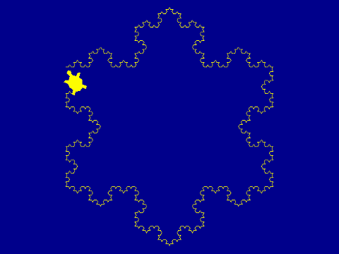
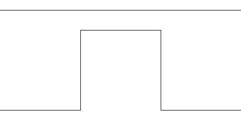
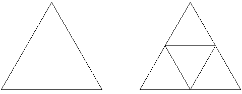
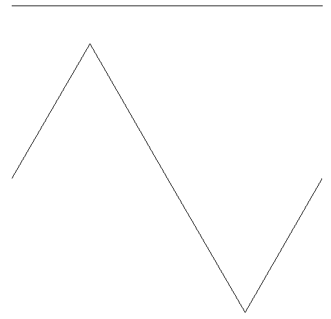

# Introduksjon {.intro}

No skal me jobbe vidare med skjelpaddekunsten frå tidlegare. Denne gongen skal
me teikne figurar som kallast fraktalar. Fraktalar er figurar som er bygd opp av
små kopiar av seg sjølv. I løpet av oppgåva skal me jobbe meir med funksjonar og
rekursjon.




# Steg 1: Hugsar du skjelpadda? {.activity}

Me har brukt skjelpaddebiblioteket `turtle` allereie. Du hugsar kanskje kode som
liknar på den under?

```python
from turtle import *

shape('turtle')
shapesize(2)
bgcolor('darkblue')
color('yellow')
speed(3)

forward(270)
```

## Sjekkliste {.check}

- [ ] Skriv inn programmet over. Lagre det med namnet `snoflak.py` og køyr det.
  Det skal bli teikna ein rett strek på skjermen.

- [ ] Prøv å endre på tala og fargene i koden slik at du forstår kva dei ulike
  kommandoane gjer. Finn du ein fargekombinasjon du likar?


# Steg 2: Ein fraktal {.activity}

Ein fraktal er ein figur som er bygd opp av mindre kopiar av seg sjølv. No skal
me sjå korleis me kan teikne denne figuren:


Dette er ein fraktal. Klarar du å sjå at den består av mange små kopiar av seg
sjølv? Det er kanskje lettare å sjå i dei neste figurane.


Den øvste figuren er berre ein rett strek. Den neste figuren består av fire
rette strekar som dannar eit enkelt fjell. Viss du ser nærare på den tredje
figuren ser du at den består av fire kopiar av det enkle fjellet, lagt slik at
dei dannar eit litt meir komplisert fjell.

Viss du ser tilbake på den fyrste figuren, ser du korleis den består av mange
små kopiar av slike fjell?


# Steg 3: Me går steg for steg {.activity}

Me skal sjå på korleis me kan lage funksjonar som kan teikne figurane over.

## Sjekkliste {.check}

- [ ] Den rette streken har me allereie teikna. La oss berre endre litt i
  programmet vårt slik at det blir ein funksjon:

  ```python
  from turtle import *

  shape('turtle')
  shapesize(2)
  bgcolor('darkblue')
  color('yellow')
  speed(3)

  def ein():
      forward(270)

  ein()
  ```

  Hugs at me må kalle funksjonen for at den skal gjere noko.

- [ ] No skal me leggje til ein funksjon `to()` som teiknar den andre figuren,
  det enkle fjellet Skriv denne funksjonen i den same fila.

  ```python
  def to():
      forward(90)
      left(60)
      forward(90)
      right(120)
      forward(90)
      left(60)
      forward(90)

  to()
  ```

  Ser du samanhengen mellom figuren og koden?

- [ ] Køyr programmet ditt. Hugs at du kan styre kva figurar som blir teikna med
  vigurane du kallar. Sjølv om både `ein` og `to` er definert treng du ikkje
  kalle begge funksjonane.

- [ ] I `to` har me brukt `forward(90)`, medan i `ein` brukte me `forward(270)`.
  Det tyder at me har teikna den rette streken med ein tredel av lengda den
  hadde fyrst. Men me har brukt vinklar slik at dei fire strekane i `to` til
  saman blir like lang som den eine streken i `ein`.

  No skal me endre litt i funksjonane slik at me brukar `ein` i staden for
  `forward` når me definerer `to`.

  ```python
  def ein(lengde):
      forward(lengde)

  def to(lengde):
      ein(lengde / 3)
      left(60)
      ein(lengde / 3)
      right(120)
      ein(lengde / 3)
      left(60)
      ein(lengde / 3)

  to(270)
  ```

- [ ] Køyr programmet att. Blir framleis dei same figurane teikna?

- [ ] No vil me teikne den tredje figuren. Ein måte å gjere det på er å
  kombinere `forward`, `left` og `right` slik me gjorde då me laga `to` fyrst.
  Du treng ikkje skrive inn koden, men sjå på den og samanlikn med figuren. Ser
  du at det stemmer?

  ```python
  def tre():
      forward(30)
      left(60)
      forward(30)
      right(120)
      forward(30)
      left(60)
      forward(30)
      left(60)
      forward(30)
      left(60)
      forward(30)
      right(120)
      forward(30)
      left(60)
      forward(30)
      right(120)
      forward(30)
      left(60)
      forward(30)
      right(120)
      forward(30)
      left(60)
      forward(30)
      left(60)
      forward(30)
      left(60)
      forward(30)
      right(120)
      forward(30)
      left(60)
      forward(30)
  ```

- [ ] Dette er ein keisam og tungvinn måte å programmere på! Me må skrive
  kjempemykje kode, det er fort gjort å gjere feil, og det tek tid å gjere
  endringar i koden.

  Men viss du ser litt nærare på koden ser du at linjene

  ```python
      forward(30)
      left(60)
      forward(30)
      right(120)
      forward(30)
      left(60)
      forward(30)
  ```

  går att fleire gonger. Samanlikn desse linjene med funksjonen `to` frå før.
  Ser du ein måte å forenkle koden vår på?

- [ ] Me har sett at koden til `tre` består av fleire kopiar av koden til `to`,
  berre krympa. Då kan me jo gjere det same trikset som før, me berre kallar
  `to`. Skriv inn følgjande kode i same fil som `ein` og `to`:

  ```python
  def tre(lengde):
      to(lengde / 3)
      left(60)
      to(lengde / 3)
      right(120)
      to(lengde / 3)
      left(60)
      to(lengde / 3)

  tre()
  ```

- [ ] Klarar du å teikna alle tre figurane no?


# Steg 4: Her kan me kombinere {.activity}

No skal me lage ein funksjon som kan teikne alle tre figurane!

## Sjekkliste {.check}

Så kjem det mest morosame. Før me kastar bort tid på å lage fleire funksjonar
for `fire`, `fem` og kanskje `seks`, så skal me sjå at me kan lage ein funksjon
som kan lage alle desse for oss!

- [ ] Samanlikn funksjonane `to` og `tre`. Ser du at dei er nesten heilt like?

No skal me bruke noko som heiter rekursjon for å lage ein funksjon som gjer
jobben til både `ein`, `to` og `tre`. Rekursjon hugsar du kanskje frå tidlegare.
Det tyder at me lagar ein funksjon som kallar seg sjølv, men for å gjere noko
som er litt enklare.

Med rekursjon ser ein gjerne på det enkle tilfellet og det generelle tilfellet.
For desse figurane er `ein` det enkle tilfellet der me berre treng å teikne ein
rett strek.

- [ ] Legg til denne funksjonen. Dette er det enkle tilfellet:

  ```python
  def fjell(lengde, djubde):
      if djubde == 1:
          forward(lengde)
          return
  ```

  Her brukar me `return` for å seie at me ikkje vil gjere meir for det enkle
  tilfellet.

- [ ] Det generelle tilfellet er det me har sett i `to` og `tre`. Med den nye
  variabelen `djubde` kan me lage både `to` og `tre` med same kode. Utvid
  funksjonen `fjell` så den ser slik ut:

  ```python
  def fjell(lengde, djubde):
      if djubde == 1:
          forward(lengde)
          return

      fjell(lengde / 3, djubde - 1)
      left(60)
      fjell(lengde / 3, djubde - 1)
      right(120)
      fjell(lengde / 3, djubde - 1)
      left(60)
      fjell(lengde / 3, djubde - 1)
  ```

  Kjenner du att koden frå før?

- [ ] Prøv å teikne

  ```python
  fjell(270, 2)
  ```

  og

  ```python
  fjell(270, 3)
  ```

  Gir dette same resultat som `to(270)` og `tre(270)`?

- [ ] Den nye funksjonen gjer endå meir enn `to` og `tre`. Me kan gå djupare enn
  me har gjort til no. Prøv til dømes `fjell(270, 6)`. Denne vil bruke litt tid.
  Bruk `speed(11)` for at skjelpadda skal bevege seg så raskt som mogleg.


# Steg 5: Eit snøflak {.activity}

No skal me kombinere fleire slike fjell til eit fint snøflak.

## Sjekkliste {.check}

- [ ] Til slutt skal me kombinere fleire kall til `fjell`-funksjonen vår for å
  teikne det fine snøflaket du såg heilt fyrst i oppgåva. Ser du korleis
  snøflaket består av tre fjell?

  Legg til denne funksjonen:

  ```python
  def snoflak(lengde, djubde):
      for i in range(3):
          fjell(lengde, djubde)
          right(120)
  ```

- [ ] Prøv å kalle denne `snoflak`-funksjonen med ulik lengde og djubde.

Dette snøflaket er ein av dei mest kjente fraktalane. Det har fått namnet "Kochs
snøflak" fordi ein av dei fyrste som studerte denne figuren heitte Helge von
Koch.


# Steg 6: Firkanta fjell {.activity}

No skal me sjå på ein annan variant av snøflaket.

## Sjekkliste {.check}

Me vil lage ein fraktal på same måte som Koch-figuren, men med ei anna form. I
staden for ein trekant som dannar fjellet vil me bruke ein firkant, som i
figuren under:



- [ ] Lag ein ny fil som du kallar `firkantfjell.py`.

- [ ] Som før kan me prøve å teikne fjellet med funksjonar for kvart steg. Til
  dømes

  ```python
  from turtle import *

  shape('turtle')
  shapesize(2)
  bgcolor('darkblue')
  color('yellow')
  speed(3)

  def ein(lengde):
      forward(lengde)

  def to(lengde):
      ein(lengde / 3)
      left(90)
      ein(lengde / 3)
      right(90)
      ein(lengde / 3)
      right(90)
      ein(lengde / 3)
      left(90)
      ein(lengde / 3)

  to(270)
  ```

- [ ] Men me har jo lært at det er mykje betre å bruke rekusjon. Me vil lage ein
  funksjon som kan teikne mange ulike firkantfjell ved at den kallar seg sjølv.

  Prøv sjølv om du får til å skrive den. Sjå på korleis me laga `fjell`
  tidlegare, og på korleis me laga `ein` og `to` sist.

  ```python
  def firkantfjell(lengde, djubde):
      if djubde == 1:
          # Her må du programmere det enkle tilfellet
          return

      # Her må du programmere det generelle tilfellet
  ```

- [ ] Test koden din. Blir det riktig? Under ser du eit døme på eit firkantfjell
  med djubde 6.

  


# Steg 7: Trekantar {.activity}

Me treng ikkje berre bruke rette strekar for det enkle tilfellet.

## Sjekkliste {.check}

No skal me lage ein fraktal basert på trekantar. La oss sjå på dei fyrste stega:



Her ser me at me har ein trekant som blir bytta ut med tre mindre trekantar.

- [ ] Lag ei ny fil `trekant.py` og legg til dei vanlege kommandoane på toppen
  av fila.

- [ ] I det enkle tilfellet vil me teikne ein trekant. Det kan me gjere slik:

  ```python
  def trekant(lengde, djubde):
      if djubde <= 1:
          pendown()
          for i in range(3):
              forward(lengde)
              left(120)
          penup()
          return
  ```

- [ ] For det generelle tilfellet må me stable tre trekantar. Det kan me gjere
  ved å bruke koden under. Samanlikn koden med figuren. Ser du samanhengen?

  ```python
      trekant(lengde / 2, djubde - 1)
      forward(lengde / 2)
      trekant(lengde / 2, djubde - 1)
      left(120)
      forward(lengde / 2)
      right(120)
      trekant(lengde / 2, djubde - 1)
      right(120)
      forward(lengde / 2)
      left(120)
  ```

- [ ] Teikn nokre trekantar med ulik djubde og storleik. Denne fraktalen er òg
  ganske kjent, og går ofte under namnet Sierpinski-trekanten.

## Prøv sjølv {.challenge}

Det finst mange fraktalar, og du kan lage dine heilt eigne!

Prøv til dømes å endre litt på vinklane og lengdene i `fjell`- eller
`firkantfjell`-funksjonane.

Kanskje du kan lage ein heilt annan figur? Prøv å teikne dine eigne `ein`- og
`to`-figurar, og så omset du dei til Python-kode.

Her er eit forslag til ein figur du kan prøve, men prøv å finne på noko sjølv!


