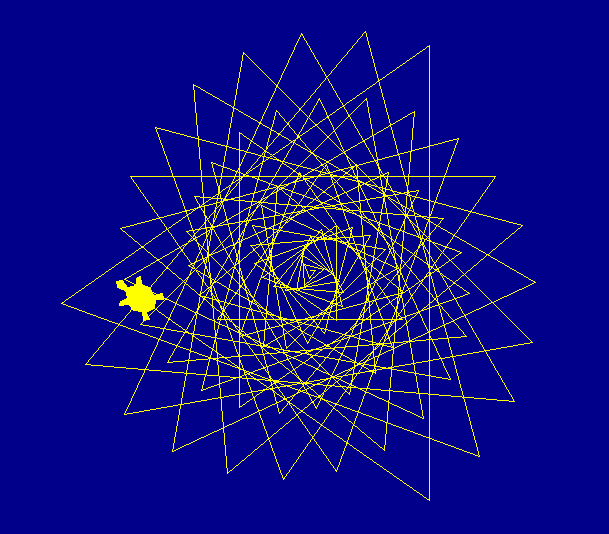

# Introduksjon {.intro}

Skilpadder (turtles på engelsk) er en form for roboter som har vært i
bruk innen programmering i lang tid. Vi vil bruke
skilpadde-biblioteket i Python til å utforske flere
programmeringskonsepter samtidig som vi tegner kule bilder.



# Steg 1: Møt skilpadden {.activity}

For å bruke skilpadder i Python må vi importere et bibliotek som heter
`turtle`. Slike biblioteker kalles *modules* i Python og brukes mye
for å organisere og gjenbruke kode som andre har skrevet. Det finnes
flere måter å importere biblioteker på i Python. Vi vil her bruke den
enkleste, hvor vi starter alle skilpaddeprogrammene våre med linjen

```python
from turtle import *
```

Her betyr `*` alt, slik at linjen sier `Importer all kode fra
turtle-biblioteket`.

### Turtles {.protip}

Navnet __Turtle__ betyr *skilpadde* på norsk. Bakgrunnen til dette
navnet er historisk. For nesten 70 år siden bygde William Grey Walter
et par roboter som kunne bevege seg rundt. Disse beveget seg ganske
sakte, og var lave og skallformet. De fikk derfor etterhvert
kallenavnet skilpadder.

Senere ble måten disse skilpaddene beveget seg på (vi skal se hvordan
snart) tatt inn i forskjellige programmeringsspråk, spesielt som en
måte å tegne på. Språket *Logo* er nok det som er mest kjent for slik
skilpaddegrafikk, men nesten alle programmeringsspråk støtter dette i
dag, inkludert for eksempel *Scratch*, *Lua* og *Python*.

## Sjekkliste {.check}

+ Det er på tide å lage vår første skilpadde. Start IDLE og åpne et
  nytt programmeringsvindu. I dette nye vinduet kan du skrive inn
  følgende kode:

  ```python
  from turtle import *

  shape('turtle')
  shapesize(2)
  bgcolor('darkblue')
  color('yellow')
  ```

  Lagre programmet med navnet `skilpadde.py` og kjør det. Du skal nå
  få opp et nytt vindu med en gul skilpadde på en blå bakgrunn. Hvis
  dette ikke skjer kan du se i det opprinnelige `Python
  Shell`-vinduet om du har fått en feilmelding.

+ La oss se litt nøyere på hva programmet gjør så langt. Det er en god
  ide å prøve å endre på ting i programmet for å se effekten av
  endringene og bedre forstå hvordan ting virker.

+ Linjen `shape('turtle')` sier at vi vil bruke en skilpaddefigur. I
  stedet for `turtle` kan du også prøve `arrow`, `circle`, `square`,
  `triangle` eller `classic`.

+ Med `shapesize(2)` forteller vi programmet hvor stor vi vil at
  skilpaddefiguren skal være. Prøv med andre tall!

+ Kommandoene `bgcolor` og `color` bestemmer fargene på henholdsvis
  bakgrunnen og på skilpaddefiguren. Python kjenner til veldig mange
  farger (men bare på engelsk), så prøv om du kan endre fargene til
  noe du liker.

+ I de senere programmene vil vi bruke disse linjene på toppen. Du kan
  gjerne bruke en variant av farger og figur som du liker bedre i
  stedet.

# Steg 2: En kunstnerisk skilpadde {.activity}

Skilpadden er ikke bare fin å se på. Den kan også tegne! I dette
steget vil vi bli kjent med noen enkle kommandoer som gjør skilpadden
om til en kunstner.

## Sjekkliste {.check}

+ Legg til en linje nederst i programmet ditt, slik at det ser slik
  ut:

  ```python
  from turtle import *

  shape('turtle')
  shapesize(2)
  bgcolor('darkblue')
  color('yellow')

  forward(200)
  ```

+ Når du kjører programmet vil du se at skilpadden har beveget seg
  forover et lite stykke, og at den har tegnet en strek der den
  beveget seg.

+ I tillegg til `forward` kan vi også bruke kommandoene `backward` for
  å gå bakover, `left` for å svinge mot venstre og `right` for å
  svinge mot høyre. Prøv for eksempel å endre programmet ditt til det
  følgende:

  ```python
  from turtle import *

  shape('turtle')
  shapesize(2)
  bgcolor('darkblue')
  color('yellow')

  forward(200)
  left(60)
  forward(50)
  backward(200)
  right(90)
  forward(100)
  ```

  Ser du at skilpadden utfører alle kommandoene du gir den?

+ Hvis vi setter sammen kommandoene litt systematisk kan vi tegne noen
  grunnleggende geometriske figurer. For eksempel, om vi vil tegne en
  firkant kan vi først gå fremover, deretter svinge 90 grader (mot
  høyre eller venstre), deretter fremover igjen, så svinge, så
  fremover, så svinge og til slutt fremover en gang til. I Python kan
  vi skrive dette som

  ```python
  from turtle import *

  shape('turtle')
  shapesize(2)
  bgcolor('darkblue')
  color('yellow')

  forward(100)
  right(90)
  forward(100)
  right(90)
  forward(100)
  right(90)
  forward(100)
  right(90)
  ```

  Tegner skilpadden en firkant når du kjører dette programmet?

+ Hva med en trekant? Hvordan må du forandre koden din for at
  skilpadden skal tegne en trekant i stedet for en firkant? Prøv selv
  å endre koden og kjør den, ble resultatet som du trodde?

# Steg 3: Gjenta deg selv {.activity}

Hvis du ser på koden vi har brukt for å tegne trekanter og firkanter
har vi stadig gjentatt oss selv. I stedet for at vi skriver samme kode
om og om igjen kan vi be Python gjenta deler av koden. Til dette
bruker vi __for-løkker__.

## Sjekkliste {.check}

+ Det følgende programmet tegner også en firkant, akkurat som det
tidligere programmet vi lagde:

  ```python
  from turtle import *

  shape('turtle')
  shapesize(2)
  bgcolor('darkblue')
  color('yellow')

  for i in range(4):
      forward(100)
      right(90)
  ```

  Endre koden din som over, og kjør programmet.

+ Legg merke til at linjene som kommer etter `for` er skjøvet inn til
  høyre. Dette er veldig viktig i Python, fordi det forteller hvor mye
  kode som skal gjentas i løkken. For å skyve koden inn på denne måten
  kan du bruke `Tab`-tasten i IDLE. For å trekke koden tilbake til
  venstre kan du trykke `Shift` og `Tab`.

+ Prøv å trekk linjen `right(90)` til venstre, slik at for-løkken ser
  slik ut:

  ```python
  for i in range(4):
      forward(100)
  right(90)
  ```

  Hva tror du programmet ditt vil gjøre nå? Forsøk å kjøre
  programmet for å se om du har rett!

  Skilpadden vil bare gå fremover fire ganger før den svinger til
  høyre en gang til slutt. Det betyr at den vil tegne en rett linje
  i stedet for en firkant.

+ Nå som vi bruker en for-løkke har det også blitt mye enklere å endre
  koden til å for eksempel tegne en trekant. Vi må endre 4 til 3 i
  for-løkken. I tillegg må vi endre vinkelen skilpadden snur ved hvert
  hjørne. For at skilpadden skal gå en runde rundt trekanten må den
  snu totalt 360 grader. Siden den snur tre ganger må den snu 120
  grader (360 delt på 3) i hvert hjørne. Programmet for å tegne en
  trekant blir dermed seende slik ut:

  ```python
  from turtle import *

  shape('turtle')
  shapesize(2)
  bgcolor('darkblue')
  color('yellow')

  for i in range(3):
      forward(100)
      right(120)
  ```

+ Prøv å endre programmet slik at det tegner andre mangekanter.
  Hvordan kan du tegne for eksempel en femkant, åttekant eller kanskje
  en femtenkant.

# Steg 4: Alle ting fortjener et navn {.activity}

Vi skal fortsette med å gjøre koden vår enda mer fleksibel ved å gi
ting navn. Dette vil også gjøre det enklere å forstå hva koden gjør.

## Sjekkliste {.check}

+ Vi innfører først variabler som sier hvor mange sider vi vil tegne,
  hvor lang hver side skal være og hvor mange grader vi skal snu ved
  hvert hjørne. Endre programmet ditt slik at det ser slik ut:

  ```python
  from turtle import *

  shape('turtle')
  shapesize(2)
  bgcolor('darkblue')
  color('yellow')

  sides = 4
  length = 100
  angle = 90

  for i in range(sides):
      forward(length)
      right(angle)
  ```

  Tegner programmet fortsatt en firkant?

+ Nå kan du få programmet til å tegne en trekant bare ved å endre
  verdiene på variablene dine. Prøv om du får det til?

+ Vi kan gjøre programmet enda smartere. I stedet for at du selv må
  regne vinkelen kan programmet gjøre det. Bytt ut linjen `angle = 90`
  med

  ```python
  angle = 360 / sides
  ```

  Nå kan du prøve å bare endre verdien av `sides` og kjøre om igjen.
  Tegner programmet de riktige mangekantene?

# Steg 5: Egne kommandoer {.activity}

I Python kan vi også lage våre egne kommandoer ved å definere
funksjoner.  Dette er en annen måte vi kan unngå å gjenta oss selv på.

## Sjekkliste {.check}

+ Vi skal nå lage en funksjon som tegner en mangekant. Dette gjør vi
  ved å bruke kommandoen `def` (def er en forkortelse for *define* som
  betyr definer). Endre programmet ditt slik at det ser ut som under:

  ```python
  from turtle import *

  shape('turtle')
  shapesize(2)
  bgcolor('darkblue')
  color('yellow')

  def polygon(sides, length):
      angle = 360 / sides

      for i in range(sides):
          forward(length)
          right(angle)

  polygon(4, 100)
  ```

  Kjør programmet. Kjenner du igjen firkanten?

+ Nå som vi har laget `polygon`-funksjonen er det kjempelett å tegne
  forskjellige mangekanter. Legg for eksempel til de følgende linjene
  nederst i programmet ditt:

  ```python
  polygon(3, 100)
  polygon(4, 100)
  polygon(5, 100)
  forward(125)
  right(180)
  polygon(3, 150)
  polygon(5, 150)
  polygon(7, 150)
  ```

# Steg 6: Skilpaddekunst {.activity}

Vi vil til slutt generalisere funksjonen vår litt slik at den ikke
bare tegner kjedelige mangekanter.

## Sjekkliste {.check}

+ Vi lager nå en ny funksjon `polylines` som ligner veldig mye på
  `polygon`, men hvor vi også kan endre på vinklene slik at de ikke
  alltid summerer seg til 360. Dette gjør underverker for kunsten vår!
  Endre programmet ditt slik at det ser slik ut:

  ```python
  from turtle import *

  shape('turtle')
  shapesize(2)
  bgcolor('darkblue')
  color('yellow')

  def polylines(sides, length, angle):
      for i in range(sides):
          forward(length)
          right(angle)

  polylines(5, 100, 144)
  ```

  Kjør programmet. Hva tegner skilpadden nå?

+ En annen variant kan være hvor vi tegner en litt skjev mangekant.
  For eksempel den følgende kommandoen vil tegne firkanter hvor
  vinklene er 91 grader i stedet for 90 grader. Dette blir
  overraskende stilig. Bytt ut `polylines`-kommandoen med

  ```python
  polylines(91, 200, 91)
  ```

+ Vi kan også endre lengden av strekene etterhvert som vi tegner.
  Dette skaper en fin spiraleffekt. Legg merke til hvor mye funksjonen
  `spiral` ligner på `polylines`:

  ```python
  from turtle import *

  shape('turtle')
  shapesize(2)
  bgcolor('darkblue')
  color('yellow')

  def polylines(sides, length, angle):
      for i in range(sides):
          forward(length)
          right(angle)

  def spiral(sides, length, angle):
      for i in range(sides):
          forward(length)
          right(angle)
          length = length + 5

  spiral(100, 5, 125)
  ```

+ Prøv forskjellige verdier i stedet for 100, 5 og 125 når du kaller
  `spiral`. Finner du noen verdier som gir spesielt fine bilder synes
  du?

## Prøv selv {.try}

Kombiner de forskjellige funksjonene vi har laget, `polygon`,
`polylines` og `spiral` med de andre skilpadde-kommandoene du har lært
som for eksempel `forward` og `left`. Klarer du å tegne enda mer
spennende kunstverk? Eller kanskje du kan tegne en by? Et hus kan for
eksempel lages ved først å tegne en firkant og deretter en trekant på
toppen for taket.

Et tips helt på slutten er at funksjonene `penup()` og `pendown()`
styrer om skilpadden tegner mens den flytter på seg. Disse er veldig
nyttige når man vil tegne flere figurer som ikke henger sammen.

Et annet tips er funksjonen `speed()`. Denne justerer hastigheten som
skilpadden tegner med. For eksempel vil `speed(1)` tegne veldig sakte,
mens `speed(11)` tegner kjempefort.
