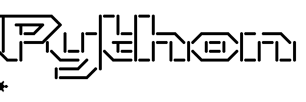
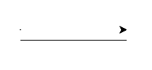
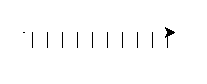
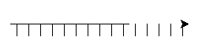
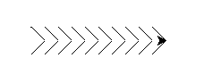

# Introduksjon {.intro}

I denne oppgåva skal me skrive kode slik at me kan skrive stor tekst ved hjelp
av `turtle`, slik som på biletet under.




# Steg 1: Tekst på fleire linjer {.activity}

Me har allereie lært at me skriv tekststrengar slik:

```python
tekst = "Hallo, verda!"
```

Men kva om me ynskjer å skrive tekst på fleire linjer? Då kan me bruke tre
`"`-teikn, på denne måten:

```
tekst = """
Dette er ein
tekst
over
mange linjer.
"""
```

## Sjekkliste {.check}

- [ ] Skriv inn programmet over, og køyr det. Kjem teksten på fleire linjer?

- [ ] Lagre det følgjande programmet som `skjelpaddetekst.py`, og sjå kva som
  skjer.

  ```python
  from turtle import *


  TEXT = """
  ______      _   _
  | ___ \    | | | |
  | |_/ /   _| |_| |__   ___  _ __
  |  __/ | | | __| '_ \ / _ \| '_ \\
  | |  | |_| | |_| | | | (_) | | | |
  \_|   \__, |\__|_| |_|\___/|_| |_|
         __/ |
        |___/
  """

  print(TEXT)
  ```

  No skal du sjå teksten printa ut i IDLE. Men kan me ikkje få skjelpadda til å
  skrive den for oss?

- [ ] Når me skal skrive teksten med skjelpadda er det enklast å gjere det linje
  for linje. Difor vil me dele opp `TEXT` i ei liste med enkeltlinjer. Til det
  brukar me `TEXT.split('\n')`. Me vil lagre lista i variabelen `LINES`.

  ```python
  LINES = TEXT.split('\n')

  print(LINES)
  ```


# Steg 2: Teikn med skjelpadda {.activity}

Me ser at teksten over består av teikna `\ | / _`. Det å lage desse kvar for seg
burde vere ein smal sak.

Viss me tenker oss at me teiknar kvart teikn i ein tenkt, kvadratisk boks, med
fleire boksar ved sidan av kvarandre på kvar linje, så bør det vere mogleg å
teikne teksten teikn for teikn. For å halde kontroll på skjelpadda bestemmer me
at kvar gong skjelpadda går inn i ein ny boks, så må den peike mot høgre, og
vere i hjørnet øvst til venstre. Når den er ferdig å teikne går den opp til
hjørnet øvst til høgre, og peikar mot høgre. Då er den klar til å teikne i neste
boks.

Tenk deg at boksane er i svart og me lagar raud skrift. Då vil det sjå slik ut:


## Sjekkliste {.check}

- [ ] Me startar med å leggje til storleiken på teikna, slik:

  (Pass på at denne koden ligg i same fil som `TEXT`-variabelen.)

  ```python
  SIZE  = 15
  ```

  No er `SIZE` ein variabel som inneheldt storleiken på boksen vår.

- [ ] Me lagar ein funksjon `underline` for å lage ein understrek:

  ```python
  def underline():
      penup()

      # Beveg skjelpadda ned til botnen av boksen
      right(90)
      forward(SIZE)
      left(90)

      # teikn understreken
      pendown()
      forward(SIZE)
      penup()

      # beveg skjelpadda opp til hjørnet øvst til høgre
      left(90)
      forward(SIZE)
      right(90)
  ```

- [ ] Køyr koden, og sjå kva som skjer:

  ```python
  underline()
  ```

- [ ] Kva om me vil lage 10 understrekar?

  ```python
  for n in range(10):
      underline()
  ```

  Det skal sjå slik ut viss du ikkje har feil i koden:

  

- [ ] Kva skjer viss du endrar storleiken på "boksen"? Prøv å endre på
  `SIZE`-variabelen, og sjå kva som skjer. Til dømes kan du prøve `5` og `50`.


# Steg 3: Endå eit teikn {.activity}

La oss prøve å lage teiknet `|`. Det er rett og slett berre ein strek som
teiknast loddrett, midt i boksen.

## Sjekkliste {.check}

- [ ] Me lagar funksjonen `bar` for å teikne `|`.

  ```python
  def bar():
      penup()

      # flytt til midten av boksen
      forward(SIZE/2)
      right(90)

      # teikn ein strek nedover
      pendown()
      forward(SIZE)
      penup()

      # flytt skjelpadda til hjørnet øvst til høgre
      left(180)
      forward(SIZE)
      right(90)
      forward(SIZE/2)
  ```

- [ ] Endre `for`-løkka me laga tidlegare:

  ```python
  for n in range(10):
      bar()
  ```

- [ ] Teiknar skjelpadda strekane på same linje, slik som på biletet under?

  


# Steg 4: Skjelpaddeteikn på fleire linjer {.activity}

Det er litt keisamt om alle teikna skal vere på ei linje, så no vil me lage ein
ny funksjon som lagar ei ny linje for oss.

For å kunne lage ei ny linje må funksjonen vite kor mange teikn den skal gå
tilbake. Difor må me deklarer funksjonen med ein parameter - ein variabel me kan
gi til funksjonen vår når me skal køyre den.

## Sjekkliste {.check}

- [ ] Skriv inn koden under:

  ```python
  def newline(lineLength):
      penup()

      right(90)
      forward(SIZE)
      right(90)

      forward(SIZE*lineLength)

      right(180)
  ```

  Denne koden går fyrst ned til linja under, så går den tilbake til starten av
  linja. Legg merke til at me kallar `forward` med `SIZE*lineLength` som
  argument. `lineLength` er kor mange teikn som er på linja me kom frå, og
  `SIZE` er kor stort kvart teikn er. Difor må skjelpadda flytte seg
  `SIZE*lineLength` pikslar tilbake.

- [ ] For å teste koden vår erstattar me dei andre `for`-løkkene med denne
  koden. Pass på at den blir plassert nedst i fila.

  ```python
  for i in range(10):
      underline()
  newline(10)
  for i in range(15):
      bar()
  ```

  Legg merke til at `newline` får inn kor mange teikn som vart skrive på linja
  over, ikkje kor mange som skal bli skrive på linja under!

  Det skal sjå omlag slik ut:

  


# Steg 5: Skjelpadder på skråplanet {.activity}

No har me berre to teikn att å lage! Nemleg `/` og `\`. Desse teikna må me lage
på skrå. Difor kan me ikkje lengre lage strekar med lengde `SIZE`, me må rekne
litt.

Viss du går på ungdomsskulen har du kanskje lært at samanhengen mellom katetane
(dei korte sidene) og hypotenusen (den lengste sida) i ein rettvinkla trekant er
slik `a² + b² = c²`. Slik kan me rekne ut lengda av diagonalen til firkanten.

Her skal du få svaret og sleppe å rekne det ut sjølv. Diagonalen i boksane våre
vil vere lik `(2*SIZE**2)**0.5`. Operatoren `**` tyder "opphøgd i", slik at
`3**2 = 9`. Når du opphøger noko i `0.5` er det det same som å ta kvadratrota av
talet. Dermed er `9**0.5 = 3`. Viss du lurar meir på korleis dette fungerer kan
du spørje ein rettleiar eller mattelæraren din.

## Sjekkliste {.check}

- [ ] Koden for ein "slash" (skråstrek), `/`, blir slik:

  ```python
  def slash(): # /
      penup()
      right(90)
      forward(SIZE)
      left(135)

      pendown()
      forward((2*SIZE**2)**0.5)
      penup()

      right(45)
  ```

- [ ] Koden for ein "backslash", `\`, blir slik:

  ```python
  def backslash(): # \
      penup()
      right(45)

      pendown()
      forward((2*SIZE**2)**0.5)
      penup()

      left(135)
      forward(SIZE)
      right(90)
  ```

- [ ] No skal me endre på `for`-løkkene våre og teste at koden blir korrekt.
  Pass igjen på at koden ligg nedst i fila di.

  ```python
  length = 10
  for i in range(length):
      backslash()
  newline(length)
  for i in range(length):
      slash()
  ```

  Denne gongen skal mønsteret bli slik:

  

  No er me nesten ferdige! Berre litt att...


# Steg 6: Skjelpaddetekst {.activity}

Me treng ein funksjon for å skrive blanke teikn, og me må kunne omsettje frå
tekstteikn til funksjonar. La oss starte med det enklaste.

## Sjekkliste {.check}

- [ ] For å skrive blanke teikn må me, enkelt og greitt, berre bevege oss til
  neste boks. Det gjer me slik:

  ```python
  def blank():
      forward(SIZE)
  ```

- [ ] For å omsetje frå tekstteikn til funksjonar kjem me til å bruke ei ordbok.
  På engelsk heiter det "dictionary", som er engelsk for ordbok. Den fungerer på
  den måten: me "slår opp" noko i ordboka, og får noko tilbake. I vårt tilfelle
  skal me slå opp på eit teikn, og få ein funksjon tilbake.

  Fyrst lagar me ordboka:

  ```python
  MOVES = {
      " " : blank,
      "_" : underline,
      "/" : slash,
      "|" : bar,
      "\\": backslash,

      "(" : bar,
      ")" : bar,
      "'" : blank,
      "," : blank
  }
  ```

  No kan me slå opp på teiknet `_` og få funksjonen `underline` tilbake. Det kan
  me gjere på denne måten:

  ```python
  function = MOVES["_"]
  ```

  Når me kallar `function` med `"_"` vil den gjere det same som `underline`:

  ```python
  function = MOVES["_"]
  function()
  ```

  Viss me vil sjekke om eit teikn er i ordboka, så kan me sjekke det slik:

  ```python
  if "_" in MOVES:
      function = MOVES["_"]
  ```

- [ ] No kan me lage ein ny funksjon, `create_text`, som lagar teksten vår.

  For å passe på at me får plass til all teksten vår vil me starte øvst til
  venstre i vindauget vårt. Det kan me fikse ved hjelp av `setx` og `sety` som
  let oss flytte skjelpadda til den posisjonen me vil.

  ```python
  def create_text():
      penup()
      setx(-window_width()/2)
      sety(window_height()/2)

      for line in LINES:
          for char in line:
              if char in MOVES:
                  move = MOVES[char]
              else:
                  move = blank
              move()
          newline(len(line))
  ```

  Som du kanskje ser har me ei `for`-løkke inni ei anna `for`-løkke. Den ytste
  (første) `for`-løkka går gjennom alle linjene i `LINES`, medan den innanfor
  går gjennom alle teikna i kvar linje. Inne i den inste `for`-løkka sjekkar me
  om me har ein funksjon for teiknet, og viss ikkje hoppar me over det ved å
  skrive eit blankt teikn i staden.

- [ ] For å køyre funksjonen vår lagar me ein `main`-funksjon som syt for å
  setje riktig fart og linjebreidde.

  ```python
  def main():
      shape("turtle")

      speed(11)
      width(5)
      create_text()

  main()
  ```

- [ ] Køyr koden og sjå resultatet ditt!

## Køyre koden uendeleg mange gonger {.challenge}

Viss du vil køyre koden uendeleg mange gonger kan du endre `main`-funksjonen
til:

```python
def main():
    shape("turtle")

    while true:
        speed(11)
        width(5)
        create_text()
        sleep(5)
        reset()
```

For at det skal fungere må me importere `sleep`-funksjonen. Det gjer me heilt på
toppen:

```python
from turtle import *
from time import sleep
```

Skjelpadda vil no lage teksten, vente i fem sekund (`sleep(5)`), og nullstille
vindauget ved hjelp av `reset()` før den startar på nytt.

## Utfordringar {.challenge}

Viss du går tilbake i ordboka me deklarerte i MOVES-konstanten vil du sjå at me
"juksa" med å teikne parentesar, `(` og `)`, som `|`. Me "juksa" òg ved å berre
teikne blanke teikn i staden for komma og apostrofar, `,` og `'`.

Prøv å lage desse sjølv! Det er enklast å lage `,` og `'`, for dei kan du teikne
som rette strekar. For å kunne lage `(` og `)` må du bruke det du har lært om
sirklar!

Lag kode for kvart teikn i ein eigen funksjon, og hugs å oppdatere `MOVES`. Til
dømes, viss du laga ein komma-funksjon, så må du endre

```
",": blank
```

til

`",": comma`,

der `comma` er namnet på funksjonen din.
