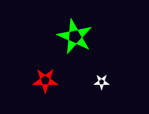
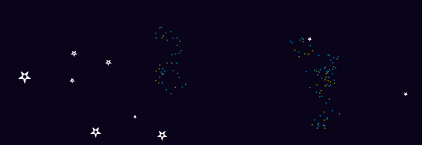
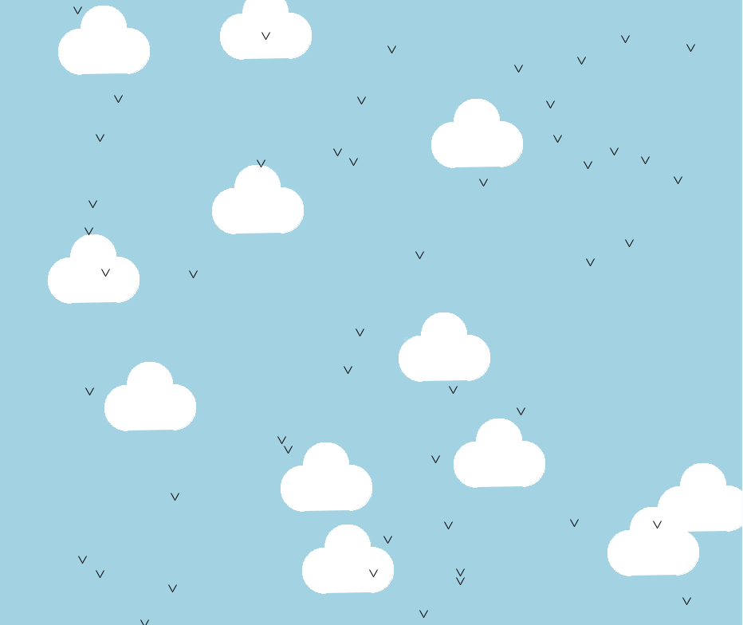

# Introduksjon {.intro}

I denne oppgaven skal vi bruke funksjoner for å gjøre programmene vi skriver enklere og mer oversiktlige.

# Steg 1: Tegne stjerner {.activity}

## Sjekkliste {.check}


+ Vi begynner med å bruke det du allerede kan om tegning med skilpadden. Kjør dette programmet:

  ```python
  from turtle import *

  # Denne koden tegner en liten grå stjerne på en mørkeblå bakgrunn
  color("WhiteSmoke")
  bgcolor("MidnightBlue")

  pendown()
  begin_fill()

  # Tegn stjernen
  for side in range(5):
      left(144)
      forward(50)

  end_fill()
  penup()

  forward(100)
  done()
  ```

  


+ Kan du alle komandoene? `bgcolor(color)` setter fargen på bakgrunnen.
Sørg for å forstå alle før du går videre.

+ Nå skal vi tegne tre stjerner på forskjellige posisjoner på skjermen. Vi lager en funksjon som heter `drawStar()` og kaller denne tre ganger for å tegne tre stjerner.

  ```python
  from turtle import *

  # En funksjon for å tegne stjerner
  # 'def' er kort for 'define' på engelsk
  def drawStar():
      pendown()
      begin_fill()
      for side in range(5):
          left(144)
          forward(50)
      end_fill()
      penup()

  # Denne koden tegner en liten grå stjerne på en mørkeblå bakgrunn
  color("WhiteSmoke")
  bgcolor("MidnightBlue")

  # Bruk funksjonen til å tegne stjerner!
  drawStar()
  forward(100)
  drawStar()
  left(120)
  forward(150)
  drawStar()

  hideturtle()
  done()
  ```

  

  `hideturtle()` gjemmer skilpadden.

  Du har sett og brukt funksjoner før. For eksempel, `penup()`og `pendown()` er funksjoner. Din nye `drawStar()`funksjon virker på samme måte. Nå som du har en funksjon for å tegne en stjerne trenger du ikke tenke på hvilke komandoer du må skrive for å tegne dem, du kan bare kalle funksjonen og den vil tegne stjernen for deg!


# Steg 2: Sende verdier inn i funksjoner {.activity}

Funksjonen du lagde i forrige steg tegner en like stor stjerne hver gang. Hva om du vil tegne stjerner med forskjellige størrelser? En måte du kan gjøre det på er å lage forskjellige funksjoner som `drawBigStar()` , `drawMediumStar()` eller `drawSmallStar()`

En bedre måte å gjøre det på er å sende inn verdier til funksjonen `drawStar()` for å fortelle hvilken størrelse du vil ha. Du har allerede brukt flere funksjoner som mottar verdier på denne måten. For eksempel: `forward(100)` Her sender du 100 inn funksjonen og det gjør at skilpadden går 100 piksler frem.


## Sjekkliste {.check}

+ Her er et program med en "stjernetegne-funksjon" som kan tegne stjerner i forskjellige størrelser ut i fra hvilket tall du sender inn i funksjonen.

  ```python
  from turtle import *

  # En funksjon for å tegne en stjerne med bestemt størrelse
  def drawStar(starSize):
      pendown()
      begin_fill()
      for side in range(5):
          left(144)
          forward(starSize)
      end_fill()
      penup()

  # Denne koden tegner en liten grå stjerne på en mørkeblå bakgrunn
  color("WhiteSmoke")
  bgcolor("MidnightBlue")

  # Bruk funksjonen til å tegne stjerner i ulike størrelse!
  drawStar(50)
  forward(100)
  drawStar(30)
  left(120)
  forward(150)
  drawStar(70)

  hideturtle()
  done()
  ```

  

+ Når programmet ditt kjører `drawStar(50)` er altså verdien til starSize lik 50. Dette gjør at kommandoen `forward(starSize)` inne i løkken tegner en linje som er 50 piksler lang.

  

+ Det er mulig å sende inn flere verdier inn i funksjonen. For eksempel kan vi sende inn hvilken farge vi vil at stjernen skal ha.

  ```python
  from turtle import *

  # En funksjon for å tegne en stjerne med bestemt størrelse og farge
  def drawStar(starSize, starColour):
      color(starColour)
      pendown()
      begin_fill()
      for side in range(5):
          left(144)
          forward(starSize)
      end_fill()
      penup()

  color("WhiteSmoke")
  bgcolor("MidnightBlue")

  # Bruk funksjonen til å tegne stjerner i ulike størrelse!
  drawStar(50, "Red")
  forward(100)
  drawStar(30, "White")
  left(120)
  forward(150)
  drawStar(70, "Green")

  hideturtle()
  done()
  ```

  Ser du hvilke endringer som er gjort i koden?

  

## Utfordring {.challenge}
Lag en funksjon for å tegne planeter og kall den `drawPlanet()` Send verdier inn i funksjonen slik at du kan bestemme hvor stor og hvilken farge den skal ha.


# Steg 3: Tilfeldige stjerner {.activity}
Vi skal nå bruke `drawStar()` til å tegne stjerner på tilfeldige steder rundt på skjermen.

## Sjekkliste {.check}

+ Kjør dette programmet. Skilpadden flyttes til en ny posisjon og tegner en hvit stjerne der.

  ```python
  from turtle import *

  # En funksjon for å tegne en stjerne med bestemt størrelse og farge
  def drawStar(starSize, starColour):
      color(starColour)
      pendown()
      begin_fill()
      for side in range(5):
          left(144)
          forward(starSize)
      end_fill()
      penup()

  # Setter bakgrunnsfargen
  bgcolor("MidnightBlue")

  # Flytt til en bestemt posisjon (x=200,y=200)
  penup()
  setpos(200, 200)
  pendown()

  drawStar(50, "White")

  hideturtle()
  done()

  ```
+ Vi bruker funksjonen `setpos(x, y)` til å flytte skilpadden til posisjonen (x,y) på skjermen. `setpos(200, 200)` flytter altså skilpadden til posisjonen (200, 200). Prøv å endre på tallene i denne funksjonen!

  

+ Vi skal nå flytte til en tilfeldig posisjon. Vi lager en ny funksjon som heter `moveToRandomLocation()`, denne flytter altså skilpadden til en tilfeldig posisjon.

  ```python
  from turtle import *
  from random import *

  # Flytter skilpadden til tilfeldig posisjon
  def moveToRandomLocation():
      penup()
      setpos(randint(-400, 400), randint(-400, 400))
      pendown()

  # Tegner en stjerne
  def drawStar(starSize, starColour):
      color(starColour)
      pendown()
      begin_fill()
      for side in range(5):
          left(144)
          forward(starSize)
      end_fill()
      penup()

  # mørkeblå bakgrunn
  bgcolor("MidnightBlue")

  # Tegner 30 stjerner med tilfeldig størrelse og posisjon
  for star in range(30):
      moveToRandomLocation()
      drawStar(randint(5, 25) , "White")

  hideturtle()
  done()
  ```

  

  Kjør koden flere ganger. Ser du at den tegner stjernene forskjellige plasser hver gang?
  Prøv å tegne flere stjerner i flere forskjellige størrelser og farger.

  `from random import *` gjør at vi får tilgang på funksjonen `randint(a,b)` . Hvis vi skriver `randint(5, 25)` gir denne funksjonen oss et tilfeldig tall som er større eller lik 5 og mindre enn eller lik 25.


# Steg 4: Funksjoner inne i funksjoner {.activity}
Du kan skrive funksjoner som kjører andre funksjoner. Dette gjør det lettere å ha oversikt når man lager store programmer.

## Sjekkliste {.check}
+ Det ville vært kult hvis vi kunne lage en galakse med små flerfargede stjerner i tegningen vår. Vi lager defor en funksjon som heter `drawGalaxy()` som bruker funksjonen `drawStar()` som vi laget tidligere.

  ```python
  from turtle import *
  from random import *

  # a function for moving the turtle to a random location
  def moveToRandomLocation():
      penup()
      setpos(randint(-400, 400), randint(-400, 400))
      pendown()

  # a function for drawing a star of a particular size
  def drawStar(starSize, starColour):
      color(starColour)
      pendown()
      begin_fill()
      for side in range(5):
          left(144)
          forward(starSize)
      end_fill()
      penup()

  # a function for drawing a small galaxy of stars
  def drawGalaxy(numberOfStars):
      starColours = ["#058396","#0275A6","#827E01"]
      moveToRandomLocation()
      # draw lots of small coloured stars
      for star in range(numberOfStars):
          penup()
          left(randint(-180, 180) )
          forward(randint(5, 20) )
          pendown()
          # draw a small star in a random colour
          drawStar( 2, choice(starColours) )

  speed(11)

  # this will draw a dark blue background
  bgcolor("MidnightBlue")

  # draw 30 white stars (random sizes/locations)
  for star in range(30):
      moveToRandomLocation()
      drawStar(randint(5, 25) , "White")

  # draw 3 small galaxies of 40 stars
  for galaxy in range(3):
      drawGalaxy(40)

  hideturtle()
  done()
  ```

  

  Ved å kjøre `drawGalaxy(40)` 3 ganger for vi 3 nye galakser som hver inneholder 40 stjerner. For hver galakse kjøres `drawStar()` 40 ganger, mellom hver gang flyttes posisjonen til den neste stjernen litt. Ser du hvor i koden dette skjer?

+ Du kan også tegne stjernebilder satt sammen av stjerner. Dette er ikke så vanskelig siden vi allerede har mange av funksjonene vi trenger.

  ```python
  from turtle import *
  from random import *

  # a function for moving the turtle to a random location
  def moveToRandomLocation():
      penup()
      setpos(randint(-400, 400), randint(-400, 400))
      pendown()

  # a function for drawing a star of a particular size
  def drawStar(starSize, starColour):
      color(starColour)
      pendown()
      begin_fill()
      for side in range(5):
          left(144)
          forward(starSize)
      end_fill()
      penup()

  # a function for drawing a small galaxy of stars
  def drawGalaxy(numberOfStars):
      starColours = ["#058396","#0275A6","#827E01"]
      moveToRandomLocation()
      # draw lots of small coloured stars
      for star in range(numberOfStars):
          penup()
          left(randint(-180, 180) )
          forward(randint(5, 20) )
          pendown()
          # draw a small star in a random colour
          drawStar( 2, choice(starColours) )

  # a function for drawing a joined constellation of stars
  def drawConstellation(numberOfStars):
      moveToRandomLocation()
      # first draw all stars except the last one,
      # joined by lines, like this: *--*--*--
      for star in range(numberOfStars-1):
          drawStar(randint(7, 15) , "white")
          pendown()
          left(randint(-90, 90) )
          forward(randint(30, 70) )
      # now draw the last star
      drawStar(randint(7, 15) , "White")

  speed(11)

  # this will draw a dark blue background
  bgcolor("MidnightBlue")

  # draw 30 white stars (random sizes/locations)
  for star in range(30):
      moveToRandomLocation()
      drawStar(randint(5, 25) , "White")

  # draw 3 small galaxies of 40 stars
  for galaxy in range(3):
      drawGalaxy(40)

  # draw 2 constellations, each with a random number of stars
  for constellation in range(2):
      drawConstellation(randint(4, 7))

  hideturtle()
  done()
  ```

  

## Utfordring {.challenge}
Programmér skilpadden til å tegne ditt eget bilde. Bruk funksjoner der du kan, spesielt til ting du skal gjøre flere ganger. Prøv også å bruke funksjoner som du kan sende inn verdier i.

# Eksempler {.activity}



