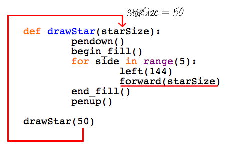
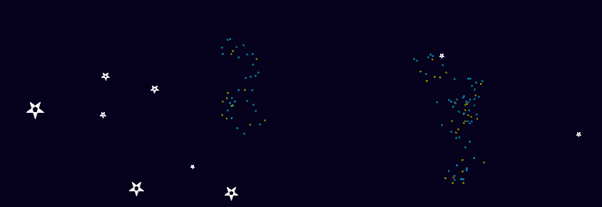

# Introduksjon {.intro}

I denne oppgåva skal me bruke funksjonar for å gjere programma me skriv enklare
og meir oversiktlege.


# Steg 1: Teikne stjerner {.activity}

## Sjekkliste {.check}

- [ ] Me startar med å bruke det du allereie kan om teikning med skjelpadda.
  Køyr dette programmet:

  ```python
  from turtle import *

  # Denne koden teiknar ei lita grå stjerne på ein mørkeblå bakgrunn
  color("WhiteSmoke")
  bgcolor("MidnightBlue")

  pendown()
  begin_fill()

  # Teikn stjerna
  for side in range(5):
      left(144)
      forward(50)

  end_fill()
  penup()

  forward(100)
  done()
  ```

  

- [ ] Kan du alle komandoane? `bgcolor(color)` set farga på bakgrunnen. Sjekk at
  du forstår alle før du går vidare.

- [ ] No skal me teikne tre stjerner på ulike posisjonar på skjermen. Me lagar
  ein funksjon som heiter `drawStar()` og kallar denne tre gonger for å teikne
  tre stjerner.

  ```python
  from turtle import *

  # Ein funksjon for å teikne stjerner
  # 'def' er kort for 'define' (definer) på engelsk
  def drawStar():
      pendown()
      begin_fill()
      for side in range(5):
          left(144)
          forward(50)
      end_fill()
      penup()

  # Denne koden teiknar ei lita grå stjerne på ein mørkeblå bakgrunn
  color("WhiteSmoke")
  bgcolor("MidnightBlue")

  # Bruk funksjonen til å teikne stjerner!
  drawStar()
  forward(100)
  drawStar()
  left(120)
  forward(150)
  drawStar()

  hideturtle()
  done()
  ```

  

  `hideturtle()` gøymer skjelpadda.

  Du har sett og brukt funksjonar før. Til dømes er `penup()`og `pendown()`
  funksjonar. Den nye `drawStar()`-funksjonen din virkar på same måte. No som du
  har ein funksjon for å teikne ei stjerne treng du ikkje tenke på kva
  kommandoar du må skrive for å teikne dei, du kan berre kalle funksjonen, så
  teiknar den stjerna for deg!


# Steg 2: Sende verdiar inn i funksjonar {.activity}

Funksjonen du laga i førre steg teiknar ei like stor stjerne kvar gong. Kva om
du vil teikne stjerner med ulike storleikar? Ein måte du kan gjere det på er å
lage ulike funksjonar, som `drawBigStar()`, `drawMediumStar()` og
`drawSmallStar()`.

Ein betre måte å gjere det på er å sende inn verdiar til funksjonen `drawStar()`
for å fortelje kva storleik du vil ha. Du har allereie brukt fleire funksjonar
som tek imot verdiar på denne måten. Til dømes tek `forward(100)` inn 100, og
gjer at skjelpadda går 100 pikslar framover.

## Sjekkliste {.check}

- [ ] Her er eit program med ein "stjerneteikne-funksjon" som kan teikne
  stjerner i ulike storleikar ut frå kva tal du sender inn i funksjonen.

  ```python
  from turtle import *

  # Ein funksjon for å teikne ei stjerne med bestemt storleik
  def drawStar(starSize):
      pendown()
      begin_fill()
      for side in range(5):
          left(144)
          forward(starSize)
      end_fill()
      penup()

  # Denne koden teiknar ei lita grå stjerne på ein mørkeblå bakgrunn
  color("WhiteSmoke")
  bgcolor("MidnightBlue")

  # Bruk funksjonen til å teikne stjerner i ulike storleikar!
  drawStar(50)
  forward(100)
  drawStar(30)
  left(120)
  forward(150)
  drawStar(70)

  hideturtle()
  done()
  ```

  

- [ ] Når programmet ditt køyrer `drawStar(50)` er altså verdien til starSize
  lik 50. Dette gjer at kommandoen `forward(starSize)` inne i løkka teiknar ei
  linje som er 50 pikslar lang.

  

- [ ] Det er mogleg å sende inn fleire verdiar inn i funksjonen. Til dømes kan
  me sende inn kva farge me vil at stjerna skal ha.

  ```python
  from turtle import *

  # Ein funksjon for å teikne ei stjerne med bestemt storleik og farge
  def drawStar(starSize, starColour):
      color(starColour)
      pendown()
      begin_fill()
      for side in range(5):
          left(144)
          forward(starSize)
      end_fill()
      penup()

  color("WhiteSmoke")
  bgcolor("MidnightBlue")

  # Bruk funksjonen til å teikne stjerner i ulike storleikar!
  drawStar(50, "Red")
  forward(100)
  drawStar(30, "White")
  left(120)
  forward(150)
  drawStar(70, "Green")

  hideturtle()
  done()
  ```

  Ser du kva endringar som er gjort i koden?

  

## Utfordring {.challenge}

Lag ein funksjon for å teikne planetar og kall den `drawPlanet()`. Send inn
verdiar i funksjonen slik at du kan bestemme kor stor den skal vere og kva farge
den skal ha.


# Steg 3: Tilfeldige stjerner {.activity}

No skal me bruke `drawStar()` til å teikne stjerner på tilfeldige stader rundt
på skjermen.

## Sjekkliste {.check}

- [ ] Køyr dette programmet. Skjelpadda blir flytta til ein ny posisjon og
  teiknar ei kvit stjerne der.

  ```python
  from turtle import *

  # Ein funksjon for å teikne ei stjerne med bestemt storleik og farge
  def drawStar(starSize, starColour):
      color(starColour)
      pendown()
      begin_fill()
      for side in range(5):
          left(144)
          forward(starSize)
      end_fill()
      penup()

  # Set bakgrunnsfarga
  bgcolor("MidnightBlue")

  # Flytt til ein bestemt posisjon (x=200, y=200)
  penup()
  setpos(200, 200)
  pendown()

  drawStar(50, "White")

  hideturtle()
  done()
  ```

- [ ] Me brukar funksjonen `setpos(x, y)` til å flytte skjelpadda til posisjonen
  `(x, y)` på skjermen. Då vil altså `setpos(200, 200)` flytte skjelpadda til
  posisjonen `(200, 200)`. Prøv å endre på tala i denne funksjonen!

  

- [ ] No skal me flytte til ein tilfeldig posisjon. Me lagar ein ny funksjon som
  heiter `moveToRandomLocation()`. Den skal flytte skjelpadda til ein tilfeldig
  posisjon.

  ```python
  from turtle import *
  from random import *

  # Flyttar skjelpadda til tilfeldig posisjon
  def moveToRandomLocation():
      penup()
      setpos(randint(-400, 400), randint(-400, 400))
      pendown()

  # Teiknar ei stjerne
  def drawStar(starSize, starColour):
      color(starColour)
      pendown()
      begin_fill()
      for side in range(5):
          left(144)
          forward(starSize)
      end_fill()
      penup()

  # Mørkeblå bakgrunn
  bgcolor("MidnightBlue")

  # Teiknar 30 stjerner med tilfeldig storleik og posisjon
  for star in range(30):
      moveToRandomLocation()
      drawStar(randint(5, 25) , "White")

  hideturtle()
  done()
  ```

  

  Køyr koden fleire gonger. Ser du at den teiknar stjernene ulike plassar kvar
  gong? Prøv å teikne fleire stjerner i fleire ulike storleikar og farger.

  Linja `from random import *` gjer at me får tilgang på funksjonen
  `randint(a,b)`. Viss me skriv `randint(5, 25)` gir denne funksjonen oss eit
  tilfeldig tal som er større enn eller lik 5 og mindre enn 25.


# Steg 4: Funksjonar inne i funksjonar {.activity}

Du kan skrive funksjonar som køyrer andre funksjonar. Dette gjer det enklare å
ha oversikt når ein lagar store program.

## Sjekkliste {.check}

- [ ] Det ville vore kult å kunne lage ein galakse med små fleirfarga stjerner i
  teikninga vår. Me lagar ein funksjon som heiter `drawGalaxy()` som brukar
  funksjonen `drawStar()` som me laga tidlegare.

  ```python
  from turtle import *
  from random import *

  # Flyttar skjelpadda til tilfeldig posisjon
  def moveToRandomLocation():
      penup()
      setpos(randint(-400, 400), randint(-400, 400))
      pendown()

  # Teiknar ei stjerne med bestemt storleik
  def drawStar(starSize, starColour):
      color(starColour)
      pendown()
      begin_fill()
      for side in range(5):
          left(144)
          forward(starSize)
      end_fill()
      penup()

  # Teiknar ei lita galakse med stjerner
  def drawGalaxy(numberOfStars):
      starColours = ["#058396","#0275A6","#827E01"]
      moveToRandomLocation()
      # Teiknar mange små, farga stjerner
      for star in range(numberOfStars):
          penup()
          left(randint(-180, 180) )
          forward(randint(5, 20) )
          pendown()
          # Teiknar ei lita stjerne med tilfeldig farge
          drawStar( 2, choice(starColours) )

  speed(11)

  # Mørkeblå bakgrunn
  bgcolor("MidnightBlue")

  # Teiknar 30 kvite stjerner med tilfeldig storleik og plassering
  for star in range(30):
      moveToRandomLocation()
      drawStar(randint(5, 25) , "White")

  # Teiknar 3 små galaksar med 40 stjerner
  for galaxy in range(3):
      drawGalaxy(40)

  hideturtle()
  done()
  ```

  

  Ved å køyre `drawGalaxy(40)` 3 gonger får me 3 nye galaksar som kvar inneheldt
  40 stjerner. For kvar galakse blir `drawStar()` køyrt 40 gonger. Mellom kvar
  gong flyttar skjelpadda seg litt og teiknar den neste stjerna. Ser du kor i
  koden dette skjer?

- [ ] Du kan teikne stjernebilete sett saman av stjerner. Det er ikkje så
  vanskeleg, sidan me allereie har mange av funksjonane me treng.

  ```python
  from turtle import *
  from random import *

  # Flyttar skjelpadda til tilfeldig posisjon
  def moveToRandomLocation():
      penup()
      setpos(randint(-400, 400), randint(-400, 400))
      pendown()

  # Teiknar ei stjerne med bestemt storleik
  def drawStar(starSize, starColour):
      color(starColour)
      pendown()
      begin_fill()
      for side in range(5):
          left(144)
          forward(starSize)
      end_fill()
      penup()

  # Teiknar ei lita galakse med stjerner
  def drawGalaxy(numberOfStars):
      starColours = ["#058396","#0275A6","#827E01"]
      moveToRandomLocation()
      # Teiknar mange små, farga stjerner
      for star in range(numberOfStars):
          penup()
          left(randint(-180, 180) )
          forward(randint(5, 20) )
          pendown()
          # Teiknar ei lita stjerne med tilfeldig farge
          drawStar( 2, choice(starColours) )

  # Teiknar eit stjernebilete
  def drawConstellation(numberOfStars):
      moveToRandomLocation()
      # Teiknar alle stjernene, bortsett frå den siste
      # kopla saman med linjer, som dette: *--*--*--
      for star in range(numberOfStars-1):
          drawStar(randint(7, 15) , "white")
          pendown()
          left(randint(-90, 90) )
          forward(randint(30, 70) )
      # Teiknar den siste stjerna
      drawStar(randint(7, 15) , "White")

  speed(11)

  # Mørkeblå bakgrunn
  bgcolor("MidnightBlue")

  # Teiknar 30 kvite stjerner med tilfeldig storleik og plassering
  for star in range(30):
      moveToRandomLocation()
      drawStar(randint(5, 25) , "White")

  # Teiknar 3 små galaksar med 40 stjerner
  for galaxy in range(3):
      drawGalaxy(40)

  # Teiknar to stjernebilete, kvar med eit tilfeldig antal stjerner
  for constellation in range(2):
      drawConstellation(randint(4, 7))

  hideturtle()
  done()
  ```

  

## Utfordring {.challenge}

Programmer skjelpadda til å teikne ditt eige bilete. Bruk funksjonar der du kan,
spesielt til ting du skal gjere fleire gonger. Prøv å bruke funksjonar du kan
sende inn verdiar i.


# Døme {.activity}


