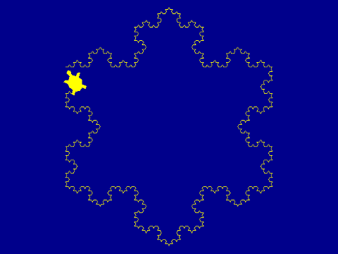
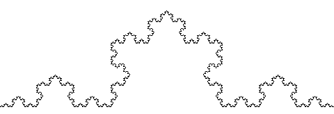
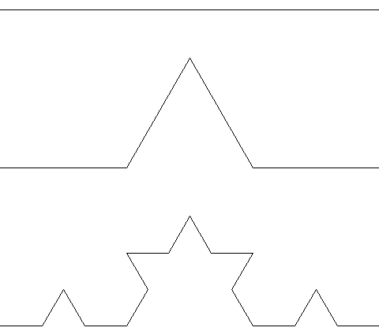
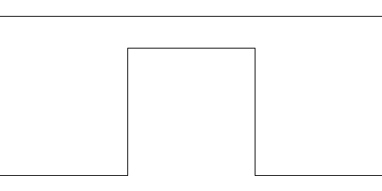
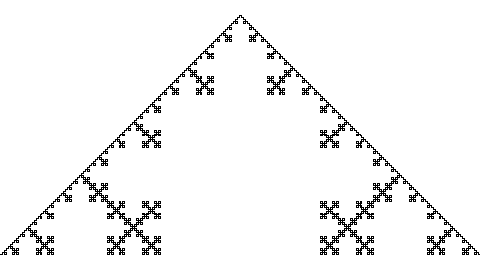
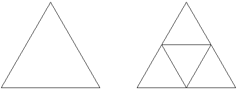
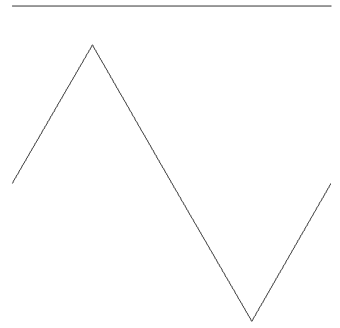

# Introduksjon {.intro}

Vi vil nå jobbe videre med skilpaddekunsten fra tidligere. Denne
gangen skal vi tegne forskjellige figurer som kalles
fraktaler. Fraktaler er figurer som bygges opp av små kopier av seg
selv. I løpet av leksjonen vil vi også jobbe mer med funksjoner og
rekursjon.



# Steg 1: Husker du skilpadden? {.activity}

Vi har brukt skilpaddebiblioteket `turtle` tidligere. Du husker
kanskje kode som lignet på den under?

```python
from turtle import *

shape('turtle')
shapesize(2)
bgcolor('darkblue')
color('yellow')
speed(3)

forward(270)
```

## Sjekkliste {.check}

+ Skriv inn programmet over. Lagre det med navnet `snoflak.py` og kjør
  det. En rett strek skal tegnes på skjermen.

+ Endre litt på tallene og fargene i koden slik at du husker hva de
  forskjellige kommandoene gjør. Finner du en fargekombinasjon du
  liker?

# Steg 2: En fraktal {.activity}

En fraktal er en figur som er bygd opp av mindre kopier av seg
selv. Vi skal nå se på hvordan vi kan tegne denne figuren:



Dette er en fraktal, klarer du å se at den består av mange små kopier
av seg selv? Det er kanskje lettere å se i de neste figurene?



Den øverste figuren er bare en rett strek. Den neste figuren består av
fire rette streker som danner et enkelt fjell. Hvis du nå ser nærmere
på den tredje figuren ser du at den består av fire kopier av det enkle
fjellet, igjen lagt slik at de danner et litt mer komplisert fjell.

Hvis du nå ser tilbake på den første figuren, ser du hvordan den
består av mange små kopier av slike fjell?

# Steg 3: Vi tar det stegvis {.activity}

Vi skal se på hvordan vi kan lage funksjoner som kan tegne figurene
over.

## Sjekkliste {.check}

+ Den rette streken har vi jo allerede tegnet. La oss bare endre litt
  i programmet vårt slik at dette blir en funksjon:

  ```python
  from turtle import *

  shape('turtle')
  shapesize(2)
  bgcolor('darkblue')
  color('yellow')
  speed(3)

  def en():
      forward(270)

  en()
  ```

  Husk at vi må kalle funksjonen for at den skal bli gjort.

+ La oss nå legge til en funksjon `to()` som tegner den andre figuren,
  det enkle fjellet. Skriv denne funksjonen i den samme filen.

  ```python
  def to():
      forward(90)
      left(60)
      forward(90)
      right(120)
      forward(90)
      left(60)
      forward(90)

  to()
  ```

  Ser du sammenhengen mellom figuren og koden?

+ Kjør programmet ditt. Husk at du kan styre hvilke figurer som tegnes
  med hvilke funksjoner du kaller. Selv om både `en` og `to` er
  definert trenger du ikke kalle begge funksjonene.

+ I `to` har vi brukt `forward(90)`, mens i `en` brukte vi
  `forward(270)`. Det betyr at vi har tegnet den rette streken tre
  ganger mindre. Men vi har brukt vinkler slik at de fire strekene i
  `to` tilsammen blir like lang som den ene streken i `en`.

  La oss endre litt i funksjonene slik at vi bruker `en` i stedet
  for `forward` når vi definerer `to`.

  ```python
  def en(lengde):
      forward(lengde)

  def to(lengde):
      en(lengde / 3)
      left(60)
      en(lengde / 3)
      right(120)
      en(lengde / 3)
      left(60)
      en(lengde / 3)

  to(270)
  ```

+ Kjør programmet igjen. Tegnes fortsatt de samme figurene?

+ Vi vil nå tegne den tredje figuren. En måte å gjøre dette på kan
  være å kombinere `forward`, `left` og `right` slik vi opprinnelig
  gjorde for `to`. Du trenger ikke skrive inn denne koden, men se på
  den og sammenlign med figuren. Ser du at det stemmer?

  ```python
  def tre():
      forward(30)
      left(60)
      forward(30)
      right(120)
      forward(30)
      left(60)
      forward(30)
      left(60)
      forward(30)
      left(60)
      forward(30)
      right(120)
      forward(30)
      left(60)
      forward(30)
      right(120)
      forward(30)
      left(60)
      forward(30)
      right(120)
      forward(30)
      left(60)
      forward(30)
      left(60)
      forward(30)
      left(60)
      forward(30)
      right(120)
      forward(30)
      left(60)
      forward(30)
  ```

+ Dette er en kjedelig måte å programmere på: Vi må skrive kjempemye
  kode, det er veldig lett å gjøre feil og det tar tid å gjøre
  endringer i koden.

  Hvis du ser litt nærmere på koden vil du se at linjene

  ```python
      forward(30)
      left(60)
      forward(30)
      right(120)
      forward(30)
      left(60)
      forward(30)
  ```

  går igjen flere ganger. Sammenlign disse linjene med funksjonen
  `to` fra tidligere. Ser du en måte vi kan forenkle koden vår?

+ Vi har sett at koden til `tre` består av flere kopier av koden til
  `to`, bare krympet. Da kan vi jo gjøre samme trikset som tidligere,
  vi bare kaller `to`. Skriv inn følgende kode i den samme filen som
  `en` og `to`:

  ```python
  def tre(lengde):
      to(lengde / 3)
      left(60)
      to(lengde / 3)
      right(120)
      to(lengde / 3)
      left(60)
      to(lengde / 3)

  tre()
  ```

+ Klarer du å tegne alle tre figurene nå?

# Steg 4: Her kan vi kombinere {.activity}

Nå skal vi lage en funksjon som kan tegne alle tre figurene!

## Sjekkliste {.check}

Nå kommer det morsomste. Før vi kaster bort tid på å lage flere
funksjoner `fire`, `fem` og kanskje `seks`, skal vi se at vi kan lage
en funksjon som kan lage alle disse for oss!

+ Sammenlign funksjonene `to` og `tre`. Ser du at de er nesten helt
  like?

Vi skal nå bruke noe som kalles rekursjon for å lage en funksjon som
gjør jobben til både `en`, `to` og `tre`. Rekursjon husker du kanskje
fra tidligere. Det betyr at vi lager en funksjon som kaller seg selv,
men for å gjøre noe som er litt enklere.

Med rekursjon ser man gjerne på det enkle tilfellet og det generelle
tilfellet. For disse figurene er `en` det enkle tilfellet hvor vi bare
trenger å tegne en rett strek.

+ Legg til denne funksjonen. Dette er det enkle tilfellet:

  ```python
  def fjell(lengde, dybde):
      if dybde == 1:
          forward(lengde)
          return
  ```

  Her bruker vi `return` for å si at vi ikke vil gjøre mer for det
  enkle tilfellet.

+ Det generelle tilfellet er det vi har sett tidligere i `to` og
  `tre`. Med den nye variabelen `dybde` kan vi lage både `to` og `tre`
  med samme kode. Utvid funksjonen `fjell` slik at den ser slik ut:

  ```python
  def fjell(lengde, dybde):
      if dybde == 1:
          forward(lengde)
          return

      fjell(lengde / 3, dybde - 1)
      left(60)
      fjell(lengde / 3, dybde - 1)
      right(120)
      fjell(lengde / 3, dybde - 1)
      left(60)
      fjell(lengde / 3, dybde - 1)
  ```

  Kjenner du igjen koden fra tidligere?

+ Prøv å tegn

  ```python
  fjell(270, 2)
  ```

  og

  ```python
  fjell(270, 3)
  ```

  Gir dette samme resultat som `to(270)` og `tre(270)`?

+ Den nye funksjonen gjør enda mer enn `to` og `tre`. Vi kan bruke
  enda større dybde. Prøv for eksempel `fjell(270, 6)`. Denne vil
  bruke litt tid. Bruk `speed(11)` for at skilpadden skal bevege seg
  så raskt som mulig.

# Steg 5: Et snøflak {.activity}

Vi skal nå kombinere flere slike fjell til et fint snøflak.

## Sjekkliste {.check}

+ Til sist skal vi kombinere flere kall til `fjell`-funksjonen vår for
  å tegne det fine snøflaket du så helt først i oppgaven. Ser du
  hvordan snøflaket består av tre fjell?

  Legg til denne funksjonen:

  ```python
  def snoflak(lengde, dybde):
      for i in range(3):
          fjell(lengde, dybde)
          right(120)
  ```

+ Prøv å kall denne `snoflak`-funksjonen med forskjellige lengder og
  dybder.

Dette snøflaket er en av de mest kjente fraktalene. Det har fått
navnet Kochs snøflak fordi en av de første som studerte denne figuren
het Helge von Koch.

# Steg 6: Firkantede fjell {.activity}

La oss se på en variant av snøflaket.

## Sjekkliste {.check}

Vi vil nå lage en fraktal på samme måte som Koch-figuren men med en
litt form. I stedet for en trekant som danner fjellet vil vi bruke en
firkant som i figuren under:



+ Lag en ny fil som du kaller `firkantfjell.py`.

+ Som tidligere så kan vi prøve å tegne dette nye fjellet med
  funksjoner for hvert steg. For eksempel

  ```python
  from turtle import *

  shape('turtle')
  shapesize(2)
  bgcolor('darkblue')
  color('yellow')
  speed(3)

  def en(lengde):
      forward(lengde)

  def to(lengde):
      en(lengde / 3)
      left(90)
      en(lengde / 3)
      right(90)
      en(lengde / 3)
      right(90)
      en(lengde / 3)
      left(90)
      en(lengde / 3)

  to(270)
  ```

+ Men vi har jo lært at det er mye bedre å bruke rekursjon. Vi vil
  lage en funksjon som kan tegne mange forskjellige firkantfjell ved
  at den kaller seg selv.

  Prøv selv om du kan skrive denne. Se på hvordan vi laget `fjell`
  tidligere, og på hvordan vi laget `en` og `to` nå sist.

  ```python
  def firkantfjell(lengde, dybde):
      if dybde == 1:
          # Her må du programmere det enkle tilfellet
          return

      # Her må du programmere det generelle tilfellet
  ```

+ Test koden din. Blir det riktig? Nedenfor ser du et eksempel hvor vi
  har laget et firkantfjell med dybde 6.

  

# Steg 7: Trekanter {.activity}

Vi trenger ikke bare bruke rette streker for det enkle tilfellet.

## Sjekkliste {.check}

Vi skal nå lage en fraktal basert på trekanter. La oss se på de første
stegene:



Her ser vi at vi har en trekant som byttes ut med tre mindre
trekanter.

+ Lag en ny fil `trekant.py` og legg til de vanlige kommandoene på
  toppen av filen.

+ I det enkle tilfellet vil vi nå tegne en trekant. Det kan vi gjøre
  på denne måten:

  ```python
  def trekant(lengde, dybde):
      if dybde <= 1:
          pendown()
          for i in range(3):
              forward(lengde)
              left(120)
          penup()
          return
  ```

+ For det generelle tilfellet må vi stable tre trekanter. Det kan vi
  gjøre for eksempel med koden under. Sammenlign koden med figuren.
  Ser du sammenhengen?

  ```python
      trekant(lengde / 2, dybde - 1)
      forward(lengde / 2)
      trekant(lengde / 2, dybde - 1)
      left(120)
      forward(lengde / 2)
      right(120)
      trekant(lengde / 2, dybde - 1)
      right(120)
      forward(lengde / 2)
      left(120)
  ```

+ Tegn noen trekanter med forskjellig dybde og størrelse. Denne
  fraktalen er også ganske kjent, og går ofte under navnet
  Sierpinski-trekanten.

## Prøv selv {.try}

Det finnes mange fraktaler, og du kan lage dine helt egne også!

Prøv for eksempel å endre litt på vinklene og lengdene i `fjell`- eller
`firkantfjell`-funksjonene.

Eller kanskje du kan lage en helt annen figur? Prøv og tegn dine egne
`en`- og `to`-figurer som du så oversetter til Python.

Her er et forslag til en figur du kan prøve, men prøv også å lage dine
egne!


