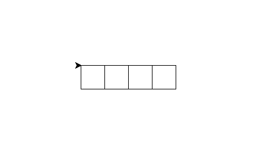
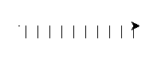
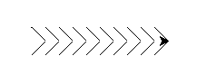

# Introduksjon {.intro}

I denne oppgaven skal vi skrive kode, slik at vi kan skrive stor tekst ved hjelp av `turtle` slik som på bildet under.


# Steg 1: Tekst på flere linjer {.activity}

Vi har allerede lært at tekststrenger skrives slik:
```python
tekst = "Hei, verden!"
```
Men hva hvis vi ønsker tekst på flere linjer? Da kan vi bruke tre `"`-tegn, på denne måten:
```
tekst = """
Dette er en
tekst
over
mange linjer.
"""
```

## Sjekkliste {.check}

* Skriv inn programmet over, og kjør det. Kommer teksten på flere linjer?

* Lagre det følgende programmet som skilpaddetekst.py, og se hva som skjer.

  ```python
  from turtle import *


  TEXT = """
  ______      _   _
  | ___ \    | | | |
  | |_/ /   _| |_| |__   ___  _ __
  |  __/ | | | __| '_ \ / _ \| '_ \\
  | |  | |_| | |_| | | | (_) | | | |
  \_|   \__, |\__|_| |_|\___/|_| |_|
         __/ |
        |___/
  """

  print(TEXT)
  ```

  Du skal nå se teksten printet ut i IDLE, men kan vi ikke få skilpadden til å skrive den for oss?

* Når vi skal skrive teksten med skilpadden, er det lettest å gjøre dette linje for linje, og det er derfor lettere om vi deler opp `TEXT` i en liste med enkeltlinjer. Til dette bruker vi `TEXT.split('\n')` som deler opp `TEXT` i flere linjer, og lagre denne i variabelen `LINES`.

  ```python
  LINES = TEXT.split('\n')

  print(LINES)
  ```

# Steg 2: Tegn med skilpadden {.activity}

Vi ser at teksten over består av tegnene `\ | / _`. Det å lage disse hver for seg burde være en smal sak.

Hvis vi tenker oss at vi tegner hvert tegn i en tenkt, kvadratisk boks, med flere bokser ved siden av hverandre på hver linje, så bør det være mulig å tegne teksten tegn for tegn. For å holde kontroll på skilpadden bestemmer vi at hver gang skilpadden går inn i en ny boks, så må den peke mot høyre (øst), og være i hjørnet øverst til venstre. Når den er ferdig å tegne går den opp til hjørnet øverst til høyre, og peker til høyre. Den vil da stå klar til å tegne neste boks.

Tenk deg at boksene er i svart, og vi lager rød skrift. Da vil det se slik ut:


## Sjekkliste {.check}

* Vi begynner med å legge til størrelsen på tegnene, slik:

  (Pass på at denne koden ligger i samme fil som `TEXT`-variabelen.)

  ```python
  SIZE  = 15
  ```

  `SIZE` er nå en variabel som inneholder størrelsen på boksen vår.

* Vi lager en funksjon `underline` for å lage en understrek:

  ```python
  def underline():
      penup()

      # Beveg skilpadden ned til bunnen av boksen
      right(90)
      forward(SIZE)
      left(90)

      # tegn understreken
      pendown()
      forward(SIZE)
      penup()

      # beveg skilpadden opp til hjørnet øverst til høyre
      left(90)
      forward(SIZE)
      right(90)
  ```

* Kjør koden, og se hva som skjer:

  ```python
  underline()
  ```

* Hva om vi ønsker å lage 10 understreker?

  ```python
  for n in range(10):
      underline()
  ```

  Det skal se slik ut, hvis du du ikke har feil i koden:
  

* Hva skjer hvis du endrer størrelsen på "boksen"? Prøv å endre på `SIZE` variabelen, og se hva som skjer. (Prøv for eksempel 5 og 50)

# Steg 3: Enda et tegn {.activity}

La oss prøve å lage tegnet `|`. Dette er rett og slett bare en rett strek som skal tegnes lodrett, midt i "boksen".

## Sjekkliste {.check}

* Vi lager funksjonen `bar` for å tegne `|`.

  ```python
  def bar():
      penup()

      # flytt til midten av boksen
      forward(SIZE/2)
      right(90)

      # tegn en strek nedover
      pendown()
      forward(SIZE)
      penup()

      # flytt skilpadden til hjørnet øverst til høyre
      left(180)
      forward(SIZE)
      right(90)
      forward(SIZE/2)
  ```

* Endre `for`-løkka vi lagde tidligere til å inneholde dette

  ```python
  for n in range(10):
      bar()
  ```

* Tegner skilpadden nå strekene på samme linje, slik som på bildet?

  

# Steg 4: Skilpaddetegn på flere linjer {.activity}

Det er jo litt kjedelig om alle tegnene bare skal være på en linje, så hva med å lage en
ny funksjon som lager en ny linje for oss?

For å kunne lage en ny linje  må funksjonen vite hvor mange tegn den skal gå tilbake, vi må derfor deklarere funksjonen, med et parameter - en variabel som vi kan gi til funksjonen når vi skal kjøre den.

## Sjekkliste {.check}

* Skriv inn koden under:

  ```python
  def newline(lineLength):
      penup()

      right(90)
      forward(SIZE)
      right(90)

      forward(SIZE*lineLength)

      right(180)
  ```

  Denne koden går først ned til linjen under, så går den tilbake begynnelsen av linjen. Legg merke til at vi kaller `forward` med `SIZE*lineLength` som argumenter. `lineLength` er hvor mange tegn som er på linjen vi kom fra, og `SIZE` er hvor stort hvert tegn er - dermed må skilpadden flytte seg `SIZE*lineLength` piksler tilbake.

* For å teste koden vår erstatter vi de tidligere `for`-løkkene med denne koden (pass på at dette blir plassert nederst i filen):

  ```python
  for i in range(10):
      underline()
  newline(10)
  for i in range(15):
      bar()
  ```

  Legg merke til at `newline` blir fortalt hvor mange tegn som ble skrevet på linjen over, ikke hvor mange som skal bli skrevet på linjen under!

  Dette skal se omtrent slik ut: 


# Steg 5: Skilpadder på skråplanet {.activity}

Nå har vi bare to tegn igjen å lage! Nemlig `/` og `\`. Disse tegnene må tegnes på skrå. Vi kan dermed ikke lenger tegne streker av lengde `SIZE`, vi er nødt til å regne litt.

Hvis du går på ungdomsskolen har du kanskje lært at sammenhengen mellom katetene og hypotenusen i et rettvinklet trekant er slik `a² + b² = c²`, det er dermed mulig å regne ut diagonalen til firkanten.

Her skal du bare få svaret og slippe å regne det ut selv. Diagonalen i boksene våre vil være lik `(2 * SIZE**2)**0.5`. `**`-operatoren betyr "opphøyd i" slik at `3**2` blir `9`. Når du opphøyer noe i `0.5`, er det det samme som å ta kvadratrota av tallet. Dermed vil `9**0.5` bli `3.0` Dersom du lurer på hvordan dette fungerer kan du spørre en CodeMaster/veileder, eller mattelæreren din.

## Sjekkliste {.check}

* Koden for en 'slash' - `/` blir slik:

  ```python
  def slash():
      penup()
      right(90)
      forward(SIZE)
      left(135)

      pendown()
      forward((2*SIZE**2)**0.5)
      penup()

      right(45)
  ```

* Koden for en 'backslash' - `\` blir slik:

  ```python
  def backslash(): # \
      penup()
      right(45)

      pendown()
      forward((2*SIZE**2)**0.5)
      penup()

      left(135)
      forward(SIZE)
      right(90)
  ```

* La oss endre på `for`-løkkene våre, og teste at koden blir korrekt (pass på at denne koden fremdeles ligger nederst).

  ```python
  length = 10
  for i in range(length):
      backslash()
  newline(length)
  for i in range(length):
      slash()
  ```

  Denne gangen skal mønsteret bli slik: 

  Nå er vi nesten ferdige! Bare litt igjen nå...

# Steg 6: Skilpaddetekst {.activity}

Vi trenger en funksjon for å skrive blanke tegn, og  vi trenger å oversette fra teksttegn til funksjoner. La oss begynne med det enkleste.

## Sjekkliste {.check}

* For å skrive blanke tegn, så må vi, enkelt og greit, bare bevege oss til neste boks. Det gjør vi slik:

  ```python
  def blank():
      forward(SIZE)
  ```

* For å oversette fra teksttegn til funksjoner kommer vi til å bruke en dictionary. Dictionary betyr ordbok, og det er akkurat slik den fungerer. Vi "slår opp" noe i ordboka, og får noe tilbake. I vårt tilfelle skal vi slå opp på tegn, og få en funksjon tilbake igjen.

  Først lager vi ordboka:

  ```python
  MOVES = {
      " " : blank,
      "_" : underline,
      "/" : slash,
      "|" : bar,
      "\\": backslash,

      "(" : bar,
      ")" : bar,
      "'" : blank,
      "," : blank
  }
  ```
  Nå kan vi slå opp på tegnet `-` og få funksjonen `underline` tilbake. Det kan vi for eksempel gjøre slik:

  ```python
  function = MOVES["_"]
  ```

  Når vi så kaller `function`, vil den gjøre det samme som `underline`
  ```python
  function = MOVES["_"]
  function()
  ```

  Dersom vi ønsker å sjekke om et tegn er i ordboka, så kan vi sjekke det slik:
  ```python
  if "_" in MOVES:
      function = MOVES["_"]
  ```

* Nå kan vi lage en ny funksjon, `create_text` som lager teksten vår.

  For å passe på at vi får plass til all teksten vår, ønsker vi å begynne øverst til venstre i vinduet vårt. Dette kan vi fikse ved hjelp av `setx` og `sety` som lar oss flytte skilpadden til den posisjonen vi ønsker.

  ```python
  def create_text():
      penup()
      setx(-window_width()/2)
      sety(window_height()/2)

      for line in LINES:
          for char in line:
              if char in MOVES:
                  move = MOVES[char]
              else:
                  move = blank
              move()
          newline(len(line))
  ```

  Som du kanskje ser, så har vi en `for`-løkke inni en annen `for`-løkke. Den ytterste (første) `for`-løkka går igjennom alle linjene i `LINES`, mens den innerste går igjennom alle tegnene i hver linje. Inni den innerste `for`-løkka sjekker vi om vi har en funksjon for tegnet, og hvis vi ikke har det så hopper vi bare over det ved å skrive et blankt tegn i stedenfor.

* For å kjøre funksjonen vår, lager vi en `main`-funksjon som sørger for å sette riktig fart og riktig linjebredde.

  ```python
  def main():
      shape("turtle")

      speed(11)
      width(5)
      create_text()

  main()
  ```

* Kjør koden og se resultatet ditt!

## Kjøre koden uendelig mange ganger {.try}

Dersom du ønsker å kjøre koden uendelig mange ganger, kan du endre `main`-funksjonen til:

```python
def main():
    shape("turtle")

    while true:
        speed(11)
        width(5)
        create_text()
        sleep(5)
        reset()
```

For at dette skal fungere må vi importere `sleep`-funksjonen. Dette gjør vi helt på toppen:

```python
from turtle import *
from time import sleep
```

Skilpadden vil nå lage teksten, vente i fem sekunder (`sleep(5)`), og nullstille vinduet ved hjelp av `reset()` før den starter på nytt.


## Utfordringer {.challenge}

Dersom du går tilbake til ordboka vi deklarerte i MOVES-konstanten vil du se at vi "jukset" ved å tegne paranteser - `(` og `)` som `|`. Vi "jukset" også ved å bare tegne et blankt tegn istedenfor komma og apostrof - `,` og `'`.

Prøv å lage disse på egenhånd! `,` og `'` er lettest, for disse kan tegnes som rette streker. For å kunne lage `(` og `)`, må du bruke det du har lært om sirkler!

Lag kode for hvert tegn i en egen funksjon, og husk og oppdatere `MOVES`. For eksempel, hvis du lagde en komma-funksjon så må du endre

`",": blank`

til

`",": comma`,

der `comma` er navnet på funksjonen din.
