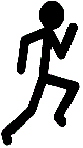

#Introduksjon {.intro}

I denne oppgaven skal du lage et spill der du styrer en strekmann som hopper over hindringer.


# Steg 1: Ny fil {.activity}

Begynn med å lage en fil som kan kjøres med Pygame Zero.

## Sjekkliste {.check}

+ Lag en ny fil `run_stickman.py`.

+ Du starter med å bestemme hvor stort vindu vi skal bruke:

    ```python
    WIDTH = 550
    HEIGHT = 250
    ```

+ Lagre og kjør programmet med `pgzrun run_stickman.py`. Se til at du får opp et vindu.

# Steg 2: Hindringer {.activity}

Du skal nå lage boksene som strekmannen løper mot. Dette skal gjøres ved hjelp av en klasse.


## Sjekkliste {.check}

+ Klassen skal hete Box og skal ha egenskapene: `height`, `width`, `color`,
  `x`, `y` og en funkson som heter `draw()`:

    ```python
    class Box:
        # Skriv egenskaper her

        def draw(self):
            # Skriv koden som tegner boksen her
    ```

    **Tips:**
    Bruk kommandoen `screen.draw.filled_rect()` for å tegne rektangler. En rød
    boks som er 50 piksler bred og høy tegnes i venstre topp med:

    ```python
    screen.draw.filled_rect( Rect((0, 0), (50, 50)) , (255, 0, 0) )
    ```

    En blå boks i høyre bunn blir:

    ```python
    screen.draw.filled_rect( Rect((WIDTH-50, HEIGHT-50), (50, 50)) , (0, 0, 255) )
    ```

+ Opprett en boks ved å legge til denne linjen i koden:

    ```python
    box = Box()
    ```

+ Lagre og kjør programmet for å sjekke at du ikke får noen feilmeldinger.

+ Hvis du vil se boksen i vinduet må du tegne den med:

    ```python
    def draw():
        box.draw()
    ```

# Steg 3: Strekmann {.activity}
Du skal nå lage en strekmann som vi skal kalle `stick_man`.

## Sjekkliste {.check}

+ Lag en strekmann (`stick_man`) fra klassen `Actor` som bruker bildet
  `running_man`.

    ```python
    stick_man = Actor('running_man')
    ```

+ Sett posisjonen til strekmannens venstre bunn til å være `50, HEIGHT`.

    ```python
    stick_man.bottomleft = 50, HEIGHT
    ```

 + For at koden skal kjøre må du lagre bildet av strekmannen under som `running_man.png` i mappen `images` der du har lagret `run_stickman.py`.

    

+ Mappen din skal nå se ut som dette:

    

# Steg 4: Funksjonene draw() og update() {.activity}

Alle spill i Pygame Zero må ha to globale funksjoner som heter `draw()` og
`update()`. Det som står i draw-funksjonen skal sørge for
at alt i spillvinduet blir tegnet. Det som står i update-funksjonen gjør
endringer i spillet før de tegnes med `draw()`.

**Tips:** Global betyr at funksjonene er i "bunnen" av programmet ditt, altså
ikke på boksen eller strekmannen.

## Sjekkliste {.check}

+ Lag den globale `draw()` med koden i blokken under. Forstår du hva koden gjør?

    ```python
    def draw():
            screen.clear()
            screen.fill((255, 255, 255))
            stick_man.draw()
            box.draw()
    ```

+ Du må nå lage `update()`. Du trenger følgende:
    - Få boksen til å flytte seg mot venstre.
    - Sjekk om boksen er ute av bildet på venstre side. Hvis det, flytt boksen til høyre side av vinduet.
    - Sjekk om strekmannen blir truffet av boksen. (Du skal lage funksjonen som gjør at han kan hoppe etterpå).

    ```python
    def update():
            
            if 'Sjekk om boksen treffer strekmannen':
                    print("Du ble truffet")

            elif 'Sjekk om boksen er ute av bildet':
                    #(Din kode) Flytt boksen til høyre side av bildet

            #(Din kode) Gjør at boksen flytter seg mot venstre
    ```


## Tips {.protip}

**Flytt boksen**

For å få boksen til å flytte seg kan du endre x-posisjonen til boksen.


**Sjekk om strekmannen blir truffet**

Legg merke til at y-aksen til spillvinduet er positiv nedover, motsatt av det
som er vanlig i matematikk. Boksens x- og y-posisjon er hvor boksens øverste
venstre hjørne er plassert, som er merket i bildet som **(x, y)**.


Den røde firkanten illustrerer hvor stort bildet til strekmannen er. I
tilfellet merket **1** ser du at boksens øverste venstre hjørne er
inni bildet til strekmannen. Dette må du sjekke i if-setningen.

I tilfelle **2** er boksens øvre høyre hjørne inne den røde firkanten, dette må
du også sjekke i if-setningen.


**Hvordan finne posisjonen til strekmannen?**

- `stick_man.bottom` gir posisjonen til bunnen av `stick_man`.

- `stick_man.left` gir posisjonen til venstre side av `stick_man`.


# Steg 5: Animasjoner {.activity}

Du skal nå lage funksjoner for å gjøre strekmannen i stand til å hoppe.

+ Vi trenger funksjonen on_key_up(key) som blir utført hvis man trykker på 'pilopp' på tastaturet.

```python
def on_key_up(key):
	#(Din kode)
```

+ Vi vil at det kun skal være lov til å hoppe hvis man står på bakken. Lag en if-setning som sjekker dette i funksjonen.

+ I if-setningen må du også sjekke at input-parameteren key er det samme som keys.UP. 

animate(...) er en funksjon som tar inn ulike parametere. I koden under animerer vi stick_man til å 'decelerate' som betyr å miste fart. Dette gjøres i en tidsperiode på 0.4 sekunder fra sin nåværende posisjon til posisjonen der bunnen av stick_man har x-verdi = (HEIGHT - box.height*1.5). Det vil si han kan hoppe 1,5 ganger så høyt som så hvor høy boksen er. Du kan endre disse verdiene for å endre vanskelighetsgrad på spillet.

```python
animate(stick_man, 'decelerate', duration = 0.4, bottom = (HEIGHT - box.height*1.5))
``` 
+ Du kan bruke koden over for å få strekmannen til å hoppe. 

Vi trenger nå en animasjon som gjør at strekmannen kommer ned til bakken igjen. Sammenlign med koden over og se om du skjønner hva som skjer.

```python
def back_down():
	animate(stick_man, 'accelerate', duration = 0.4, bottom = HEIGHT)
```

+ Legg til denne koden nederst i filen din.

+ Legg til koden under for å gjøre slik at når strekmannen når toppen av hoppet sitt settes animasjonen som gjør at han beveger seg ned i gang.

```python
clock.schedule_unique(back_down, 0.4)

```

Dette er en skisse på hvordan koden din skal se ut:

```python
def on_key_up(key):
	if "Strekmann på bakken og key er piltast-opp":

		#Animasjon oppover

		#Sett i gang animasjon ned
	
def back_down():
	#Animasjon ned
```

# Steg 6: Poeng {.activity}

+ Lag en variabel som heter score og gi den verdien 0.

 Du trenger også en variabel som holder styr på om du er blitt truffet. Strekmannen er ikke truffet i begynnelsen så denne skal ha verdien False.

+ Lag variabelen stick_man_hit.

Du trenger nå å bruke disse i update(). For at python skal forstå at der disse variablene du skal bruke må du skrive global foran dem øverst i funksjonen.

+ Slik skal de to øverste linjer i update() se ut:

```python
def update():
	global score
	global stick_man_hit

	...
```

+ Inne i update(), sett score = 0 hvis du blir truffet. Endre stick_man_hit til True.

+ Økt poengsummen med 10 poeng hvis du ikke ble truffet og boksen er ute av bildet på venstre side. Sett stick_man_hit til False.

Du trenger nå en funksjon som printer poengene:

```python
def print_score():
	global score
	screen.draw.text("Poeng: " + str(score), (400, 30), color = (0, 0, 0))
```

+ Legg funksjonen til i programmet.

+ Nå trenger du å kalle på denne funksjonen inne i draw().

## Test programmet ditt {.flag}

## Utfordringer: {.challenge}

- Utvid spillet slik at boksen har forskjellig høyde eller bredde for hver gang.

- Gjør at flere bokser kommer inn på skjermen samtidig.

- Dine egne ideer?
