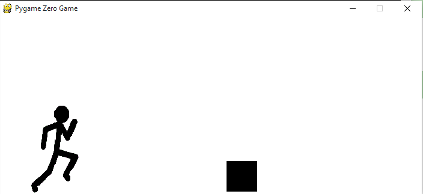

# Introduksjon {.intro}

I denne oppgaven skal du lage et spill der du styrer en strekmann som skal hoppe over hindringer.



# Steg 1: Ny fil {.activity}

Lag en ny fil.

Vi starter med å bestemme hvor stort vindu hvis skal bruke:

```python
WIDTH = 550
HEIGHT = 250
```
+ Lagre og kjør programmet, se at du får opp et vindu.

# Steg 2: Hindringer {.activity}

+ Du skal nå lage boksene som strekmannen løper mot. Dette skal du gjøre ved hjelp av en klasse.

Klassen skal hete Box og skal ha egenskapene:
height, width, color, x, y og en funkson som heter draw()

```python
class Box:
    # Skriv egenskaper her

    def draw(self):
    	# Skriv koden som tegner boksen her
```
**Tips:**
Denne koden tegner en boks som har det øverste venstre hjørnet i origo, er 50 piksler høy og bred, og har fargen rød:
```python
screen.draw.filled_rect( Rect((0, 0), (50, 50)) , (255, 0, 0))
```
og denne koden tegner en boks som har det øverste venstre hjørnet i punktet (25, 25) , er 100 piksler høy og bred, og har fargen blå:
```python
screen.draw.filled_rect( Rect((25, 25), (100, 100)) , (0, 0, 255))
```

+ Opprett en boks ved å legge til denne linjen i koden:
```python
box = Box()
```

+ Lagre og kjør programmet og se at du ikke får noen feilmeldinger. 

+ Hvis du vil se boksen i vinduet må du først tegne den. Dette gjør du med draw() funksjonen.

# Steg 3: Strekmann {.activity}

+ Du må nå gjøre at strekmannen blir med: 

Til dette skal vi bruke en klasse som heter Actor som allerede finnes i Pygame Zero. 

```python
stick_man = Actor('running_man')
stick_man.bottomleft = 50, HEIGHT
```

Første linje i koden sier at variabelen som heter stick_man er en 'Actor' som er bildet som heter 'running_man'. 

Andre linje setter posisjonen til nedre høyre hjørne av strekmannen til å være punktet (50, HEIGHT)

 + For at denne koden skal kjøre må du lagre bildet under som 'running_man.png' i en mappe som heter 'images' der du har lagret kodefilen.


Slik:


# Steg 4: De globale funksjonene draw() og update()  {.activity}

Alle spill i Pygame Zero må ha to globale funksjoner som heter draw() og update().

Det som står i draw-funksjon skal sørge for at som skal vises i spillviduet blir tegnet.

Det som står i update-funksjonen gjør alle endringer i spillet mellom hver gang tingene tegnes.

+ Vi trenger følgende kode i den globale draw(), pass på at du forstår hva koden gjør.

```python
def draw():
	screen.clear()
	screen.fill((255, 255, 255))
	stick_man.draw()
	box.draw()
```

+ Du må nå skrive koden i update().
Du trenger følgende:
	- Få boksen til å flytte seg mot venstre.
	- Sjekke om boksen er ute av bildet på venstre side av vinduet. Hvis det, flytt den til høyre side av vinduet.
	- Sjekke om strekmannen blir truffet av boksen. (Du skal lage funksjonen som gjør at han kan hoppe etterpå)
```python
def update():
	
	if 'Sjekk om boksen treffer strekmannen':
		print("Du ble truffet")

	elif 'Sjekk om boksen er ute av bildet':
		#Flytt boksen til høyre side av bildet

	#Gjør at boksen flytter seg mot venstre
```

**Tips:**

# Steg 5: Animasjoner {.activity}