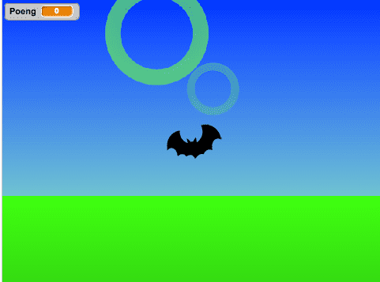

# Introduksjon {.intro}

I dette prosjektet skal me laga ein versjon av Flaksefugl (som er ein kopi av
Flappy Bird) i *tre dimensjonar*! Spelet går ut på at du styrar ein flygande
figur gjennom ringar som kjem mot deg. Du må styra figuren opp og ned og side
til side. Hovedutfordringa i dette spelet er å få det til å virka som om ringane
faktisk kjem mot flaksaren, og så forsvinn forbi. Prosjektet er delt inn i to
delar sidan det er ganske mykje me skal gjennom. I denne første delen skal me få
ringane til å fungera som dei skal. La oss sette i gong!




# Steg 1: Lag ringar, og få dei til å kome mot deg {.activity}

Spelet skal bestå av tre figurar: __Ring__, __Flakser__ og __Bakken__.

Me startar med å laga ringfiguren. Du kan enkelt teikne den sjølv som to sirklar
inni kvarandre, fylt med ein farge i mellom.

## Sjekkliste {.check}

- [ ] Teikne figuren __Ring__. Jo enklare jo betre.

- [ ] Gi ringfiguren desse skripta:

    ```blocks
        når eg får meldinga [Nytt spel v]
        gøym
        gjenta for alltid
            lag klon av [meg v]
            vent (1) sekund
        slutt

        når eg startar som klon
        gå til x: (0) y: (0)
        vis
        gjenta (10) gongar
            endra storleik med (5)
            vent (0.1) sekund
        slutt
        slett denne klonen
    ```

Du må og laga eit skript som syt for at meldinga `Nytt spel` blir sendt når du
klikkar på det grøne flaget.

## Test prosjektet {.flag}

- [ ] Kva gjer dei to skripta over? Ser det ut som om ringane kjem mot deg?

## Sjekkliste {.check}

Dei to skripta me har til no er ein OK start, men dei er ikkje gode nok til å
verkeleg kallast 3D! Tenk litt på korleis det virkar som om noko veks i
storleik når det kjem mot deg. Når det er langt unna så veks det ganske sakte,
medan når det er nærare så veks det mykje fortare. Dette skal me få til ved
hjelp av ein *variabel* som me kallar `distanse`{.blockdata}. Når
`distanse`{.blockdata} er stor, så er ringen langt borte, og skal vekse sakte.
Når `distanse`{.blockdata} er lita så betyr det at ringen er nære, og den skal
vekse fort.

- [ ] Lag ein variabel som heiter `distanse`{.blockdata}. Pass på at den berre
gjeld for denne figuren.

- [ ] Endre skriptet til dette:

    ```blocks
        når eg startar som klon
        gå til x: (0) y: (0)
        vis
        set [distanse v] til (10)
        gjenta til <(distanse) < (1)>
            set storleik til ((150) / (distanse)) %
            endra [distanse v] med (-0.5)
            vent (0.1) sekund
        slutt
        slett denne klonen
    ```

- [ ] Det kan hende du må endra litt på tala i skriptet over for at det skal sjå
bra ut. Prøv deg fram!

## Utfordring: Gjennomsiktig effekt {.challenge}

Dette er ikkje viktig for å kunne gå vidare med spelet, men prøv viss du vil.
For at det skal sjå endå meir ut som at ringane først er langt borte og så nære,
så kan du bruke klossen

```blocks
    set [gjennomsiktig v]-effekt til ((100)-((150)/(distanse))
```

for å gjera ringane meir gjennomsiktige når dei er langt borte. Kva tal må du
putta i denne klossen for at det skal sjå bra ut?


# Steg 2: Få ringane til å dukka opp tilfeldige stader {.activity}

*For at spelet skal bli mest mogleg utfordrande så burde ringane dukka opp på
forskjellige stader kvar gong.*

Å først få dei til å dukka opp på forskjellige stader er ikkje så vanskeleg,men
å få dei til å vekse på rett måte er litt vanskeleg.

## Sjekkliste {.check}

- [ ] Prøv først å endra på blokka som plasserar ring-klonane til

    ```blocks
        gå til x: (tilfeldig tal frå (-100) til (100)) y: (tilfeldig tal frå (-100) til (100))
    ```

    Det ser ganske bra ut, men ikkje helt rett, eller kva? Det er fordi
    *midtpunktet* til ringen er på same stad heile tida medan ringen er på veg
    mot deg. For at det skal sjå ut som at den susar *forbi deg* så må du heile
    tida flytta på ringen medan den er på veg mot deg. For å få det til å
    fungera må ringklonen hugsa kor den dukka opp til å begynne med.

- [ ] Lag variabler `ringX`{.blockdata} og `ringY`{.blockdata} som *berre gjeld
for ringfiguren*.

- [ ] Erstatt blokka som først plasserar ringen med dette:

    ```blocks
        set [ringX v] til (tilfeldig tal frå (-100) til (100)
        set [ringY v] til (tilfeldig tal frå (-100) til (100)
        gå til x: (ringX) y: (ringY)
    ```

    Forhåpentligvis har ikkje oppførselen til ringane endra seg endå. For å få
    midtpunktet til ringane til å flytta på seg medan ringane kjem mot deg kan
    du putte følgjande blokk ein stad inni løkka kor ringen veks:

    ```blocks
        gå til x: ((ringX) / (distanse)) y: ((ringY) / (distanse))
    ```

## Test prosjektet {.flag}

Trykk på det grøne flaget. Nå burde det sjå ut som om ringane verkeleg kjem mot
deg! No kan du ta ein pust i bakken og sjå over det du har skrive så langt.


# Steg 3: Styr ein flaksefigur med piltastane {.activity}

*I neste del av dette kurset skal me få ein figur til å fly gjennom ringane. I
dette steget skal me laga den figuren, men ikkje koda korleis den skal oppføra
seg.*

## Sjekkliste {.check}

- [ ] Lag ein ny figur. Det er best om den er symmetrisk, slik at det kan sjå
ut som om den flyg innover i skjermen utan at det ser teit ut, bruk til dømes
flaggermus-figuren. Kall den __Flakse__.

- [ ] Lag to nye variablar, `x`{.blockdata} og `y`{.blockdata}. La dei gjelde
*for alle figurer*.

- [ ] Gi Flakse følgjande skript:

    ```blocks
        når eg får meldinga [Nytt spel v]
        set [x v] til [0]
        set [y v] til [0]
        gjenta for alltid
            viss <tasten [pil høgre v] er trykt>
                endra [x v] med (10)
                vent (0.05) sekund
            slutt
            viss <tasten [pil venstre v] er trykt>
                endra [x v] med (-10)
                vent (0.05) sekund
            slutt
            viss <tasten [pil opp v] er trykt>
                endra [y v] med (10)
                vent (0.05) sekund
            slutt
            viss <tasten [pil ned v] er trykt>
                endra [y v] med (-10)
                vent (0.05) sekund
            slutt
        slutt
    ```

    No blir `x`{.blockdata} og `y`{.blockdata} endra når du styrar med
    piltastane. Me venter litt inni kvar `viss`{.blockcontrol}-test slik at
    `x`{.blockdata} og `y`{.blockdata} ikkje plutseleg veks over alle grenser.
    Test gjerne kva som skjer dersom me ikkje ventar.

- [ ] No vil me at posisjonen til ringane skal endra seg når me styrer. Det kan
me få til ved å endra klossen

    ```blocks
        gå til x: ((ringX) / (distanse)) y: ((ringY) / (distanse))
    ```

    til dette:

    ```blocks
        gå til x: (((ringX)-(x)) / (distanse)) y: (((ringY) - (y)) / (distanse))
    ```

    Ser det rett ut no? No er me i grunnen ferdig med det som trengst for å gå
    vidare til del 2. I del 2 skal me få det til å virke som om Flakse flaksar
    når me trykkjer på mellomromstasten, akkurat som i Flappy Bird og
    Flaksefugl. Prøv deg på desse utfordringane viss du har att meir tid.

## Ting å prøve {.try}

- [ ] Er det mogleg å styra figuren gjennom alle ringane? Husk at spelet skal
vera akkurat passe vanskeleg, og i alle fall ikkje umogleg. Gå gjennom alle
skripta og endra på verdiane slik at spelet er kjekt å spela, og slik at det
ser bra ut. Kanskje du må endra på storleiken til ringen, kor mykje ringane
skal veksa, kor mykje `x` og `y` endrar seg når du trykkjer på pilane, kor
lenge me ventar eller nokon av dei andre verdiane.

- [ ] Teikne din eigen figur! Flaggermusfiguren er kanskje ikkje heilt perfekt.
Prøv å sjå om du kan finna nokre bilete på nettet du kan bruka, eller teikne
din heilt eigen figur (den burde vera eit fugleliknande dyr). Hugs at det ser
mykje betre ut om figuren er symmetrisk. Det er lurt å gi figuren to draktar;
ein med vingene ned og ein med vingene opp. Då kan me seinere få Flakse til å
flaksa!
