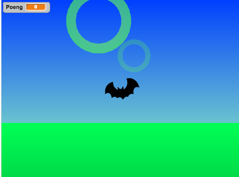

# Introduksjon {.intro}

Velkommen til andre og siste del av __3D-flaksar__! I denne delen skal me få
Flakse til å flakse som ein fugl, og snu seg i lufta når me svingar med
piltastene. Til slutt skal me legge til at ein får poeng når Flakse flyvningen
gjennom ein ring og tapar viss ein treff ein ring. Etter det er det opp til
deg. Lag ein meny, lag fleire vanskegradar eller noko heilt anna.



# Steg 1: Lag bakken og få den til å følgje med {.activity}

Me startar med eit enkelt steg som gjer spelet litt meir realistisk. Sidan
figuren flyg kan me vente at viss ein ikkje flaksar, så treff ein bakken
før eller seinare. Dette gjer me med ein ny figur som me kallar `bakken`.

## Sjekkliste {.check}

- [ ] Lag ein ny figur som heiter `bakken`. Teikn ei drakt til den. Det
  enklaste er å fylle den nedste tredjeparten av teikneområdet med grøn farge.
  Me startar med å gi den det følgande skriptet:

  ```blocks
  når eg får meldinga [Nytt spel v]
  gå til x: (0) y: (-300)
  set storleik til (200) %
  ```

  No bør bakken liggje nedst i scena når spelet startar. Viss ikkje bør du
  endre tala litt.

- [ ] No vil me at bakken skal følgje med Flakse, det vil seie at når Flakse
  er høgt oppe (`y`{.blockdata} er stor) så går bakken nedover, og når Flakse
  er langt nede skal bakken vere tilsvarande høgt oppe. Viss Flakse kjem
  borti bakken skal spelaren tape. Me legg til følgande
  `gjenta for alltid`{.blockcontrol}-løkke i skriptet til bakken:

  ```blocks
  gjenta for alltid
      set y til ((20) - (y))
      viss <rører [Flakse v]>
          sei [du tapte!] i (2) sekund
          stopp [alle v] :: control
      slutt
  slutt
  ```

- [ ] Til slutt vil me helst at bakken skal forsvinne heilt når Flakse flyg
  veldig høgt. Det kan me gjere med `gøym`{.blocklooks}- og
  `vis`{.blocklooks}-kommandoane:

  ```blocks
  viss <(y) < [150]>
      vis
  elles
      gøym
  slutt
  ```

# Steg 2: Få Flakse til å flakse {.activity}

Viss du har gjort del ein av 3D-flaksar riktig, så kan du styre Flakse
gjennom ringane med piltastane. Det er to ulemper med dette: det er eit veldig
lett spel, og det er ikkje slik fuglar flyg. Me vil at Flakse faktisk må
flakse for å halde seg i lufta. Derfor endrar me litt på skripta til flakse-
figuren, slik at den flaksar med vengjene når me trykkar mellomromtasten.

## Sjekkliste {.check}

- [ ] For å halde styr på kor mange gonger spelaren har trykka på mellomrom,
  så lagar me ein variabel `flaks`{.blockdata} som berre gjeld for Flakse.

- [ ] Me må slette testane som sjekkar om `pil opp`- eller `pil ned`-tastane
  blir trykka, og erstatte dei med

  ```blocks
  viss <tasten [mellomrom v] er trykt?>
      endra [flaks v] med (1)
      vent (0.01) sekund
  slutt
  ```

  Det som skjer no er at `flaks`{.blockdata} blir auka med éin kvar gong
  mellomrom blir trykka. Me lagar eit nytt skript for Flakse som tek seg av
  flaksinga.

- [ ] Lag ein ny variabel. Kall den `løft`{.blockdata}, og la den gjelde berre
  for denne figuren. Variabelen skal fortelje oss kor fort Flakse skal flyttast
  opp eller ned.

- [ ] Legg inn ein `set løft til 0`{.blockdata}-kloss ein stad før spelet
  startar.

- [ ] Set inn desse klossane fyrst i hovudløkka til Flakse:

  ```blocks
  endra [y v] med (løft)
  viss <(løft) > [-5]>
      endra [løft v] med (-0.5)
  slutt
  ```

- [ ] Til slutt lagar me eit nytt skript hjå Flakse:

  ```blocks
  når eg får meldinga [Nytt spel v]
  gjenta for alltid
      gjenta til <(flaks) = [0]>
          endra [flaks v] med (-1)
          viss <(løft) < [5]>
              endra [løft v] med (2)
          slutt
          viss <(løft) < [0]>
              sett [løft v] til [0]
          slutt
      slutt
  slutt
  ```

  Du kan justere på tala i skripta over for å få Flakse til å flyge slik DU vil!

# Steg 3: Få Flakse til å snu seg i lufta {.activity}

For at spelet skal sjå best mogleg ut vil me at Flakse skal rotere i lufta når
me heldt inne piltastane. Litt som eit fly som går inn for landing. Oppførselen
me ynskjer når (til dømes) høgre piltast blir trykka er at figuren skal peike
mot høgre, og halde seg slik så lenge piltasten er trykka. Når piltasten blir
slept opp skal figuren rotere sakte tilbake til de vanlege posisjonen sin.

Me må endre litt på hovudskriptet til Flakse.

## Sjekkliste {.check}

- [ ] Legg til klossane `peik i retning 135`{.blockmotion} og `peik i
  retning 45`{.blockmotion} i testane som sjekkar om høvesvis høgre og venstre
  piltast blir trykka. Prøv spelet og sjekk om figuren peiker i riktig retning.

- [ ] No vil me at figuren skal rotere tilbake til vassrett stilling når
  piltastane ikkje blir trykka inn lengre. Det kan me enkelt få til ved å
  leggje til nokre klossar under testane som sjekkar om piltastane blir trykka.

  ```blocks
  viss <(retning) < [90]>
      snu @turnRight (1) gradar
  slutt
  viss <(retning) > [90]>
      snu @turnLeft (1) gradar
  slutt
  ```

  Desse klossane syt enkelt og greitt for at figuren alltid prøver å peike i
  retning 90 (vassrett for figuren). No bør flyginga til Flakse sjå bra ut!

# Steg 4: Sjekk om Flakse treff ringane {.activity}

No vil me gi Flakse poeng kvar gong han flyg gjennom ein ring, og tape om han
treff ein ring. Denne oppførselen må me kode i `når eg startar som
klon`{.blockcontrol}-skriptet til ring-figuren.

## Sjekkliste {.check}

- [ ] Me startar med å sjekke om Flakse er borti ringen som ligg nærast. Hugs
  at det er `distanse`{.blockdata}-variabelen til ringen som fortel oss kor nær
  ringen er. Så me må heile tida sjekke om Flakse rører ringen, *og* om ringen
  faktisk er nære. Du må leggje til denne klossen i skriptet til ring-klonane.

  ```blocks
  viss <<rører [Flakse v]> og <(distanse) < [1.2]>>
      sei [du tapte!] i (1) sekund
      stopp [alle v] :: control
  slutt
  ```

  No stoppar spelet om du treff ein ring som er nære. Viss du vil kan du kode
  noko anna som skjer (kanskje ein berre mistar eit liv, eller det skal kome
  ein lyd?).

- [ ] Så vil me gi poeng for å flyge gjennom ringane. Lag ein variabel
  `poeng`{.blockdata} som gjeld for alle figurane. No må me sjekke at
  variablane `x`{.blockdata} og `y`{.blockdata}, som seier kor Flakse er, ikkje
  er for langt unna `ringX`{.blockdata} og `ringY`{.blockdata}. Me legg til
  desse klossane rett under hovudløkka til ringane, slik at det siste ringane
  gjer før dei blir sletta er å sjekke om Flakse er inni.

  ```blocks
  viss < <(x) < ((ringX) + (160))> og <(x) > ((ringX) - (160))> >
      viss < <(y) < ((ringY) + (160))> og <(y) > ((ringY) - (160))> >
          endra [poeng v] med (1)
      slutt
  slutt
  ```

  Fungerer skriptet som det skal? Kva er det eigentleg me sjekkar i den siste
  `viss`{.blockcontrol}-testen?

No er me ferdige med det viktigaste i spelet. Men det er framleis mykje
spanande du kan prøve!

## Ting å prøve {.challenge}

- [ ] Lag ein meny.

- [ ] Få ringane til å kome fortare mot deg etter kvart som du får fleire poeng.

- [ ] Gi Flakse fleire drakter så det ser ut som han flyg når han
  skiftar drakt.
