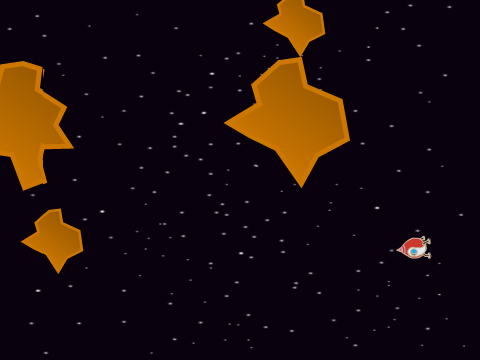
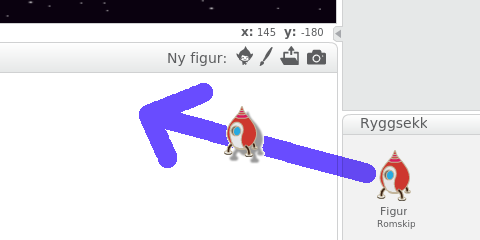
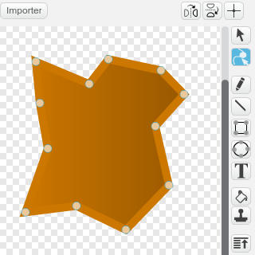

# Introduksjon {.intro}

På slutten av 1970-tallet ga Atari ut to spill hvor man skulle
kontrollere et romskip. Det første var Lunar Lander, men dette ble
utkonkurrert av Asteroids som Atari ga ut noen måneder senere.
Spillene var faktisk så like at de kunne gjenbruke mye av teknologien.
Vi skal gjøre det samme! Du må derfor ha laget
[Lunar Lander](../lunar_lander/lunar_lander.html) før du begynner på
dette prosjektet. I Asteroids er målet å beskytte romskipet mot
asteroider ved å skyte dem i småbiter.



# Oversikt over prosjektet {.activity}

*Mesteparten av kodingen av Asteroids skal du gjøre selv (og noe har
 du allerede gjort). I Asteroids vil vi spesielt se på noen av måtene
 man kan gjenbruke kode i Scratch.*

## Plan {.check}

+ Enda et flyvende romskip

+ Romskipet kan skyte!

+ Pass deg for asteroidene

+ .. og andre utfordringer

# Steg 1: Enda et flyvende romskip {.activity}

*I [Lunar Lander](../lunar_lander/lunar_lander.html) laget vi et flott
 romskip. Nå skal vi se hvordan vi kan bruke det samme romskipet i
 dette prosjektet.*

Du vet sikkert at du kan *Remikse* andres Scratch-prosjekter. Du får
da muligheten til å lage din egen versjon av noe andre har gjort, og
spesielt kan du gjenbruke kode andre har skrevet tidligere.

Nå skal vi se på et triks for å gjenbruke kode vi selv har laget
tidligere. Ved å bruke `Ryggsekken` kan man kopiere figurer og kode
mellom forskjellige prosjekter. Vi vil derfor først kopiere romskipet
vi laget i Lunar Lander.

## Sjekkliste {.check}

+ Åpne [Lunar Lander](../lunar_lander/lunar_lander.html)-prosjektet
  ditt.

+ Legg merke til at det står `Ryggsekk` helt nederst på skjermen.
  Klikk på `Ryggsekk` og et litt større felt skal åpne seg opp.

+ Dra hele romskip-figuren din til den åpne ryggsekken. En kopi av
  romskip-figuren blir værende i ryggsekken.

+ Start et nytt prosjekt ved å velge `Ny` i `Fil`-menyen. Slett
  kattefiguren og legg på en stjernebakgrunn.

+ Du kan nå dra romskip-kopien ut fra ryggsekken, og til figurvinduet
  i det nye prosjektet.

  

  Du vil nå se at alle draktene, alle variablene og alle skriptene til
  romskipet er kopiert over. Du kan rydde opp litt ved å slette skript
  som ikke har noe med kontrollen over romskipet å gjøre, for eksempel
  om du har et `Sjekk landing`-skript trenger vi ikke det i dette
  spillet.

+ Legg et skript på scenen som sender en melding til romskipet om
  at det skal begynne å fly når det grønne flagget klikkes. Prøv
  spillet ditt. Kan du fly romskipet rundt omkring?

+ Vi skal gjøre en liten forandring i hvordan romskipet oppfører
  seg. Asteroids foregår langt ute i rommet hvor det ikke er noen
  merkbar tyngdekraft. Slett derfor klossen som modellerer
  tyngdekraften i `for alltid`{.blockcontrol}-løkken din, `endre
  [fartY v] med (-0.01)`{.b}.

+ Vi skal også gjøre en litt større endring i spillet. Vi vil at
  verdensrommet skal føles litt stort og uoversiktlig ved at når
  romskipet går ut av skjermen på den ene siden skal det dukke opp på
  andre siden av skjermen.

  Dette gjør vi ved ganske enkle `hvis`{.blockcontrol}-tester. Det vi
  må huske på er at `x`-koordinatene på skjermen går fra `-240` til
  `240`, mens `y`-koordinatene ligger mellom `-180` og `180`. Siden
  Scratch passer på at figurer ikke går helt av skjermen flytter vi
  dem litt innenfor skjermkanten:

  ```blocks
  når jeg mottar [Nytt spill v]
  for alltid
      hvis <(x-posisjon) < [-235]>
          endre x med (470)
      slutt
      hvis <(x-posisjon) > [235]>
          endre x med (-470)
      slutt
      hvis <(y-posisjon) < [-175]>
          endre y med (350)
      slutt
      hvis <(y-posisjon) > [175]>
          endre y med (-350)
      slutt
  slutt
  ```

# Steg 2: Romskipet kan skyte {.activity}

*Romskipet vårt vil snart fly inn i en asteroidesverm, så vi må
 montere raketter som kan sprenge unna asteroidene.*

## Sjekkliste {.check}

+ Lag en ny figur som du kaller `Skudd`. Denne tegner du greit selv.
  Eventuelt finnes det for eksempel noen ball-figurer som kan brukes
  som kuler. Bruk en `sett størrelse`{.blocklooks}-kloss for at
  figuren skal bli passe stor. Legg også på en kloss for å
  `skjule`{.blocklooks} figuren.

+ Vi vil bruke kloner slik at vi kan skyte flere skudd. Først trenger
  vi koden som lager en ny skuddklone når mellomromtasten trykkes:

  Lag et skript på skudd-figuren som starter på `Nytt
  spill`-meldingen. Skriptet kan bestå av en `for
  alltid`{.blockcontrol}-løkke, hvor du tester på om mellomromtasten
  er trykket. Dersom et skudd skal avfyres kan du først la skuddet `gå
  til`{.blockmotion} romskipet og deretter peke i samme retning som
  romskipet. Dette siste kan du gjøre med en kombinasjon av `pek i
  retning`{.blockmotion}, `retning av`{.blocksensing} og
  `vend`{.blockmotion}-klosser. Til slutt kan du `lage en
  klon`{.blockcontrol} av figuren.

+ For å passe på at bare en melding sendes ut hver gang
  mellomromtasten trykkes kan vi starte `hvis`{.blockcontrol}-testen
  med å vente til mellomromtasten er sluppet igjen. Dette trikset ser
  omtrent slik ut:

  ```blocks
  hvis <tast [mellomrom v] trykket?>
      vent til <ikke <tast [mellomrom v] trykket?>>
      ...
  slutt
  ```

+ Nå skal vi kode oppførselen til skuddet etter at det er avfyrt. Det
  kan være ganske enkelt. Når skuddfiguren `starter som
  klon`{.blockcontrol} må den `vises`{.blocklooks}, og deretter kan
  den flyttes i en løkke før den til slutt slettes. Eksperimenter med
  hastigheten og rekkevidden på skuddet ved å endre på hvor mange
  ganger løkka gjentas og hvor mange steg figuren går inne i løkka.

+ Til slutt vil vi at også skuddene skal kunne forsvinne ut på den ene
  siden av skjermen og dukke opp igjen på den andre. Til dette vil vi
  bruke omtrent samme kode for romskipet.

  For å kopiere skript mellom figurer kan du bruke ryggsekken på samme
  måte som tidligere. En litt raskere metode er å bare dra skriptet du
  vil kopiere til den figuren du vil kopiere til.

  Kopier koden for å *warp'e* rundt skjermen fra romskipet til
  skudd-figuren.

+ Vi kan nesten bruke denne koden som den er. Den eneste endringen vi
  trenger å gjøre er at den skal starte på `når jeg starter som
  klon`{.b} i stedet for på `når jeg mottar [Nytt spill v]`{.b}, siden
  denne oppførselen skal gjelde for alle skuddklonene.

+ Prøv spillet ditt. Nå skal du kunne fly rundt i verdensrommet mens
  du skyter.

# Steg 3: Pass deg for asteroidene {.activity}

*Da er det på tide å lage en asteroidesverm. Noe av det som er kult
 med Asteroids er at asteroidene blir skutt i småbiter når de treffes,
 og man må fortsatt passe seg for og skyte disse mindre asteroidene.
 Vi vil kode dette ved å bruke kloner i forskjellige størrelser.*

## Sjekkliste {.check}

+ Lag en asteroidefigur. En måte å gjøre dette på er å tegne en ny
  figur med vektorgrafikk. Start med en enkel firkant, og bruk
  deretter `Bøy`-verktøyet for å legge til flere hjørnepunkter og
  flytte dem rundt som i figuren under.

  

+ Også for asteroidene vil vi bruke kloner. Lag et skript som
  `skjuler`{.blocklooks} figuren og lager et par asteroide-kloner
  tilfeldige steder på skjermen når det mottar `Nytt spill`-meldingen.

+ Når figuren `starter som klon`{.blockcontrol} vil vi først at den
  `peker`{.blockmotion} i en tilfeldig retning og deretter
  `vises`{.blocklooks}. Videre kan den gå inn i en løkke som `gjentas
  til`{.blockcontrol} figuren `berører romskipet`{.blocksensing}. Inne
  i løkken lar du først asteroiden `gå noen
  steg`{.blockmotion}. Deretter må du teste om asteroiden `berører et
  skudd`{.blocksensing}. Hvis den gjør det kan du lage asteroiden
  mindre med en kloss som ligner

  ```blocks
  sett størrelse til ((størrelse) / (2)) %
  ```

  `Hvis`{.blockcontrol} `størrelsen`{.blocklooks} fortsatt er større
  enn for eksempel 10 kan du lage et par nye kloner av denne mindre
  asteroiden. Til slutt kan du `slette denne klonen`{.blockcontrol}
  uansett hva størrelsen er.

+ Legg på en melding eller en `stopp`{.blockcontrol}-kloss slik at
  spillet kan avsluttes etter at `gjenta til`{.blockcontrol}-løkken
  avsluttes, siden romskipet da har krasjet i en asteroide.

+ Også asteroidene skal kunne fly ut av skjermen på en side og dukke
  opp på en annen. Kopier derfor skriptet som fikser dette fra
  skudd-figuren på samme måte som tidligere.

+ Til slutt vil vi også slette skudd-klonene når de treffer
  asteroidene. Her må vi være litt forsiktig så vi ikke sletter
  skudd-klonene før asteroidene merker at de er truffet. Dette kan vi
  fikse ved å legge inn en ørliten forsinkelse. Du kan for eksempel
  legge inn kode som dette i løkka som flytter skudd-figuren:

  ```blocks
  hvis <berører [Asteroide v] ?>
      vent (0.01) sekunder
      slett denne klonen
  slutt
  ```

# Steg 4: Videreutvikling av spillet {.activity}

*Du har nå laget en enkel variant av Asteroids. Men prøv å gjøre
 spillet morsommere ved å videreutvikle det. Du bestemmer selv hvordan
 du vil jobbe videre, men nedenfor er noen ideer som kanskje kan være
 til inspirasjon?*

## Ideer til videreutvikling {.check}

+ Gi poeng når spilleren treffer en asteroide. Man burde kanskje få
  flere poeng for å treffe de små asteroidene? Det kan du fikse med en
  utregning omtrent som

  ```blocks
  avrund ((100) / (størrelse))
  ```

+ Dersom du plasserer asteroidene helt tilfeldig når et nytt spill
  starter er det ganske sannsynlig at romskipet krasjer i en asteroide
  allerede før spillet har begynt. Det er ikke noe moro. En måte å
  fikse det på vil være å først la asteroideklonen
  `gå til romskipet`{.blockmotion}, men deretter peke i en tilfeldig
  retning og `gå 100 til 200 steg`{.blockmotion} før det til slutt
  `vises`{.blocklooks}.

+ Spillet ser litt kulere ut om du tegner flere asteroidedrakter, og
  velger en av dem tilfeldig når en klon lages.

+ Dersom man klarer å skyte ned alle asteroidene burde man komme
  videre til et vanskeligere nivå. Kanskje med flere asteroider? Eller
  med asteroider som beveger seg raskere? Eller deler seg i flere
  deler når de blir skutt?

  For å vite når du kan gå videre til et nytt nivå må du telle hvor
  mange asteroider som flyr rundt. Lag derfor en variabel `Antall
  asteroider`{.blockdata} som du øker med 1 når en asteroide `starter
  som klon`{.blockcontrol}. Deretter må variabelen minke med 1 når
  klonen slettes.

  Videre bruker du en `Nivå`{.blockdata}-variabel som holder styr på
  hvilket nivå spilleren har kommet til.

+ I det originale Asteroids-spillet dukket det også opp en flyvende
  tallerken (UFO) innimellom. Denne måtte man også passe seg for, men
  i motsetning til asteroidene kunne UFOen skyte tilbake. Prøv å legg
  til en slik UFO i spillet ditt!
