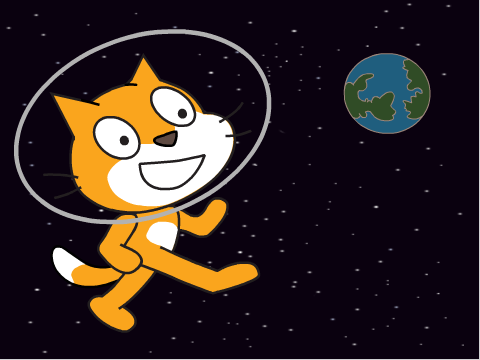
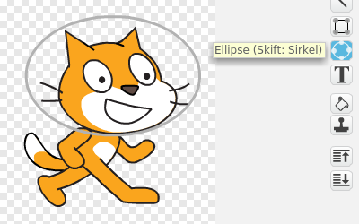

# Introduksjon {.intro}

Katten vår har så lyst å være en astronaut, la oss se om vi kan hjelpe
ham? Underveis vil vi lære hvordan vi flytter figurer rundt på
skjermen, og hvordan katter blir påvirket av gravitasjonskreftene fra
jorden.



# Steg 1: En flyvende katt {.activity}

Vi begynner prosjektet vårt med å få katten til å fly!

## Sjekkliste {.check}

+ Start et nytt prosjekt. Du vil se en katt som venter på å bli
  programmert!

+ Prøv å klikk på de blå klossene midt på skjermen. For eksempel, om
  du klikker på

  ```blocks
  gå (10) steg
  ```

  skal du se at katten flytter litt på seg, og om du klikker på

  ```blocks
  vend høyre (15) grader
  ```

  vil den snu seg! Disse klossene er kommandoer vi kan gi til
  katten!

+ Legg merke til at at over de blå klossene er det flere kategorier av
  kommandoer i forskjellige farger, for eksempel
  `Utseende`{.blocklooks} og `Lyd`{.blocksound}. Klikk på disse
  kategoriene og prøv noen av klossene du finner!

+ For å sette sammen flere kommandoer til et skript kan du dra klosser
  til det store tomme området til høyre på skjermen.

  Prøv å pusle sammen disse klossene (bruk fargene for å finne
  riktig kategori):

  ```blocks
  når grønt flagg klikkes
  for alltid
      gå (10) steg
      vend høyre (15) grader
  slutt
  ```

## Test prosjektet {.flag}

Legg merke til at den første klossen sier at noe skal skje når vi
klikker et grønt flagg. Over vinduet med katten til venstre er det et
grønt flagg. __Klikk på det!__

+ Du skal se at katten flytter seg rundt i en sirkel. Les koden du
  laget en gang til. Skjønner du hvorfor katten går i sirkel?

+ Prøv å endre tallene i koden din. Kan du få katten til å gå saktere?
  I større sirkler?

## Sjekkliste {.check}

+ Nå skal vi endre litt på koden slik at vi kan kontrollere hvordan
  katten beveger seg. I kategorien `Sansning`{.blocksensing} finnes en
  kloss som reagerer når en tast er trykket. Den kan vi bruke til å
  styre katten med piltastene.

  Bytt ut klossene i koden din slik at den blir seende slik ut:

  ```blocks
  når grønt flagg klikkes
  for alltid
      hvis <tast [pil høyre v] trykket?>
          vend høyre (5) grader
      slutt
      hvis <tast [pil venstre v] trykket?>
          vend venstre (5) grader
      slutt
      hvis <tast [pil opp v] trykket?>
          gå (5) steg
      slutt
  slutt
  ```

## Test prosjektet {.flag}

__Klikk på det grønne flagget.__

+ Kan du styre katten rundt ved å bruke piltastene?

+ Forstår du hvordan katten kontrolleres?

+ Kan du få katten til å fly raskere eller saktere ved å endre i koden?

# Steg 2: Ut i verdensrommet! {.activity}

Nå skal vi sende den flyvende katten ut i verdensrommet.

## Sjekkliste {.check}

+ Klikk på  nederst
  til venstre på skjermen for å hente inn en ny bakgrunn. Velg
  bakgrunnen `stars` som du finner i kategorien `Romfart`.

+ Vi skal også gi katten en liten oksygentank, siden den flyr rundt
  ute i rommet. Klikk på katten i figurvinduet og deretter på fanen
  `Drakter` øverst på skjermen.

+ Velg først en litt lys farge. Klikk deretter på Ellipse-verktøyet
  til høyre på skjermen, og tegn en ellipse rundt hodet på katten.

  

Til slutt lager vi også en jordklode, som katten kan fly rundt.

+ Klikk på fanen `Skript` og deretter på
  . Velg
  jordklodefiguren `Romfart/Earth`. Plasser denne litt på siden av skjermen.

## Test prosjektet {.flag}

__Klikk på det grønne flagget.__

+ Flyr katten rundt omkring i verdensrommet?

# Steg 3: Litt mer ekte ... {.activity}

Vi skal nå legge på noen effekter som gjør at spillet virker litt mer
realistisk.

## Sjekkliste {.check}

+ Først kan vi få jordkloden til å rotere. Dette er enkelt, vi har jo
  allerede gjort det for katten! Pass på at jordkloden er merket i
  figurlisten, og lag deretter dette skriptet:

  ```blocks
  når grønt flagg klikkes
  for alltid
      vend høyre (1) grader
  slutt
  ```

+ Videre skal vi gjøre det slik at det ser ut som om katten flyr mot
  jorda. Det gjør vi ved å endre størrelsen slik at katten blir mindre
  jo nærmere den kommer jordkloden.

  Klikk på katten i figurlisten. Legg `sett størrelse
  til`{.blocklooks} nederst i `for alltid`{.blockcontrol}-løkka,
  slik at størrelsen på katten er avhengig av avstanden til
  jordkloden:

  ```blocks
  når grønt flagg klikkes
  for alltid
      hvis <tast [pil høyre v] trykket?>
          vend høyre (5) grader
      slutt
      hvis <tast [pil venstre v] trykket?>
          vend venstre (5) grader
      slutt
      hvis <tast [pil opp v] trykket?>
          gå (5) steg
      slutt
      sett størrelse til (avstand til [Earth v])%
  slutt
  ```

## Test prosjektet {.flag}

__Klikk på det grønne flagget.__

+ Blir katten mindre når den nærmer seg jorda?

+ Ser det ut som om den flyr ned mot jorda, og kommer tilbake til oss?

## Sjekkliste {.check}

+ For å gjøre det enda mer realistisk vil vi forandre hvor langt
  katten flytter seg med. Når den er langt unna oss flytter den seg
  ikke like mange steg. Bytt ut

  ```blocks
  gå (5) steg
  ```

  med

  ```blocks
  gå ((avstand til [Earth v]) / (50)) steg
  ```

  Denne klossen er litt komplisert fordi den er satt sammen av tre
  forskjellige klosser. Se på fargene så finner du de riktige
  klossene.

+ Av og til vil katten fly bak jordkloden. For å slippe det kan du
  legge klossen `legg øverst`{.blocklooks} først i katten sitt
  skript.

## Test prosjektet {.flag}

__Klikk på det grønne flagget.__

+ Flyr katten rundt omkring i verdensrommet? Kan du få den til å lande
  på jorda?

+ Prøv også å flytte jordkloden til andre steder på skjermen. Blir det
  annerledes å fly med katten nå?

# Steg 4: Gravitasjon {.activity}

Gravitasjon er kraften som jorda trekker på alle katter og mennesker
med. Vi kan la astrokatten vår bli påvirket av gravitasjonen også.

## Sjekkliste {.check}

+ Lag et nytt skript på katten. Du kan bare legge klossene ved siden
  av det skriptet du allerede har laget. Skriptet skal se slik ut:

  ```blocks
  når grønt flagg klikkes
  gå til x: (-200) y: (150)
  for alltid
      pek mot [Earth v]
      gå (1) steg
  slutt
  ```

+ Når du tester programmet ditt ved å klikke på det grønne flagget,
  vil du se at katten svever mot jordkloden. Gravitasjonen trekker på
  den!

+ MEN, vi har et problem: Vi kan ikke lengre styre katten! Hva har skjedd?

  I det nye skriptet sier vi at katten `for alltid`{.blockcontrol}
  skal `peke mot`{.blockmotion} jordkloden. Da hjelper det jo ikke
  at vi i det andre skriptet sier at katten skal snu seg.

+ Det er ingen kommando i Scratch for å flytte en figur mot en
  annen. Derfor må vi peke katten mot jordkloden og deretter flytte
  den. Men vi kan få programmet til å virke igjen, hvis vi bare husker
  hvilken retning katten pekte før vi snudde den.

  For at programmer skal huske ting bruker vi variabler. Lag en
  variabel ved å klikke på `Data`{.blockdata}-kategorien og deretter
  på `Lag en variabel`. Kall variabelen `katteretning`.

+ Vi kan nå bruke denne variabelen til å huske hvilken retning katten
  pekte. Endre skriptet ditt ved å legge til to nye klosser:

  ```blocks
  når grønt flagg klikkes
  gå til x: (-200) y: (150)
  for alltid
      sett [katteretning v] til (retning)
      pek mot [Earth v]
      gå (1) steg
      pek i retning (katteretning)
  slutt
  ```

## Test prosjektet {.flag}

__Klikk på det grønne flagget.__

+ Kan du styre katten igjen?

+ Hvis du ikke trykker på noen taster, vil katten da falle ned mot jorden?

+ Legg merke til at hvis katten har kommet veldig nært jorden klarer
  den ikke å fly tilbake til oss. Det er fordi gravitasjonen er
  kraftigere jo nærmere jorda man er. Og når katten kommer nært jorda
  har den ikke nok hastighet til å unnslippe jordas gravitasjon.

  Hvordan kan du endre på jordas gravitasjon og kattens hastighet?

## Lagre spillet {.save}

Da har vi en katt som kan fly rundt i verdensrommet. Eksperimenter
gjerne med å utvide spillet ditt. Når du er ferdig kan du klikke på
`Legg ut`-knappen. Da vil spillet bli lagt ut på Scratch-hjemmesiden
din slik at andre kan spille det.
